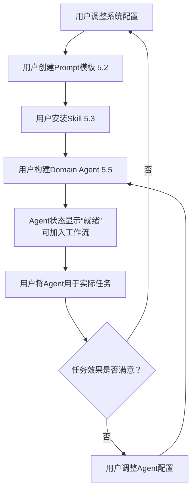
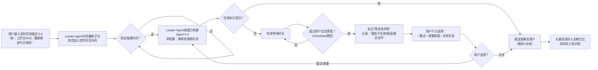
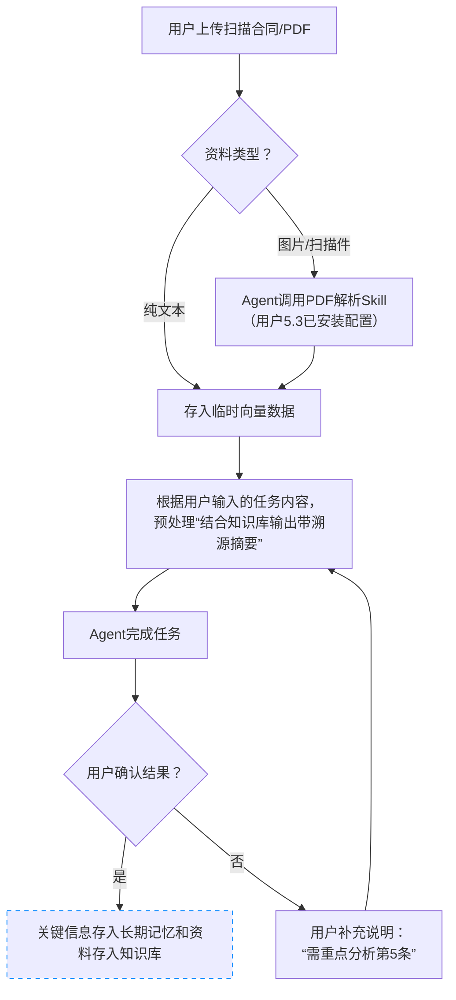
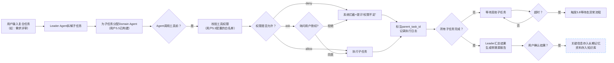

# BiosBot 需求分析

## 1. 文档目的

本文档用于明确 BiosBot 的业务背景、目标用户、可验证需求、核心场景及优先级，为后续方案设计提供清晰依据。
重点回答：
✅ 为什么要做（背景痛点）
✅ 谁来使用（用户角色）
✅ 核心场景是什么（端到端工作流+子场景）
✅ 需求优先级如何划分（P0）
支撑文档：02-功能要求、03-技术分析、04-概要设计等全链路设计输出。

## 2. 背景分析

当前通用大模型产品聚焦“单轮问答”，在以下场景存在显著缺口：

| 不足场景     | 问题描述   | BiosBot 解法 |
|--------------|----------|---------|
| 复杂任务      | 需拆解、执行、复盘，单轮输出不可追踪、不可审计 | 自动任务拆解与Agent协作链路 |
| 业务资料      | 大量存在于图片/PDF/扫描件等非结构化载体，解析成本高 | 用户配置领域Skill(解析器+知识增强规则) |
| 私有知识      | 用户需使用私有资料，但拒绝将敏感数据上传外部平台 | 全流程本地定制：数据+逻辑+交付标准 |
| 资料的多模态   | 单一模型只支持单一模态 | 不同Agent可以配置不同的大模型 |
| 多 Agent 协同 | 单一模型难以覆盖跨领域任务，缺乏稳定协作机制 | 用户按需组装Domain Agent与工具链 |

## 3. 核心概念定义（前置术语基线）
Leader Agent：任务总控中枢，负责任务理解、拆解、调度、汇总与反馈。用户可见行为：实时展示“思考→行动→观察”循环步骤（例：思考：需解析合同条款 → 行动：调用PDF解析Skill → 观察：提取到3处关键条款）
Domain Agent：领域专业智能体（如文档解析Agent、代码Agent），执行子任务。用户可见行为：每步操作附带推理说明（例：“因用户要求溯源，故保留页码标注”）
Agent的大脑：根据需求，可以使用不同的模型提供商
Leader Agent 对子任务指令进行摘要化提炼后传递给 Domain Agent，仅当 Domain Agent 明确要求或任务需要全文溯源时，才透传原始长文本，以适配不同模型的上下文窗口限制
向量数据库：用于存储长期记忆与知识库的检索结构
本地优先：用户私有数据（文档/记忆）默认存储于本地设备, 无授权不上传
等待态异常：任务因队列阻塞、事件未触发等超出阈值仍未推进的状态
授权等待超时：当系统请求用户授权（Ask）而用户在设定阈值（默认10分钟）内未响应，任务自动标记为“授权超时 - 已拒绝”，并释放占用资源

**核心定制：**
- 定制工作台：用户可以创建专业领域Agent（Domain Agent），Leader Agent 默认存在且不可删除
- Prompt模板管理：用户可以创建大模型提示模板，配置给Agent，使得Agent清楚自己的角色定位、行为规范和能力边界
- Skill管理：用户可以安装Skill，配置给Agent，使得Agent有各种专业的技能来帮助完成任务
- 知识库管理：用户可以手动为每个Agent添加专业知识集来帮助完成任务
- 记录管理：系统自动按日期归档会话信息，归档时过滤无意义信息，存入向量数据作为长期记忆；当短期记忆超过模型支持的最大上下文窗口时，也进行必要的会话归档

**核心定位：**
- 构建一个**本地优先**、**可配置**、**全链路可追踪**的多智能体工作台，实现多模态输入、知识库、Skills、工具与任务系统的有机协同。
- 提供低门槛定制能力，让用户将领域知识转化为可持续复用的智能工作台，实现从“使用工具”到“拥有专属智能体团队”的跃迁。

## 4. 用户需求分析

### 4.1 目标用户与定制能力
BiosBot 的核心用户是 “具备领域知识、有流程优化意识的定制者”。系统角色由用户定制决定，而非产品预设。

| 用户画像 | 定制目标 | 典型定制动作 | 定制后系统角色 | 价值锚点 |
|----------|----------|--------------|----------------|----------|
| 技术型个人 （工程师/开发者） | 构建个人开发流水线 | 1. 选用“代码生成”模板 2. 配置审查规则库+测试框架 3. 绑定Git仓库与CI工具 | 自动化开发助手： 需求解析→代码生成→审查→单元测试→提交摘要 | 减少重复编码，保障代码质量一致性 |
| 知识型团队负责人 （产品经理/项目经理） | 搭建轻量级协作中枢 | 1. 创建“需求评审”工作流 2. 配置Domain Agent（需求分析/设计评审/文档生成） 3. 设置交付物模板与权限规则 | 个人助理+专业团队： • 个人层：待办/提醒/知识沉淀 • 团队层：需求拆解→多Agent协同评审→结构化归档 | 降低跨角色沟通成本，沉淀团队知识资产 |
| 研究型个人 （学者/分析师） | 构建文献处理工作台 | 1. 启用PDF解析+知识图谱技能 2. 配置跨文献比对规则 3. 设置引用格式与报告模板 | 智能研究伙伴： 文献摄入→关键信息提取→对比分析→带溯源报告生成 | 解决“资料散、归纳难、依据模糊”痛点 |
| 效率追求者 （自由职业者/管理者） | 整合碎片化工作流 | 1. 混搭“日程管理”+“邮件摘要”模板 2. 配置跨平台工具（日历/邮箱/笔记） 3. 设置自动化触发条件 | 全能私人助理： 信息聚合→任务规划→执行跟进→结果复用 | 打破工具孤岛，形成个人工作操作系统 |

**关键逻辑说明**（支撑“可定制”定位）
- 同一用户可创建/切换多个定制方案（例：工程师白天用“代码生成”方案，晚上切换至“个人知识管理”方案）
- 系统角色由用户配置决定，而非产品预设（避免“我们为工程师设计”的局限表述）

### 4.2 可验证用户需求清单
| 需求ID | 需求描述 | 验收标准 | 优先级 |
|--------|----------|----------|--------| 
| REQ-AGENT-001 | 用户可添加与管理大模型（本地文件/API密钥） | 1. 上传模型文件或配置API密钥后，10秒内生成模型卡片（含参数量/状态） 2. 点击“测试连接”，10秒内返回“连接成功”，状态更新为“就绪” | P0 |
| REQ-PROMPT-001 | 用户可创建与管理Prompt模板 | 1. 保存模板后，Agent配置页下拉列表实时可见 2. 模板预览区实时渲染效果，标签显示适用场景 | P0 |   
| REQ-SKILL-001 | 用户可安装与配置Skill | 1. 安装后状态变“已安装” 2. Agent配置页可勾选绑定该Skill并配置Skill里工具的权限 | P0 |  
| REQ-TOOL-001 | 系统提供基础工具集，用户可配置Agent工具权限 | 1. Agent配置页“工具”分类含≥5种基础工具（文件/网络/系统命令） 2. 工具列表支持勾选“启用/禁用”，保存后生效 | P0 |
| REQ-DATA-001 | 用户可指定本地工作目录，所有数据存于此 | 1. 默认使用系统用户下创建工作目录  2. 设置页显示当前路径，支持修改与验证 | P0 |  
| REQ-AGENT-002 | 用户可构建Domain Agent（整合模型/Prompt/Skill/知识库） | Agent卡片实时显示配置状态：`模型✓｜Prompt✓｜Skill✓｜知识库✓` | P0 | 用户画像验证：所有角色均需定制专属Agent |  
| REQ-REACT-001 | Agent执行任务时透明展示“思考→行动→观察”循环 | 1. 任务日志分段显示：    • `💡 思考`：分析意图/规划步骤    • `🛠️ 行动`：调用工具/生成内容    • `👀 观察`：环境反馈 2. 每个循环提供“暂停”按钮 | P0 |  
| REQ-TASK-001 | 用户可配置定时任务规则并自动触发 | 1. 配置Cron/自然语言规则后，任务加入调度队列（状态=“待触发”） 2. 到达时间点自动触发，Leader非阻塞继续处理新任务 | P0 |   
| REQ-KNOWLEDGE-001 | 用户可管理知识库（文件上传→自动处理→绑定Agent） | 1. 上传文件后，系统自动提取正文存入LanceDB 2. 自动生成标题（可编辑）与概述（系统维护） | P0 | 
| REQ-TASK-002 | 任务全链路追踪与异常介入 | 1. 子任务日志标注`parent_task_id` 2. 等待态超阈值自动标记“异常”，提供重试/调整/关闭选项  3. 授权请求超时（默认10min）自动拒绝并释放资源| P0 |   
| REQ-TASK-003 | 用户可强制终止正在运行的任务| 1. 点击“终止”后，任务状态立即变更为“已终止”  2. 系统立即释放该任务占用的显存/内存资源  3. 生成终止报告，记录已完成的子步骤	| P0 |

## 5. 场景分析（定制能力驱动）
### 基础配置层
| 场景 | 用户动作 | 系统反馈 | 验收标准 |
|------|----------|----------|----------|
| 5.1 添加与管理大模型 | 1. 点击“模型仓库” 2. 选择本地模型文件（GGUF/Q4_K_M）或配置API密钥（Ollama/OpenRouter） 3. 为模型命名（例：“轻量分析模型-Qwen7B"） | • 模型卡片生成（显示参数量/模态支持/状态） • 提示“该模型可分配至任意Agent" | 点击测试，成功后，状态显示“就绪” |
| 5.2 创建与管理Prompt模板 | 1. 进入“Prompt模板库” 2. 新建模板：填写角色定义/约束规则/输出示例 3. 保存为“需求分析专家V1" | • 模板预览区实时渲染效果 • 标签显示“适用场景：需求评审、文档解析" | 保存后可在Agent配置页下拉选择该模板 |
| 5.3 安装与配置Skill | 1. 打开“Skill市场” 2. 搜索“PDF解析”→点击“安装” 3. 配置参数（OCR精度/页码保留规则） | • Skill状态变“已安装” • 提示“可绑定至文档类Agent" | 安装后成功后，可在Agent配置页使用该 Skill |
| 5.4 系统需内置基础工具集（文件系统工具，网络请求，系统命令执行），供Agent调用 | NA | NA | 在Agent里可以配置这些工具权限 |
### 配置能力的场景化组合
| 场景 | 与基础配置的关联 | 关键逻辑 |
|------|------------------|----------|
| 5.5 构建Domain Agent | 整合5.1-5.3成果： - 选择“模型”（5.1） - 绑定“需求分析专家V1"模板（5.2） - 绑定“需求解析Skill"+ Skill 权限设置  - 绑定产品知识库（5.3+知识库管理） | Agent卡片实时显示配置状态： `模型✓｜Prompt✓｜Skill✓｜知识库✓` |
| 5.6 定时任务配置与执行 | 复用5.4构建的Agent： - 选择“日报生成Agent"（已配置Prompt+Skill+知识库） - 设置触发规则：工作日 9:00 AM | 1. 用户配置定时规则（Cron表达式/自然语言“每天上班前”） 2. 任务加入调度队列，状态显示“待触发” 3. 到达时间点，Leader Agent自动触发执行（非阻塞：Leader继续处理新任务） 4. 执行结果推送至用户（应用内通知+邮件） 5. 异常联动：若触发后子任务卡顿，自动进入5.8等待态异常流程（阈值按`scheduled`类型独立配置） |
| 5.7 多模态资料处理 | 依赖5.4构建的Agent： 上传扫描合同 → Agent调用PDF解析Skill → “系统自动结合知识库生成带溯源摘要（例：依据：合同P3第2条），供Agent完成任务”  用户上传文件后，系统自动提取正文存入知识库，并生成标题与概述（标题可编辑）。 | 输出含"依据：合同P3第2条"，输入给Agent来完成任务 |
| 5.8 复合任务协作 | Leader调用多个5.4构建的Agent： 需求分析Agent（定制Prompt+Skill）→ 设计评审Agent（绑定Figma Skill） | 子任务日志明确标注`parent_task_id`，异常时定位到具体Agent |

## 6. 需求优先级
| 优先级 | 需求范围 |  
|--------|----------|  
| P0 | • REQ-AGENT-001：添加与管理大模型 • REQ-PROMPT-001：创建与管理Prompt模板 • REQ-SKILL-001：安装与配置Skill • REQ-TOOL-001：基础工具集与权限配置 • REQ-DATA-001：本地目录指定 • REQ-AGENT-002：构建Domain Agent • REQ-REACT-001：ReAct循环透明化 • REQ-TASK-001：定时任务配置与触发 • REQ-KNOWLEDGE-001：知识库管理 • REQ-KNOWLEDGE-002：知识库文件智能处理（OCR/标题生成） • REQ-TASK-002：任务全链路追踪 |   

## 7. 关键逻辑闭环验证

### 7.1 定制工作台逻辑

### 7.2 定时任务执行与异常处理

### 7.3 多模态资料处理与溯源

### 7.4 权限管理逻辑

## 8. 边界与约束

| 约束项 | 说明 |
|-------|------|
| 架构选择 | P0 默认单体架构，**不引入微服务** |
| 部署策略 | P0 默认本地优先，**不构建复杂云端控制平面** |
| 用户规模 | P0 默认单用户，**不构建多租户体系** |
| 输入内容 | P0 只支持文本/图片/PDF（≤100MB）|
| 设计原则 | Prompt、Skills、工具和知识库必须围绕**任务主链路**设计 |

## 9. 风险分析

### 9.1 技术风险

| 风险项 | 描述 |
|-------|------|
| Prompt 膨胀 | 当 Prompt 拼装后超出模型窗口限制、裁剪频率过高或关键上下文被反复截断时，可能导致模型返回错误码、结果缺字段或前后轮输出依据不一致 |
| 多模态质量 | 当图片/PDF 解析失败率升高、OCR 结果缺页漏段或版面识别错误时，可能导致后续摘要、比对和结构化结论引用错误原文 |
| 权限安全 | 当高风险工具被授予过宽权限、Agent 可访问超出工作区范围的资源，或 `ask` / `deny` 操作被错误放行为 `allow` 时，可能导致未授权写入、命令执行或外部副作用发生 |
| 资源浪费 | 当大量 Skill 在任务开始前被预先加载、无关上下文被提前注入，或长时间等待态任务持续占用运行时资源时，可能导致上下文窗口被挤占、任务启动变慢或系统资源持续升高 |
| 状态不一致 | 当前后端对同一任务状态、错误码或终态语义映射不一致时，可能导致列表、详情、结果页和事件流展示互相冲突，进而引发错误操作或错误统计 |
| 并发冲突 | 当多个任务并发访问同一文件、共享工具实例、同一 Agent 资源池或同一外部服务配额时，可能导致写入覆盖、队列阻塞、执行顺序错乱或任务结果相互污染 |
| 服务降级 | 当外部模型、OCR、检索或其他依赖服务不可用，而系统未能在阈值内切换备用路径、返回缓存结果或给出明确失败反馈时，可能导致任务长时间挂起、直接失败或返回缺少依据的降级结果 |

### 9.2 入口与等待态风险

| 风险项 | 描述 |
|-------|------|
| 低置信度入口 | 当低置信度入口请求未统一进入 `clarification_pending` 或等价状态，或在澄清完成前已被部分系统视为可执行任务时，可能导致任务列表、事件流和接口契约对"是否已建单"理解不一致 |
| 等待态滞留 | 当 `queued`、`scheduled` 或 `event_triggered` 任务超过配置阈值仍未释放，且在一段时间内没有新的等待事件、没有最近一次重评估结果或没有异常状态推进时，可能导致任务长期停留在等待态而用户无法判断系统是否仍在有效推进 |
| 触发失效 | 当事件订阅已失效、定时触发器未注册成功、等待条件已变化但系统未重新评估，或触发回调长期未写入事件流时，可能导致任务进入不可见卡死状态 |

### 9.3 编排与交付风险

| 风险项 | 描述 |
|-------|------|
| 任务拆分 | 当相似输入在短时间内被判为不同入口模式或不同拆分结果，或判定摘要缺少拆分原因、主要目标、关键约束等必要字段时，用户将无法判断系统为何拆分任务，也难以复核编排是否正确 |

### 9.4 权限与安全风险

| 风险项 | 描述 |
|-------|------|
| 权限绕过 | 当低置信度安全默认路径在状态推进后未继续套用 `deny > ask > allow` 规则，或会话内快捷操作绕开审批检查时，可能导致入口模式默认确定后错误绕过 `ask` / `deny` 权限裁决 |
| 边界失效 | 当低置信度安全默认路径未限制后续动作边界，且系统在澄清未完成前已触发规划、拆分、工具调用或状态推进时，可能导致任务越过应有的确认门槛直接进入执行链路 |

### 9.5 结果展示风险

| 风险项 | 描述 |
|-------|------|
| 终态歧义 | 当无最终输出物但已合法终止的任务缺少统一终态摘要页、关闭原因展示或统计口径时，可能导致结果页、任务终态和报表对"是否已完成交付"给出冲突解释 |
| 阶段混淆 | 当阶段性 ETA / 安排通知与最终输出共用相同展示样式、状态文案或通知类型时，可能导致用户将"已安排完成"误解为"已交付完成" |

### 9.6 监控与质量风险

| 风险项 | 描述 |
|-------|------|
| 告警脱节 | 当监控告警未关联任务 ID、会话上下文或事件流定位信息时，可能导致告警与具体任务脱节，无法追溯异常根因 |
| 自检过度 | 当质量自检在低风险任务上重复触发、重试阈值过高或自检链路本身调用过多模型与工具时，可能导致任务执行耗时显著增加并挤占主链路资源 |
| 校验误报 | 当推理一致性校验在引用充足、结论正确的任务上频繁标记异常，或误把表达差异判为逻辑冲突时，可能导致用户对系统信任度下降并增加不必要的人工复核 |
| 历史偏见 | 当经验提取长期复用过时 Prompt、旧工具组合或不再适用的成功模式，而缺少有效期、禁用或人工修正机制时，可能导致新任务被错误引导 |

### 9.7 安全与运维风险

| 风险项 | 描述 |
|-------|------|
| 凭证泄露 | 当 API Keys、数据库密码等凭证以明文出现在配置文件、日志、导出内容或错误信息中，或轮换后旧凭证仍可继续使用时，可能导致外部服务被未授权访问 |
| 数据泄露 | 当日志、审计记录、结果导出或知识库内容未按规则脱敏，且包含身份证号、手机号、银行卡号等敏感信息时，可能导致隐私数据外泄 |
| 磁盘满 | 当附件缓存、日志、数据库或备份文件持续增长且未触发清理、压缩或容量告警时，可能导致任务写入失败、服务异常或数据丢失 |
| 配置错误 | 当模型、Agent、Skill 或权限配置修改后未经过连通性校验和最小回归验证就投入使用时，可能导致新任务调用失败、权限异常或结果与当前配置不一致 |

### 9.8 本地数据灾备
| 风险项 | 描述 | 缓解措施 |
| 本地数据损坏/丢失 | 用户误删工作目录、磁盘故障或软件崩溃导致配置文件、知识库向量化数据丢失，且无云端备份。 | 1. 系统每日自动备份关键配置至隐藏文件夹。 2. 提供“一键导出/导入”整个工作空间的功能。 3. 启动时检测数据完整性。 |

### 9.9 依赖服务本地化指引
| 风险项 | 描述 | 缓解措施 |
|-------|------|----------|
| 本地环境依赖缺失 | 用户未安装 Ollama、Python 环境或缺少特定系统库，导致本地模型无法加载或 Skill 执行失败，报错信息晦涩。 | 1. 启动时进行环境自检。 2. 提供友好的引导式修复向导。 |

## 10. 需求分析结论

BiosBot 的核心不是"堆叠多少个 Agent 能力点"，而是"能否围绕一个复杂任务形成从入口判定、编排执行、结果交付到知识沉淀的**稳定闭环**"。

### 核心收敛原则

| 原则 | 说明 |
|-----|------|
| **主链路优先** | 任务主链路仍是系统设计的第一优先级，聊天、展示和辅助能力都必须服务于**从会话输入到任务创建、从任务创建到步骤编排、从步骤执行到输出物生成、从输出物生成到结果交付、从结果交付到知识沉淀**这一任务闭环 |
| **结果导向** | 输出物与可交付结果优先于普通对话回复，必须保证任务结果页、阶段性安排通知、最终完成通知和终态摘要页之间**语义一致**，不把"已安排"误当作"已交付" |
| **可观测性** | 过程可观测、可追踪、可审计优先于黑盒执行，确保事件流能够支撑排障、复盘与验收 |
| **统一服从** | Agent、工具、Prompt、知识库和记忆能力必须统一服从任务主链路和追踪语义 |
| **角色清晰** | Leader/Domain Agent 的价值在于稳定完成**角色边界清晰**的协作、等待态协调、权限边界控制与 ReAct 执行闭环 |
| **受控加载** | 记忆、知识和上下文装配必须坚持受控加载原则，不能在释放执行时被静默重算或覆盖 |
| **资源可控** | 系统必须对本地计算资源（CPU/Mem）进行实时监控与配额管理，防止单个任务耗尽资源导致系统崩溃，支持任务排队与强制终止。 |
| **数据兜底** | 在本地优先的前提下，必须提供轻量级的自动备份与恢复机制，保障用户数字资产安全。 |

### P0 阶段定位

| 阶段 | 定位 |
|-----|------|
| **P0** | 以**任务为中心**，以**交付结果**为目标，以**事件流**和**摘要化观测**为治理手段，以 Agent、记忆、知识、工具和 Prompt 的受控协作为支撑，形成一个可执行、可解释、可验收、可复盘的、资源可控且数据安全的复杂任务闭环系统|

