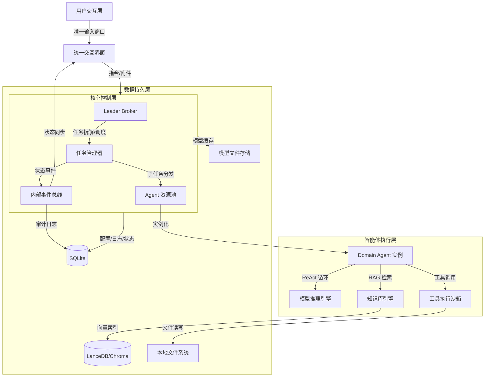
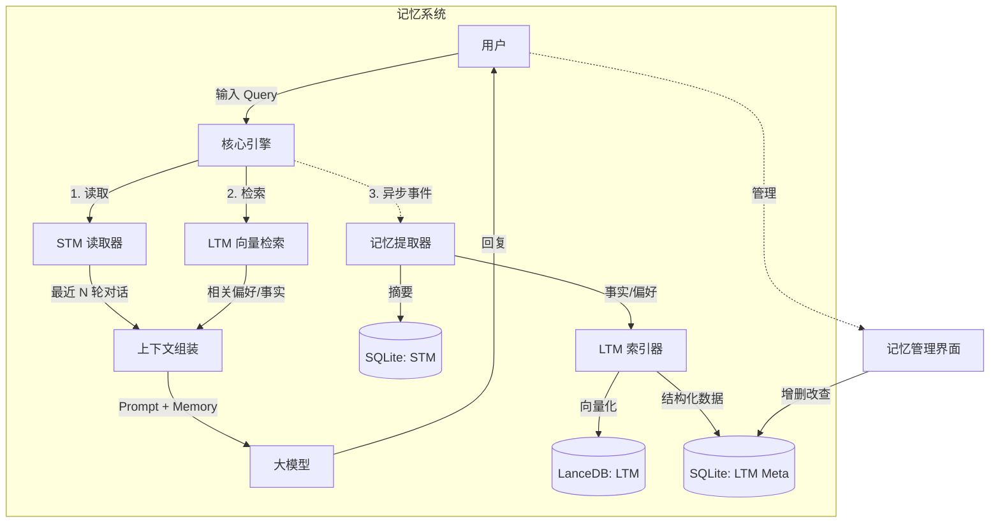

# BiosBot 技术分析

## 1. 文档目的

本文档基于《BiosBot 需求分析》与《BiosBot 功能要求》，旨在明确系统的技术架构、核心组件选型、关键算法策略及非功能性保障措施。重点解决**本地优先架构下的资源约束**、**多智能体并发调度**、**知识库隔离检索**及**任务全链路可观测性**等技术难题，为后续概要设计与详细开发提供技术基线。

## 2. 技术原则
- **本地优先 (Local-First)**：核心数据（模型、知识库、配置、日志）默认存储于用户本地设备，除用户显式配置的 LLM API 外，严禁任何数据外传。
- **单体模块化 (Modular Monolith)**：P0 阶段采用单体架构，通过内部模块解耦（而非微服务）降低部署复杂度，确保启动速度与资源效率。
- **事件驱动 (Event-Driven)**：任务状态流转、Agent 协作、资源监控均基于内部事件总线，实现松耦合与高可扩展性。
- **安全沙箱 (Sandboxed Execution)**：工具执行、文件读写严格限制在工作目录内，实施最小权限原则。

## 3. 系统总体架构
### 3.1 逻辑架构图
系统划分为五个核心层级：


### 3.2 部署架构
- **运行环境**：桌面客户端（Windows/macOS/Linux），内置轻量级运行时（Node.js/TypeScript）。
- **依赖服务**：
  - **LLM 后端**：支持本地 Ollama/LM Studio 或远程 API（OpenAI/OpenRouter）。
  - **向量数据库**：嵌入式向量库（如 LanceDB 或 ChromaDB），直接运行在客户端进程内。
  - **关系数据库**：SQLite，存储任务状态、配置元数据、审计日志。

## 4. 核心技术方案
### 4.1 智能体编排与并发模型 (Agent Orchestration)
#### 4.1.1 Leader-Agent 调度机制
为满足"Leader 非阻塞”与"Domain Agent 串行”的需求，采用异步任务队列 + 状态机模式：
- **Leader 行为**：
  - 接收任务后进入 PARSING -> DISPATCHING 状态。
  - 生成子任务 DAG（有向无环图）后，立即将子任务推送到对应 Domain Agent 的专属 FIFO 队列。
  - 推送完成后，Leader 状态立即置为 IDLE，释放上下文，准备接收新任务。
- **Domain Agent 行为**：
  - 维护独立的 Task Queue。
  - 内部维护一个单线程执行器，按顺序从队列拉取任务执行。
  - 执行期间状态为 RUNNING，拒绝新任务入栈（仅入队）。
- **技术实现**：
  - 使用 Node.js + TypeScript，结合 Worker Threads 或基于事件循环的异步任务队列实现非阻塞 I/O。
  - 队列持久化：将队列状态实时写入 SQLite，防止崩溃丢失。
#### 4.1.2 任务状态机 (Task State Machine)
- 定义严格的状态流转逻辑，确保可追踪性：
  - **状态枚举**：CLARIFICATION_PENDING -> WAITING_FOR_LEADER -> PARSING -> DISPATCHING -> QUEUED -> RUNNING -> AGGREGATING -> COMPLETED / EXCEPTION / TERMINATED。
  - **状态持久化**：每次状态变更触发 on_state_change 事件，异步写入 SQLite task_logs 表，包含时间戳、耗时、错误码。
  - **超时检测**：启动全局定时器轮询 RUNNING 和 QUEUED 状态的任务，若超过阈值（如 10min 无心跳），自动触发异常处理流程。
### 4.2 知识库隔离与 RAG 架构 (Knowledge Isolation)
#### 4.2.1 物理与逻辑隔离策略
- **物理存储**：
  - **原始文件**：存储于 {workspace}/knowledge/{agent_id}/ 目录。
  - **向量数据**：采用 Collection/Partition per Agent 策略。
    - 方案 A (推荐)：每个 Agent 创建独立的 Collection (col_{agent_uuid})，利用向量库的原生隔离能力。
    - 方案 B：单一 Collection，但在 Metadata 中强制过滤 agent_id。
- **检索拦截**：
  - 在 RAG 检索接口层封装中间件，自动注入 filter={"agent_id": current_agent_id} 条件。
禁止任何不带 agent_id 的全局检索请求。
#### 4.2.2 文件处理流水线
- **上传解析**：
  - 监听文件上传事件 -> 识别 MIME 类型 -> 路由至对应解析器（PDFPlumber, Tesseract OCR, Plain Text）。
- **分块策略 (Chunking)**：采用递归字符分割（Recursive Character Text Splitter），保留段落语义，每块约 500-800 tokens，重叠 50 tokens。
- **向量化 (Embedding)**：
  - 支持本地 Embedding 模型（如 bge-m3 via ONNX）或调用 API。
- **异步处理**：解析与向量化在后台线程池执行，不阻塞主界面。
- **溯源元数据**：
  - 每个 Chunk 存入 Metadata：{file_name, page_num, agent_id, chunk_id, original_offset}，确保返回结果可精准定位到页码。
### 4.3 模型适配与推理引擎 (Model Adaptation)
#### 4.3.1 异构模型抽象层
- **定义统一接口 ILlmProvider，屏蔽不同后端差异**：
  - generate(prompt, config)
  - stream_generate(prompt, config)
  - get_capabilities() (上下文窗口、支持模态)
- **适配器模式**：
  - OllamaAdapter: 处理本地 HTTP 请求，解析 GGUF 模型响应。
  - OpenAIAdapter: 处理标准 API 协议。
#### 4.3.2 上下文管理 (Context Window Management)
- **动态裁剪**：
  - 统计当前 Prompt + History + Retrieved Chunks 的 Token 数。
  - 若超出模型限制，采用 LRU (Least Recently Used) 策略裁剪历史对话，优先保留 System Prompt 和最新几轮对话。
- **摘要压缩**：
  - 当历史过长时，调用轻量模型对旧对话进行摘要总结，替换原始文本。
### 4.4 工具执行与安全沙箱 (Tool Sandbox)
#### 4.4.1 权限裁决引擎
- **实现 DENY > ASK > ALLOW 决策链**：
  - 预检 (Pre-flight)：工具调用前，检查 Agent_Tool_Permission 表。
  - 高风险拦截：
    - 若策略为 DENY：直接抛出 PermissionDeniedException。
    - 若策略为 ASK：挂起当前任务，发送 AUTH_REQUEST 事件至 UI，等待用户回调（带超时计时器）。
    - 若策略为 ALLOW：直接执行。
- **审计记录**：所有裁决结果写入 audit_logs。
#### 4.4.2 执行沙箱
- **文件系统限制**：
  - 所有文件操作路径强制解析为绝对路径，并校验是否以 {workspace_path} 开头。
  - 禁止访问 /etc, C:\Windows, ~/.ssh 等敏感目录。
- **网络限制**：
  - 可配置域名白名单，禁止访问内网 IP（除非显式允许）。
- **命令执行**：
  - Shell 命令执行禁用管道符、重定向符等危险字符，或使用受限 Shell (Restricted Shell)。

### 4.5 记忆系统架构与实现 (Memory System)

#### 4.5.1 总体架构
- **设计目标**：在不阻塞主对话链路的前提下，为 Agent 提供可持续演进的短期/长期记忆能力，支撑“上下文连贯”、“用户偏好记住”和“事实性知识沉淀”，同时满足本地优先与隐私要求。
- **架构模式**：旁路异步处理 + 双库存储（关系库 + 向量库）。
- **逻辑流程**：



- **关键点**：
  - 记忆读取（STM/LTM 检索）在主链路同步进行，但控制在可接受的时延范围内（配合 NFR 中的 <200ms 目标）。
  - 记忆写入（摘要提取、Fact 抽取与向量化）通过事件驱动异步执行，不阻塞用户回复。

#### 4.5.2 短期记忆 (STM) 实现
- **存储结构**：
  - 表名：`session_memory`（或等价命名）。
  - 字段示例：`id, session_id, role (user/assistant/system), content, summary, token_count, created_at`。
- **滑动窗口 + 归档算法**：
  - 运行时上下文构建阶段，按 `token_count` 统计当前会话窗口的 Token 总量，在接近模型上限时优先裁剪低重要性消息（生成局部 summary 代替原文），保证注入 LLM 的上下文不超限。
  - 后台归档任务（对应 05-详细设计 4.3 的 ChatHistoryArchiver）采用时间窗口 + 最小条数阈值：默认扫描 24 小时前且 `is_archived = 0` 的记录，仅当数量超过阈值（如 >5 条）时才触发一次归档批次。
  - 归档时将多条历史对话合并为 `session_summary` 写入 LTM，并在 `session_memory` 中将原记录标记为 `is_archived = 1`、写入 `ltm_ref_id` 和 `summary`，从而形成“可裁剪的活动窗口 + 不丢失的长期回放能力”。
- **应用场景**：
  - 恢复对话上下文：从 STM 中加载最近 N 轮对话，作为 Conversation History 注入模型。
  - 任务态回放：在任务详情页中重建某次任务的关键对话轨迹。
  - 统一对话流：所有用户与 Agent 消息均存储于 `session_memory`，通过归档标记与过滤条件区分“活跃 STM 视图”和“完整历史对话流”。

#### 4.5.3 长期记忆 (LTM) 实现
- **混合存储策略**：
  - **向量库 (LanceDB 等)**：存储记忆的语义向量，用于模糊检索（如“上次说的那个项目”）。
    - Schema 示例：`{id, content, embedding, category, created_at, access_count}`。
  - **关系库 (SQLite)**：存储结构化元数据和精确匹配字段。
    - 表名：`long_term_memory`。
    - 字段示例：`id, agent_id, category (preference/fact/project/summary), key, value, embedding_id, confidence, access_count, last_accessed, is_active`。
- **提取与嵌入流水线**：
  - 使用轻量级 Embedding 模型（如 all-MiniLM-L6-v2 本地版）对候选记忆生成向量。
  - 记忆提取器通过 Prompt 或规则分析对话，抽取偏好/事实/项目类信息，输出 JSON 结构：

```json
[{"category":"preference","key":"coding_language","value":"TypeScript","confidence":0.9}]
```

  - 高置信度记录直接写入 LTM；低置信度或敏感信息通过 UI 二次确认。

#### 4.5.4 检索与排序优化 (Retrieval Optimization)
- **混合检索 (Hybrid Search)**：
  - 结合向量相似度与关键词匹配（BM25/SQL LIKE）。
  - 典型策略：
    - 问“我的数据库密码是多少？”时，以关键词/精确匹配为主。
    - 问“我之前喜欢用什么语言？”时，以向量语义相似度为主。
- **时间衰减加权**：
  - 评分公式示例：`score = vector_similarity * 0.7 + recency_score * 0.3`。
  - 在保证相关性的前提下，让近期记忆优先被召回，降低“陈旧记忆”误导当前回答的概率。

#### 4.5.5 隐私与安全策略
- **敏感信息过滤**：
  - 在写入 LTM 前，通过正则/NER 识别手机号、密码、API Key 等模式。
  - 默认策略：对高度敏感字段要么不入库，要么仅在用户显式开启“加密存储”时写入（使用用户主密钥进行加密）。
- **记忆隔离**：
  - 默认按 Agent 维度隔离长期记忆（`agent_id` 强关联），仅当用户显式配置为“共享全局记忆”时才跨 Agent 检索。
  - 与 F06 知识库隔离策略保持一致，在查询层强制注入 `agent_id` 过滤条件。

#### 4.5.6 潜在难点与应对
- **记忆冲突**（如先说“用 JS”后说“用 TS”）：
  - LTM 写入时基于 `key` 查重，若已存在则按时间和置信度更新为新值，并将旧值归档为历史版本，以便审计与回滚。
- **检索噪声**（召回不相关记忆干扰回答）：
  - 在主模型使用前增加轻量 Re-Rank 步骤，由小模型或规则判断召回记忆与当前 Query 的相关度，不相关的记忆在注入前丢弃。
- **存储膨胀**（长期堆积向量导致空间占用过大）：
  - 实施“记忆遗忘曲线”，定期扫描 `access_count` 低且 `last_accessed` 久远的记录，提示用户清理或自动归档到冷存储。
  - 结合 NFR 中的本地空间监控，在磁盘余量过低时触发记忆清理向导。

## 5. 数据存储设计
### 5.1 数据库选型
- **关系型数据 (SQLite)**：
  - 存储：用户配置、Agent 定义、任务状态机、审计日志、权限规则。
  - 优势：零配置、单文件、事务支持、易于备份。
- **向量数据 (LanceDB / Chroma)**：
  - 存储：文档切片向量、Metadata。
  - 优势：本地嵌入、支持混合检索（向量 + 标量过滤）、高性能。
- **文件存储 (FileSystem)**：
  - 结构：
    BiosBot_Workspace/
    ├── config/          # 配置文件
    ├── models/          # 模型文件缓存
    ├── knowledge/       # 按 Agent ID 分目录存储原始文件
    │   ├── {agent_id_1}/
    │   └── {agent_id_2}/
    ├── logs/            # 结构化日志
    └── backup/          # 自动备份包
### 5.2 关键数据表结构 (简化)
- **Table: agents**
    | 字段 | 类型 | 说明 |
    | :--- | :--- | :--- |
    | id | UUID | 主键 |
    | name | String | 名称 |
    | model_config | JSON | 绑定的模型配置 |
    | prompt_template_id | UUID | 关联 Prompt |
    | status | Enum | IDLE, RUNNING, BUSY_WITH_QUEUE |

- **Table: tasks**
    | 字段 | 类型 | 说明 |
    | :--- | :--- | :--- |
    | id | UUID | 主键 |
    | parent_task_id | UUID | 父任务 ID (用于追踪) |
    | assigned_agent_id | UUID | 执行 Agent |
    | status | Enum | 见状态机定义 |
    | created_at | Timestamp | 创建时间 |
    | updated_at | Timestamp | 最后更新时间 |
    | error_msg | Text | 异常信息 |

- **Table: knowledge_chunks**
    | 字段 | 类型 | 说明 |
    | :--- | :--- | :--- |
    | id | UUID | 主键 |
    | agent_id | UUID | 强隔离字段 |
    | file_id | UUID | 源文件 ID |
    | content | Text | 文本内容 |
    | embedding | Vector | 向量数据 (由向量库管理) |
    | metadata | JSON | 页码、偏移量等 |

- **Table: session_memory (对话流 + STM)**
  | 字段 | 类型 | 说明 |
  | :--- | :--- | :--- |
  | id | UUID | 主键 |
  | session_id | String | 会话 ID（与前端会话/任务绑定） |
  | role | Enum | user / assistant / system |
  | content | Text | 原始对话内容 |
  | summary | Text | 可选，该轮对话的压缩摘要 |
  | token_count | Integer | 该消息的 Token 数，用于滑动窗口控制 |
  | created_at | Timestamp | 创建时间 |
  - 说明：该表同时存储全局对话流（Chat History）与 STM 视图，通过查询条件和索引实现不同视角的读取需求。

- **Table: long_term_memory (LTM Meta)**
  | 字段 | 类型 | 说明 |
  | :--- | :--- | :--- |
  | id | UUID | 主键 |
  | agent_id | UUID | 所属 Agent（支持按 Agent 隔离记忆） |
  | category | Enum | preference / fact / project / summary |
  | key | String | 记忆键（如 "preferred_language"） |
  | value | Text | 记忆值（如 "TypeScript"） |
  | embedding_id | UUID | 关联向量库条目 ID |
  | confidence | Float | 置信度 (0.0–1.0) |
  | access_count | Integer | 被检索或使用的次数，用于热度排序 |
  | last_accessed | Timestamp | 最后一次被使用时间 |
  | is_active | Boolean | 是否有效（软删除标记） |

## 6. 关键技术难点与解决方案
### 6.1 难点一：本地资源受限下的多任务并发
- **问题**：用户本地显存/内存有限，同时运行多个 Agent 或多个大模型可能导致 OOM (Out Of Memory)。
- **解决方案**：
  - 模型共享池：多个 Agent 若配置相同模型，共享同一个模型加载实例（引用计数管理）。
  - 资源配额监控：
    - 实时监控进程内存/CPU 使用率。
    - 设定阈值（如 90%），触发时暂停新任务入队，或将低优先级任务挂起。
  - 按需加载：对于超大模型，仅在任务执行前加载，执行完毕后若长时间空闲可卸载（或交换到磁盘）。
### 6.2 难点二：任务长链路的断点恢复与一致性
- **问题**：软件崩溃或断电导致任务状态不一致（如 Agent 显示 Running 但实际已死）。
- **解决方案**：
  - 心跳机制：Agent 执行过程中定期（如每 30s）更新 task_heartbeat 字段。
  - 启动自检：应用启动时扫描所有非终态任务：
    - 若心跳超时，标记为 EXCEPTION 并记录“系统意外中断”。
    - 若处于 QUEUED，保持排队。
  - 原子操作：关键状态变更（如扣减资源、写入日志）使用数据库事务保证原子性。
### 6.3 难点三：Prompt 膨胀与上下文截断
- **问题**：随着任务拆解和知识检索，Prompt 长度极易超出模型窗口。
- **解决方案**：
  - 分级上下文策略：
    - Level 1 (必须): System Prompt + 当前步骤指令。
    - Level 2 (重要): 最近 3 轮对话历史。
    - Level 3 (参考): RAG 检索结果（按相关性排序，动态填充直至填满窗口）。
  - Map-Reduce 摘要：对于超长文档分析，先分块摘要，再汇总摘要，避免一次性输入全文。
### 6.4 难点四：低置信度入口的死锁风险
- **问题**：用户未响应澄清请求，任务长期占用资源。
- **解决方案**：
  - 实现全局超时守卫 (Global Timeout Guardian)。
  - 针对 CLARIFICATION_PENDING 状态的任务，启动独立计时器（默认 10min）。
  - 超时后自动触发 TERMINATED 流程，释放占用的 Leader 资源，并推送通知给用户。
## 7. 安全与隐私设计
### 7.1 数据隐私
- **本地加密**：敏感配置（API Keys、数据库密码）使用操作系统密钥环（Keychain/DPAPI）加密存储，或在 SQLite 中使用 SQLCipher 加密。
- **传输安全**：所有对外 API 调用强制使用 HTTPS，并校验证书。
- **日志脱敏**：在写入日志前，通过正则匹配自动抹去 API Key、手机号、身份证号等敏感模式。
### 7.2 执行安全
- 最小权限原则：
  - 默认禁止所有写操作和网络访问，需用户在 Skill 配置中显式开启。
  - 文件操作限制在 workspace 目录树内。
- 代码注入防御：
  - 严禁直接 eval() 用户输入的任意代码（包括 JS/TS 代码）。
  - 工具调用参数经过严格的 Schema 校验（Zod 或等价的 TypeScript 校验库）。

## 8. 技术栈推荐
| 模块 | 推荐技术 | 理由 |
| :--- | :--- | :--- |
| 客户端框架 | React 或 Tauri + React | React 生态丰富，开发快；Tauri适合本地应用。建议 P0 选 React 以降低前端门槛。 |
| 后端逻辑 | Node.js + TypeScript (Fastify/Express/NestJS 三选一) | 与前端技术栈统一，生态成熟，方便集成 LangChain.js、向量库 SDK 和各类 LLM 客户端。 |
| 进程通信 | IPC (React) / HTTP (Internal) | 前后端分离，通过本地 localhost 或 IPC 通道通信。 |
| 向量数据库 | LanceDB | 纯本地嵌入，无需服务器，支持磁盘存储，性能优异，适合桌面端。 |
| 关系数据库 | SQLite (SQLAlchemy) | 轻量、零配置、单文件，完美契合本地优先架构。 |
| 模型推理 | Ollama / OpenAI 兼容 HTTP API | Ollama 作为本地模型服务管理方便；远程模型通过 OpenAI 兼容 API 访问。P0 建议优先对接 Ollama 和一套标准 HTTP 客户端封装。 |
| 文档解析 | Unstructured / PyMuPDF | 强大的 PDF/图片解析能力，支持 OCR 集成。 |
| 任务队列 | SQLite-based Queue | 避免引入 Redis 等外部依赖，利用 SQLite 的行锁特性实现简单队列。 |

## 9. 风险评估与应对
| 风险项 | 等级 | 应对措施 |
| :--- | :--- | :--- |
| 本地模型加载失败 | 高 | 提供详细的错误码和引导向导；支持自动切换至备用 API 配置（若用户配置了）。 |
| 向量检索性能下降 | 中 | 限制单个 Agent 知识库文件大小（P0 ≤ 100MB/文件）；定期执行向量索引优化（VACUUM）。 |
| 无限循环任务 | 高 | 设置最大 ReAct 迭代次数（如 15 次），超限强制终止并报错。 |
| 磁盘空间耗尽 | 中 | 启动时检查磁盘余量；日志轮转（Log Rotation）策略，保留最近 7 天日志。 |
| 跨平台路径兼容 | 中 | 使用 Node.js 标准库（如 `path`、`fs`）处理路径和文件系统操作，自动化测试覆盖 Windows/macOS/Linux。 |

## 10. 结论
本技术方案确立了 BiosBot 作为本地优先、单体模块化、事件驱动的多智能体工作台的技术基线。通过SQLite+LanceDB的双库架构实现数据高效隔离，利用异步队列解决并发调度问题，并构建了严密的安全沙箱保障本地执行安全。该方案在满足 P0 核心需求的同时，为后续的功能扩展（如多租户、云端协同）预留了清晰的演进路径。