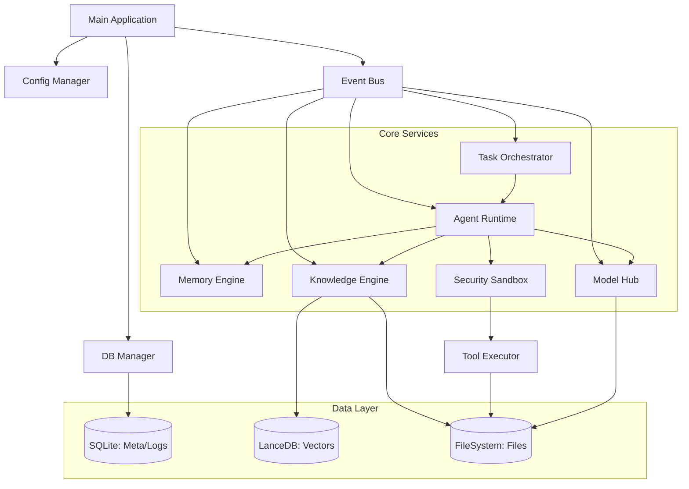
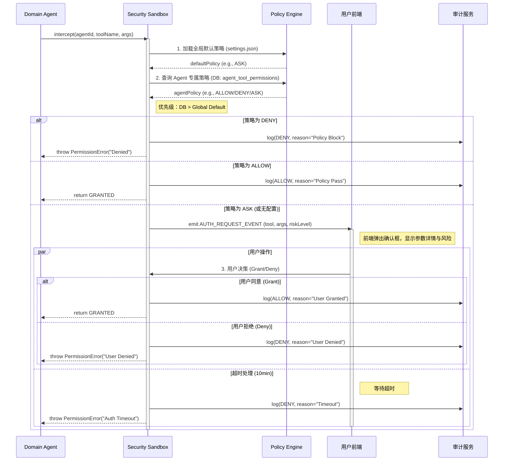

# BiosBot 详细设计

## 1. 文档目的
本文档是《BiosBot 概要设计文档》的深化与落地指南，旨在将架构层面的模块划分转化为可执行的代码逻辑，明确类结构、算法伪代码、数据库物理模型、接口契约及异常处理细节，用于直接指导开发人员进行编码实现、单元测试编写及集成测试验证。

### 1.1 适用范围
- 单会话：基于单用户、单会话窗口架构设计,历史存储于全局唯一的记录池中，通过时间戳和归档状态进行管理
- 核心模块：任务调度引擎、Agent 运行时、记忆系统、知识库引擎、安全沙箱、前端交互组件。
- 技术栈：Node.js + TypeScript（后端逻辑）、SQLite、LanceDB、React（前端）。
- 约束：严格遵循“本地优先”、“单体模块化”、“Agent 隔离”及 P0 阶段的功能边界。

### 1.2 术语定义
- **Leader Agent**：任务总控中枢，负责拆解与调度。
- **Domain Agent**：领域执行者，负责具体子任务。
- **Chat History(STM)**：全局唯一的对话历史记录，存储在 session_memory 表中，is_archived，布尔标记，区分 Chat History 中的记录是“活跃状态”还是“已归档至 LTM”。。
- **LTM (Long Term Memory)**：长期记忆，存储由 Chat History 归档生成的摘要及用户显式保存的事实。
- **ReAct**：Reasoning + Acting，智能体思考-行动循环。
- **Sandbox**：安全沙箱，负责权限裁决与路径校验。

## 2. 系统架构细化

### 2.1 模块依赖图（Mermaid）


### 2.2 核心类设计（Class Diagram 逻辑说明）

#### 2.2.1 任务调度核心（TaskOrchestrator）
- 职责：单例模式，管理全局任务生命周期。
- 主要属性：
  - `taskQueue: Map<UUID, Task>`：全局任务缓存。
  - `agentQueues: Map<AgentID, FIFOQueue>`：按 Agent 划分的任务队列。
  - `stateMachine: StateMachine`：任务状态机实例。
- 主要方法：
  - `createTask(input: TaskInput): Promise<Task>`：入口澄清门控，创建任务记录。
  - `dispatchSubtasks(taskId: UUID, dag: DAG): Promise<void>`：拆解并分发子任务（非阻塞）。
  - `handleTimeout(): void`：全局定时器，扫描超时任务并触发异常处理。
  - `terminateTask(taskId: UUID): Promise<void>`：强制终止任务，释放资源。

#### 2.2.2 Agent 运行时（AgentRuntime）
- 职责：管理 Agent 实例与执行循环。
- 关键类：
  - `BaseAgent`（抽象类）：
    - `run(task: Task): Promise<void>`：主循环入口。
    - `think(context: string): Promise<string>`：调用 LLM 生成思考。
    - `act(action: Action): Promise<Observation>`：调用工具/RAG。
    - `observe(result: any): string`：格式化观察结果。
  - `LeaderAgent extends BaseAgent`：重写 `run`，专注于 `parseIntent -> generateDAG -> dispatch`。
  - `DomainAgent extends BaseAgent`：重写 `run`，执行 `while (!task.done) { ReAct }` 循环。
  - `AgentWorker`：每个 Domain Agent 一个独立 Worker 线程/协程，维护 `isBusy` 状态。

#### 2.2.3 记忆引擎（MemoryEngine）
- 职责：管理全局唯一的对话历史流（Chat History）与长期记忆（LTM）。所有记录属于当前唯一用户。核心逻辑包括：历史持久化、后台非活跃期归档、运行时混合检索与上下文组装。
- 关键类：
  - `ChatHistoryService`:
    - `appendMessage(role: string, content: string): Promise<void>`：写入全局历史表 (is_archived=false)。
    - `getActiveHistory(limit: number): Promise<Message[]>`：获取最近未归档的历史。
  - `ArchiverService`:
    - `archiveEligibleHistory(): Promise<void>`：后台任务。扫描全局表，将 24 小时前 且 数量 > 5 条 的未归档记录摘要并转存 LTM，标记原记录为 is_archived=true。
  - `ContextRetrievalService`:
    - `assembleContext(agent: Agent, query: string, budget: number): Promise<string>`：
      - 两级检索：检索全局活跃历史 + 检索 LTM。
      - 混合排序：匹配度优先，时间次之。
      - 动态压缩：超出窗口时，实时压缩未摘要历史，丢弃低优先级已摘要内容。
  - `LongTermMemoryService`:
    - `saveFact(agentId: string, category: string, content: string): Promise<string>`：显式保存事实或偏好到 LTM，生成向量索引。
    - `search(query: string, agentId: string, topK: number): Promise<LtmItem[]>`：基于向量相似度检索长期记忆。
    - `deleteMemory(id: string): Promise<void>`：软删除长期记忆，并清理对应的向量索引。

#### 2.2.4 知识库引擎（KnowledgeEngine）
- 职责：文件解析与向量索引。
- 主要方法：
  - `ingestFile(file: File, agentId: UUID): Promise<void>`：执行解析流水线（上传 -> 解析 -> 切块 -> 向量化 -> 入库）。
  - `search(query: string, agentId: UUID, topK: number): Promise<Chunk[]>`：在 Agent 隔离前提下执行向量检索。

#### 2.2.5 安全沙箱（SecuritySandbox）
- 职责：权限裁决与路径校验。
- 主要方法：
  - `intercept(agentId: UUID, tool: string, args: any): Promise<PermissionResult>`：根据策略返回 `ALLOW/DENY/ASK`。
  - `validatePath(path: string): boolean`：路径白名单校验，防止目录穿越。

#### 2.2.6 配置中心与备份调度（ConfigManager & SystemSettingsService）
- 职责：对应 F01，统一管理工作目录、系统阈值、备份/恢复入口，对外提供只读配置视图和更新接口。
- 关键类：
  - `ConfigManager`：
    - `load(): Promise<SystemConfig>`：从 `settings.json` 读取配置并做 Schema 校验。
    - `save(patch: Partial<SystemConfig>): Promise<void>`：原子写回配置，触发配置热更事件。
    - `getWorkspacePath(): string`：返回当前工作目录路径，供所有文件相关模块调用。
  - `SystemSettingsService`：
    - `ensureWorkspaceInitialized(): Promise<void>`：在启动时检查工作目录是否存在，不存在则按 02-F01.1 约定创建标准子目录结构。
    - `changeWorkspacePath(newPath: string, migrate: boolean): Promise<void>`：处理用户修改工作目录及数据迁移逻辑。
  - `BackupScheduler`：
    - `runDailyBackup(): Promise<void>`：每日定时打包关键配置与元数据到 `backup/` 目录，对应 02-F01.2 自动备份。
    - `exportWorkspace(targetPath: string): Promise<void>`：一键导出工作空间压缩包。
    - `importWorkspace(archivePath: string): Promise<void>`：从备份包恢复配置与数据库文件。

#### 2.2.7 模型与能力中心（ModelHub & CapabilityRegistry）
- 职责：对应 F02/F03，集中管理模型、Prompt 模板、Skill/工具及其权限策略，为 AgentRuntime 和 TaskOrchestrator 提供统一查询接口。
- 关键类：
  - `ModelHub`：
    - `registerModel(config: ModelConfig): Promise<void>`：注册本地或远程模型。
    - `testConnection(id: string): Promise<ModelHealth>`：在 10 秒内完成连通性测试，返回健康状态和错误信息。
    - `getProvider(agentId: string): Promise<ILlmProvider>`：根据 Agent 绑定关系返回已适配的 LLM Provider 实例。
  - `PromptTemplateRepository`：
    - `getById(id: string): Promise<PromptTemplate>`：按 ID 获取模板文本和变量定义。
    - `render(id: string, vars: Record<string, any>): string`：渲染模板（包括 System Prompt 与任务级 Prompt）。
  - `SkillRegistry`：
    - `listInstalled(): Promise<SkillMeta[]>`：列出所有已安装 Skill。
    - `install(packagePath: string): Promise<void>` / `uninstall(id: string): Promise<void>`：本地包安装/卸载。
    - `getAvailableTools(agentId: string): Promise<ToolDescriptor[]>`：结合权限策略返回某 Agent 可用工具集合。
  - `ToolPermissionService`：
    - `getPolicy(agentId: string, toolName: string): Promise<'DENY' | 'ASK' | 'ALLOW'>`：查询权限裁决规则（对接 F03.3）。
    - 为 `SecuritySandbox` 的 `intercept` 方法提供数据源，与 `agent_tool_permissions` 表联动。

#### 2.2.8 监控与审计服务（MonitorService & AuditService）
- 职责：对应 F07，聚合任务、Agent 状态与资源指标，为前端 MonitorDashboard 和审计导出提供统一接口。
- 关键类：
  - `MonitorService`：
    - `getAgentMatrix(): Promise<AgentMatrixDTO>`：返回每个 Agent 的 `status`、队列长度、当前任务 ID。
    - `getResourceMetrics(): Promise<ResourceMetricsDTO>`：采集 CPU/内存/磁盘水位，与 NFR 中的阈值配置绑定。
    - `getTaskTimeline(rootTaskId: string): Promise<TaskTimelineNode[]>`：构造任务树与甘特图数据结构。
  - `AuditService`：
    - `log(event: AuditEvent): Promise<void>`：向 `audit_logs` 与结构化日志双写审计事件。
    - `query(filter: AuditQuery): Promise<AuditEvent[]>`：按时间范围、任务、Agent 过滤审计记录，支撑导出功能。

#### 2.2.9 记忆管理服务与面板（MemoryService & MemoryDashboard）
- 职责：对应 F09，封装 STM/LTM 查询与维护逻辑，并为前端记忆管理界面提供专用 API。
- 关键类：
  - `MemoryService`：
    - `searchLtm(agentId: string, query: MemoryQuery): Promise<LtmItem[]>`：基于类别/关键词/向量检索长期记忆。
    - `deleteLtm(id: string): Promise<void>`：软删除长期记忆条目，联动向量库清理。
    - `getSessionHistory(sessionId: string): Promise<Message[]>`：为“记忆溯源”提供对话原文。
  - `MemoryDashboardController`（后端控制器）：
    - 暴露 `/api/v1/memory/dashboard` 相关接口，聚合 LTM/任务信息，支撑 02-F09.4 所述的可视化记忆管理界面。

## 3. 数据库详细设计（Physical Schema）

### 3.1 SQLite 表结构（DDL 示例）

#### 3.1.1 `agents` 表
```sql
CREATE TABLE agents (
    id TEXT PRIMARY KEY, -- UUID
    name TEXT NOT NULL,
    type TEXT NOT NULL CHECK(type IN ('LEADER', 'DOMAIN')),
    model_config_json TEXT NOT NULL, -- JSON: {provider, model, temp, ...}
    prompt_template_id TEXT, -- FK to prompts
    status TEXT DEFAULT 'IDLE' CHECK(status IN ('IDLE', 'RUNNING', 'BUSY_WITH_QUEUE')),
    created_at DATETIME DEFAULT CURRENT_TIMESTAMP,
    updated_at DATETIME DEFAULT CURRENT_TIMESTAMP
);

CREATE INDEX idx_agents_status ON agents(status);
```

#### 3.1.2 `tasks` 表
```sql
CREATE TABLE tasks (
    id TEXT PRIMARY KEY, -- UUID
    parent_task_id TEXT, -- FK to tasks(id), Nullable
    root_task_id TEXT NOT NULL, -- FK to tasks(id), 用于全局追踪
    assigned_agent_id TEXT NOT NULL, -- FK to agents(id)
    status TEXT NOT NULL CHECK(status IN (
        'CLARIFICATION_PENDING', 'WAITING_FOR_LEADER', 'PARSING', 'DISPATCHING',
        'QUEUED', 'QUEUED_WAITING_RESOURCE', 'RUNNING', 'AGGREGATING',
        'COMPLETED', 'EXCEPTION', 'TERMINATED'
    )),
    input_payload TEXT, -- JSON
    output_summary TEXT,
    error_msg TEXT,
    retry_count INTEGER DEFAULT 0,
    heartbeat DATETIME, -- 最后心跳时间
    created_at DATETIME DEFAULT CURRENT_TIMESTAMP,
    updated_at DATETIME DEFAULT CURRENT_TIMESTAMP,
    started_at DATETIME,
    finished_at DATETIME
);

CREATE INDEX idx_tasks_status_agent ON tasks(status, assigned_agent_id);
CREATE INDEX idx_tasks_heartbeat ON tasks(heartbeat);
```

#### 3.1.3 `task_logs` 表（ReAct 日志）
```sql
CREATE TABLE task_logs (
    id INTEGER PRIMARY KEY AUTOINCREMENT,
    task_id TEXT NOT NULL, -- FK to tasks(id)
    step_index INTEGER NOT NULL,
    step_type TEXT NOT NULL CHECK(step_type IN ('THOUGHT', 'ACTION', 'OBSERVATION')),
    content TEXT NOT NULL,
    tool_name TEXT,
    tool_args_json TEXT,
    timestamp DATETIME DEFAULT CURRENT_TIMESTAMP
);

CREATE INDEX idx_logs_task ON task_logs(task_id);
```

#### 3.1.4 `knowledge_files` 表
```sql
CREATE TABLE knowledge_files (
    id TEXT PRIMARY KEY, -- UUID
    agent_id TEXT NOT NULL, -- FK to agents(id), **强隔离**
    file_name TEXT NOT NULL,
    file_path TEXT NOT NULL, -- Relative to workspace
    file_hash TEXT, -- For dedup/versioning
    vector_partition TEXT NOT NULL, -- e.g., 'vec_{agent_id}'
    status TEXT CHECK(status IN ('PROCESSING', 'READY', 'ERROR')),
    version INTEGER DEFAULT 1,
    meta_info_json TEXT, -- {pages, chunks, ocr_conf}
    created_at DATETIME DEFAULT CURRENT_TIMESTAMP
);

CREATE INDEX idx_kb_agent ON knowledge_files(agent_id, status);
```

#### 3.1.5 session_memory (全局 Chat History)
```sql
CREATE TABLE session_memory (
    id INTEGER PRIMARY KEY AUTOINCREMENT,
    role TEXT CHECK(role IN ('user', 'assistant', 'system')),
    content TEXT NOT NULL,
    summary TEXT, -- 归档时生成的摘要，或实时压缩的临时结果
    token_count INTEGER NOT NULL,
    importance REAL DEFAULT 0.5,
    created_at DATETIME DEFAULT CURRENT_TIMESTAMP,
    is_archived BOOLEAN DEFAULT 0, -- 0: 活跃历史，1: 已归档至 LTM
    ltm_ref_id TEXT -- 关联的 LTM ID (若已归档)
);

-- 索引优化：针对归档状态和时间排序
CREATE INDEX idx_history_active ON session_memory(is_archived, created_at);
CREATE INDEX idx_history_search ON session_memory(is_archived, created_at); -- 配合向量检索元数据
```

#### 3.1.6 `long_term_memory`（LTM Meta）表
```sql
CREATE TABLE long_term_memory (
    id TEXT PRIMARY KEY, -- UUID
    agent_id TEXT NOT NULL, -- FK, **强隔离**
    category TEXT CHECK(category IN ('preference', 'fact', 'project', 'summary')),
    key TEXT NOT NULL,
    value TEXT NOT NULL,
    embedding_id TEXT NOT NULL, -- ID in LanceDB
    confidence REAL,
    access_count INTEGER DEFAULT 0,
    last_accessed DATETIME,
    is_active BOOLEAN DEFAULT 1,
    created_at DATETIME DEFAULT CURRENT_TIMESTAMP
);

CREATE INDEX idx_ltm_agent ON long_term_memory(agent_id, is_active);
CREATE INDEX idx_ltm_key ON long_term_memory(key);
```

#### 3.1.7 `audit_logs` 表
```sql
CREATE TABLE audit_logs (
    id INTEGER PRIMARY KEY AUTOINCREMENT,
    event_type TEXT NOT NULL,
    actor_id TEXT NOT NULL, -- Agent ID or 'USER'
    task_id TEXT,
    details_json TEXT, -- Sanitized
    result TEXT, -- ALLOW, DENY, TIMEOUT
    timestamp DATETIME DEFAULT CURRENT_TIMESTAMP
);
```

#### 3.1.8 `chat_messages`（全局对话流）表
注：session_memory 是主要的操作表，此表可选用于完整备份或特殊用途，结构与 session_memory 类似但可能包含更多元数据。为简化设计，P0 阶段主要依赖 session_memory。
```sql
CREATE TABLE chat_messages (
    msg_id TEXT PRIMARY KEY, -- UUID
    timestamp DATETIME DEFAULT CURRENT_TIMESTAMP,
    role TEXT CHECK(role IN ('user', 'assistant', 'system')),
    content TEXT NOT NULL,
    attachments_json TEXT, -- [{file_id, name, path}]
    related_task_id TEXT, -- FK to tasks(id)
    meta_json TEXT -- ReAct summary, citations
);

CREATE INDEX idx_chat_time ON chat_messages(timestamp);
```

#### 3.1.9 `prompts`（Prompt 模板）表
```sql
CREATE TABLE prompts (
  id TEXT PRIMARY KEY, -- UUID
  name TEXT NOT NULL,
  description TEXT,
  content TEXT NOT NULL, -- 模板正文
  variables_json TEXT, -- 可用变量定义
  tags TEXT, -- 逗号分隔标签
  created_at DATETIME DEFAULT CURRENT_TIMESTAMP,
  updated_at DATETIME DEFAULT CURRENT_TIMESTAMP
);

CREATE INDEX idx_prompts_name ON prompts(name);
```

#### 3.1.10 `skills`（本地 Skill 包）表
```sql
CREATE TABLE skills (
  id TEXT PRIMARY KEY, -- UUID 或包名
  name TEXT NOT NULL,
  version TEXT,
  entrypoint TEXT NOT NULL, -- 入口脚本/命令
  config_schema_json TEXT, -- 参数 Schema
  installed_at DATETIME DEFAULT CURRENT_TIMESTAMP,
  enabled BOOLEAN DEFAULT 1
);
```

#### 3.1.11 `agent_skills`（Agent-Skill 绑定关系）表
```sql
CREATE TABLE agent_skills (
  agent_id TEXT NOT NULL, -- FK to agents(id)
  skill_id TEXT NOT NULL, -- FK to skills(id)
  config_json TEXT, -- 针对该 Agent 的 Skill 参数
  PRIMARY KEY (agent_id, skill_id)
);

CREATE INDEX idx_agent_skills_agent ON agent_skills(agent_id);
```

#### 3.1.12 `agent_tool_permissions`（基础工具权限配置）表
```sql
CREATE TABLE agent_tool_permissions (
  agent_id TEXT NOT NULL, -- FK to agents(id)
  tool_name TEXT NOT NULL,
  policy TEXT NOT NULL CHECK(policy IN ('DENY', 'ASK', 'ALLOW')),
  updated_at DATETIME DEFAULT CURRENT_TIMESTAMP,
  PRIMARY KEY (agent_id, tool_name)
);

CREATE INDEX idx_permissions_agent ON agent_tool_permissions(agent_id);
```

### 3.2 向量数据库（LanceDB）设计

- 连接：本地嵌入式连接 `{workspace}/lancedb`。
- 表命名：`vec_{agent_id}`（动态创建）或统一表 `global_vectors`（带 `agent_id` 列过滤）。
- 推荐方案：统一表 `global_vectors` 以简化备份，但在查询时强制注入 `agent_id` 过滤。
- Schema 示例：

```ts
{
  vector: number[768], // 取决于 Embedding 模型维度
  text: string,
  metadata: {
    agent_id: string,
    source_type: 'knowledge' | 'ltm',
    file_id?: string,
    page_num?: number,
    chunk_id: string
  }
}
```

- 索引：自动构建 IVF_PQ 等索引以加速检索。查询时强制注入 agent_id 或 source_type 过滤。

### 3.3 文件系统结构

```text
{UserHome}/BiosBot_Workspace/
├── config/
│   ├── settings.json       # 全局配置 (工作目录路径, 阈值等)
│   └── agents/             # Agent 特定配置备份 (可选)
├── models/                 # 本地模型缓存 (GGUF 等)
├── knowledge/
│   ├── {agent_uuid_1}/     # Agent 1 专属原始文件
│   │   ├── doc1.pdf
│   │   └── ...
│   └── {agent_uuid_2}/     # Agent 2 专属原始文件
├── lancedb/                # 向量数据文件
├── biosbot.db              # SQLite 主数据库
├── logs/
│   ├── app.log             # 应用运行日志 (JSON 格式)
│   └── audit.log           # 审计日志文本备份 (可选)
└── backup/                 # 自动备份压缩包 (.zip)
    ├── backup_20240523.zip
    └── ...
```

## 4. 核心算法与逻辑流程（Pseudo-code）

### 4.1 Leader 非阻塞分发逻辑
- 职责：作为任务入口，负责意图识别、任务拆解及子任务分发。核心目标是快速释放资源，不阻塞后续输入。
```ts
async function leaderExecuteTask(task: Task): Promise<void> {
  try {
    updateTaskStatus(task.id, 'PARSING');

    // 1. 意图分析与 DAG 生成
    const dag = await this.generateDag(task.inputPayload);

    // 2. 创建子任务并持久化
    const subTasks: Task[] = [];
    for (const node of dag.nodes) {
      const subTask = new Task({
        parentId: task.id,
        rootId: task.rootId,
        agentId: node.assignedAgentId,
        payload: node.params,
        status: 'QUEUED'
      });
      await db.tasks.insert(subTask);
      subTasks.push(subTask);
    }

    // 3. 分发到 Domain Agent 队列 (关键：立即返回，不等待执行)
    for (const st of subTasks) {
      await this.agentManager.enqueue(st.agentId, st);
    }

    // 4. 更新 Leader 状态为 IDLE (非阻塞核心)
    updateTaskStatus(task.id, 'DISPATCHING'); // 短暂中间态
    await this.agentManager.setAgentStatus('LEADER', 'IDLE');

    // 5. 监听子任务完成事件以进行聚合 (异步回调)
    this.watchSubTasksCompletion(task.id, subTasks.map(s => s.id));

  } catch (error) {
    handleTaskException(task.id, error);
  }
}
```

### 4.2 Domain Agent 串行执行与队列管理
职责：执行具体子任务，维护 ReAct 循环。每个 Agent 同一时刻仅处理一个任务，其余排队。
```ts
class DomainAgent {
  private queue: Task[] = [];
  private isRunning: boolean = false;

  async enqueue(task: Task): Promise<void> {
    await db.tasks.updateStatus(task.id, 'QUEUED');
    this.queue.push(task);
    if (!this.isRunning) {
      this.processQueue();
    }
  }

  private async processQueue(): Promise<void> {
    while (this.queue.length > 0) {
      this.isRunning = true;
      const task = this.queue.shift()!;
      await db.tasks.updateStatus(task.id, 'RUNNING');
      await db.agents.updateStatus(this.id, 'RUNNING');

      try {
        await this.runReactLoop(task);
        await db.tasks.updateStatus(task.id, 'COMPLETED');
        eventBus.emit('task_completed', task);
      } catch (error) {
        await db.tasks.updateStatus(task.id, 'EXCEPTION', error.message);
        eventBus.emit('task_failed', task, error);
      } finally {
        this.isRunning = false;
        await db.agents.updateStatus(this.id, 'IDLE');
      }
    }
  }

  private async runReactLoop(task: Task): Promise<void> {
    let steps = 0;
    const maxSteps = 15; // 防止死循环
    while (!task.isComplete() && steps < maxSteps) {
      // 1. 组装上下文 (STM + LTM + RAG)
      const context = await this.assembleContext(task);

      // 2. Thought
      const thought = await this.llm.think(context);
      await logStep(task.id, 'THOUGHT', thought);
      eventBus.emit('step_update', { taskId: task.id, type: 'THOUGHT', content: thought });

      // 3. Action (解析工具调用)
      const action = this.parseAction(thought);
      if (!action) break; // 无动作，视为结束

      try {
        // 显式捕获权限裁决链路的异常
        // 1. Security Check (Sandbox) - 此处可能抛出 PermissionError 或 SecurityError
        const perm = await sandbox.intercept(this.id, action.name, action.args);
        
        // 如果 perm 返回 (隐含 ALLOW)，继续执行
        // 注意：intercept 方法设计为：允许时不返回值(或void)，拒绝时直接 throw
        
      } catch (error) {
        if (error instanceof PermissionError || error instanceof SecurityError) {
          // 权限被拒或安全拦截
          await logStep(task.id, 'SECURITY_BLOCK', error.message);
          eventBus.emit('step_update', { taskId: task.id, type: 'ERROR', content: error.message });
          
          // 标记任务为异常终止，原因是权限问题
          throw new TaskTerminationError(`Security Block: ${error.message}`, 'PERMISSION_DENIED');
        }
        // 其他非权限错误继续向上抛
        throw error;
      }

      // 5. Execute Tool
      await logStep(task.id, 'ACTION', action.name, action.args);
      eventBus.emit('step_update', { taskId: task.id, type: 'ACTION', content: action.name });

      const observation = await toolExecutor.execute(action.name, action.args);
      await logStep(task.id, 'OBSERVATION', observation);
      eventBus.emit('step_update', { taskId: task.id, type: 'OBSERVATION', content: truncate(observation) });

      steps++;
      await db.tasks.updateHeartbeat(task.id); // 更新心跳
    }
  }
}
```

### 4.3 短期记忆管理器 (STM Manager) - 基于时间与阈值的归档
职责：管理“最近 24 小时”或“最近 5 条”的原始会话记录。负责在用户非活跃期将旧的历史记录摘要并转存为长期记忆（LTM），同时标记原记录为 is_archived = true。
```ts
class ChatHistoryArchiver {
  private readonly TIME_WINDOW_HOURS = 24;
  private readonly MIN_COUNT_THRESHOLD = 5;

  async runArchivalTask(): Promise<void> {
    if (!this.isUserInactive()) return; // 仅在非活跃期执行

    // 1. 扫描全局历史表：查找 24 小时前且未归档的记录
    const cutoffTime = new Date(Date.now() - this.TIME_WINDOW_HOURS * 3600 * 1000);
    const rawRecords = await db.sessionMemory.query({
      is_archived: false,
      created_at: { '<': cutoffTime }
    });

    // 2. 阈值判断
    if (rawRecords.length <= this.MIN_COUNT_THRESHOLD) {
      return; 
    }

    // 3. 分批处理 (避免单次处理过多)
    const batchToArchive = rawRecords.slice(0, 20); 
    await this.processBatchArchive(batchToArchive);
  }

  private async processBatchArchive(records: Message[]): Promise<void> {
    // 3.1 生成摘要
    const contextText = records.map(r => `${r.role}: ${r.content}`).join('\n');
    const summary = await llm.summarize(`Summarize key facts and preferences from this history:\n${contextText}`);

    // 3.2 存入 LTM
    const ltmId = await memoryEngine.saveToLtm({
      agent_id: 'GLOBAL', 
      category: 'session_summary',
      key: `History Summary ${new Date().toISOString()}`,
      value: summary,
      source_type: 'chat_history_archive',
      original_record_ids: records.map(r => r.id)
    });

    // 3.3 更新全局历史记录状态
    await db.sessionMemory.updateBatch(records.map(r => r.id), {
      is_archived: true,
      ltm_ref_id: ltmId,
      summary: summary 
    });
  }
}
```

### 4.4 长期记忆引擎 (LTM Engine) - 事实与偏好库
- 职责：存储由会话历史归档生成的摘要、用户显式保存的事实与偏好。提供基于向量相似度的检索接口，供上下文组装引擎调用。
```ts
interface LtmQueryResult {
  id: string;
  content: string;
  matchScore: number; // 向量相似度 0-1
  timestamp: Date;
  type: 'fact' | 'preference' | 'session_summary';
}

class LtmEngine {
  // 检索长期记忆
  async searchLtm(query: string, agentId: string, topK: number): Promise<LtmQueryResult[]> {
    // 1. 生成查询向量
    const queryVector = await embeddingModel.encode(query);
    
    // 2. 在 LanceDB 中检索 (强制过滤 agent_id 或 source_type)
    const results = await lancedb.search({
      collection: `global_vectors`,
      vector: queryVector,
      filter: `source_type IN ('fact', 'preference', 'session_summary') AND agent_id = '${agentId}'`,
      limit: topK
    });

    // 3. 映射元数据
    return results.map(r => ({
      id: r.metadata.id,
      content: r.text, // LTM 存储的通常是摘要或事实文本
      matchScore: r.score,
      timestamp: new Date(r.metadata.created_at),
      type: r.metadata.category
    }));
  }
}
```

### 4.5 上下文动态组装引擎 (Context Assembly Engine) - 混合检索与动态压缩
- 职责：响应用户输入或任务执行需求，执行“两级检索（全局活跃历史 + 长期记忆）-> 混合排序 -> 动态压缩”流程，构建最终 Prompt

#### 4.5.1 核心处理流程 (Pseudo-code)
```ts
class ContextAssemblyEngine {
  
  async assembleForInput(agent: BaseAgent, userInput: string): Promise<string> {
    const modelLimit = agent.modelConfig.contextWindow;
    const outputReserve = 1024;
    const availableBudget = modelLimit - outputReserve;
    
    let currentTokens = 0;
    const parts: string[] = [];

    // --- 步骤 1: 注入 System & Instruction (固定占用) ---
    const sysPrompt = await this.getSystemPrompt(agent);
    const instruction = `User Input: ${userInput}`;
    parts.push(`<SYSTEM>\n${sysPrompt}\n</SYSTEM>`);
    parts.push(`<INPUT>\n${instruction}\n</INPUT>`);
    currentTokens += countTokens(sysPrompt + instruction);

    // --- 步骤 2: 两级检索 (Two-Stage Retrieval) ---
    
    // 2.1 第一级：检索未转存的短期记忆 (Active STM)
    // 只在 is_archived = false 的记录中搜索语义最匹配的
    const stmMatches = await db.sessionMemory.semanticSearch({
      query: userInput,
      is_archived: false, // 关键：只搜活跃的
      topK: 10
    });

    // 2.2 第二级：检索长期记忆 (LTM)
    const ltmMatches = await memoryEngine.searchLtm({
      query: userInput,
      agent_id: agent.id,
      topK: 20 // 多取一些，后续排序筛选
    });

    // --- 步骤 3: 混合排序 (Hybrid Sorting) ---
    // 规则：内容匹配度 (Score) 优先级 > 时间 (Timestamp) 优先级
    // 将 STM 和 LTM 结果合并为统一对象
    const allCandidates = [
      ...stmMatches.map(m => ({ ...m, source: 'STM', score: m.score, time: m.created_at })),
      ...ltmMatches.map(m => ({ ...m, source: 'LTM', score: m.similarity, time: m.created_at }))
    ];

    // 排序算法：
    // 1. 主要关键字：Score (降序) - 内容越相关越靠前
    // 2. 次要关键字：Time (降序) - 同样相关的情况下，最近的靠前
    allCandidates.sort((a, b) => {
      if (Math.abs(a.score - b.score) > 0.05) { 
        return b.score - a.score; // 分数差异明显时，按分数排
      }
      return new Date(b.time).getTime() - new Date(a.time).getTime(); // 分数接近时，按时间排
    });

    // --- 步骤 4: 动态填充与压缩 (Dynamic Filling & Compression) ---
    let selectedContext: string[] = [];
    let contextTokens = 0;
    const historyBudget = availableBudget - currentTokens;

    for (const item of allCandidates) {
      const content = item.content; // LTM 通常是摘要，STM 是原文
      const tokens = countTokens(`${item.source}: ${content}`);

      if (contextTokens + tokens <= historyBudget) {
        // 情况 A: 直接放入
        selectedContext.push(`<MEM[${item.source}]> ${content}`);
        contextTokens += tokens;
      } else {
        // 情况 B: 空间不足，尝试压缩或丢弃
        
        // 策略 B1: 如果该内容已经是摘要 (LTM 或 已 summary 的 STM)，直接丢弃
        if (item.source === 'LTM' || (item.source === 'STM' && item.summary)) {
          continue; // 丢弃低优先级的摘要内容
        }

        // 策略 B2: 如果是 STM 原文且未摘要，尝试实时压缩
        // 注意：这会消耗额外时间和 Token，仅在预算极其紧张且内容高相关时使用
        if (item.source === 'STM' && !item.summary) {
           const compressed = await llm.compress(`Compress to 1 sentence: ${content}`);
           const compTokens = countTokens(`<MEM[COMPRESSED]> ${compressed}`);
           
           if (contextTokens + compTokens <= historyBudget) {
             selectedContext.push(`<MEM[COMPRESSED]> ${compressed}`);
             contextTokens += compTokens;
           } else {
             continue; // 压缩后还是放不下，丢弃
           }
        } else {
          // 其他情况直接丢弃
          continue;
        }
      }
    }

    if (selectedContext.length > 0) {
      parts.push(`<CONTEXT_MEMORY>\n${selectedContext.join('\n')}\n</CONTEXT_MEMORY>`);
    }

    // --- 步骤 5: 补充最近 N 条原始对话 (保持连贯性) ---
    // 除了检索匹配项，通常还需要带上当前会话最近的 3-5 条原始记录以保持对话流畅
    // 这部分逻辑同上，若空间不足则截断
    const recentRaw = await db.sessionMemory.getRecent(5);
    // ... (类似的填充逻辑，略) ...

    return parts.join('\n\n');
  }
}
```

### 4.6 数据流转图 (Mermaid)
展示用户输入、检索、归档与上下文组装的完整数据流向。
```mermaid
  graph TD
  User[用户输入] --> InputHandler[输入处理]
  InputHandler -->|1. 语义搜索 | STM_DB[(STM DB: is_archived=0)]
  InputHandler -->|2. 语义搜索 | LTM_DB[(LTM DB)]
  
  STM_DB -->|返回匹配记录 | Merger[混合排序器]
  LTM_DB -->|返回匹配记录 | Merger
  
  Merger -->|排序规则：Match Score > Time | SortedList[排序后列表]
  
  SortedList --> Loop{遍历列表}
  Loop -->|空间足够 | AddRaw[直接加入 Prompt]
  Loop -->|空间不足 & 已摘要 | Drop[丢弃]
  Loop -->|空间不足 & 未摘要 | Compress[实时压缩 Summary]
  Compress -->|压缩后空间够 | AddComp[加入压缩内容]
  Compress -->|压缩后仍不够 | Drop
  
  AddRaw --> FinalPrompt[最终 Prompt]
  AddComp --> FinalPrompt
  
  subgraph 后台归档任务 (夜间/非活跃)
      Timer[定时器] --> Check{检查活跃 Session}
      Check -->|24h 前 & >5 条 | Batch[批量读取]
      Batch --> Summarize[LLM 生成摘要]
      Summarize --> SaveLTM[存入 LTM]
      SaveLTM --> MarkArchived[标记 STM 为 is_archived=1]
  end
```

### 4.7 异常与边界处理
- 针对记忆系统与上下文组装过程中的异常情况定义处理策略。
  - 实时压缩失败：
    - 场景：调用 LLM 进行 compress 操作时超时或报错。
    处理：直接将该条目丢弃，记录警告日志 (WARN: Compression failed, item dropped)，不阻塞主流程，确保用户能尽快得到回复。
  - 无匹配内容：
    - 场景：活跃历史和 LTM 中均未找到相关匹配项。
    - 处理：跳过 <CONTEXT_MEMORY> 板块，仅保留 System Prompt + Instruction + 最近 N 条原始对话，确保对话基本连贯性不中断。
  - 归档任务积压：
    - 场景：用户连续多天未休眠，导致大量历史数据待归档。
    - 处理：采用分批处理机制。每次归档任务仅处理最早的一批（如 20 条）旧记录，处理完后暂停片刻再处理下一个，避免长时间占用 LLM 资源和数据库锁，影响白天正常使用。
  - 向量库不可用：
    - 场景：LanceDB 文件损坏或锁定。
    - 处理：捕获异常，降级为纯关键词匹配或仅使用最近 N 条历史，并在监控台报错提示修复向量索引。

## 5. 接口详细设计（API Contract）

### 5.1 任务管理 API
- `POST /api/v1/tasks`
  - Request: `{ content: string, attachments?: File[], clarificationData?: object }`
  - Response: `{ taskId: string, status: 'CLARIFICATION_PENDING' | 'PARSING' }`
  - Logic: 创建任务，若低置信度则返回 `CLARIFICATION_PENDING`。

- `GET /api/v1/tasks/:id/events`（WebSocket/SSE）
  - Response Stream 示例：
  ```json
  { "type": "STEP_UPDATE", "data": { "stepType": "THOUGHT", "content": "...", "timestamp": 123 } }
  { "type": "STATUS_CHANGE", "data": { "status": "RUNNING" } }
  { "type": "AUTH_REQUEST", "data": { "authId": "...", "tool": "write_file", "args": {"...": "..."} } }
  ```

- `POST /api/v1/tasks/:id/terminate`
  - Response: `{ success: true, releasedResources: ["memory", "gpu_handle"] }`
  - Logic: 中断协程，清理句柄，写入终止报告。

### 5.2 Agent 管理 API
- `GET /api/v1/agents`
  - Response: `[{ id, name, status, queueLength, currentTaskId }]`

- `POST /api/v1/agents`
  - Request: `{ name, modelConfig, promptTemplateId, skills: [], knowledgeBaseIds: [] }`

- `POST /api/v1/agents/:id/knowledge/upload`（Multipart）
  - Logic: 接收文件 -> 存入 `knowledge/{agent_id}` -> 触发后台解析任务 -> 返回 `fileId`。

### 5.2.1 模型与 Prompt/Skill 资源 API
- 模型管理：
  - `GET /api/v1/models`
    - Response: `[{ id, name, provider, contextWindow, status }]`
  - `POST /api/v1/models`
    - Request: `{ name, provider, type: 'local' | 'api', config: {...} }`
  - `POST /api/v1/models/:id/test`
    - Logic: 触发一次连通性测试，10 秒内返回成功/失败与错误信息。
- Prompt 模板：
  - `GET /api/v1/prompts`
    - Response: `PromptSummary[]`，用于 Agent 配置页下拉选择。
  - `POST /api/v1/prompts`
    - Request: `{ name, description, content, variables, tags }`
- Skill 与基础工具：
  - `GET /api/v1/skills`
    - Response: `[{ id, name, version, enabled }]`
  - `POST /api/v1/skills/install`
    - Request: `{ filePath: string }`，安装本地 Skill 包。
  - `POST /api/v1/skills/:id/uninstall`
    - Logic: 若 Skill 正在被某 Agent 使用则拒绝卸载，对应 02-F03.2 的约束。
  - `POST /api/v1/agents/:id/skills`
    - Request: `{ skillId, config, enabled }`，为 Agent 绑定/配置 Skill。
  - `PUT /api/v1/agents/:id/tools/permissions`
    - Request: `{ toolName, policy }`，更新基础工具权限，落地到 `agent_tool_permissions` 表。

### 5.3 记忆管理 API
- `GET /api/v1/memory/ltm`
  - Query Params: `?query=...&agentId=...&category=fact`
  - Response: `[{ id, key, value, confidence, source }]`

- `DELETE /api/v1/memory/ltm/:id`
  - Logic: 软删除（`is_active=0`）并从向量库移除对应向量。

- `GET /api/v1/memory/history`
  - Query Params: ?limit=50
  - Response: [{ id, role, content, timestamp, is_archived }]
  - Logic: 返回全局活跃历史记录 (is_archived=false)。

- `POST /api/v1/chat`
  - Request: { content: string, attachments?: File[] }
  - Logic: 写入全局历史，触发任务，返回流式响应。

- `GET /api/v1/chat`
  - Request: Query Params: ?limit=50
  - Response: [{ id, role, content, timestamp, attachments?: File[] }]
  - Logic: 写入全局历史，触发任务，返回流式响应。

### 5.4 系统与监控 API
- `GET /api/v1/metrics/resources`
  - Response: `{ cpuUsage: 0.45, memoryUsage: 0.62, diskFree: 10240 }`

- `GET /api/v1/audit/logs`
  - Query Params: `?startTime=...&endTime=...&agentId=...`
  - Response: `[AuditLogEntry]`（支持导出 CSV）。

## 6. 前端组件详细设计

### 6.1 统一对话窗口（ChatWindow）
- 状态管理：使用 Zustand/Redux 存储 `messages`、`activeTask`、`streamingState` 等。
- 组件树：
  - `MessageList`：虚拟滚动列表，渲染 `UserBubble`、`AgentBubble`、`TaskCard`。
  - `ChatInput`：底部输入框，集成 `FileUploader`、`MentionPicker`（@Agent）。
  - `ReActDetailPanel`：折叠面板，展示当前任务的 Thought/Action/Observation 时间轴。
- 交互逻辑：
  - 用户发送消息 -> 调用 `POST /tasks` -> 订阅 WebSocket -> 实时渲染步骤。
  - 收到 `AUTH_REQUEST` 事件 -> 弹出模态框 `AuthModal` -> 用户决策 -> 发送 `POST /auth/decision`。

### 6.2 Agent 工厂（AgentFactory）
- Tab 结构：
  - `BasicSettings`：表单（Name、Model Select、Temp Slider、Prompt Editor）。
  - `SkillConfig`：列表展示已安装 Skill，Toggle 开关，参数配置 Modal。
  - `KnowledgeBase`：文件列表（Table），上传按钮，重新解析按钮，RAG 参数配置。
- 状态同步：修改配置后，新任务自动生效（热更），无需重启。

### 6.3 监控审计台（MonitorDashboard）
- 可视化组件：
  - `ResourceChart`：ECharts/Recharts 绘制 CPU/Mem 曲线。
  - `AgentMatrix`：网格展示 Agent 状态灯（Green/Blue/Orange）。
  - `TaskGantt`：简易甘特图，展示 Leader 与 Domain Agent 的时间轴占用。
  - 日志表格：支持按 TaskID、Level、Time 过滤，点击行展开详情 JSON。

### 6.4 记忆管理面板（MemoryDashboard）
- 组件职责：对应 02-F09.4，提供 LTM/STM 视图、溯源与编辑/删除能力。
- 主要视图：
  - `MemoryOverview`：按类别（偏好、事实、项目）分组展示长期记忆，支持搜索与筛选。
  - `MemoryDetailModal`：展示单条记忆详情，包括来源对话片段、时间戳、关联任务 ID。
  - `SessionHistoryPanel`：在侧边栏以时间线形式展示选中记忆的原始对话上下文。
- 交互逻辑：
  - 进入方式：从设置页或对话内命令（如“你记得我什么”）打开。
  - 删除记忆：调用 `DELETE /api/v1/memory/ltm/:id`，前端立即从列表移除并展示提示。
  - 编辑记忆：通过 `PUT /api/v1/memory/ltm/:id`（可选 P1）更新内容，并在 UI 中高亮“已修改”。
  - 溯源跳转：点击“查看来源”按钮，定位到 `MessageList` 中对应的历史消息并高亮。

## 7. 异常处理与容错机制

### 7.1 常见异常场景处理表

| 异常场景       | 触发条件                         | 处理逻辑                                                              | 用户反馈                                       |
|----------------|----------------------------------|-----------------------------------------------------------------------|------------------------------------------------|
| 模型连接失败   | Ollama/API 超时或 5xx           | 指数退避重试 3 次 -> 标记任务 EXCEPTION -> 释放资源                  | Toast: "模型服务不可用，请检查设置"          |
| 上下文超长     | Token 计数 > 模型上限           | 触发 STM 滑动窗口裁剪 -> 若仍超限，报错 CONTEXT_OVERFLOW             | 系统消息: "上下文过长，已自动裁剪早期对话"  |
| 工具执行超时   | Tool 运行 > 60s                  | 杀死子进程 -> 标记 EXCEPTION -> 记录审计日志                         | 任务卡片显示: "工具执行超时，已终止"        |
| 磁盘空间不足   | Write 操作失败 (ENOSPC)         | 捕获异常 -> 暂停新任务入队 -> 触发清理向导                          | 模态框: "磁盘空间不足，请清理或扩容"        |
| 向量库损坏     | LanceDB 读取错误                 | 捕获异常 -> 尝试从原始文件重建索引 -> 若失败标记文件 ERROR           | 知识库列表显示红色感叹号，提示"修复"        |
| 授权超时       | ASK 状态 > 10min                | 自动拒绝 -> 终止任务 -> 释放资源 -> 记录审计                         | 系统消息: "授权等待超时，任务已自动取消"    |
|  归档任务失败	 | LLM 摘要生成超时	| 记录错误日志，跳过本次归档，等待下次调度	| 无感知 (后台静默失败) | 

### 7.2 事务一致性保障
- 任务状态变更：使用 SQLite 事务（`BEGIN ... COMMIT`）确保 `tasks` 表与 `task_logs` 表原子写入。
- 队列持久化：任务入队操作必须先写 DB（`status='QUEUED'`），成功后才推入内存队列。应用重启时，扫描 DB 恢复所有非终态任务。
- 文件与元数据：文件上传完成后，先写 DB 记录，再移动文件到目标目录，防止孤儿文件。
- 历史归档：更新 session_memory 状态与写入 long_term_memory 必须在同一事务或具有补偿机制，防止数据不一致。

## 8. 安全设计细节
本章节详细定义从 工具调用发起 到 最终执行/拒绝 的完整权限裁决链路。系统采用 “默认拒绝 + 显式允许” 原则，支持三级策略覆盖：全局默认策略 -> Agent 专属策略 -> 运行时动态授权。

### 8.1 权限裁决链路流程图 (Mermaid)

### 8.2 核心类实现：SecuritySandbox & PolicyEngine
#### 8.2.1 策略引擎 (PolicyEngine)
负责分层加载策略，确定初始裁决结果。
```ts
class PolicyEngine {
  private globalConfig: SystemConfig;
  
  // 获取某 Agent 对某工具的初始策略
  async getInitialPolicy(agentId: string, toolName: string): Promise<'ALLOW' | 'DENY' | 'ASK'> {
    // 1. 优先查询数据库：Agent 专属配置 (agent_tool_permissions 表)
    const dbRecord = await db.agentToolPermissions.query({
      agent_id: agentId,
      tool_name: toolName
    });

    if (dbRecord) {
      return dbRecord.policy as 'ALLOW' | 'DENY' | 'ASK';
    }

    // 2. 降级查询：全局默认策略 (settings.json)
    // 支持通配符匹配，如 "*": "ASK", "read_*": "ALLOW"
    const globalDefault = this.globalConfig.security.defaultToolPolicy || 'ASK';
    
    // 检查是否有针对该工具的全局特例
    const globalOverrides = this.globalConfig.security.toolOverrides || {};
    if (globalOverrides[toolName]) {
      return globalOverrides[toolName];
    }
    
    // 检查通配符规则 (简化版：前缀匹配)
    for (const [pattern, policy] of Object.entries(globalOverrides)) {
      if (toolName.startsWith(pattern.replace('*', ''))) {
        return policy;
      }
    }

    return globalDefault;
  }
}
```

#### 8.2.2 安全沙箱 (SecuritySandbox) - 完整裁决链路
负责执行链路，处理 ASK 状态的异步用户交互。
```ts
class SecuritySandbox {
  private policyEngine: PolicyEngine;
  private authPendingMap: Map<string, AuthResolver>; // 存储等待中的授权请求

  constructor() {
    this.policyEngine = new PolicyEngine();
    this.authPendingMap = new Map();
  }

  /**
   * 权限裁决入口
   * @returns Promise<void> - 若通过则 resolve，若拒绝则 throw PermissionError
   */
  async intercept(agentId: string, toolName: string, args: any): Promise<void> {
    // 0. 基础路径校验 (防止路径穿越，无论策略如何都执行)
    if (this.containsPathTraversal(args)) {
      await auditService.log({
        event_type: 'SECURITY_BLOCK',
        actor_id: agentId,
        details: { tool: toolName, reason: 'Path Traversal Detected' },
        result: 'DENY'
      });
      throw new SecurityError(`Path traversal detected in ${toolName}`);
    }

    // 1. 获取初始策略 (DB > Global Config)
    const policy = await this.policyEngine.getInitialPolicy(agentId, toolName);

    // 2. 执行裁决逻辑
    if (policy === 'DENY') {
      await auditService.log({
        event_type: 'TOOL_ACCESS',
        actor_id: agentId,
        details: { tool: toolName, args: this.sanitizeArgs(args) },
        result: 'DENY',
        reason: 'Policy Block'
      });
      throw new PermissionError(`Tool '${toolName}' is explicitly denied for Agent '${agentId}'.`);
    }

    if (policy === 'ALLOW') {
      await auditService.log({
        event_type: 'TOOL_ACCESS',
        actor_id: agentId,
        details: { tool: toolName, args: this.sanitizeArgs(args) },
        result: 'ALLOW',
        reason: 'Policy Pass'
      });
      return; // 直接通过
    }

    // 3. 处理 ASK (需要用户交互)
    if (policy === 'ASK') {
      return await this.handleUserAuthorization(agentId, toolName, args);
    }

    // 兜底：未知策略视为 DENY
    throw new PermissionError(`Unknown policy state for ${toolName}`);
  }

  /**
   * 处理用户授权交互 (ASK 分支)
   */
  private async handleUserAuthorization(agentId: string, toolName: string, args: any): Promise<void> {
    const authId = generateUUID();
    const timeoutMs = 10 * 60 * 1000; // 10 分钟超时

    // 创建 Promise 包装器，等待用户决策
    const authPromise = new Promise<void>((resolve, reject) => {
      // 存储解析器，供外部回调调用
      this.authPendingMap.set(authId, {
        resolve,
        reject,
        createdAt: Date.now(),
        agentId,
        toolName,
        args
      });

      // 发射事件通知前端弹出确认框
      eventBus.emit('AUTH_REQUEST', {
        authId,
        agentId,
        toolName,
        args: this.sanitizeArgs(args), // 脱敏后发送
        riskLevel: this.assessRisk(toolName, args),
        expiresAt: new Date(Date.now() + timeoutMs)
      });
    });

    // 设置超时定时器
    const timeoutTimer = setTimeout(() => {
      this.authPendingMap.delete(authId);
      auditService.log({
        event_type: 'TOOL_ACCESS',
        actor_id: agentId,
        details: { tool: toolName, authId },
        result: 'DENY',
        reason: 'Authorization Timeout'
      });
      // 主动 reject，触发上层 catch
      // 注意：这里不能直接 throw，因为是在 timer 里，需要通过 promise 链处理
      // 实际上上面的 authPromise 还没 resolve/reject，我们需要手动 reject 它
      // 但由于 authPromise 是局部变量，我们通过 map 里的 reject 来处理
      const pending = this.authPendingMap.get(authId); 
      if(pending) {
         pending.reject(new PermissionError('Authorization request timed out.'));
         this.authPendingMap.delete(authId);
      }
    }, timeoutMs);

    try {
      await authPromise; // 等待用户决策 (resolve) 或 超时 (reject)
      clearTimeout(timeoutTimer);
      
      // 记录成功日志
      await auditService.log({
        event_type: 'TOOL_ACCESS',
        actor_id: agentId,
        details: { tool: toolName, authId },
        result: 'ALLOW',
        reason: 'User Granted'
      });
    } catch (error) {
      clearTimeout(timeoutTimer);
      this.authPendingMap.delete(authId);
      // 如果是超时或用户拒绝，错误已经由 reject 抛出，此处只需透传或补充日志
      if (!(error instanceof PermissionError)) {
         // 意外错误
         await auditService.log({
            event_type: 'TOOL_ACCESS',
            actor_id: agentId,
            details: { tool: toolName, authId },
            result: 'ERROR',
            reason: error.message
         });
      }
      throw error;
    }
  }

  /**
   * 外部 API 接口：前端用户点击“允许/拒绝”后调用此方法
   */
  async submitAuthDecision(authId: string, granted: boolean): Promise<void> {
    const pending = this.authPendingMap.get(authId);
    if (!pending) {
      throw new Error(`Auth request ${authId} not found or expired.`);
    }

    if (granted) {
      pending.resolve(); // 解除拦截，继续执行
    } else {
      pending.reject(new PermissionError('User explicitly denied the action.'));
    }
    this.authPendingMap.delete(authId);
  }

  // 辅助方法：路径穿越检测
  private containsPathTraversal(args: any): boolean {
    // 递归检查 args 中的字符串是否包含 ..
    const check = (obj: any): boolean => {
      if (typeof obj === 'string') return obj.includes('..');
      if (Array.isArray(obj)) return obj.some(check);
      if (typeof obj === 'object' && obj !== null) return Object.values(obj).some(check);
      return false;
    };
    return check(args);
  }

  // 辅助方法：参数脱敏
  private sanitizeArgs(args: any): any {
    // 简单实现：替换敏感字段
    return JSON.parse(JSON.stringify(args, (key, value) => {
      if (['password', 'secret', 'token', 'key'].includes(key.toLowerCase())) return '[REDACTED]';
      return value;
    }));
  }
  
  // 辅助方法：风险评估 (简化版)
  private assessRisk(toolName: string, args: any): 'LOW' | 'MEDIUM' | 'HIGH' {
    const highRiskTools = ['exec_shell', 'delete_file', 'write_file'];
    if (highRiskTools.includes(toolName)) return 'HIGH';
    if (toolName.includes('write') || toolName.includes('update')) return 'MEDIUM';
    return 'LOW';
  }
}
```

### 8.3 数据库扩展：权限配置表
```sql
-- 3.1.12 agent_tool_permissions (已存在，此处强调用途)
-- 用于存储每个 Agent 对特定工具的显式策略
-- 优先级高于 settings.json 中的全局默认值
CREATE TABLE IF NOT EXISTS agent_tool_permissions (
  agent_id TEXT NOT NULL, 
  tool_name TEXT NOT NULL, -- 例如: 'read_file', 'exec_shell'
  policy TEXT NOT NULL CHECK(policy IN ('DENY', 'ASK', 'ALLOW')),
  updated_at DATETIME DEFAULT CURRENT_TIMESTAMP,
  updated_by TEXT DEFAULT 'SYSTEM', -- 'SYSTEM' 或 'USER'
  PRIMARY KEY (agent_id, tool_name)
);

-- 初始化示例数据 (Leader Agent 默认允许读取，Domain Agent 默认询问)
-- INSERT INTO agent_tool_permissions VALUES ('leader-uuid', 'read_file', 'ALLOW', NOW(), 'SYSTEM');
-- INSERT INTO agent_tool_permissions VALUES ('domain-uuid', 'exec_shell', 'DENY', NOW(), 'SYSTEM');
```

### 8.4 敏感数据脱敏
- 日志脱敏：在写入 `audit_logs` 前，使用正则替换：
  - `sk-[a-zA-Z0-9]+` -> `[API_KEY_REDACTED]`
  - `\d{11}`（手机号）-> `[PHONE_REDACTED]`
- 内存保护：API Key 仅在调用瞬间从加密存储解密，使用后立即 `null` 化。

### 8.5 前端交互组件：AuthModal
当 AUTH_REQUEST 事件触发时，前端需立即阻断当前操作流，弹出模态框。
- 组件状态：
 - visible: boolean
 - request: { authId, toolName, args, riskLevel, agentName }
 - countdown: number (倒计时秒数)
- UI 布局：
 - 标题：[Agent Name] 请求执行高风险操作
 - 风险标识：根据 riskLevel 显示红/黄/绿图标。
- 操作详情：
 - 工具名：exec_shell
 - 参数预览：command: "rm -rf /tmp/cache" (代码高亮显示)
 - 影响范围提示：此操作将修改文件系统
 - 操作按钮：
  - 拒绝 (Deny)：红色按钮，立即关闭并返回错误。
  - 允许 (Allow)：绿色按钮，需二次确认（若是 HIGH 风险）。
 - 始终允许 (Allow Always)：(可选) 调用 API 更新 DB 策略为 ALLOW，然后本次通过。
 - 始终拒绝 (Deny Always)：(可选) 调用 API 更新 DB 策略为 DENY，然后本次拒绝。
- 超时逻辑：
 - 倒计时归零时，自动执行 Deny 逻辑，关闭模态框，并在聊天窗口显示系统消息：“授权请求已超时，任务终止”。

8.6 审计日志规范
所有权限裁决必须写入 audit_logs 表，确保可追溯。
| 字段 | 说明 | 示例值 |
| :--- | :--- | :--- |
| `event_type` | 事件类型 | `TOOL_ACCESS` |
| `actor_id` | 发起者 ID | `agent-domain-01` |
| `details_json` | 详细信息 | `{"tool": "write_file", "path": "/data/log.txt", "authId": "uuid-123"}` |
| `result` | 裁决结果 | `ALLOW`, `DENY`, `TIMEOUT`, `ERROR` |
| `reason` | 裁决原因 | `User Granted`, `Policy Block`, `Timeout`, `Path Traversal` |
| `timestamp` | 时间戳 | `2026-03-23T22:55:00Z` |

## 9. 部署与配置

### 9.1 配置文件（`settings.json`）示例

```json
{
  "workspacePath": "/default/path",
  "llmProviders": {
    "ollama": { "baseUrl": "http://localhost:11434", "enabled": true },
    "openai": { "apiKey": "encrypted_blob", "baseUrl": "https://api.openai.com" }
  },
  "security": {
    "defaultToolPolicy": "ASK",
    "maxFileSizeMb": 100,
    "allowedDomains": ["api.example.com"]
  },
  "memory": {
    "stmMaxTokens": 4096,
    "ltmExtractionThreshold": 0.8,
    "autoBackupEnabled": true
  },
  "resources": {
    "memoryThresholdPercent": 90,
    "maxConcurrentTasks": 5
  }
}
```

### 9.2 启动流程
- 环境自检：检查 Node 版本、依赖包、大模型的 连通性、磁盘空间。
- 加载配置：读取 `settings.json`，解密敏感项。
- 初始化 DB：若 SQLite/LanceDB 不存在，执行 Schema 迁移。
- 恢复任务：扫描 `tasks` 表，恢复 `QUEUED/RUNNING` 任务到内存队列。
- 启动服务：启动 HTTP Server、WebSocket Server、后台 Worker（Archiver、Backup Scheduler）。
- 打开 UI：拉起 B 窗口加载 React 应用。

## 10. 测试策略

### 10.1 单元测试重点
- `StateMachine`：覆盖所有非法状态流转断言。
- `Sandbox`：覆盖路径穿越攻击用例（`../../etc/passwd`）。
- `ChatHistoryArchiver`：覆盖全局扫描逻辑，验证 is_archived 标记更新和 LTM 写入。
- `ContextAssemblyEngine`：覆盖混合排序逻辑、动态压缩边界值（刚好填满、需压缩、需丢弃）。
- `PermissionResolver`：覆盖 DENY/ASK/ALLOW 分支及超时逻辑。

### 10.2 集成测试场景
- E2E 任务流：上传 PDF -> 指令总结 -> 等待完成 -> 验证 LTM 记录。
- 并发压力：同时提交 20 个任务，验证 Leader 非阻塞及 Domain Agent 队列顺序。
- 断点恢复：任务执行中 `kill -9` 进程，重启后验证状态恢复。
- 归档模拟：修改系统时间或配置阈值，触发归档任务，验证全局历史记录是否正确标记为 is_archived 且 LTM 中生成对应摘要。
- 隔离性：尝试用 Agent A 的上下文检索 Agent B 的知识库，断言返回空。

### 10.3 性能测试指标
- ReAct 延迟：单步（不含 LLM 生成）< 100ms。
- 检索延迟：RAG（含向量搜索）< 200ms（10 万级向量）。
- 启动时间：冷启动 < 5s。
- 内存泄漏：24h 连续运行，内存增长 < 5%。
- 归档效率：处理 100 条历史记录并生成摘要的时间 < 30s。