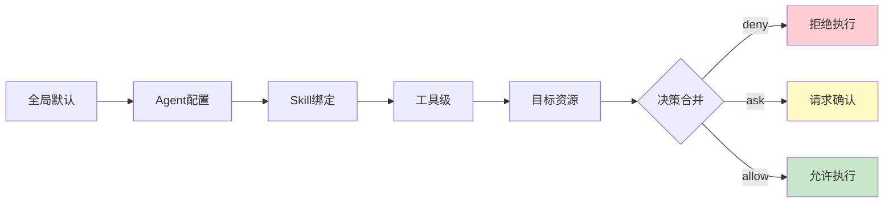
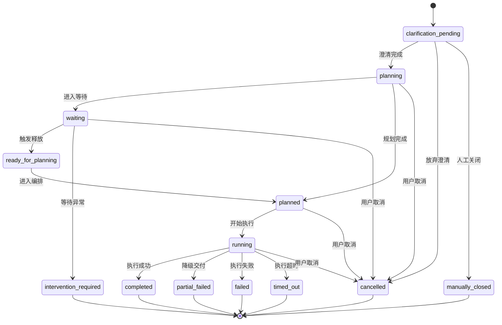
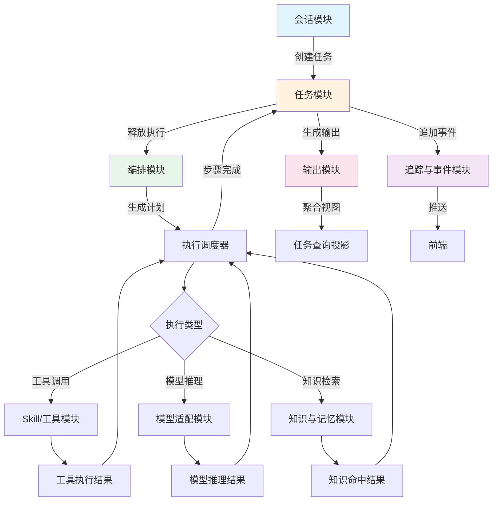

# BiosBot 详细设计

## 1. 文档目的

本文档用于在概要设计基础上，进一步描述 BiosBot 各核心模块的内部职责、关键对象、处理流程和内部协作方式。
本文档主要支撑 01-需求分析 中的 N-01～N-14 需求，并为接口实现、数据库落表、前端联调和测试用例编写提供直接依据。
本文档重点回答“模块内部如何工作、核心对象如何流转、异常和边界如何处理”；本文中的对象为模块内部使用的领域对象和运行时对象，不等同于数据库表结构。对外接口定义、DTO 结构、错误码和事件契约以 06-功能函数文档 为准，持久化表结构、字段和索引以 07-数据库文档 为准，跨模块结构与系统分层以 04-概要设计 为准。

**文档边界约定：**
- 对外接口定义、DTO 结构、错误码、事件契约以 06-功能函数文档 为准
- 持久化表结构、字段和索引以 07-数据库文档 为准
- 跨模块结构与系统分层以 04-概要设计 为准
- 配置项定义与默认值以 06-功能函数文档 为准
- 详细事件类型列表以 06-功能函数文档 为准

## 2. 设计范围

P0 阶段详细设计覆盖以下模块：

- 会话模块。
- 任务模块。
- 编排模块。
- 附件模块。
- Skill 与工具模块。
- 模型适配模块。
- 知识与记忆模块。
- 输出模块。
- 追踪与事件模块。

## 3. 模块详细设计

### 3.1 会话模块

| 项目 | 内容 |
|------|------|
| 职责 | 管理默认会话上下文、标题生成、消息持久化和最近任务引用 |
| 核心对象 | Conversation, Message, ConversationSummary |
| 入口依赖 | 用户消息输入 |
| 出口目标 | 任务模块 |

职责：

- 管理默认会话上下文、标题生成、消息持久化和最近任务引用。
- 为任务创建提供会话上下文和附件关联关系。

核心领域对象：

- `Conversation`
- `Message`
- `ConversationSummary`

处理流程：

- 系统为用户维护默认会话上下文；首次进入或首次发送消息时，若不存在对应 `Conversation` 记录，则自动初始化，不要求用户显式执行“新建会话”动作。
- 用户发送消息时写入 `Message`，并关联当前会话和可选任务；消息事实至少需要记录 `entryPoint`、`originClientId` 或等价来源接入端标识，供单窗口主交互和多端显示策略判断使用。
- 若消息承载的是权限确认、高风险执行确认或人工介入处置请求，会话层还需关联统一的任务事实摘要引用，确保用户在非原始接入端处理同一事实时，界面仍能展示一致的最小事实摘要。
- 若消息触发复杂任务，则将会话上下文摘要传递给任务模块。

边界与约束：

- 会话模块只维护消息与上下文，不直接生成最终输出物。
- 历史消息可用于标题生成和短期记忆整理，但不直接替代任务事件流。

### 3.1.5 Agent Service 模块

| 项目 | 内容 |
|------|------|
| 职责 | Agent 生命周期管理、Leader Agent 初始化、Domain Agent CRUD、Agent 配置与绑定 |
| 核心对象 | Agent, AgentConfig, AgentCapability, LeaderAgentInitializer |
| 入口依赖 | 系统启动、用户配置请求 |
| 出口目标 | 编排模块、模型适配模块、Skill 模块 |

职责：

- 管理 Leader Agent 和 Domain Agent 的生命周期。
- 系统首次启动时自动初始化默认 Leader Agent。
- 提供 Domain Agent 的创建、编辑、删除、启用、禁用能力。
- 管理 Agent 与模型、Skills、权限策略的绑定关系。

核心领域对象：

- `Agent`
- `AgentConfig`
- `AgentCapability`
- `AgentSkillBinding`
- `AgentModelBinding`
- `LeaderAgentInitializer`

**Leader Agent 系统初始化 (N-07.1)：**

- 系统首次启动时自动检查是否存在 Leader Agent 记录
- 若不存在，则自动创建内置 Leader Agent，具备以下能力：
  - 任务路由与意图解析
  - 复杂任务拆解为父子任务
  - Domain Agent 分配与编排
  - 执行结果汇总与最终输出生成
  - ReAct 模式执行与目标满足性判定
- Leader Agent 配置为系统内置角色，`isSystem=true`，不可删除
- 初始化时写入默认系统角色描述和任务处理指令

处理流程：

- **初始化流程**：
  1. 检查数据库是否存在 Leader Agent 记录
  2. 若不存在，创建默认 Leader Agent，配置如下：
     - `type`: `leader`
     - `name`: `Leader Agent`
     - `role`: 系统内置任务路由、拆解、编排与汇总角色
     - `isSystem`: `true`
     - `status`: `active`
  3. 绑定默认模型配置
  4. 注册到系统服务

- **Domain Agent 管理流程**：
  1. 用户提交 Agent 配置请求（创建/编辑）
  2. 校验 Agent 名称、角色描述、绑定模型、Skills
  3. 若为新建 Agent，保存后需通过连通性测试才能启用
  4. 若为编辑 Agent，保存后新任务立即生效，运行中任务不受影响
  5. 删除 Agent 前检查是否有运行中任务引用，若有则拒绝删除

- **Agent 与模型绑定**：
  1. Agent 配置中通过 `model` 字段指定使用的模型 ID
  2. 若未指定模型，使用系统默认模型
  3. Agent 执行任务时，系统根据 Agent 配置调用对应模型

- **Agent 与 Skills 绑定**：
  1. Agent 只能调用已绑定的 Skills
  2. Skill 激活后，工具才在当前 Agent 上下文中变为可用
  3. 调用记录需按 Agent 独立追溯

边界与约束：

- Leader Agent 始终存在且不可删除
- Domain Agent 删除前必须检查运行中任务引用
- Agent 配置变更后，新任务立即生效，不影响运行中任务
- Agent 只能通过系统接口调用工具，不得直接绕过系统

### 3.1.6 Input Normalization Service 模块

| 项目 | 内容 |
|------|------|
| 职责 | 多模态输入标准化、TaskInput 生成、附件与文本切片 |
| 核心对象 | TaskInput, InputSlice, InputNormalizer |
| 入口依赖 | 用户上传的附件、文本消息 |
| 出口目标 | 任务模块、编排模块 |

职责：

- 将多模态输入（文本、图片、PDF、文档）标准化为统一的 TaskInput
- 生成可供 Agent 使用的 InputSlice
- 管理附件解析结果的切片与摘要

核心领域对象：

- `TaskInput`
- `InputSlice`
- `InputNormalizer`
- `MultiModalContent`

处理流程：

- **输入标准化流程**：
  1. 接收用户输入（文本 + 附件列表）
  2. 对文本进行分词、实体识别、意图初步解析
  3. 对附件根据类型分发到不同解析器：
     - 图片 → OCR 提取文本
     - PDF → 文本抽取 + 版面分析
     - Word → 文本抽取
  4. 合并文本与附件解析结果，生成统一的 TaskInput
  5. 生成 InputSlice 供后续 Agent 执行使用

- **TaskInput 结构**：
  ```
  TaskInput {
    rawText: string           // 原始文本输入
    slices: InputSlice[]     // 标准化切片
    attachments: AttachmentRef[] // 附件引用
    intentHints: IntentHint[] // 意图提示
    memoryScope: MemoryScope  // 建议的记忆范围
  }
  ```

- **InputSlice 类型**：
  - `text`: 纯文本切片
  - `ocr_result`: OCR 识别的文本
  - `parsed_content`: 解析后的结构化内容
  - `image_description`: 图片描述（可选）

边界与约束：

- Input Normalization 不负责知识沉淀决策
- 附件入知识库必须由显式用户动作触发
- 单个附件大小上限 50MB

### 3.2 任务模块

| 项目 | 内容 |
|------|------|
| 职责 | 管理任务生命周期、状态流转、步骤集合、重试和取消 |
| 核心对象 | Task, TaskStep, TaskExecutionView, TaskWriteCommand, FrozenIntakeSnapshot |
| 入口依赖 | 会话上下文、编排结果 |
| 出口目标 | 追踪与事件模块、输出模块 |

职责：

- 管理任务生命周期、状态流转、步骤集合、重试和取消。
- 对外提供任务详情、步骤列表、时间线和结果页所需的聚合视图。

核心领域对象：

- `Task`
- `TaskStep`
- `TaskExecutionView`
- `TaskWriteCommand`
- `TaskAggregateVersion`
- `PermissionRequest`
- `TaskTriggerDecision`
- `TaskTriggerRule`
- `FrozenIntakeSnapshot`

对象字段详细说明：

| 对象 | 字段 | 说明 |
|------|------|------|
| Task | status, triggerMode, scheduledAt, triggerRule, triggerDecisionSummary, complexityDecisionSummary, entryPoint, originClientId, syncPolicy, visibleClientIds, displayScope, waitingAnomalyCode, waitingAnomalySummary, lastTriggerEvaluationSummary, waitingThresholdMode, waitingThresholdBasisSummary, interventionRequiredReason, clarificationRequiredFields, clarificationResolutionSummary, clarificationClosedReason, arrangementStatus, userNotificationStage, finalOutputReady | 任务稳定状态 |
| TaskTriggerDecision | triggerMode, scheduledAt?, triggerRule?, triggerDecisionSummary, waitingThresholdMode, waitingThresholdBasisSummary, nextTriggerCheckAt? | 入口判定与等待阈值依据 |
| TaskExecutionView | suggestedActions, arrangementSummary, estimatedCompletionAt, estimatedDurationMinutes, outputStage, arrangementNoticeSummary, degradedDeliverySummary, supplementalUpdates, visibleClientIds | 界面查询聚合字段 |
| FrozenIntakeSnapshot | memoryScope, 显式记忆条目, 入口输入摘要, 触发判定摘要, thresholdConfigSnapshot | 冻结时的记忆上下文 |

处理流程：

- 接收 `CreateTaskRequestDto` 后，先由任务入口判定链路生成 `TaskTriggerDecision`，给出 `triggerMode`、`scheduledAt?`、`triggerRule?`、`triggerDecisionSummary`、`waitingThresholdMode`、`waitingThresholdBasisSummary` 和可选的 `nextTriggerCheckAt?`，再创建 `Task` 主记录并写入这些入口控制信息。
- `triggerMode` 枚举如下：
  - `immediate`：立即执行
  - `queued`：进入队列等待
  - `scheduled`：定时执行
  - `event_triggered`：事件触发
  - `clarification_pending`：低置信度待澄清
- `triggerMode`、`scheduledAt?` 和 `triggerRule?` 由会话意图解析链路根据输入中的时间表达、排队意图和事件条件自动归一化填入，不需要前端以显式交互直接覆盖该判定结果。
- **入口澄清流程 (N-01.5)**：当系统对入口模式判定置信度不足，或缺少定时/触发执行所需关键条件时，进入澄清链路：
  - 创建 `clarification_pending` 状态任务，记录 `clarificationRequiredFields`（待澄清字段列表）和 `lowConfidenceReason`
  - 入口澄清事件序列：`ClarificationRequested` -> `ClarificationProvided` / `ClarificationTimeout` / `ClarificationClosed`
  - 用户补充信息后，更新 `clarificationResolutionSummary`，推进到正式 `triggerMode` 并继续执行
  - 用户放弃澄清时，任务进入明确终态（如 `TaskCancelled` 或 `TaskManuallyClosed`），而不是继续停留或重建新任务
  - 澄清期间禁止进入执行链路，必须在原 Task 上完成状态推进
- 对于 `queued`、`scheduled` 和 `event_triggered` 任务，创建时同时生成 `FrozenIntakeSnapshot`，冻结 `memoryScope`、显式选择的记忆条目、入口输入摘要、触发判定摘要和 `thresholdConfigSnapshot`；后续释放执行默认基于该快照进入记忆确认与加载链路。
- 任务创建成功后立即记录 `TaskTriggerResolved`；若 `triggerMode = immediate`，则继续记录 `TaskReadyForPlanning` 并直接进入编排链路；若为 `queued`、`scheduled` 或 `event_triggered`，则记录 `TaskTriggerWaiting`，并把 `waitingThresholdMode`、`waitingThresholdBasisSummary`、`nextTriggerCheckAt?` 一并写入查询投影，再由任务入口判定链路登记等待订阅或下一次重评估条件。
- 等待调度采用统一等待订阅结构，字段定义如下：

| 字段 | 类型 | 说明 |
|------|------|------|
| id | string | 订阅唯一标识 |
| taskId | string | 关联任务ID |
| type | enum | 等待类型：queued/scheduled/event_triggered |
| queuePosition | int | 队列位置（queued类型） |
| domainAgentId | string | 目标Agent ID（queued类型） |
| scheduledAt | datetime | 计划执行时间（scheduled类型） |
| nextCheckAt | datetime | 下次检查时间 |
| triggerRule | string | 触发规则（event_triggered类型） |
| lastEvaluatedAt | datetime | 最近评估时间 |
| createdAt | datetime | 创建时间 |
| status | enum | active/released/cancelled |
| thresholdConfig | object | maxWaitTimeMs/maxRetryCount/anomalyThresholdMs |
- 定时扫描调度由 Task Intake Service 统一驱动，负责恢复未完成订阅、驱动定时扫描、检查队列可用槽位。
- **等待调度器细节**：
  - 扫描间隔：默认5秒
  - 批处理大小：每次处理50个订阅
  - 单次扫描超时：最长1分钟
  - 评估失败 backoff：指数退避，最大30秒
  - 异常阈值触发：记录 `WaitAnomalyDetected` 事件，写入 `waitingAnomalyCode`、`waitingAnomalySummary`，进入 `TaskInterventionRequired`
  - 启动时自动恢复所有 active 状态的订阅
- 当等待中的任务被队列释放、达到 `scheduledAt` 或命中预定义事件条件时，先由 `Trigger Source Adapter` 产出标准化触发事实，再由 `Task Intake Service` 记录 `TaskTriggerActivated` 或必要的 `TaskTriggerReevaluated`，同时写入 `lastTriggerEvaluationSummary`；若本次重评估已触发异常阈值，则任务模块必须同步写入 `waitingAnomalyCode`、`waitingAnomalySummary`、`interventionRequiredReason` 和 `suggestedActions`，随后再决定是进入 `TaskReadyForPlanning` 还是 `TaskInterventionRequired`。
- 释放执行前必须校验 `FrozenIntakeSnapshot` 中显式记忆条目的可用性；若条目被删除、归档、脱敏或因权限变化不可读，只能按降级规则标记失效条目并保留原快照摘要继续执行，或在不满足最小执行上下文时进入 `TaskInterventionRequired`，禁止隐式切换到释放时刻的新上下文重算。
- 若任务在等待期间被取消、超时、失败终止或人工关闭，则入口判定链路必须注销等待订阅，并与 `TaskCancelled`、`TaskTimedOut`、`TaskFailed` 或 `TaskManuallyClosed` 之一同提交记录 `TaskTriggerInvalidated`，禁止后续触发事实再次释放该任务。
- 延迟任务成功释放的最小事件顺序固定为 `TaskTriggerActivated -> TaskReadyForPlanning -> MemoryScopeConfirmed`；`TaskTriggerReevaluated` 仅用于释放未成功但等待条件被重新判断的场景。
- 所有针对同一 `taskId` 的状态推进、权限确认、步骤完成、重试和降级写操作，先封装为 `TaskWriteCommand` 并进入任务写队列，按单任务顺序依次消费；写命令入队时记录 `TaskWriteQueued`，若版本校验失败或命中乱序覆盖风险，则拒绝本次提交并返回 `TASK_WRITE_CONFLICT`，同时记录 `TaskWriteConflictDetected`。
- 根据编排结果生成 `TaskStep` 列表，并维护当前步骤与任务状态。
- 当步骤执行前命中高风险写入、编辑、执行或外部调用检查点时，接收权限模块返回的最终权限决策与判定轨迹；若结果为待权限确认，则创建 `PermissionRequest` 权限请求，并将对应步骤置为等待权限确认状态，同时记录 `waitingReason=permission_confirmation`。
- 用户完成权限确认后，任务模块接收最终权限决策结果；若为允许执行则恢复对应步骤执行，若为拒绝执行则写入拒绝结果，并将步骤标记为失败、跳过或按降级策略继续。
- 每次写入前读取当前聚合版本并执行版本校验；若命中过期写入，则拒绝本次提交或进入有限重试，避免并行步骤覆盖较新的任务状态；接口层对该类冲突统一暴露 `TASK_WRITE_CONFLICT`，事件载荷统一包含 `aggregateVersion`、`expectedAggregateVersion`、`writeCommandId` 和 `conflictCode`。
- 在同一次任务写事务中同步更新 `Task`、相关 `TaskStep`、任务查询投影和待追加事件，并由任务模块在该提交边界内驱动追踪与事件模块完成 `sequence` 分配与事件持久化；同一次写操作中不得出现“状态已更新但事件未落库”或“事件已追加但任务状态未提交”的分叉结果。
- 汇总路由摘要、复杂任务判定摘要、等待异常摘要、阈值依据、并行状态、自动重试、权限摘要、阶段性通知状态和降级记录，形成界面所需聚合视图。

边界与约束：

- 任务模块不负责选择具体 Agent 或 Skill，只负责承接编排结果。
- 任务状态更新必须与事件写入、`sequence` 分配保持同一提交边界，不允许在任务事务提交成功后再异步补写正式时间线事件。
- 任务模块不直接决定权限策略，只负责承接权限决策结果，并控制步骤暂停、恢复和拒绝后的状态流转。
- 任务模块拥有 `TaskExecutionView` 查询投影，任务详情页和结果页优先读取该投影，不直接从输出模块或事件表临时拼装页面字段。
- 同一 `taskId` 的写命令必须串行消费；若未采用显式写队列，则必须通过等价的任务级锁或聚合版本校验保证顺序一致。
- 队列等待、定时等待和事件等待属于任务入口控制状态，不等同于步骤级 `waiting`；只有任务被释放进入执行链路后，才生成正式 `TaskPlan` 与步骤级等待语义。
- `FrozenIntakeSnapshot` 是延迟任务的执行基线，不允许在等待期间被释放时刻的新上下文静默覆盖；若快照失效导致无法满足最小执行上下文，必须走显式终态或人工处理分支。
- P0 阶段的队列释放只基于全局任务执行槽位预算：以本地运行时允许的最大并发执行任务数减去当前正在执行链路中的任务数得到，不引入 Agent 级、模型级或任务类型级子配额。
- **并行执行控制细节**：
  - 全局最大并发数：默认3（可通过配置调整）
  - 并行组内启动：同时启动，无 FIFO 顺序
  - 槽位释放时机：步骤完成 / 失败 / 跳过时立即释放
  - 并行任务状态独立追踪，不因组内单任务失败而自动终止其他并行任务

任务入口判定链路与编排模块边界必须分离：前者只决定任务是否立即进入执行、何时重评估以及释放条件；后者只处理已经进入执行链路的任务规划、路由和运行时步骤调度。

等待订阅必须具备一次性释放保障：同一订阅只能成功认领一次释放动作；重复的触发事实或恢复扫描只能命中幂等路径或被拒绝，不能重复把同一任务推进到可规划状态。

#### 3.2.7 任务检查点恢复机制 (N-14.2)

| 项目 | 内容 |
|------|------|
| 职责 | 检查点生成、验证、恢复执行、快照管理 |
| 核心对象 | TaskCheckpoint, CheckpointValidator, RecoveryDecision, SnapshotMetadata |
| 入口依赖 | 步骤完成、系统重启 |
| 出口目标 | 任务模块、编排模块 |

职责：

- 任务执行过程中自动生成检查点
- 系统重启后验证并恢复中断任务
- 确保恢复的安全性与幂等性

核心领域对象：

- `TaskCheckpoint`
- `CheckpointValidator`
- `RecoveryDecision`
- `SnapshotMetadata`
- `CheckpointRecoveryContext`

**检查点结构**：
```
TaskCheckpoint {
  checkpointId: string
  taskId: string
  stepId: string
  stepStatus: enum  // pending/running/waiting/completed/failed/skipped
  taskStatus: enum
  createdAt: datetime

  // 快照数据
  snapshot: {
    taskInput: TaskInput           // 任务输入
    memoryScope: MemoryScope       // 记忆范围
    selectedMemoryIds: string[]   // 选中的记忆条目
    planRevision: number          // 当前计划版本
    replanCount: number           // 重编排次数

    // 执行上下文
    executedToolCalls: ToolCall[]  // 已执行的工具调用
    toolResults: ToolResult[]     // 工具返回结果
    reasoningSummary: string       // 当前推理摘要
    observationSummary: string    // 观察摘要

    // 决策状态
    goalSatisfactionStatus: enum  // 目标满足状态
    goalSatisfactionSummary: string
  }

  // 验证元数据
  validation: {
    integrity: boolean           // 完整性验证
    idempotency: boolean          // 幂等性验证
    timeliness: boolean           // 时效性验证
    validatedAt: datetime
  }
}
```

**检查点生成流程**：

1. 触发时机：每个任务步骤完成后自动生成
2. 记录内容：
   - 任务当前状态
   - 已执行的工具调用列表
   - 输入输出摘要
   - 决策摘要（推理摘要、观察摘要、目标满足性判定）
3. 持久化存储到数据库
4. 保留最近 N 个检查点（默认 5 个）

**检查点验证流程**：

系统重启后，执行以下验证：

1. **完整性验证**：
   - 检查点数据无损坏
   - 必填字段齐全
   - 关联的任务、步骤记录存在

2. **幂等性验证**：
   - 已执行的工具调用是否可安全重放
   - 判断依据：工具调用是否为幂等操作
   - 以下情况视为不可重放：
     - 非幂等写入操作
     - 有外部副作用的操作

3. **时效性验证**：
   - 快照是否过期
   - 关联的记忆条目是否仍然有效
   - 配置是否仍然有效

**恢复决策流程**：

```
RecoveryDecision {
  decision: enum  // auto_recover/manual_confirm/cannot_recover
  checkpointId: string
  recoveryType: enum  // continue_from_checkpoint/restart_from_beginning
  reason: string
  safetyProof: {
    integrityValid: boolean
    idempotencyValid: boolean
    timelinessValid: boolean
  }
  affectedSteps: string[]
  rollbackActions: string[]
}
```

- 若三项验证全部通过 → 自动恢复
- 若部分验证失败 → 进入人工确认流程
- 若全部验证失败 → 标记为无法恢复，记录原因

**恢复执行流程**：

1. 从最近的有效检查点恢复
2. 重置当前步骤状态为 pending
3. 恢复执行上下文
4. 跳过已完成的工具调用（直接复用结果）
5. 重新执行当前步骤的决策逻辑
6. 记录恢复事件 `TaskRecovered`

**边界与约束**：

- 每个执行步骤完成后必须生成检查点
- 检查点验证失败时必须进入人工确认或受控重试
- 恢复时不得跳过决策逻辑重执行
- 恢复判定依据必须写入事件流

### 3.3 编排模块

| 项目 | 内容 |
|------|------|
| 职责 | 解析用户意图、生成 TaskPlan、匹配 Agent/Skill/工具、运行时步骤调度、基于观察结果的增量重编排 |
| 核心对象 | TaskPlan, TaskRouteDecision, DomainTaskAssignment, ExecutionScheduler |
| 入口依赖 | 任务模块释放的任务 |
| 出口目标 | 任务模块（回传执行结果）、Agent 执行服务 |

职责：

- 解析用户意图。
- 生成 `TaskPlan`。
- 匹配 Leader Agent、Domain Agent、Skill、知识检索和工具调用链路。
- 负责运行时步骤调度、并行组控制、等待恢复和续跑触发。

核心领域对象：

- `TaskPlan`
- `TaskRouteDecision`
- `ParentTaskRelation`
- `DomainTaskAssignment`
- `TaskArrangementSummary`
- `ParallelExecutionGroup`
- `ExecutionScheduler`
- `StepDispatchTicket`

核心对象字段说明：

| 对象 | 必须字段 | 说明 |
|------|---------|------|
| TaskRouteDecision | complexityDecisionSummary, routeDecisionSummary | 意图解析结果 |
| TaskPlan | planRevision, latestPlanSummary | 当前正式计划版本及其摘要；同一父任务内每发生一次有效增量重编排即递增 |
| DomainTaskAssignment | assignedDomainAgentId, 子任务入口模式, 等待摘要 | Domain分配信息 |
| TaskArrangementSummary | arrangementStatus, arrangementSummary, estimatedCompletionAt, estimatedDurationMinutes, 安排阶段通知摘要 | 安排聚合信息 |

编排模块不直接消费原始触发源事件；所有队列变更、定时器到期和预定义事件都必须先经 `Trigger Source Adapter` 与入口判定链路处理，只有任务被释放进入执行链路后，编排模块才开始工作。

处理流程：

- 基于任务输入、附件摘要、记忆范围和 Agent 能力进行意图解析，生成可解释的 `complexityDecisionSummary`。
- 若任务需要多 Domain Agent 协作，则先生成父任务级拆分结果，为每个 Domain Agent 创建 `DomainTaskAssignment`，并生成父任务与子任务关系。
- 生成不少于规划、执行、汇总三级的步骤计划。
- 对已释放进入执行链路的步骤，`ExecutionScheduler` 调度对应 Agent 按 ReAct 回合运行：先生成简短推理摘要，再决定下一步 Skill / 工具动作，接着接收观察结果并回写当前步骤上下文，只有在观察结果被吸收后才能继续下一轮决策、输出最终答案或进入失败 / 人工介入分支。
- 对每个 Domain 子任务写入目标 `assignedDomainAgentId`、`parentTaskId`、子任务输入摘要、入口模式和等待条件；`queued` 子任务进入该 Domain Agent 的显式队列，`scheduled` / `event_triggered` 子任务登记各自等待订阅。
- 对每个 Domain 子任务生成 `blockingDecision` 与 `blockingDecisionReason`：凡是缺失后会导致父任务首版结果不成立、不可信、不可用，或晚到后会推翻首版结论的子任务，必须标记为 blocking；凡是可在首版交付后以补充更新追加、且不会推翻首版结论的增强性、补充性、可延后子任务，才可标记为 non-blocking。安全、权限、合规、关键校验、回滚保障和最终汇总所必需的子任务不得标记为 non-blocking；若模型输出无法稳定判断该子任务是否影响主目标成立，编排模块按 blocking 接管，并把该保守判定写入理由摘要。
- Leader 父任务在收到一轮 Domain 子任务回传结果后，必须先聚合观察结果并执行统一的父任务目标满足性判定；该判定结果统一记为 `goalSatisfactionStatus`、`goalSatisfactionSummary`，并追加 `GoalSatisfactionEvaluated` 事件。若目标未满足且仍具备自动推进条件，则在原父任务上下文内再次调用大模型生成增量 `TaskPlan` / `DomainTaskAssignment`，同步递增 `planRevision`、`replanCount`，写入 `latestPlanSummary`，并追加 `TaskReplanned` 事件，继续向 Domain Agent 分派新一轮子任务，而不是要求用户重新建单。
- 当全部 blocking 子任务都返回“已入队 / 已登记定时 / 已登记触发”等安排确认后，生成 `TaskArrangementSummary`，汇总子任务排队状态、各自 ETA 和父任务聚合 ETA，并驱动 Leader 父任务先向用户发送安排完成通知。
- 为可并行步骤分配 `parallelGroupId`，为冲突步骤标记等待条件。
- 生成 `routeDecisionSummary` 并回交任务模块。
- `ExecutionScheduler` 根据 `TaskPlan` 发放可执行步骤，为每个步骤生成 `StepDispatchTicket`，并控制并行组内的启动顺序。
- 当步骤因共享资源冲突、前置依赖未满足或权限确认暂停时，`ExecutionScheduler` 将步骤维持在 `waiting`，并订阅恢复条件；该状态需通过 `StepWaiting` 事件对外暴露，恢复条件满足后再次投递步骤执行。
- 步骤完成、失败、重试或降级后，`ExecutionScheduler` 不直接改写任务状态，而是将执行回执统一回交任务模块进入任务写队列。

边界与约束：

- 编排模块负责规划与运行时调度，但不直接写入任务状态或事件流。
- 并行调度仅适用于无共享写冲突的步骤；涉及共享文件、共享输出物或同一外部资源提交时必须串行。
- ReAct 回合只保留可审计的推理摘要、动作事实和观察摘要，不把完整原始思维链落入对外接口、界面或长期存储契约。
- 与增量编排相关的内部对象、查询投影、事件追加请求和对外摘要命名必须统一使用 `planRevision`、`replanCount`、`latestPlanSummary`、`goalSatisfactionStatus`、`goalSatisfactionSummary`，不得在模块内再引入同义别名。
- blocking / non-blocking 判定只服务于三类运行时决策：父任务是否允许首版交付、父任务 ETA 与安排完成是否成立、晚到子任务结果应进入降级交付说明还是补充更新链路；不得把该标记扩展为额外状态机，也不得用它替代任务成功/失败状态本身。
- 统一的父任务目标满足性判定不得绕过 blocking 约束：若仍存在未完成、失败或未被合法降级处理的 blocking 子任务，则不得判定为允许首版最终交付。
- Leader 的重编排必须建立在已落账的观察结果和原父任务上下文之上；不得绕过已完成子任务事实直接重写历史结论，也不得让 Domain Agent 彼此直接协商新任务。
- 父任务与子任务必须分离持久化：Leader 父任务负责安排确认、聚合 ETA 和最终汇总，Domain 子任务负责各自排队、触发、执行与结果回传。

### 3.3.5 Trigger Evaluation Service 模块

| 项目 | 内容 |
|------|------|
| 职责 | 触发条件判定、等待条件重评估、异常检测与阈值判定 |
| 核心对象 | TriggerEvaluator, WaitThresholdConfig, TriggerEvaluationResult |
| 入口依赖 | 队列变更信号、定时器信号、事件信号 |
| 出口目标 | 任务模块、Trigger Source Adapter |

职责：

- 标准化触发条件判断逻辑
- 等待条件重评估
- 异常检测与阈值判定
- 生成标准化的触发评估结果

核心领域对象：

- `TriggerEvaluator`
- `WaitThresholdConfig`
- `TriggerEvaluationResult`
- `AnomalyDetectionResult`

处理流程：

- **触发条件评估流程**：
  1. 接收 Trigger Source Adapter 提供的触发信号
  2. 根据触发类型（queued/scheduled/event_triggered）执行对应评估逻辑
  3. 检查是否满足释放条件：
     - `queued`: 检查目标 Domain Agent 队列是否有可用槽位
     - `scheduled`: 检查当前时间是否已达到 scheduledAt
     - `event_triggered`: 检查事件条件是否匹配 triggerRule
  4. 生成 TriggerEvaluationResult，包含：
     - `canRelease`: boolean - 是否可以释放
     - `evaluationSummary`: string - 评估摘要
     - `nextCheckAt`: datetime? - 下次检查时间（若不能释放）
     - `anomalyDetected`: boolean - 是否检测到异常

- **异常检测流程**：
  1. 根据 WaitThresholdConfig 检查是否超过阈值：
     - `maxWaitTimeMs`: 最大等待时间
     - `maxRetryCount`: 最大重估次数
     - `anomalyThresholdMs`: 异常阈值
  2. 若检测到异常，生成 AnomalyDetectionResult：
     - `anomalyCode`: 异常码（WAIT_TIMEOUT/TRIGGER_INVALIDATED/SNAPSHOT_INVALIDATED）
     - `summary`: 异常摘要
     - `suggestedActions`: 建议动作列表
  3. 触发 WaitAnomalyDetected 事件

- **重评估流程**：
  1. 对不能立即释放的任务，执行重评估逻辑
  2. 更新 lastEvaluatedAt 和 nextCheckAt
  3. 若重评估次数超过 maxRetryCount，触发异常检测
  4. 记录 TaskTriggerReevaluated 事件

边界与约束：

- Trigger Evaluation Service 不直接修改任务状态，只输出评估结果
- 异常判定必须基于配置的阈值参数，不得硬编码
- 评估结果需要写入事件流供审计使用

### 3.3.6 Trigger Source Adapter 模块

| 项目 | 内容 |
|------|------|
| 职责 | 队列变更信号接入、定时器到期信号接入、预定义事件信号接入、标准化触发事实输出 |
| 核心对象 | QueueSignal, TimerSignal, EventSignal, StandardizedTriggerFact |
| 入口依赖 | 队列管理器、定时器、外部事件 |
| 出口目标 | Trigger Evaluation Service、任务模块 |

职责：

- 统一接入各类触发信号源
- 将不同类型的触发信号标准化为统一格式
- 提供触发事实的持久化与幂等性保障

核心领域对象：

- `QueueSignal`
- `TimerSignal`
- `EventSignal`
- `StandardizedTriggerFact`
- `TriggerSubscription`

处理流程：

- **队列信号处理**：
  1. 监听 Domain Agent 队列状态变化
  2. 当队列释放可用槽位时，生成 QueueSignal：
     - `type`: `queue_released`
     - `domainAgentId`: 目标 Agent ID
     - `availableSlots`: 可用槽位数
  3. 转换为 StandardizedTriggerFact 并发送到 Trigger Evaluation Service

- **定时器信号处理**：
  1. 管理系统内的定时任务调度器
  2. 当定时器到期时，生成 TimerSignal：
     - `type`: `timer_expired`
     - `taskId`: 关联任务 ID
     - `scheduledAt`: 计划执行时间
  3. 转换为 StandardizedTriggerFact 并发送到 Trigger Evaluation Service

- **事件信号处理**：
  1. 监听预定义的事件源（如文件变化、API 回调等）
  2. 当事件匹配 triggerRule 时，生成 EventSignal：
     - `type`: `event_matched`
     - `taskId`: 关联任务 ID
     - `eventType`: 事件类型
     - `eventData`: 事件数据
  3. 转换为 StandardizedTriggerFact 并发送到 Trigger Evaluation Service

- **标准化触发事实结构**：
  ```
  StandardizedTriggerFact {
    factId: string           // 触发事实唯一标识
    taskId: string           // 关联任务 ID
    triggerType: enum       // queued/scheduled/event_triggered
    signalType: enum        // queue_released/timer_expired/event_matched
    signalSource: string    // 信号来源标识
    signalSignature: string // 信号签名（用于幂等检测）
    timestamp: datetime     // 信号产生时间
    evaluationRequired: boolean // 是否需要触发评估
  }
  ```

- **一次性释放保障**：
  1. 每个 StandardizedTriggerFact 包含唯一 signalSignature
  2. 释放前检查该 signature 是否已被处理
  3. 若已处理，则跳过；否则标记为已处理并继续释放流程
  4. 确保同一触发事实不会被重复处理

边界与约束：

- Trigger Source Adapter 不执行条件评估，只负责信号接入和标准化
- 所有触发信号必须经过标准化后才能被任务模块消费
- 需要保证触发信号的幂等性，防止重复释放

### 3.4 附件模块

| 项目 | 内容 |
|------|------|
| 职责 | 上传、存储、解析、重解析、附件状态管理 |
| 核心对象 | Attachment, AttachmentParseResult, InputSlice |
| 入口依赖 | 用户上传的附件 |
| 出口目标 | 任务模块（InputSlice） |

职责：

- 负责上传、存储、解析、重解析和附件状态管理。
- 为任务输入标准化提供文本切片、OCR 结果和解析摘要。

核心领域对象：

- `Attachment`
- `AttachmentParseResult`
- `InputSlice`

处理流程：

- 上传后先写入附件元数据和文件系统。
- 根据类型进入 OCR、文本抽取或 PDF 解析链路。
- 解析成功后生成 `InputSlice`；失败时记录错误并支持重解析或跳过。

边界与约束：

- 附件模块只负责输入处理，不负责知识沉淀决策。
- 附件入知识库必须由显式用户动作或明确的系统流程触发。

### 3.5 Skill 与工具模块

| 项目 | 内容 |
|------|------|
| 职责 | Skill 元数据管理、懒加载激活、工具注册、权限策略校验 |
| 核心对象 | SkillDescriptor, ToolDefinition, ToolInvocationLog, PermissionPolicy |
| 入口依赖 | Agent 执行请求 |
| 出口目标 | 工具沙箱执行 |

职责：

- 管理全局 Skill 元数据、懒加载激活、工具注册和权限策略校验。
- 为 Agent 执行阶段提供标准化工具入口。
- 支持系统级多语言 Skill 装载，但对单个 Skill 包执行单语言运行时约束与一致性校验。

核心领域对象：

- `SkillDescriptor`
- `ToolDefinition`
- `ToolInvocationLog`
- `PermissionPolicy`

处理流程：

- 系统启动时扫描 Skill 目录并建立索引。
- 任务执行时通过 `use_skill(skillId)` 激活 Skill。
- 根据 Agent 绑定关系和白名单校验工具可用性。
- 在实际执行工具前，先判断动作是否命中权限检查点，如文件写入、文本编辑、命令执行或外部系统调用。
- 权限策略合并顺序为全局默认权限策略 -> Agent 配置 -> Skill 绑定权限策略 -> 工具级权限策略 -> 目标资源限制，实际判定统一按 `deny > ask > allow` 取最严格结果，并输出标准化权限判定轨迹。
- 若同一权限确认或确认执行动作在多个接入端并发提交，系统必须先完成权限策略计算，再对同一事实的交互结果做幂等去重；“最先生效的有效交互结果”只用于同一事实的重复提交处理，不得覆盖 `deny > ask > allow` 的权限策略优先级。
- 对于来自非原始接入端的确认请求，执行前必须先渲染最小事实摘要，至少包含任务标识、当前状态、触发原因、影响范围和待确认动作；缺少该摘要时，不得进入最终确认提交流程。

**Skill 安装/卸载生命周期：**

- **设计原则：系统可支持多种语言的 Skill，但一个 Skill 包只能选择一种编程语言**
- Skill 目录结构：
  ```
  skills/<skill-id>/
  ├── SKILL.md              # Skill 元数据定义（含 runtimeLanguage）
  ├── install.js            # JavaScript 安装脚本
  ├── uninstall.js          # JavaScript 卸载脚本
  ├── package.json          # JavaScript 依赖
  └── scripts/              # 工具执行脚本目录

  # 或 Python 版本
  skills/<skill-id>/
  ├── SKILL.md
  ├── install.py
  ├── uninstall.py
  ├── requirements.txt
  └── scripts/

  # 或 Ruby 版本
  skills/<skill-id>/
  ├── SKILL.md
  ├── install.rb
  ├── uninstall.rb
  ├── Gemfile
  └── scripts/

  # 或 Bash 版本
  skills/<skill-id>/
  ├── SKILL.md
  ├── install.sh
  ├── uninstall.sh
  └── scripts/

  # 或 PowerShell 版本
  skills/<skill-id>/
  ├── SKILL.md
  ├── install.ps1
  ├── uninstall.ps1
  └── scripts/
  ```
- **安装流程**：
  1. 扫描 `skills/` 目录，识别包含 `SKILL.md` 的子目录
  2. 读取 `SKILL.md` 解析 Skill 元数据
  3. 校验 `runtimeLanguage` 字段且确认单包内脚本、依赖文件、执行器与该语言一致；若检测到多语言混装或声明与内容不一致则拒绝安装
  4. 根据 `runtimeLanguage` 安装对应依赖：
     - JavaScript → `npm install`
     - Python → `pip install -r requirements.txt`
     - Ruby → `bundle install`
  5. 执行安装脚本（如存在），传入参数：通过文件传递 `{ skillId, skillPath, config }`
  6. 将 Skill 注册到系统数据库
- **卸载流程**：
  1. 从系统数据库注销 Skill
  2. 执行卸载脚本（如存在），传入参数：通过文件传递 `{ skillId, skillPath, config }`
  3. 根据 `runtimeLanguage` 清理对应依赖目录（`node_modules`/`venv`/`.bundle`）
- **支持的语言**：
  | 语言 | 安装脚本 | 卸载脚本 | 依赖文件 | 清理目录 |
  |------|---------|---------|---------|---------|
  | JavaScript/Node.js | install.js | uninstall.js | package.json | node_modules |
  | Python | install.py | uninstall.py | requirements.txt | venv |
  | Ruby | install.rb | uninstall.rb | Gemfile | .bundle |
  | Bash | install.sh | uninstall.sh | - | - |
  | PowerShell | install.ps1 | uninstall.ps1 | - | - |
- **脚本接口**：
  - JavaScript：导出 `execute` 函数
  - Python/Ruby/Bash/PowerShell：通过文件传递参数，执行后输出 JSON 格式结果

- **安装拒绝条件**：
  - `SKILL.md` 未声明 `runtimeLanguage`
  - 同一 Skill 包同时出现多种语言的生命周期脚本或互斥依赖文件
  - 生命周期脚本、依赖文件、执行器目录与声明的 `runtimeLanguage` 不一致

  ```typescript
  interface SkillLifecycleScript {
    execute(params: {
      skillId: string;
      skillPath: string;
      config: Record<string, any>;
    }): Promise<{
      success: boolean;
      message?: string;
      error?: string;
    }>;
  }
   ```



- 若权限决策为 `ask`，需配置超时机制：默认超时时间 5 分钟，最大超时时间 30 分钟。
  - 默认超时行为：维持等待状态（可配置为自动升级为 deny）
  - 按风险等级区分超时时间：
    - 低风险操作（如读取配置文件）：5分钟
    - 中风险操作（如写入非敏感文件）：2分钟
    - 高风险操作（如执行命令、写入可执行文件）：1分钟
  - 超时事件：记录 `PermissionCheckTimeout`，包含超时时长和操作类型
  - 超时后可选择自动升级为 deny，或保持等待用户确认；高风险操作超时时间应短于低风险操作。
- 若权限决策为 `allow`，则直接进入工具执行；若权限决策为 `ask`，则返回带判定轨迹摘要的权限请求；若权限决策为 `deny`，则直接返回权限拒绝结果。
- 完成权限确认并获得允许执行的权限决策后再执行工具调用，并将执行结果与权限决策结果一并写入日志。

边界与约束：

- 未激活 Skill 的工具不可见、不可调用。
- 所有工具调用必须落日志并带错误码、耗时和参数摘要。
- Skill 激活仅表示工具可被候选使用，不表示高风险工具动作默认获得执行权限决策。

### 3.5.5 Permission Policy Service 模块

| 项目 | 内容 |
|------|------|
| 职责 | 权限策略合并、决策生成、判定轨迹记录、权限请求管理 |
| 核心对象 | PermissionPolicy, PolicyMergeResult, PermissionDecision, PermissionRequest |
| 入口依赖 | Skill 模块的工具调用请求、任务模块的权限检查请求 |
| 出口目标 | 任务模块、Skill 模块、审计模块 |

职责：

- 管理五层权限策略（全局默认/Agent配置/Skill绑定/工具级/资源级）
- 执行策略合并，生成最终权限决策
- 输出标准化判定轨迹
- 管理权限请求的生命周期

核心领域对象：

- `PermissionPolicy`
- `PolicyLayer`
- `PolicyMergeResult`
- `PermissionDecision`
- `PermissionRequest`
- `DecisionTrace`

处理流程：

- **权限策略合并流程**：
  1. 接收权限检查请求，包含：
     - `action`: read/write/execute
     - `agentId`: 发起 Agent
     - `skillId`: 关联 Skill（可选）
     - `toolId`: 目标工具
     - `resource`: 目标资源
  2. 按优先级获取各层策略：
     - Layer 1: 全局默认策略
     - Layer 2: Agent 配置策略
     - Layer 3: Skill 绑定策略
     - Layer 4: 工具级策略
     - Layer 5: 资源级策略
  3. 执行合并算法：
     ```
     PolicyMergeResult {
       mergedDecision: enum  // deny > ask > allow
       decisionSource: string  // 最终决策来自哪层
       trace: DecisionTrace[]  // 每层决策记录
     }
     ```
  4. 输出最终决策和完整判定轨迹

- **五层策略配置结构**：
  ```
  // Layer 1: 全局默认
  {
    level: 'global',
    rules: [
      { action: 'read', decision: 'allow' },
      { action: 'write', decision: 'ask' },
      { action: 'execute', decision: 'deny' }
    ]
  }

  // Layer 2: Agent 配置
  {
    level: 'agent',
    agentId: 'code-agent',
    rules: [
      { action: 'execute', decision: 'allow' }  // 收紧
    ]
  }

  // Layer 3: Skill 绑定
  {
    level: 'skill',
    skillId: 'file-skill',
    rules: [
      { action: 'write', decision: 'deny' }  // 收紧
    ]
  }

  // Layer 4: 工具级
  {
    level: 'tool',
    toolId: 'shell.exec',
    rules: [
      { action: 'execute', decision: 'deny' }
    ]
  }

  // Layer 5: 资源级
  {
    level: 'resource',
    resourcePattern: '/workspace/.env',
    rules: [
      { action: 'read', decision: 'deny' }
    ]
  }
  ```

- **权限请求管理流程**：
  1. 若决策为 `ask`，创建 PermissionRequest：
     ```
     PermissionRequest {
       requestId: string
       taskId: string
       stepId: string
       action: enum
       target: string
       agentId: string
       policy: { level, decision }
       timeout: number
       createdAt: datetime
       status: pending/confirmed/denied/expired
     }
     ```
  2. 发送到前端请求用户确认
  3. 用户确认后更新请求状态
  4. 若超时，按配置决定自动 deny 或保持等待

- **Ask 模式超时配置**：
  ```
  AskTimeoutConfig {
    defaultTimeout: number       // 默认 5 分钟 (300000ms)
    maxTimeout: number          // 最大 30 分钟 (1800000ms)
    autoUpgradeOnTimeout: boolean  // 超时后自动升级为 deny
    riskBasedTimeout: boolean       // 高风险操作超时时间短于低风险
  }
  ```

- **超时时间配置（按风险等级）**：
  | 风险等级 | 操作类型 | 超时时间 |
  |----------|----------|----------|
  | 低风险 | 读取配置文件 | 5 分钟 |
  | 中风险 | 写入非敏感文件 | 2 分钟 |
  | 高风险 | 执行命令、写入可执行文件 | 1 分钟 |

边界与约束：

- 决策优先级：deny > ask > allow（只收紧、不放宽）
- 权限决策必须写入审计日志
- 判定轨迹必须可追溯
- 超时事件记录为 PermissionCheckTimeout

### 3.5.6 Prompt Management Service 模块

| 项目 | 内容 |
|------|------|
| 职责 | Prompt 模板管理、Agent Prompt 配置管理、版本控制、自动迁移、超长裁剪、上下文装配 |
| 核心对象 | PromptTemplate, PromptVersion, AgentPromptProfile, PromptMigrationRecord, PromptContext, Prompt裁剪决策 |
| 入口依赖 | 编排模块、Agent 执行服务 |
| 出口目标 | 模型适配模块 |

职责：

- 管理 Leader、Domain、Output 三类 Prompt 模板
- 管理 Agent 级 Prompt 配置（角色定位、行为规范、能力边界）
- 支持 Prompt 模板版本化
- 支持 Agent 绑定模板版本并在切换时自动迁移
- 处理 Prompt 超长时的裁剪逻辑
- 负责上下文（记忆、知识、工具）的装配

核心领域对象：

- `PromptTemplate`
- `PromptVersion`
- `AgentPromptProfile`
- `PromptMigrationRecord`
- `PromptContext`
- `Prompt裁剪决策`
- `ContextAssembly`

处理流程：

- **Prompt 模板结构**：
  ```
  PromptTemplate {
    id: string
    type: enum  // leader/domain/output
    name: string
    currentVersion: string
    versions: PromptVersion[]
  }

  PromptVersion {
    version: string
    schema: {
      system: string      // 系统层模板结构（包含插槽）
      developer: string   // 开发者层模板结构（包含插槽）
      user: string        // 用户层模板结构（包含插槽）
      context: string     // 上下文层模板结构（包含插槽）
      toolResult: string  // 工具结果层模板结构（包含插槽）
      slotSpec: string[]  // 要求注入的插槽规范
    }
    createdAt: datetime
    changeReason: string
  }

  AgentPromptProfile {
    id: string
    agentId: string
    templateId: string
    templateVersion: string
    roleDefinition: string
    behaviorRules: string
    capabilityBoundaries: string
    customSections: json
    profileVersion: string
    updatedAt: datetime
  }

  PromptMigrationRecord {
    id: string
    agentId: string
    templateId: string
    fromVersion: string
    toVersion: string
    migrationStatus: enum  // succeeded/failed/rolled_back
    conflictSummary: string
    rollbackApplied: boolean
    createdAt: datetime
  }
  ```

- **Prompt 裁剪流程**：
  1. 预估当前上下文窗口使用量
  2. 计算输出保留预算
  3. 若超出窗口，按以下优先级裁剪：
     - 裁剪旧步骤结果（最早的开始）
     - 裁剪知识命中结果（按相关性排序，低的优先）
     - 裁剪长文本输入
     - 裁剪短期记忆
  4. 生成裁剪决策记录：
     ```
     Prompt裁剪决策 {
       originalLength: number
       trimmedLength: number
       trimmedCategories: string[]  // 被裁剪的上下文类别
       trimReason: string          // 触发裁剪的原因
       remainingContent: string[]  // 保留的内容摘要
     }
     ```
  5. 若裁剪后仍不满足最小执行上下文，触发降级策略或返回错误码 PROMPT_OVERFLOW

- **上下文装配流程**：
  1. 接收任务上下文请求
  2. 读取当前 Agent 的 `AgentPromptProfile` 与绑定模板版本
  3. 按模板插槽把 Agent 角色内容注入五层结构
  4. 按以下顺序装配上下文：
     - 系统角色（system）
     - 开发者指令（developer）
     - 任务描述（user）- 填入当前任务目标、输入、约束
     - 短期记忆（context）- 加载会话级记忆
     - 持久记忆（context）- 加载 Agent 级记忆
     - 知识库命中（context）- 加载检索结果
     - 工具使用说明（toolResult）- 填入可用工具定义
  5. 每层上下文需标注来源和优先级
  6. 完成后生成完整 Prompt 发送到模型

- **版本控制流程**：
  1. 每次修改 Prompt 模板创建新版本
  2. 记录修改原因和修改人
  3. Agent 修改模板版本时自动触发迁移流程（兼容校验 -> 插槽映射补全 -> 冲突标记）
  4. 迁移成功后更新 Agent 生效版本，迁移失败则自动回退到迁移前版本
  5. 任务执行时记录实际使用的模板版本 + Agent Prompt 配置版本
  6. 支持版本回滚（仅对新任务生效，运行中任务不变）

边界与约束：

- Prompt 模板修改需保留变更记录
- Agent Prompt 配置需与模板版本分离追踪
- 模板只定义结构，不可直接覆盖 Agent 独立角色内容
- 模板版本切换迁移失败时不得静默生效
- 裁剪决策必须可解释、可记录
- 不得把完整原始思维链作为 Prompt 输出
- 任务详情可追溯实际使用的模板内容

### 3.6 模型适配模块

| 项目 | 内容 |
|------|------|
| 职责 | 模型调用封装、超时控制、失败处理、结果归一化、**多模型配置管理** |
| 核心对象 | ModelRequest, ModelResponse, ModelProviderProfile, ModelCallResult, **ModelConfig** |
| 入口依赖 | Agent 执行服务的模型调用请求 |
| 出口目标 | Agent 执行服务 |

职责：

- 统一封装模型调用协议、请求构造、超时控制、失败处理和结果归一化。
- 为 Agent 执行阶段提供稳定的推理接口，不暴露底层厂商差异。
- **管理多模型配置，支持多供应商（OpenAI/Anthropic/本地/自定义）**
- **支持不同 Agent 使用不同模型**
- **提供模型 CRUD、连通性测试、默认模型设置功能**

核心领域对象：

- `ModelRequest`
- `ModelResponse`
- `ModelProviderProfile`
- `ModelCallResult`
- `ModelConfig`（新增：模型配置）

处理流程：

- 接收上游生成的 `ModelRequest`，补充模型配置、超时参数和幂等标识后发起调用。
- **根据请求中的模型 ID 或 Agent 配置选择对应的模型**
- **模型配置从 JSON 配置文件加载，支持运行时热更新**
- 模型调用开始时记录 `ModelCallStarted`，当外部模型调用成功时，统一归一化返回文本、结构化片段、token 使用量和供应商元数据，并记录 `ModelCallCompleted`。
- 当调用超时、限流、网络失败或供应商错误时，先在适配层完成错误归一化，统一映射为 `MODEL_TIMEOUT`、`MODEL_RATE_LIMITED`、`MODEL_PROVIDER_UNAVAILABLE` 或 `MODEL_RESPONSE_INVALID`，再按配置执行有限重试、供应商切换或降级出口。
- 若发生供应商切换，则在同一调用链路中保留原提供方失败事实，并在事件或日志载荷中写入 `modelProvider`、`normalizedErrorCode`、`retryAttempt`、`fallbackProvider` 等字段。
- 若重试与切换后仍失败，则记录 `ModelCallFailed`，并向任务模块和追踪模块返回标准化失败结果，由上层决定失败、等待或降级执行。

边界与约束：

- 模型适配模块是外部模型依赖的唯一入口；Agent Execution Service、编排模块和应用层不得直接依赖具体厂商 SDK。
- 模型适配模块只负责远程依赖隔离与结果归一化，不直接决定任务状态流转。

### 3.7 知识与记忆模块

| 项目 | 内容 |
|------|------|
| 职责 | 知识库文档管理、短期/持久记忆管理、定时记忆整理 |
| 核心对象 | KnowledgeDocument, MemoryEntry, DailyConversationDigest |
| 入口依赖 | 任务输入、附件解析结果 |
| 出口目标 | 任务模块（知识/记忆加载） |

职责：

- 管理 Agent 级知识库文档。
- 管理会话级短期记忆和 Agent 级持久记忆。
- 在任务启动时提供知识/记忆加载，在任务结束后负责显式写回。
- 负责后台定时记忆整理，将当天会话记录汇总为可追溯的持久记忆摘要。
- 该模块只管理知识文档与记忆资产，不直接负责模板、经验条目或反思报告的长期治理。

核心领域对象：

- `KnowledgeDocument`
- `MemoryEntry`
- `TaskMemoryLink`
- `MemoryConsolidationJob`
- `DailyConversationDigest`

处理流程：

- 任务创建时先确认 `memoryScope` 和可选记忆条目。
- 若任务属于延迟执行模式，则同时冻结入口记忆快照，并在释放执行前校验快照中的显式记忆条目是否仍然可读。
- 执行阶段按需加载知识命中结果和持久记忆。
- 若冻结快照中的记忆条目失效，则只能按降级规则保留失效标记并继续使用剩余快照，或进入明确失败/待人工处理终态；不得静默扩大 `memoryScope` 或替换为释放时刻的新记忆集合。
- 任务完成后根据输出层决策，写回记忆条目或生成知识文档。
- 后台调度器按日触发 `MemoryConsolidationJob`，读取当天会话消息、附件摘要和已有持久记忆，生成 `DailyConversationDigest`。
- `DailyConversationDigest` 需过滤无关寒暄、重复表达和低价值噪声，只保留稳定偏好、连续上下文、附件关键信息和值得长期保留的结论。
- 定时整理生成的摘要以去重键落入 `MemoryEntry`；若同一 Agent 和同一日期范围已存在等价日摘要，则更新既有条目而不是重复插入。

边界与约束：

- 知识库承载可复用资料和结果文档，记忆承载偏好、约束和高频上下文。
- 记忆写回必须带来源任务、来源输出和摘要，避免无边界扩张。
- `DailyConversationDigest` 和落入 `MemoryEntry` 的整理结果属于记忆资产，只用于后续检索、加载与上下文装配；若某些内容需要升级为模板、经验条目或其他长期复用资产，必须转入独立的经验治理链路处理。
- 定时记忆整理属于后台维护链路，不阻塞任务主执行路径，但必须保留来源会话、整理日期、摘要版本和失败日志，支持后续补跑与人工清理。

### 3.8 输出模块

| 项目 | 内容 |
|------|------|
| 职责 | 主输出物生成、结构化结论、引用依据、执行报告 |
| 核心对象 | TaskOutput, ExecutionReport, ResultExplanation |
| 入口依赖 | 任务执行结果、步骤输出 |
| 出口目标 | 任务查询投影、前端展示 |

职责：

- 生成主输出物、结构化结论、引用依据和执行报告。
- 聚合 Agent 参与摘要、知识命中摘要和记忆变更摘要。

核心领域对象：

- `TaskOutput`
- `ExecutionReport`
- `ResultExplanation`

其中 `TaskOutput` 在详细层还需承接 `outputStage`、`arrangementNoticeSummary`、`degradedDeliverySummary`、`supplementalUpdates`、`supplementalNotificationType`、`terminalSummary` 和最终输出引用；`ExecutionReport` 需能表达 `finalOutputReady`、阶段性通知记录、权限决策摘要、各 Domain Agent 回传摘要、结构化降级交付判定摘要、交付后补充更新记录、blocking 标记变更摘要和终态摘要可见性，供任务查询投影稳定聚合结果页字段。

处理流程：

- 收集步骤执行结果和中间输出。
- 若父任务仅完成安排确认，则先生成 `arrangementNoticeSummary` 并把 `TaskOutput.outputStage` 标记为 `arranged_only`；此时 `ExecutionReport.finalOutputReady=false`。
- 若父任务以部分完成或降级交付方式结束，则输出模块必须生成结构化 `degradedDeliverySummary`，至少列出已完成的 blocking 子任务、失败或跳过的 non-blocking 子任务、影响范围和仍可交付理由，并将其挂入 `TaskOutput` 与 `ExecutionReport`。
- 若父任务已完成最终交付后仍收到 non-blocking 子任务晚到成功结果，则输出模块只能把该结果追加为 `supplementalUpdates`，并保留其到达时间、来源子任务和影响说明；此类补充记录不得改写既有主输出内容，也不得改变 `TaskOutput.outputStage=final` 的首次交付事实。
- 若补充更新触发了用户侧再次告知，则输出模块必须同步生成 `supplementalNotificationType`，用于标记本次通知是结果补充、影响说明还是仅时间线更新；该字段只解释补充更新通知语义，不得被复用为新的最终完成通知。
- 若任务合法结束但不存在可展示的主输出物，输出模块仍必须生成 `terminalSummary`，用于承接终态摘要页或等价终态摘要区展示所需的原因说明、完成边界、未产出原因和建议后续动作。
- 当全部必需子任务完成并可汇总时，生成主输出物和结构化结论。
- 输出 `agentExecutionSummary`、`knowledgeHitSummary`、`memoryWriteSummary`、权限解释片段、`availableActions`、`outputStage`、`degradedDeliverySummary`、`supplementalUpdates`、`supplementalNotificationType`、`terminalSummary` 和阶段性通知相关事实，供任务查询投影进一步聚合后再提供给页面展示。

边界与约束：

- 输出模块不直接决定步骤执行顺序。
- 输出模块不直接拥有页面读模型；任务详情页和结果页字段由任务模块的查询投影统一聚合。
- 结果解释由后端统一生成，前端只负责展示。

### 3.9 追踪与事件模块

| 项目 | 内容 |
|------|------|
| 职责 | 任务事件记录、步骤状态变化追踪、时间线生成 |
| 核心对象 | ExecutionEvent, TaskTimeline, TaskStatisticsSnapshot |
| 入口依赖 | 任务模块的事件追加请求 |
| 出口目标 | WebSocket 推送、HTTP 补拉 |

职责：

- 统一记录任务事件、步骤状态变化、工具调用、知识命中和记忆读写。
- 为任务详情页、结果页、统计面板和失败复盘提供事实来源。

核心领域对象：

- `ExecutionEvent`
- `TaskTimeline`
- `TaskStatisticsSnapshot`

处理流程：

- 执行链路中的关键动作由任务模块提交事件追加请求后统一写入事件表。
- 每次写入事件时先分配单任务内严格递增的 `sequence`，并生成可供 WebSocket 推送与 HTTP 补拉共用的事件游标。
- 当出现待权限确认的权限请求时，写入 `PermissionCheckRequested` 事件，并附带动作类型、目标对象、权限策略模式、请求 ID 和权限判定轨迹摘要。
- 用户完成权限确认后，若权限决策为允许执行则写入 `PermissionGranted` 事件并恢复对应步骤执行；若权限决策为拒绝执行则写入 `PermissionDenied` 事件，并记录拒绝原因。
- 若某个子任务的 blocking / non-blocking 标记在已参与安排、ETA 计算或交付判定后发生调整，事件模块必须写入 `BlockingDecisionChanged` 事件，并携带 `blockingDecisionChangeSummary`，用于说明改标前后差异、触发原因、受影响 ETA / 安排 / 交付结论以及是否需要重新评估。
- 若 Leader 基于新观察结果执行父任务目标满足性判定，事件模块必须先写入 `GoalSatisfactionEvaluated`，并在载荷中统一携带 `planRevision`、`replanCount`、`goalSatisfactionStatus`、`goalSatisfactionSummary`；若判定结果为未满足且已生成新的增量计划，则继续写入 `TaskReplanned`，并补充 `latestPlanSummary` 与重编排原因。
- WebSocket 推送增量事件，HTTP 接口提供基于 `sequence` 或事件游标的历史补拉。
- 前端基于事件游标恢复页面状态，并按 `eventId` 或 `sequence` 对重复事件做幂等处理。

边界与约束：

- 事件必须统一命名、统一载荷结构，不允许每个模块自定义时间线语义。
- 自动重试、降级执行、记忆加载/写回和并行等待必须落为显式事件。
- 权限请求、权限确认、系统默认执行和系统默认拒绝也必须落为显式事件，确保后续可审计和可复盘；同一事件允许重复投递，但不能重复推进任务状态。
- 追踪与事件模块不直接成为任务状态写入口，只消费任务模块提交的事件追加请求并完成持久化与推送。

## 4. 状态设计约束

### 4.1 任务状态约束

任务状态 `Task.status` 枚举值：

| 状态 | 说明 | 所属阶段 |
|------|------|---------|
| `clarification_pending` | 低置信度待澄清，等待用户补充信息 | 入口阶段 |
| `planning` | 规划中，任务已创建但尚未生成正式 TaskPlan | 编排阶段 |
| `waiting` | 入口等待中（queued/scheduled/event_triggered） | 入口阶段 |
| `ready_for_planning` | 已满足释放条件，等待进入编排 | 入口阶段 |
| `planned` | 已生成 TaskPlan，等待执行 | 编排阶段 |
| `running` | 执行中，步骤正在运行 | 执行阶段 |
| `completed` | 任务成功完成，存在最终输出 | 终态 |
| `partial_failed` | 部分完成/降级交付，仍有最终输出 | 终态 |
| `failed` | 执行失败，无最终输出 | 终态 |
| `cancelled` | 用户取消 | 终态 |
| `timed_out` | 执行超时 | 终态 |
| `manually_closed` | 人工关闭 | 终态 |
| `intervention_required` | 需要人工介入（等待异常/快照失效） | 终态 |

任务状态必须覆盖以上关键阶段，同时支撑执行控制、界面展示和事件流回放，持久化枚举以 07-数据库文档 为准。



### 4.2 阶段状态枚举词表基线

本节作为 `arrangementStatus`、`userNotificationStage`、`outputStage` 三组状态词的唯一允许值基线；06-功能函数文档、07-数据库文档 和 08-界面文档 如需引用这三组状态，均以本节语义为准，不再各自扩展同层级同义值。

`arrangementStatus`：表达任务安排链路状态，挂载于 `Task` / `TaskExecutionView`，不承载最终通知阶段，也不直接替代输出阶段。

- `planning`：父任务已进入拆分或子任务已创建，但尚未完成任何可对外展示的安排确认。
- `queued_confirmed`：子任务已进入所属 Domain Agent 显式队列，排队顺位已可解释。
- `trigger_registered`：子任务已完成等待登记，适用于 `scheduled` 与 `event_triggered` 两类延迟入口；具体是“已登记定时”还是“已登记触发”由 `triggerMode` 与 `triggerRule` 解释，不再拆成额外枚举值。
- `arranged_completed`：父任务的全部必需子任务都已完成安排确认，父任务可生成 `arrangementSummary`、聚合 ETA 和阶段性安排通知。
- `arranged_completed`：父任务的全部必需子任务都已完成安排确认，父任务可生成 `arrangementSummary`、聚合 ETA 和阶段性安排通知；该值只表达安排链路完成，不等同于权限确认已完成、最终输出已通过质量增强检查或任务已进入最终交付。
- `intervention_required`：安排链路或等待链路已无法继续自动推进，需要人工介入；该值只表达安排相关阻塞，不表达任务已完成通知。

`userNotificationStage`：表达面向用户的通知阶段，挂载于 `Task` / `TaskExecutionView`，用于区分尚未通知、已发送安排通知、已发送人工介入通知和已发送最终完成通知。

- `none`：尚未向用户发出正式阶段通知。
- `arranged`：已向用户发送“任务已安排好”或等价阶段性安排通知。
- `intervention_notified`：已向用户发送人工介入或等待异常通知。
- `final_notified`：已向用户发送最终完成通知；该阶段出现时，任务应已具备最终可交付结果或明确终态说明。

`outputStage`：表达结果输出阶段，挂载于 `TaskOutput` / `TaskOutputsResponseDto` / `TaskExecutionView`，只用于区分阶段性安排结果和最终输出结果。

- `arranged_only`：当前仅存在阶段性安排结果，如 ETA、安排摘要、安排通知；该值不能被界面或知识沉淀链路解释为最终输出。
- `final`：当前输出已构成最终交付结果，可进入结果页主输出区、知识沉淀和后续复盘链路。

三组状态的分工边界必须保持稳定：`arrangementStatus` 负责“安排是否完成”，`userNotificationStage` 负责“是否已经通知用户”，`outputStage` 负责“当前输出是否只是阶段性安排结果还是最终交付结果”；禁止以任一字段跨层替代另外两组状态。

结构化降级交付判定摘要与交付后补充更新记录不属于独立状态枚举：`degradedDeliverySummary` 用于解释一次已成立的部分完成 / 降级交付为何仍可交付，`supplementalUpdates` 用于承载最终交付后晚到的 non-blocking 成功结果；二者都不得通过扩展 `outputStage` 取值来替代。

`terminalSummary`、`supplementalNotificationType` 和 `blockingDecisionChangeSummary` 也不属于独立状态枚举：三者分别用于表达合法终态无主输出时的终态摘要、补充更新通知类型和 blocking 改标事实，不得通过新增 `outputStage`、`userNotificationStage` 或 `arrangementStatus` 同义值替代。

### 4.3 步骤状态约束

步骤状态 `TaskStep.status` 枚举值：

| 状态 | 说明 |
|------|------|
| `pending` | 待执行 |
| `running` | 执行中 |
| `waiting` | 等待资源（并行冲突/前置依赖/权限确认） |
| `completed` | 完成 |
| `failed` | 失败 |
| `skipped` | 跳过 |

- 步骤状态必须能表达待执行、执行中、等待资源、完成、失败和跳过等情形。
- `waiting` 状态仅用于并行冲突或前置依赖未满足场景，不能替代失败状态。
- 因权限确认而暂停的步骤，可复用 `waiting` 状态，但必须通过独立原因字段明确标识为等待权限确认。

### 4.4 附件状态约束

附件状态 `Attachment.status` 枚举值：

| 状态 | 说明 |
|------|------|
| `pending` | 排队中 |
| `parsing` | 解析中 |
| `parsed` | 解析成功 |
| `parse_failed` | 解析失败 |
| `accepted` | 已接受 |
| `skipped` | 已跳过 |

- 附件状态必须覆盖排队、解析中、解析成功、解析失败、被接受和被跳过等关键节点。
- 附件状态既要支持解析链路控制，也要支持界面展示和后续重解析判断。

### 4.5 模块初始化与健康检查

#### 模块初始化顺序

系统启动时，各模块按以下顺序初始化：

1. **基础设施层**：数据库连接、配置加载、文件系统就绪
2. **知识与记忆模块**：加载持久记忆、初始化向量检索
3. **Skill 模块**：扫描 Skill 目录建立索引
4. **模型适配模块**：初始化模型连接池
5. **任务模块**：恢复活跃等待订阅、验证任务状态
6. **会话模块**：初始化默认会话上下文
7. **调度器**：启动定时扫描器、恢复等待任务检查

#### 模块健康检查

各模块需暴露健康状态接口：

| 模块 | 健康检查项 |
|------|----------|
| 任务模块 | 待处理写队列长度、活跃任务数 |
| 调度器 | 活跃订阅数量、扫描器运行状态 |
| 模型适配 | 可用模型数量、连接池状态 |
| 数据库 | 连接可用性、查询延迟 |
| 知识库 | 向量检索可用性 |

- 健康检查接口由运维模块统一暴露为 `/health` 端点
- 各模块健康检查超时默认 500ms
- 检查失败时返回 degraded 状态，不阻塞服务启动

### 4.6 资源限制设计

系统运行时资源限制：

| 资源项 | 默认限制 | 说明 |
|--------|---------|------|
| 单任务最大步骤数 | 100 | 超过则进入人工介入 |
| 单任务最大执行时间 | 30分钟 | 超过则触发超时 |
| 单任务最大内存使用 | 512MB | 超过则触发降级 |
| 附件解析超时 | 60秒 | 超过则标记失败 |
| 单次模型调用超时 | 120秒 | 超过则记录超时 |
| 最大并发任务数 | 3 | 全局执行槽位 |
| 等待订阅扫描间隔 | 5秒 | 定时调度间隔 |
| 单次扫描最大订阅数 | 50 | 批处理大小 |

### 4.7 安全审计要求

所有涉及安全的操作必须记录审计日志：

| 审计项 | 内容要求 |
|--------|---------|
| 操作人 | 用户ID或系统标识 |
| 操作时间 | 毫秒级时间戳 |
| 操作类型 | 如权限确认、任务创建、工具调用 |
| 影响范围 | taskId、stepId、resourceId 等 |
| 结果状态 | 成功/失败/拒绝 |
| 保留周期 | 90天 |

- 敏感信息（手机号、身份证、API Key）在日志中必须脱敏
- 审计日志写入不得阻塞主业务链路
- 审计日志支持导出为 CSV/JSON 格式

### 4.8 监控运维设计

#### 日志级别定义

| 级别 | 使用场景 |
|------|---------|
| DEBUG | 详细调试信息、输入输出内容 |
| INFO | 关键业务节点、状态变更 |
| WARN | 可恢复异常、降级处理 |
| ERROR | 系统异常、执行失败 |

#### 指标采集

| 指标类型 | 采集内容 |
|----------|---------|
| 任务指标 | 创建数、执行中数、成功率、平均执行时间 |
| 步骤指标 | 执行数、平均执行时间、超时率 |
| 模型指标 | 调用次数、平均响应时间、错误率、供应商切换次数 |
| 资源指标 | CPU使用率、内存使用率、并发槽位利用率 |

#### 告警规则

| 告警项 | 阈值 | 级别 |
|--------|------|------|
| 任务失败率 | > 10%（5分钟内） | ERROR |
| 模型调用错误率 | > 5%（5分钟内） | WARN |
| 并发槽位利用率 | > 90%（持续1分钟） | WARN |
| 等待订阅堆积 | > 1000（持续5分钟） | WARN |

### 4.9 性能设计

#### 限流策略

| 限流类型 | 限流值 | 说明 |
|----------|--------|------|
| API限流 | 100 QPS/用户 | 按用户维度限流 |
| 模型调用限流 | 50 QPS/模型 | 按模型维度限流 |
| 任务创建限流 | 10 QPS/用户 | 防止任务洪泛 |

#### 缓存策略

| 缓存内容 | 缓存策略 | TTL |
|----------|---------|-----|
| 知识库检索结果 | LRU缓存 | 1小时 |
| Skill元数据 | 启动时加载 | 不过期 |
| 向量检索结果 | LRU缓存 | 30分钟 |
| 用户会话上下文 | LRU缓存 | 10分钟 |

#### 数据归档策略

| 数据类型 | 归档条件 | 归档方式 |
|----------|---------|---------|
| 已完成任务 | 完成后90天 | 归档到冷存储 |
| 任务事件 | 完成后180天 | 删除或压缩存储 |
| 审计日志 | 保留90天 | 导出后删除 |
| 附件原始文件 | 归档后删除 | 保留解析结果 |

## 5. 关键内部协作



## 6. 异常与降级设计

- Prompt 超长时，必须按结构化字段优先级依次裁剪：先裁剪旧步骤结果、再裁剪知识命中、最后裁剪长输入，禁止字符串硬截断；输出必须支持截断标记和摘要化。
- 附件解析失败时，允许重解析、忽略附件继续或整体失败。
- Skill 未激活或工具无权限时，返回统一错误码并写入任务事件。
- 并行步骤发生资源冲突时，后续步骤进入 `waiting`，而不是直接失败。
- 自动重试仅作用于可恢复错误，并在达到上限后落为明确失败或降级结果。
- **重试机制细节**：
  - 可重试错误：`MODEL_TIMEOUT`、`MODEL_RATE_LIMITED`、`NETWORK_ERROR`
  - 不可重试错误：`MODEL_RESPONSE_INVALID`、`PERMISSION_DENIED`、`RESOURCE_NOT_FOUND`
  - 重试间隔公式：`min(100ms * 2^retryCount, 2000ms)`，即基础100ms，指数退避，最大2秒
  - 最大重试次数：步骤级默认3次，任务级默认5次（均可通过配置调整）
  - 每次重试前必须重新获取最新聚合版本，避免基于过期状态提交
- 任务写入命中聚合版本冲突时，采用版本号生成策略：时间戳（毫秒级）+ 自增序列号；比较时先比较时间戳，再比较序列号。
- **版本冲突处理详细流程**：
  1. 写命令携带 expectedVersion 入队
  2. 消费时读取当前 aggregateVersion
  3. 比较：相等则执行并更新版本；不等则拒绝
  4. 拒绝时返回 TASK_WRITE_CONFLICT，记录 TaskWriteConflictDetected
  5. 触发重试（最多3次）或返回错误
- 模型调用出现超时、限流或供应商异常时，优先由模型适配模块完成错误归一化、有限重试和可选供应商切换；仍失败时再回落为任务失败、等待或降级执行。

## 7. 详细设计结论

详细设计必须服务于一个目标：让概要设计中的系统结构，能够被实现层稳定落地。
P0 阶段应保持以下原则：

- 模块边界清晰，避免跨层直接耦合。
- 任务、事件、输出三类核心对象语义统一。
- 结果解释、记忆控制和路由摘要由后端统一生成。
- 错误、重试、降级和等待状态都必须可追踪、可展示、可复盘。
