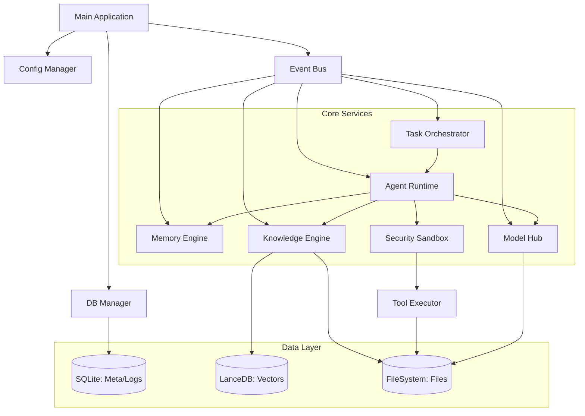

# BiosBot 详细设计

## 1. 文档目的
本文档是《BiosBot 概要设计文档》的深化与落地指南，旨在将架构层面的模块划分转化为可执行的代码逻辑，明确类结构、算法伪代码、数据库物理模型、接口契约及异常处理细节，用于直接指导开发人员进行编码实现、单元测试编写及集成测试验证。

### 1.1 适用范围
- 核心模块：任务调度引擎、Agent 运行时、记忆系统、知识库引擎、安全沙箱、前端交互组件。
- 技术栈：Node.js + TypeScript（后端逻辑）、SQLite、LanceDB、React（前端）。
- 约束：严格遵循“本地优先”、“单体模块化”、“Agent 隔离”及 P0 阶段的功能边界。

### 1.2 术语定义
- **Leader Agent**：任务总控中枢，负责拆解与调度。
- **Domain Agent**：领域执行者，负责具体子任务。
- **STM/LTM**：短期记忆（会话级）/长期记忆（跨会话）。
- **ReAct**：Reasoning + Acting，智能体思考-行动循环。
- **Sandbox**：安全沙箱，负责权限裁决与路径校验。

## 2. 系统架构细化

### 2.1 模块依赖图（Mermaid）


### 2.2 核心类设计（Class Diagram 逻辑说明）

#### 2.2.1 任务调度核心（TaskOrchestrator）
- 职责：单例模式，管理全局任务生命周期。
- 主要属性：
  - `taskQueue: Map<UUID, Task>`：全局任务缓存。
  - `agentQueues: Map<AgentID, FIFOQueue>`：按 Agent 划分的任务队列。
  - `stateMachine: StateMachine`：任务状态机实例。
- 主要方法：
  - `createTask(input: TaskInput): Promise<Task>`：入口澄清门控，创建任务记录。
  - `dispatchSubtasks(taskId: UUID, dag: DAG): Promise<void>`：拆解并分发子任务（非阻塞）。
  - `handleTimeout(): void`：全局定时器，扫描超时任务并触发异常处理。
  - `terminateTask(taskId: UUID): Promise<void>`：强制终止任务，释放资源。

#### 2.2.2 Agent 运行时（AgentRuntime）
- 职责：管理 Agent 实例与执行循环。
- 关键类：
  - `BaseAgent`（抽象类）：
    - `run(task: Task): Promise<void>`：主循环入口。
    - `think(context: string): Promise<string>`：调用 LLM 生成思考。
    - `act(action: Action): Promise<Observation>`：调用工具/RAG。
    - `observe(result: any): string`：格式化观察结果。
  - `LeaderAgent extends BaseAgent`：重写 `run`，专注于 `parseIntent -> generateDAG -> dispatch`。
  - `DomainAgent extends BaseAgent`：重写 `run`，执行 `while (!task.done) { ReAct }` 循环。
  - `AgentWorker`：每个 Domain Agent 一个独立 Worker 线程/协程，维护 `isBusy` 状态。

#### 2.2.3 记忆引擎（MemoryEngine）
- 职责：管理 STM/LTM 读写。
- 主要方法：
  - `addToStm(sessionId: string, msg: Message): Promise<void>`：写入 STM 并触发滑动窗口裁剪。
  - `retrieveLtm(query: string, agentId: UUID, topK: number): Promise<LtmItem[]>`：对 LTM 执行混合检索。
  - `extractFacts(dialogue: Message[]): Promise<void>`：异步后台任务，基于对话流提取事实。

#### 2.2.4 知识库引擎（KnowledgeEngine）
- 职责：文件解析与向量索引。
- 主要方法：
  - `ingestFile(file: File, agentId: UUID): Promise<void>`：执行解析流水线（上传 -> 解析 -> 切块 -> 向量化 -> 入库）。
  - `search(query: string, agentId: UUID, topK: number): Promise<Chunk[]>`：在 Agent 隔离前提下执行向量检索。

#### 2.2.5 安全沙箱（SecuritySandbox）
- 职责：权限裁决与路径校验。
- 主要方法：
  - `intercept(agentId: UUID, tool: string, args: any): Promise<PermissionResult>`：根据策略返回 `ALLOW/DENY/ASK`。
  - `validatePath(path: string): boolean`：路径白名单校验，防止目录穿越。

#### 2.2.6 配置中心与备份调度（ConfigManager & SystemSettingsService）
- 职责：对应 F01，统一管理工作目录、系统阈值、备份/恢复入口，对外提供只读配置视图和更新接口。
- 关键类：
  - `ConfigManager`：
    - `load(): Promise<SystemConfig>`：从 `settings.json` 读取配置并做 Schema 校验。
    - `save(patch: Partial<SystemConfig>): Promise<void>`：原子写回配置，触发配置热更事件。
    - `getWorkspacePath(): string`：返回当前工作目录路径，供所有文件相关模块调用。
  - `SystemSettingsService`：
    - `ensureWorkspaceInitialized(): Promise<void>`：在启动时检查工作目录是否存在，不存在则按 02-F01.1 约定创建标准子目录结构。
    - `changeWorkspacePath(newPath: string, migrate: boolean): Promise<void>`：处理用户修改工作目录及数据迁移逻辑。
  - `BackupScheduler`：
    - `runDailyBackup(): Promise<void>`：每日定时打包关键配置与元数据到 `backup/` 目录，对应 02-F01.2 自动备份。
    - `exportWorkspace(targetPath: string): Promise<void>`：一键导出工作空间压缩包。
    - `importWorkspace(archivePath: string): Promise<void>`：从备份包恢复配置与数据库文件。

#### 2.2.7 模型与能力中心（ModelHub & CapabilityRegistry）
- 职责：对应 F02/F03，集中管理模型、Prompt 模板、Skill/工具及其权限策略，为 AgentRuntime 和 TaskOrchestrator 提供统一查询接口。
- 关键类：
  - `ModelHub`：
    - `registerModel(config: ModelConfig): Promise<void>`：注册本地或远程模型。
    - `testConnection(id: string): Promise<ModelHealth>`：在 10 秒内完成连通性测试，返回健康状态和错误信息。
    - `getProvider(agentId: string): Promise<ILlmProvider>`：根据 Agent 绑定关系返回已适配的 LLM Provider 实例。
  - `PromptTemplateRepository`：
    - `getById(id: string): Promise<PromptTemplate>`：按 ID 获取模板文本和变量定义。
    - `render(id: string, vars: Record<string, any>): string`：渲染模板（包括 System Prompt 与任务级 Prompt）。
  - `SkillRegistry`：
    - `listInstalled(): Promise<SkillMeta[]>`：列出所有已安装 Skill。
    - `install(packagePath: string): Promise<void>` / `uninstall(id: string): Promise<void>`：本地包安装/卸载。
    - `getAvailableTools(agentId: string): Promise<ToolDescriptor[]>`：结合权限策略返回某 Agent 可用工具集合。
  - `ToolPermissionService`：
    - `getPolicy(agentId: string, toolName: string): Promise<'DENY' | 'ASK' | 'ALLOW'>`：查询权限裁决规则（对接 F03.3）。
    - 为 `SecuritySandbox` 的 `intercept` 方法提供数据源，与 `agent_tool_permissions` 表联动。

#### 2.2.8 监控与审计服务（MonitorService & AuditService）
- 职责：对应 F07，聚合任务、Agent 状态与资源指标，为前端 MonitorDashboard 和审计导出提供统一接口。
- 关键类：
  - `MonitorService`：
    - `getAgentMatrix(): Promise<AgentMatrixDTO>`：返回每个 Agent 的 `status`、队列长度、当前任务 ID。
    - `getResourceMetrics(): Promise<ResourceMetricsDTO>`：采集 CPU/内存/磁盘水位，与 NFR 中的阈值配置绑定。
    - `getTaskTimeline(rootTaskId: string): Promise<TaskTimelineNode[]>`：构造任务树与甘特图数据结构。
  - `AuditService`：
    - `log(event: AuditEvent): Promise<void>`：向 `audit_logs` 与结构化日志双写审计事件。
    - `query(filter: AuditQuery): Promise<AuditEvent[]>`：按时间范围、任务、Agent 过滤审计记录，支撑导出功能。

#### 2.2.9 记忆管理服务与面板（MemoryService & MemoryDashboard）
- 职责：对应 F09，封装 STM/LTM 查询与维护逻辑，并为前端记忆管理界面提供专用 API。
- 关键类：
  - `MemoryService`：
    - `searchLtm(agentId: string, query: MemoryQuery): Promise<LtmItem[]>`：基于类别/关键词/向量检索长期记忆。
    - `deleteLtm(id: string): Promise<void>`：软删除长期记忆条目，联动向量库清理。
    - `getSessionHistory(sessionId: string): Promise<Message[]>`：为“记忆溯源”提供对话原文。
  - `MemoryDashboardController`（后端控制器）：
    - 暴露 `/api/v1/memory/dashboard` 相关接口，聚合 STM/LTM/任务信息，支撑 02-F09.4 所述的可视化记忆管理界面。

## 3. 数据库详细设计（Physical Schema）

### 3.1 SQLite 表结构（DDL 示例）

#### 3.1.1 `agents` 表
```sql
CREATE TABLE agents (
    id TEXT PRIMARY KEY, -- UUID
    name TEXT NOT NULL,
    type TEXT NOT NULL CHECK(type IN ('LEADER', 'DOMAIN')),
    model_config_json TEXT NOT NULL, -- JSON: {provider, model, temp, ...}
    prompt_template_id TEXT, -- FK to prompts
    status TEXT DEFAULT 'IDLE' CHECK(status IN ('IDLE', 'RUNNING', 'BUSY_WITH_QUEUE')),
    created_at DATETIME DEFAULT CURRENT_TIMESTAMP,
    updated_at DATETIME DEFAULT CURRENT_TIMESTAMP
);

CREATE INDEX idx_agents_status ON agents(status);
```

#### 3.1.2 `tasks` 表
```sql
CREATE TABLE tasks (
    id TEXT PRIMARY KEY, -- UUID
    parent_task_id TEXT, -- FK to tasks(id), Nullable
    root_task_id TEXT NOT NULL, -- FK to tasks(id), 用于全局追踪
    assigned_agent_id TEXT NOT NULL, -- FK to agents(id)
    status TEXT NOT NULL CHECK(status IN (
        'CLARIFICATION_PENDING', 'WAITING_FOR_LEADER', 'PARSING', 'DISPATCHING',
        'QUEUED', 'QUEUED_WAITING_RESOURCE', 'RUNNING', 'AGGREGATING',
        'COMPLETED', 'EXCEPTION', 'TERMINATED'
    )),
    input_payload TEXT, -- JSON
    output_summary TEXT,
    error_msg TEXT,
    retry_count INTEGER DEFAULT 0,
    heartbeat DATETIME, -- 最后心跳时间
    created_at DATETIME DEFAULT CURRENT_TIMESTAMP,
    updated_at DATETIME DEFAULT CURRENT_TIMESTAMP,
    started_at DATETIME,
    finished_at DATETIME
);

CREATE INDEX idx_tasks_status_agent ON tasks(status, assigned_agent_id);
CREATE INDEX idx_tasks_heartbeat ON tasks(heartbeat);
```

#### 3.1.3 `task_logs` 表（ReAct 日志）
```sql
CREATE TABLE task_logs (
    id INTEGER PRIMARY KEY AUTOINCREMENT,
    task_id TEXT NOT NULL, -- FK to tasks(id)
    step_index INTEGER NOT NULL,
    step_type TEXT NOT NULL CHECK(step_type IN ('THOUGHT', 'ACTION', 'OBSERVATION')),
    content TEXT NOT NULL,
    tool_name TEXT,
    tool_args_json TEXT,
    timestamp DATETIME DEFAULT CURRENT_TIMESTAMP
);

CREATE INDEX idx_logs_task ON task_logs(task_id);
```

#### 3.1.4 `knowledge_files` 表
```sql
CREATE TABLE knowledge_files (
    id TEXT PRIMARY KEY, -- UUID
    agent_id TEXT NOT NULL, -- FK to agents(id), **强隔离**
    file_name TEXT NOT NULL,
    file_path TEXT NOT NULL, -- Relative to workspace
    file_hash TEXT, -- For dedup/versioning
    vector_partition TEXT NOT NULL, -- e.g., 'vec_{agent_id}'
    status TEXT CHECK(status IN ('PROCESSING', 'READY', 'ERROR')),
    version INTEGER DEFAULT 1,
    meta_info_json TEXT, -- {pages, chunks, ocr_conf}
    created_at DATETIME DEFAULT CURRENT_TIMESTAMP
);

CREATE INDEX idx_kb_agent ON knowledge_files(agent_id, status);
```

#### 3.1.5 `session_memory`（STM）表
```sql
CREATE TABLE session_memory (
    id INTEGER PRIMARY KEY AUTOINCREMENT,
    session_id TEXT NOT NULL, -- Usually root_task_id or custom session
    role TEXT CHECK(role IN ('user', 'assistant', 'system')),
    content TEXT NOT NULL,
    summary TEXT, -- Compressed version
    token_count INTEGER NOT NULL,
    importance REAL DEFAULT 0.5,
    created_at DATETIME DEFAULT CURRENT_TIMESTAMP
);

CREATE INDEX idx_stm_session ON session_memory(session_id, created_at);
```

#### 3.1.6 `long_term_memory`（LTM Meta）表
```sql
CREATE TABLE long_term_memory (
    id TEXT PRIMARY KEY, -- UUID
    agent_id TEXT NOT NULL, -- FK, **强隔离**
    category TEXT CHECK(category IN ('preference', 'fact', 'project', 'summary')),
    key TEXT NOT NULL,
    value TEXT NOT NULL,
    embedding_id TEXT NOT NULL, -- ID in LanceDB
    confidence REAL,
    access_count INTEGER DEFAULT 0,
    last_accessed DATETIME,
    is_active BOOLEAN DEFAULT 1,
    created_at DATETIME DEFAULT CURRENT_TIMESTAMP
);

CREATE INDEX idx_ltm_agent ON long_term_memory(agent_id, is_active);
CREATE INDEX idx_ltm_key ON long_term_memory(key);
```

#### 3.1.7 `audit_logs` 表
```sql
CREATE TABLE audit_logs (
    id INTEGER PRIMARY KEY AUTOINCREMENT,
    event_type TEXT NOT NULL,
    actor_id TEXT NOT NULL, -- Agent ID or 'USER'
    task_id TEXT,
    details_json TEXT, -- Sanitized
    result TEXT, -- ALLOW, DENY, TIMEOUT
    timestamp DATETIME DEFAULT CURRENT_TIMESTAMP
);
```

#### 3.1.8 `chat_messages`（全局对话流）表
```sql
CREATE TABLE chat_messages (
    msg_id TEXT PRIMARY KEY, -- UUID
    timestamp DATETIME DEFAULT CURRENT_TIMESTAMP,
    role TEXT CHECK(role IN ('user', 'assistant', 'system')),
    content TEXT NOT NULL,
    attachments_json TEXT, -- [{file_id, name, path}]
    related_task_id TEXT, -- FK to tasks(id)
    meta_json TEXT -- ReAct summary, citations
);

CREATE INDEX idx_chat_time ON chat_messages(timestamp);
```

#### 3.1.9 `prompts`（Prompt 模板）表
```sql
CREATE TABLE prompts (
  id TEXT PRIMARY KEY, -- UUID
  name TEXT NOT NULL,
  description TEXT,
  content TEXT NOT NULL, -- 模板正文
  variables_json TEXT, -- 可用变量定义
  tags TEXT, -- 逗号分隔标签
  created_at DATETIME DEFAULT CURRENT_TIMESTAMP,
  updated_at DATETIME DEFAULT CURRENT_TIMESTAMP
);

CREATE INDEX idx_prompts_name ON prompts(name);
```

#### 3.1.10 `skills`（本地 Skill 包）表
```sql
CREATE TABLE skills (
  id TEXT PRIMARY KEY, -- UUID 或包名
  name TEXT NOT NULL,
  version TEXT,
  entrypoint TEXT NOT NULL, -- 入口脚本/命令
  config_schema_json TEXT, -- 参数 Schema
  installed_at DATETIME DEFAULT CURRENT_TIMESTAMP,
  enabled BOOLEAN DEFAULT 1
);
```

#### 3.1.11 `agent_skills`（Agent-Skill 绑定关系）表
```sql
CREATE TABLE agent_skills (
  agent_id TEXT NOT NULL, -- FK to agents(id)
  skill_id TEXT NOT NULL, -- FK to skills(id)
  config_json TEXT, -- 针对该 Agent 的 Skill 参数
  PRIMARY KEY (agent_id, skill_id)
);

CREATE INDEX idx_agent_skills_agent ON agent_skills(agent_id);
```

#### 3.1.12 `agent_tool_permissions`（基础工具权限配置）表
```sql
CREATE TABLE agent_tool_permissions (
  agent_id TEXT NOT NULL, -- FK to agents(id)
  tool_name TEXT NOT NULL,
  policy TEXT NOT NULL CHECK(policy IN ('DENY', 'ASK', 'ALLOW')),
  updated_at DATETIME DEFAULT CURRENT_TIMESTAMP,
  PRIMARY KEY (agent_id, tool_name)
);

CREATE INDEX idx_permissions_agent ON agent_tool_permissions(agent_id);
```

### 3.2 向量数据库（LanceDB）设计

- 连接：本地嵌入式连接 `{workspace}/lancedb`。
- 表命名：`vec_{agent_id}`（动态创建）或统一表 `global_vectors`（带 `agent_id` 列过滤）。
- 推荐方案：统一表 `global_vectors` 以简化备份，但在查询时强制注入 `agent_id` 过滤。
- Schema 示例：

```ts
{
  vector: number[768], // 取决于 Embedding 模型维度
  text: string,
  metadata: {
    agent_id: string,
    source_type: 'knowledge' | 'ltm',
    file_id?: string,
    page_num?: number,
    chunk_id: string
  }
}
```

- 索引：自动构建 IVF_PQ 等索引以加速检索。

### 3.3 文件系统结构

```text
{UserHome}/BiosBot_Workspace/
├── config/
│   ├── settings.json       # 全局配置 (工作目录路径, 阈值等)
│   └── agents/             # Agent 特定配置备份 (可选)
├── models/                 # 本地模型缓存 (GGUF 等)
├── knowledge/
│   ├── {agent_uuid_1}/     # Agent 1 专属原始文件
│   │   ├── doc1.pdf
│   │   └── ...
│   └── {agent_uuid_2}/     # Agent 2 专属原始文件
├── lancedb/                # 向量数据文件
├── biosbot.db              # SQLite 主数据库
├── logs/
│   ├── app.log             # 应用运行日志 (JSON 格式)
│   └── audit.log           # 审计日志文本备份 (可选)
└── backup/                 # 自动备份压缩包 (.zip)
    ├── backup_20240523.zip
    └── ...
```

## 4. 核心算法与逻辑流程（Pseudo-code）

### 4.1 Leader 非阻塞分发逻辑

```ts
async function leaderExecuteTask(task: Task): Promise<void> {
  try {
    updateTaskStatus(task.id, 'PARSING');

    // 1. 意图分析与 DAG 生成
    const dag = await this.generateDag(task.inputPayload);

    // 2. 创建子任务并持久化
    const subTasks: Task[] = [];
    for (const node of dag.nodes) {
      const subTask = new Task({
        parentId: task.id,
        rootId: task.rootId,
        agentId: node.assignedAgentId,
        payload: node.params,
        status: 'QUEUED'
      });
      await db.tasks.insert(subTask);
      subTasks.push(subTask);
    }

    // 3. 分发到 Domain Agent 队列 (关键：立即返回，不等待执行)
    for (const st of subTasks) {
      await this.agentManager.enqueue(st.agentId, st);
    }

    // 4. 更新 Leader 状态为 IDLE (非阻塞核心)
    updateTaskStatus(task.id, 'DISPATCHING'); // 短暂中间态
    await this.agentManager.setAgentStatus('LEADER', 'IDLE');

    // 5. 监听子任务完成事件以进行聚合 (异步回调)
    this.watchSubTasksCompletion(task.id, subTasks.map(s => s.id));

  } catch (error) {
    handleTaskException(task.id, error);
  }
}
```

### 4.2 Domain Agent 串行执行与队列管理

```ts
class DomainAgent {
  private queue: Task[] = [];
  private isRunning: boolean = false;

  async enqueue(task: Task): Promise<void> {
    await db.tasks.updateStatus(task.id, 'QUEUED');
    this.queue.push(task);
    if (!this.isRunning) {
      this.processQueue();
    }
  }

  private async processQueue(): Promise<void> {
    while (this.queue.length > 0) {
      this.isRunning = true;
      const task = this.queue.shift()!;
      await db.tasks.updateStatus(task.id, 'RUNNING');
      await db.agents.updateStatus(this.id, 'RUNNING');

      try {
        await this.runReactLoop(task);
        await db.tasks.updateStatus(task.id, 'COMPLETED');
        eventBus.emit('task_completed', task);
      } catch (error) {
        await db.tasks.updateStatus(task.id, 'EXCEPTION', error.message);
        eventBus.emit('task_failed', task, error);
      } finally {
        this.isRunning = false;
        await db.agents.updateStatus(this.id, 'IDLE');
      }
    }
  }

  private async runReactLoop(task: Task): Promise<void> {
    let steps = 0;
    const maxSteps = 15; // 防止死循环
    while (!task.isComplete() && steps < maxSteps) {
      // 1. 组装上下文 (STM + LTM + RAG)
      const context = await this.assembleContext(task);

      // 2. Thought
      const thought = await this.llm.think(context);
      await logStep(task.id, 'THOUGHT', thought);
      eventBus.emit('step_update', { taskId: task.id, type: 'THOUGHT', content: thought });

      // 3. Action (解析工具调用)
      const action = this.parseAction(thought);
      if (!action) break; // 无动作，视为结束

      // 4. Security Check (Sandbox)
      const perm = await sandbox.intercept(this.id, action.name, action.args);
      if (perm === 'DENY') throw new PermissionError('Denied by policy');
      if (perm === 'ASK') {
        const granted = await this.waitForUserAuth(task.id, action);
        if (!granted) throw new PermissionError('User denied');
      }

      // 5. Execute Tool
      await logStep(task.id, 'ACTION', action.name, action.args);
      eventBus.emit('step_update', { taskId: task.id, type: 'ACTION', content: action.name });

      const observation = await toolExecutor.execute(action.name, action.args);
      await logStep(task.id, 'OBSERVATION', observation);
      eventBus.emit('step_update', { taskId: task.id, type: 'OBSERVATION', content: truncate(observation) });

      steps++;
      await db.tasks.updateHeartbeat(task.id); // 更新心跳
    }
  }
}
```

### 4.3 STM 滑动窗口算法

```ts
async function manageStmWindow(sessionId: string, newMsgTokenCount: number): Promise<void> {
  const MAX_TOKENS = 4096;
  const TARGET_TOKENS = 3200; // 水位线

  let messages = await db.sessionMemory.getBySession(sessionId);
  let currentTotal = messages.reduce((sum, m) => sum + m.tokenCount, 0) + newMsgTokenCount;

  while (currentTotal > MAX_TOKENS && messages.length > 0) {
    const oldest = messages.shift()!;

    if (oldest.summary) {
      // 策略 A: 已有摘要，删除原文，保留摘要 (假设摘要占 20%)
      const reduction = oldest.tokenCount - Math.floor(oldest.tokenCount * 0.2);
      await db.sessionMemory.replaceWithSummary(oldest.id, oldest.summary);
      currentTotal -= reduction;
    } else {
      // 策略 B: 无摘要，尝试生成摘要或直接删除
      if (messages.length > 5) {
        // 如果还有很多消息，直接删除最旧的以节省 LLM 调用
        await db.sessionMemory.delete(oldest.id);
        currentTotal -= oldest.tokenCount;
      } else {
        // 只剩几条重要消息，调用小模型生成摘要
        const summary = await smallLlm.summarize(oldest.content);
        await db.sessionMemory.replaceWithSummary(oldest.id, summary);
        currentTotal -= (oldest.tokenCount - estimateTokens(summary));
      }
    }
  }
}
```

### 4.4 权限裁决链路（DENY > ASK > ALLOW）

```ts
async function interceptToolCall(agentId: string, toolName: string, args: any): Promise<'ALLOW' | 'DENY'> {
  // 1. 查询策略
  const rule = await db.permissions.getRule(agentId, toolName); // 'DENY', 'ASK', 'ALLOW'

  if (rule === 'DENY') {
    await auditLog.log('TOOL_CALL', agentId, { tool: toolName }, 'DENY');
    throw new PermissionDeniedError(`Tool ${toolName} is forbidden.`);
  }

  if (rule === 'ALLOW') {
    await auditLog.log('TOOL_CALL', agentId, { tool: toolName }, 'ALLOW');
    return 'ALLOW';
  }

  if (rule === 'ASK') {
    const authId = generateUuid();
    await db.authRequests.save({ id: authId, agentId, tool: toolName, args, status: 'PENDING' });

    // 发送事件到前端，等待回调 (带超时)
    const userDecision = await eventBus.waitForEvent(`auth_response_${authId}`, { timeout: 600000 }); // 10 min

    if (userDecision === 'GRANTED') {
      await auditLog.log('TOOL_CALL', agentId, { tool: toolName }, 'ALLOW_USER');
      return 'ALLOW';
    } else {
      await auditLog.log('TOOL_CALL', agentId, { tool: toolName }, 'DENY_USER');
      throw new PermissionDeniedError('User denied the tool execution.');
    }
  }

  return 'DENY'; // Default
}
```

## 5. 接口详细设计（API Contract）

### 5.1 任务管理 API
- `POST /api/v1/tasks`
  - Request: `{ content: string, attachments?: File[], clarificationData?: object }`
  - Response: `{ taskId: string, status: 'CLARIFICATION_PENDING' | 'PARSING' }`
  - Logic: 创建任务，若低置信度则返回 `CLARIFICATION_PENDING`。

- `GET /api/v1/tasks/:id/events`（WebSocket/SSE）
  - Response Stream 示例：
  ```json
  { "type": "STEP_UPDATE", "data": { "stepType": "THOUGHT", "content": "...", "timestamp": 123 } }
  { "type": "STATUS_CHANGE", "data": { "status": "RUNNING" } }
  { "type": "AUTH_REQUEST", "data": { "authId": "...", "tool": "write_file", "args": {"...": "..."} } }
  ```

- `POST /api/v1/tasks/:id/terminate`
  - Response: `{ success: true, releasedResources: ["memory", "gpu_handle"] }`
  - Logic: 中断协程，清理句柄，写入终止报告。

### 5.2 Agent 管理 API
- `GET /api/v1/agents`
  - Response: `[{ id, name, status, queueLength, currentTaskId }]`

- `POST /api/v1/agents`
  - Request: `{ name, modelConfig, promptTemplateId, skills: [], knowledgeBaseIds: [] }`

- `POST /api/v1/agents/:id/knowledge/upload`（Multipart）
  - Logic: 接收文件 -> 存入 `knowledge/{agent_id}` -> 触发后台解析任务 -> 返回 `fileId`。

### 5.2.1 模型与 Prompt/Skill 资源 API
- 模型管理：
  - `GET /api/v1/models`
    - Response: `[{ id, name, provider, contextWindow, status }]`
  - `POST /api/v1/models`
    - Request: `{ name, provider, type: 'local' | 'api', config: {...} }`
  - `POST /api/v1/models/:id/test`
    - Logic: 触发一次连通性测试，10 秒内返回成功/失败与错误信息。
- Prompt 模板：
  - `GET /api/v1/prompts`
    - Response: `PromptSummary[]`，用于 Agent 配置页下拉选择。
  - `POST /api/v1/prompts`
    - Request: `{ name, description, content, variables, tags }`
- Skill 与基础工具：
  - `GET /api/v1/skills`
    - Response: `[{ id, name, version, enabled }]`
  - `POST /api/v1/skills/install`
    - Request: `{ filePath: string }`，安装本地 Skill 包。
  - `POST /api/v1/skills/:id/uninstall`
    - Logic: 若 Skill 正在被某 Agent 使用则拒绝卸载，对应 02-F03.2 的约束。
  - `POST /api/v1/agents/:id/skills`
    - Request: `{ skillId, config, enabled }`，为 Agent 绑定/配置 Skill。
  - `PUT /api/v1/agents/:id/tools/permissions`
    - Request: `{ toolName, policy }`，更新基础工具权限，落地到 `agent_tool_permissions` 表。

### 5.3 记忆管理 API
- `GET /api/v1/memory/ltm`
  - Query Params: `?query=...&agentId=...&category=fact`
  - Response: `[{ id, key, value, confidence, source }]`

- `DELETE /api/v1/memory/ltm/:id`
  - Logic: 软删除（`is_active=0`）并从向量库移除对应向量。

### 5.4 系统与监控 API
- `GET /api/v1/metrics/resources`
  - Response: `{ cpuUsage: 0.45, memoryUsage: 0.62, diskFree: 10240 }`

- `GET /api/v1/audit/logs`
  - Query Params: `?startTime=...&endTime=...&agentId=...`
  - Response: `[AuditLogEntry]`（支持导出 CSV）。

## 6. 前端组件详细设计

### 6.1 统一对话窗口（ChatWindow）
- 状态管理：使用 Zustand/Redux 存储 `messages`、`activeTask`、`streamingState` 等。
- 组件树：
  - `MessageList`：虚拟滚动列表，渲染 `UserBubble`、`AgentBubble`、`TaskCard`。
  - `ChatInput`：底部输入框，集成 `FileUploader`、`MentionPicker`（@Agent）。
  - `ReActDetailPanel`：折叠面板，展示当前任务的 Thought/Action/Observation 时间轴。
- 交互逻辑：
  - 用户发送消息 -> 调用 `POST /tasks` -> 订阅 WebSocket -> 实时渲染步骤。
  - 收到 `AUTH_REQUEST` 事件 -> 弹出模态框 `AuthModal` -> 用户决策 -> 发送 `POST /auth/decision`。

### 6.2 Agent 工厂（AgentFactory）
- Tab 结构：
  - `BasicSettings`：表单（Name、Model Select、Temp Slider、Prompt Editor）。
  - `SkillConfig`：列表展示已安装 Skill，Toggle 开关，参数配置 Modal。
  - `KnowledgeBase`：文件列表（Table），上传按钮，重新解析按钮，RAG 参数配置。
- 状态同步：修改配置后，新任务自动生效（热更），无需重启。

### 6.3 监控审计台（MonitorDashboard）
- 可视化组件：
  - `ResourceChart`：ECharts/Recharts 绘制 CPU/Mem 曲线。
  - `AgentMatrix`：网格展示 Agent 状态灯（Green/Blue/Orange）。
  - `TaskGantt`：简易甘特图，展示 Leader 与 Domain Agent 的时间轴占用。
  - 日志表格：支持按 TaskID、Level、Time 过滤，点击行展开详情 JSON。

### 6.4 记忆管理面板（MemoryDashboard）
- 组件职责：对应 02-F09.4，提供 LTM/STM 视图、溯源与编辑/删除能力。
- 主要视图：
  - `MemoryOverview`：按类别（偏好、事实、项目）分组展示长期记忆，支持搜索与筛选。
  - `MemoryDetailModal`：展示单条记忆详情，包括来源对话片段、时间戳、关联任务 ID。
  - `SessionHistoryPanel`：在侧边栏以时间线形式展示选中记忆的原始对话上下文。
- 交互逻辑：
  - 进入方式：从设置页或对话内命令（如“你记得我什么”）打开。
  - 删除记忆：调用 `DELETE /api/v1/memory/ltm/:id`，前端立即从列表移除并展示提示。
  - 编辑记忆：通过 `PUT /api/v1/memory/ltm/:id`（可选 P1）更新内容，并在 UI 中高亮“已修改”。
  - 溯源跳转：点击“查看来源”按钮，定位到 `MessageList` 中对应的历史消息并高亮。

## 7. 异常处理与容错机制

### 7.1 常见异常场景处理表

| 异常场景       | 触发条件                         | 处理逻辑                                                              | 用户反馈                                       |
|----------------|----------------------------------|-----------------------------------------------------------------------|------------------------------------------------|
| 模型连接失败   | Ollama/API 超时或 5xx           | 指数退避重试 3 次 -> 标记任务 EXCEPTION -> 释放资源                  | Toast: "模型服务不可用，请检查设置"          |
| 上下文超长     | Token 计数 > 模型上限           | 触发 STM 滑动窗口裁剪 -> 若仍超限，报错 CONTEXT_OVERFLOW             | 系统消息: "上下文过长，已自动裁剪早期对话"  |
| 工具执行超时   | Tool 运行 > 60s                  | 杀死子进程 -> 标记 EXCEPTION -> 记录审计日志                         | 任务卡片显示: "工具执行超时，已终止"        |
| 磁盘空间不足   | Write 操作失败 (ENOSPC)         | 捕获异常 -> 暂停新任务入队 -> 触发清理向导                          | 模态框: "磁盘空间不足，请清理或扩容"        |
| 向量库损坏     | LanceDB 读取错误                 | 捕获异常 -> 尝试从原始文件重建索引 -> 若失败标记文件 ERROR           | 知识库列表显示红色感叹号，提示"修复"        |
| 授权超时       | ASK 状态 > 10min                | 自动拒绝 -> 终止任务 -> 释放资源 -> 记录审计                         | 系统消息: "授权等待超时，任务已自动取消"    |

### 7.2 事务一致性保障
- 任务状态变更：使用 SQLite 事务（`BEGIN ... COMMIT`）确保 `tasks` 表与 `task_logs` 表原子写入。
- 队列持久化：任务入队操作必须先写 DB（`status='QUEUED'`），成功后才推入内存队列。应用重启时，扫描 DB 恢复所有非终态任务。
- 文件与元数据：文件上传完成后，先写 DB 记录，再移动文件到目标目录，防止孤儿文件。

## 8. 安全设计细节

### 8.1 路径沙箱实现

```ts
import path from 'path';
import { workspaceRoot } from './config';

function safePathJoin(relativePath: string): string {
  const target = path.resolve(workspaceRoot, relativePath);
  if (!target.startsWith(workspaceRoot)) {
    throw new SecurityError(`Path traversal detected: ${target}`);
  }
  return target;
}
// 所有 file read/write 操作必须经过此函数
```

### 8.2 敏感数据脱敏
- 日志脱敏：在写入 `audit_logs` 前，使用正则替换：
  - `sk-[a-zA-Z0-9]+` -> `[API_KEY_REDACTED]`
  - `\d{11}`（手机号）-> `[PHONE_REDACTED]`
- 内存保护：API Key 仅在调用瞬间从加密存储解密，使用后立即 `null` 化。

## 9. 部署与配置

### 9.1 配置文件（`settings.json`）示例

```json
{
  "workspacePath": "/default/path",
  "llmProviders": {
    "ollama": { "baseUrl": "http://localhost:11434", "enabled": true },
    "openai": { "apiKey": "encrypted_blob", "baseUrl": "https://api.openai.com" }
  },
  "security": {
    "defaultToolPolicy": "ASK",
    "maxFileSizeMb": 100,
    "allowedDomains": ["api.example.com"]
  },
  "memory": {
    "stmMaxTokens": 4096,
    "ltmExtractionThreshold": 0.8,
    "autoBackupEnabled": true
  },
  "resources": {
    "memoryThresholdPercent": 90,
    "maxConcurrentTasks": 5
  }
}
```

### 9.2 启动流程
- 环境自检：检查 Node 版本、依赖包、Ollama 连通性、磁盘空间。
- 加载配置：读取 `settings.json`，解密敏感项。
- 初始化 DB：若 SQLite/LanceDB 不存在，执行 Schema 迁移。
- 恢复任务：扫描 `tasks` 表，恢复 `QUEUED/RUNNING` 任务到内存队列。
- 启动服务：启动 HTTP Server、WebSocket Server、后台 Worker（Memory Extractor、Backup Scheduler）。
- 打开 UI：拉起 Electron 窗口加载 React 应用。

## 10. 测试策略

### 10.1 单元测试重点
- `StateMachine`：覆盖所有非法状态流转断言。
- `Sandbox`：覆盖路径穿越攻击用例（`../../etc/passwd`）。
- `MemoryEngine`：覆盖滑动窗口裁剪逻辑（边界值测试）。
- `PermissionResolver`：覆盖 DENY/ASK/ALLOW 分支及超时逻辑。

### 10.2 集成测试场景
- E2E 任务流：上传 PDF -> 指令总结 -> 等待完成 -> 验证 LTM 记录。
- 并发压力：同时提交 20 个任务，验证 Leader 非阻塞及 Domain Agent 队列顺序。
- 断点恢复：任务执行中 `kill -9` 进程，重启后验证状态恢复。
- 隔离性：尝试用 Agent A 的上下文检索 Agent B 的知识库，断言返回空。

### 10.3 性能测试指标
- ReAct 延迟：单步（不含 LLM 生成）< 100ms。
- 检索延迟：RAG（含向量搜索）< 200ms（10 万级向量）。
- 启动时间：冷启动 < 5s。
- 内存泄漏：24h 连续运行，内存增长 < 5%。
