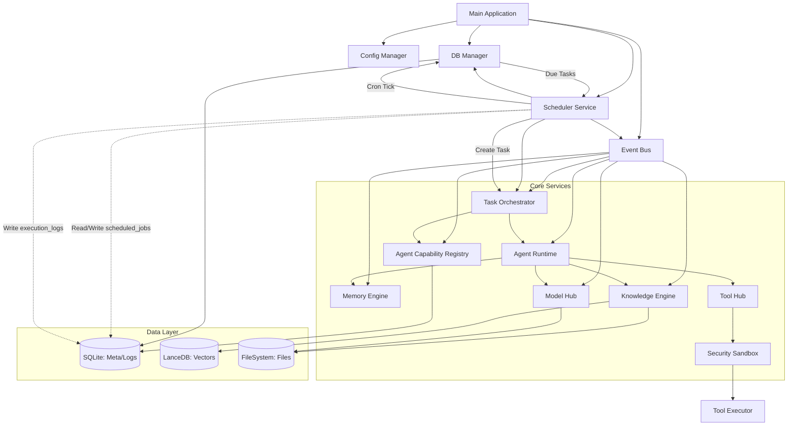
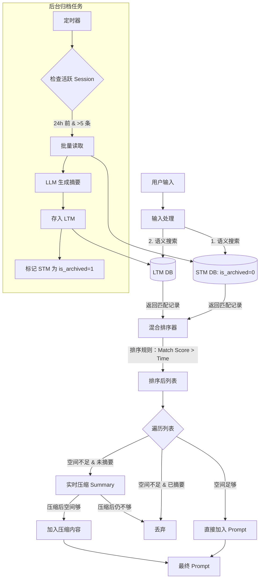
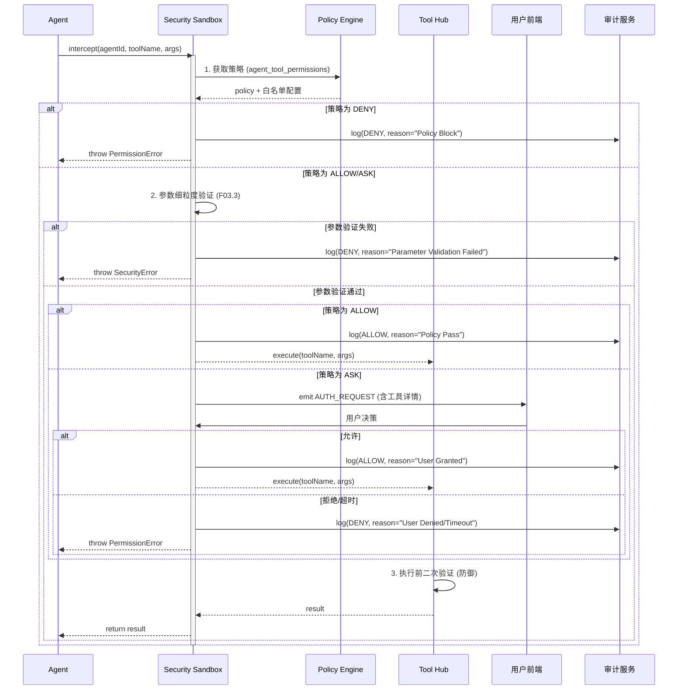

# BiosBot 详细设计

## 1. 文档目的
本文档是旨在将架构层面的模块划分转化为可执行的代码逻辑，明确类结构、算法伪代码、数据库物理模型、接口契约及异常处理细节，用于直接指导开发人员进行编码实现、单元测试编写及集成测试验证。

### 1.1 适用范围
- 单会话：基于单用户、单会话窗口架构设计,历史存储于全局唯一的记录池中，通过时间戳和归档状态进行管理
- 核心模块：任务调度引擎、Agent 运行时、记忆系统、知识库引擎、安全沙箱、前端交互组件。
- 技术栈：Node.js + TypeScript（后端逻辑）、SQLite、LanceDB、React（前端）。
- 约束：严格遵循“本地优先”、“单体模块化”、“Agent 隔离”及 P0 阶段的功能边界。

### 1.2 术语定义
- **Leader Agent**：任务总控中枢，负责拆解与调度。
- **Domain Agent**：领域执行者，负责具体子任务。
- **Chat History(STM)**：全局唯一的对话历史记录，存储在 session_memory 表中，is_archived，布尔标记，区分 Chat History 中的记录是“活跃状态”还是“已归档至 LTM”。
- **LTM (Long Term Memory)**：长期记忆，存储由 Chat History 归档生成的摘要及用户显式保存的事实。
- **ReAct**：Reasoning + Acting，智能体思考-行动循环。
- **Sandbox**：安全沙箱，负责权限裁决与路径校验。
- **triggerMode**：任务触发方式字段，取值 `immediate`（手动触发）、`scheduled`（定时触发）、`event_triggered`（事件触发）。

## 2. 系统架构细化

### 2.1 模块依赖图（Mermaid）


### 2.2 核心类设计（Class Diagram 逻辑说明）

#### 2.2.1 Agent 能力注册中心 (AgentCapabilityRegistry)
- 职责：维护全局 Domain Agent 的实时状态与能力画像，支持 Leader Agent 进行资源发现与匹配。
- 关键属性：
  - `agentProfiles: Map<AgentID, DomainAgentProfile>`：内存缓存，存储最新能力元数据。
  - `heartbeatTimeoutMs: number`：心跳超时阈值（默认 30s）。
- 主要方法：
  - `register(profile: DomainAgentProfile): void`：Agent 启动或配置变更时调用。
  - `updateHeartbeat(agentId: string): void`：接收心跳，更新存活时间。
  - `getActiveAgents(filters?: SkillFilter): Promise<DomainAgentProfile[]>`：查询在线且具备特定技能的 Agent 列表（供 Leader 调用）。
  - `markOffline(agentId: string): void`：心跳超时或收到下线通知时调用。

#### 2.2.2 任务调度核心（`TaskOrchestrator`）
- 职责：单例模式，管理全局任务生命周期。
- 主要属性：
  - `taskQueue: Map<UUID, Task>`：全局任务缓存。
  - `agentQueues: Map<AgentID, FIFOQueue>`：按 Agent 划分的任务队列。
  - `stateMachine: StateMachine`：任务状态机实例。
- 主要方法：
  - `createTask(input: TaskInput): Promise<Task>`：入口澄清门控，创建任务记录。
  - `dispatchSubtasks(taskId: UUID, dag: DAG): Promise<void>`：拆解并分发子任务（非阻塞）。
  - `handleTimeout(): void`：全局定时器，扫描超时任务并触发异常处理。
  - `terminateTask(taskId: UUID): Promise<void>`：强制终止任务，释放资源。

#### 2.2.3 Agent 运行时（`AgentRuntime`）
- 职责：管理 Agent 实例与执行循环。
- 关键类：
  - `BaseAgent`（抽象类）：
    - `run(task: Task): Promise<void>`：主循环入口。
    - `think(context: string): Promise<string>`：调用 LLM 生成思考。
    - `act(action: Action): Promise<Observation>`：调用工具/RAG。
    - `observe(result: any): string`：格式化观察结果。
    - `handleClarification(task: Task, missingInfo: MissingInfo[]): Promise<void>`：处理因缺少 Agent 能力或参数而发起的用户澄清
  - `LeaderAgent extends BaseAgent`：重写 `run`，专注于 `parseIntent -> generateDAG -> dispatch`。
    - 调用 CapRegistry.getActiveAgents() 获取实时资源池。
    - 构建包含资源池信息的 Prompt。
    - 调用 LLM 进行意图识别与任务拆解。
    - 验证阶段：检查 LLM 生成的 DAG 中指定的 assignedAgentId 是否真实存在且在线。
    - 若验证失败或技能不匹配，触发 Re-plan 或进入 CLARIFICATION_NEEDED 状态。
    - 分发任务。
  - `DomainAgent extends BaseAgent`：重写 `run`，执行 `while (!task.done) { ReAct }` 循环。
      - `onStart(): void`：启动时读取自身配置（Skills, Tools, Constraints），构建 DomainAgentProfile 并向 CapRegistry 注册。
      - `sendHeartbeat(): void`：定时向注册中心发送心跳。
      - `updateProfile(): void`：当用户动态修改 Agent 配置（如新增 Skill）时，重新上报 Profile。
  - `AgentWorker`：每个 Domain Agent 一个独立 Worker 线程/协程，维护 `isBusy` 状态。

#### 2.2.4 记忆引擎（`MemoryEngine`）
- 职责：管理全局唯一的对话历史流（Chat History）与长期记忆（LTM）。所有记录属于当前唯一用户。核心逻辑包括：历史持久化、后台非活跃期归档、运行时混合检索与上下文组装。
- 关键类：
  - `ChatHistoryService`:
    - `appendMessage(role: string, content: string): Promise<void>`：写入全局历史表 (is_archived=false)。
    - `getActiveHistory(limit: number): Promise<Message[]>`：获取最近未归档的历史。
  - `ArchiverService`:
    - `archiveEligibleHistory(): Promise<void>`：后台任务。扫描全局表，将 24 小时前 且 数量 > 5 条 的未归档记录摘要并转存 LTM，标记原记录为 is_archived=true。
  - `ContextRetrievalService`:
    - `assembleContext(agent: Agent, query: string, budget: number): Promise<string>`：
      - 两级检索：检索全局活跃历史 + 检索 LTM。
      - 混合排序：匹配度优先，时间次之。
      - 动态压缩：超出窗口时，实时压缩未摘要历史，丢弃低优先级已摘要内容。
  - `LongTermMemoryService`:
    - `saveFact(agentId: string, category: string, content: string): Promise<string>`：显式保存事实或偏好到 LTM，生成向量索引。
    - `search(query: string, agentId: string, topK: number): Promise<LtmItem[]>`：基于向量相似度检索长期记忆。
    - `deleteMemory(id: string): Promise<void>`：软删除长期记忆，并清理对应的向量索引。

#### 2.2.5 记忆管理服务与面板（`MemoryService` & `MemoryDashboard`）
- 职责：对应 F09，封装 STM/LTM 查询与维护逻辑，并为前端记忆管理界面提供专用 API。
- 关键类：
  - `MemoryService`：
    - `searchLtm(agentId: string, query: MemoryQuery): Promise<LtmItem[]>`：基于类别/关键词/向量检索长期记忆。
    - `deleteLtm(id: string): Promise<void>`：软删除长期记忆条目，联动向量库清理。
  - `MemoryDashboardController`（后端控制器）：
    - 暴露 `/api/v1/memory/dashboard` 相关接口，聚合 LTM/任务信息，支撑 02-F09.4 所述的可视化记忆管理界面。

#### 2.2.6 知识库引擎（`KnowledgeEngine`）
- 职责：文件解析与向量索引。
- 主要方法：
  - `ingestFile(file: File, agentId: UUID): Promise<void>`：执行解析流水线（上传 -> 解析 -> 切块 -> 向量化 -> 入库）。
  - `search(query: string, agentId: UUID, topK: number): Promise<Chunk[]>`：在 Agent 隔离前提下执行向量检索。

#### 2.2.7 模型与能力中心（`ModelHub` & `CapabilityRegistry`）
- 职责：对应 F02/F03，集中管理模型、Prompt 模板、Skill/工具及其权限策略，为 `AgentRuntime` 和 `TaskOrchestrator` 提供统一查询接口。
- 关键类：
  - `ModelHub`：
    - `registerModel(config: ModelConfig): Promise<void>`：注册本地或远程模型。
    - `testConnection(id: string): Promise<ModelHealth>`：在 10 秒内完成连通性测试，返回健康状态和错误信息。
    - `getProvider(agentId: string): Promise<ILlmProvider>`：根据 Agent 绑定关系返回已适配的 LLM Provider 实例。
  - `PromptTemplateRepository`：
    - `getById(id: string): Promise<PromptTemplate>`：按 ID 获取模板文本和变量定义。
    - `render(id: string, vars: Record<string, any>): string`：渲染模板（包括 System Prompt 与任务级 Prompt）。
  - `SkillRegistry`：
    - `listInstalled(): Promise<SkillMeta[]>`：列出所有已安装 Skill。
    - `previewPackage(zipPath: string): Promise<SkillPreview>`：预读取 zip 包中的 `SKILL.md`，返回导入确认所需元数据。
    - `install(zipPath: string, config?: Record<string, any>): Promise<SkillInstallResult>`：执行本地 Skill 包导入、校验、依赖安装与注册。
    - `uninstall(id: string): Promise<void>`：执行注销、运行时清理和目录删除。
    - `getAvailableTools(agentId: string): Promise<ToolDescriptor[]>`：结合权限策略返回某 Agent 可用工具集合。
    - 懒加载设计：
      - 启动时仅从 `skills`、`agent_skills` 表加载 Skill 元数据（id/name/version/工具清单），**不立即加载 Skill 包或启动运行时进程**；
      - `getAvailableTools` 返回的 `ToolDescriptor` 仅包含声明信息（名称、参数 Schema、风险级别），由前端展示用，真正的执行载入由 `SkillRuntimeManager` 在首次调用时触发；
    - 详细的 Skill 包标准、运行时一致性规则和安装/卸载生命周期见 4.6.5 与 4.6.6。
  - `ToolPermissionService`：
    - `getPolicy(agentId: string, toolName: string): Promise<'DENY' | 'ASK' | 'ALLOW'>`：查询权限裁决规则（对接 F03.3）。
    - 为 `SecuritySandbox` 的 `intercept` 方法提供数据源，与 `agent_tool_permissions` 表联动。

#### 2.2.8 安全沙箱（`SecuritySandbox`）
- 职责：权限裁决、路径校验、参数细粒度验证。
- 主要方法：
  - `intercept(agentId: UUID, tool: string, args: any): Promise<PermissionResult>`：根据策略返回 `ALLOW/DENY/ASK`。
  - `validateToolParams(tool: string, args: any)`: boolean：工具专用参数校验
  - `getAllowedDomains(agentId: UUID): string[]`：获取 HTTP 白名单
  - `getAllowedCommands(agentId: UUID): string[]`：获取 Shell 白名单
- 内置基础工具集（F03.3 实现）
  | 工具名 | 功能描述 | 权限粒度 | 默认策略 |
  |--------|----------|----------|----------|
  | `read_file` | 读取本地文件 | 路径白名单/文件类型 | ASK |
  | `edit_file` | 编辑本地文件 | 路径白名单/文件类型 | ASK |
  | `write_file` | 写入本地文件 | 路径白名单/文件类型 | ASK |
  | `list_directory` | 列出目录内容 | 路径白名单深度限制 | ALLOW |
  | `exec_shell` | 执行 Shell 命令 | 命令白名单/参数过滤 | DENY |
  | `http_request` | 发送 HTTP 请求 | 域名白名单/方法限制 | ASK |
  | `clipboard` | 操作剪贴板 | 读/写分离控制 | ASK |
  | `system_info` | 获取系统信息 | ALLOW |

#### 2.2.9 工具中枢（`ToolHub`）
- 职责：统一管理系统内置基础工具，处理工具注册、执行和参数验证
- 关键类：
  - `BaseTool`（抽象类）：
    - name: string：工具唯一标识
    - description: string：功能描述
    - parameters: Schema：JSON Schema 定义
    - execute(args: any): Promise<any>：执行逻辑
- `FileReadTool extends BaseTool`：
  - 实现路径白名单校验
  - 限制文件类型（.txt, .md, .pdf）
  - 分块读取大文件
- `FileWriteTool extends BaseTool`：
  - 路径必须在 workspace 内
  - 禁止直接覆盖系统文件, 覆盖前要求添加备份后缀 (.bak)
- `HttpTool extends BaseTool`：
  - 验证 URL 域名在白名单内
  - 禁止 POST/PUT 敏感端点
  - 限制请求大小和超时
- `ShellTool extends BaseTool`：
  - 仅允许白名单命令（ls, cat, grep）
  - 禁止管道和重定向
  - 沙箱化执行环境
- `SkillTool extends BaseTool`：
  - 由已安装的 Skill 动态提供，实现 Skill 内工具到统一 Tool 接口的适配；
  - name 约定为 `skill:{skillId}:{toolName}`，确保在全局内唯一，可由 `SkillRegistry` 生成；
  - execute 内部通过 Skill 运行时（如 `SkillRuntime` 或进程桥接层）调用对应 Skill 的工具入口；
  - parameters 直接复用 Skill 声明的 JSON Schema（由 Skill 包提供），便于在前端自动渲染表单并在后端做统一参数校验。
- `ToolRegistry`：
  - `register(tool: BaseTool): void`：注册内置工具
  - `getTool(name: string): BaseTool`：获取工具实例
  - `listTools(): ToolDescriptor[]`：返回所有工具元数据
  - 与 `SkillRegistry` 协作：在 Skill 安装/卸载时批量注册/移除对应的 `SkillTool`，保证 `ToolExecutor` 始终可以通过统一 `toolName` 调用 Skill 提供的工具。

#### 2.2.10 配置中心与备份调度（`ConfigManager` & `SystemSettingsService`）
- 职责：对应 F01，统一管理工作目录、系统阈值、备份/恢复入口，对外提供只读配置视图和更新接口。
- 关键类：
  - `ConfigManager`：
    - `load(): Promise<SystemConfig>`：从 `settings.json` 读取配置并做 Schema 校验。
    - `save(patch: Partial<SystemConfig>): Promise<void>`：原子写回配置，触发配置热更事件。
    - `getWorkspacePath(): string`：返回当前工作目录路径，供所有文件相关模块调用。
  - `SystemSettingsService`：
    - `ensureWorkspaceInitialized(): Promise<void>`：在启动时检查工作目录是否存在，不存在则按 02-F01.1 约定创建标准子目录结构。
    - `changeWorkspacePath(newPath: string, migrate: boolean): Promise<void>`：处理用户修改工作目录及数据迁移逻辑。
  - `BackupScheduler`：
    - `runDailyBackup(): Promise<void>`：每日定时打包关键配置与元数据到 `backup/` 目录，对应 02-F01.2 自动备份。
    - `exportWorkspace(targetPath: string): Promise<void>`：一键导出工作空间压缩包。
    - `importWorkspace(archivePath: string): Promise<void>`：从备份包恢复配置与数据库文件。

#### 2.2.11 监控与审计服务（`MonitorService` & `AuditService`）
- 职责：对应 F07，聚合任务、Agent 状态与资源指标，为前端 `MonitorDashboard` 和审计导出提供统一接口。
- 关键类：
  - `MonitorService`：
    - `getAgentMatrix(): Promise<AgentMatrixDTO>`：返回每个 Agent 的 `status`、队列长度、当前任务 ID。
    - `getResourceMetrics(): Promise<ResourceMetricsDTO>`：采集 CPU/内存/磁盘水位，与 NFR 中的阈值配置绑定。
    - `getTaskTimeline(rootTaskId: string): Promise<TaskTimelineNode[]>`：构造任务树与甘特图数据结构。
  - `AuditService`：
    - `log(event: AuditEvent): Promise<void>`：向 `audit_logs` 与结构化日志双写审计事件。
    - `query(filter: AuditQuery): Promise<AuditEvent[]>`：按时间范围、任务、Agent 过滤审计记录，支撑导出功能。

#### 2.2.12 定时调度服务
- 职责：单例模式，维护内存中的 Cron 计时器，定期扫描数据库，触发到期任务。
- 关键类
  - 定时调度服务(`SchedulerService`)
    - 主要属性：
      - `activeJobs: Map<JobID, CronJob>`：内存中运行的计时器引用。
      - `scanIntervalMs: number`：数据库轮询间隔（默认 60000ms，即 1 分钟）。
      - `isRunning: boolean`：服务状态标志。
    - 主要方法：
      - `start(): void`：启动轮询线程，加载所有 enabled=true 的任务到内存。
      - `stop(): void`：停止所有计时器，清空内存。
      - `registerJob(job: ScheduledJob): void`：动态注册新任务（用户创建时调用）。
      - `unregisterJob(jobId: string): void`：移除任务（用户删除/禁用时调用）。
      - `tick(): Promise<void>：`核心轮询逻辑。扫描 scheduled_jobs 表，找出 next_run_at <= Now 的任务。
      - `triggerJob(job: ScheduledJob)`: Promise<void>：执行触发逻辑，调用 TaskOrchestrator 创建任务。
      - updateNextRun(jobId: string, cronExpr: string): void：计算下一次运行时间并更新 DB。
  - 定时任务实体 (`ScheduledJob`)
    - 关键属性：
      - `id: string` (UUID)
      - `name: string` (人类可读名称)
      - `cronExpression: string` (e.g., "0 9 * * 1")
      - `taskTemplate: JSON` (复用时所需的输入 payload，包括 prompt, agentId 等)
      - `enabled: boolean`
      - `lastRunAt: DateTime | null`
      - `nextRunAt: DateTime`
      - `timezone: string` (默认 UTC 或系统时区)
      - `concurrencyPolicy: 'FORBID' | 'ALLOW' | 'REPLACE'` (并发策略)
  - 执行历史记录（`JobExecutionLog`）
    - 关键属性：
      - `jobId: string`
      - `scheduledTime: DateTime` (计划运行时间)
      - `actualStartTime: DateTime` (实际开始时间)
      - `taskId: string | null` (关联的 Task ID，若创建失败则为 null)
      - `status: 'SUCCESS' | 'FAILED' | 'SKIPPED' | 'MISSED'`
      - `errorMessage: string | null`

## 3 数据库详细设计（Physical Schema）

### 3.1 SQLite 表结构（DDL 示例）

#### 3.1.1 `agents` 表
```sql
CREATE TABLE agents (
  id TEXT PRIMARY KEY, -- UUID
  name TEXT NOT NULL,
  type TEXT NOT NULL CHECK(type IN ('LEADER', 'DOMAIN')),
  model_config_json TEXT NOT NULL, -- JSON: {provider, model, temp, ...}
  prompt_template_id TEXT, -- FK to prompts
  status TEXT DEFAULT 'IDLE' CHECK(status IN ('IDLE', 'RUNNING', 'BUSY_WITH_QUEUE')),
  created_at DATETIME DEFAULT CURRENT_TIMESTAMP,
  updated_at DATETIME DEFAULT CURRENT_TIMESTAMP
);

CREATE INDEX idx_agents_status ON agents(status);
```

#### 3.1.2 `agent_capabilities`（Agent 能力元数据表）
```sql
CREATE TABLE agent_capabilities (
  agent_id TEXT PRIMARY KEY, -- FK to agents(id)
  skills_json TEXT NOT NULL, -- JSON Array: ["python", "data_analysis", "plotting"]
  tools_json TEXT NOT NULL,  -- JSON Array: ["read_file", "exec_shell", "custom_skill_x"]
  description TEXT,          -- 自然语言描述，用于语义匹配
  constraints TEXT,          -- 限制条件描述，如 "No Internet Access"
  last_heartbeat DATETIME DEFAULT CURRENT_TIMESTAMP,
  status TEXT DEFAULT 'OFFLINE' CHECK(status IN ('ONLINE', 'BUSY', 'OFFLINE')),
  updated_at DATETIME DEFAULT CURRENT_TIMESTAMP
);

CREATE INDEX idx_agent_skills ON agent_capabilities USING GIN (json_extract(skills_json, '$')); -- 若 SQLite 版本支持 JSON 索引
-- 或者使用普通索引配合应用层过滤
CREATE INDEX idx_agent_status ON agent_capabilities(status);
```
注：agents 表中的 status 字段表示宏观状态，此表中的 status 更侧重于能力可用性视角的实时状态。

#### 3.1.3 `skills`（本地 Skill 包）表
```sql
CREATE TABLE skills (
  id TEXT PRIMARY KEY, -- UUID 或包名
  name TEXT NOT NULL,
  description TEXT NOT NULL,
  version TEXT,
  author TEXT,
  runtime_language TEXT, -- javascript/python，NULL 表示仅目录拷贝模式
  detected_language TEXT, -- 服务端扫描得到的语言结果
  install_mode TEXT NOT NULL DEFAULT 'copy_only' CHECK(install_mode IN ('copy_only', 'managed')),
  root_dir TEXT NOT NULL, -- Skill 在本地文件系统中的根目录
  entrypoint TEXT, -- 入口脚本/命令，copy_only 模式可为空
  config_schema_json TEXT, -- 参数 Schema
  tool_manifest_json TEXT, -- 解析后的工具清单与权限声明
  compatibility TEXT,
  installed_at DATETIME DEFAULT CURRENT_TIMESTAMP,
  updated_at DATETIME DEFAULT CURRENT_TIMESTAMP,
  enabled BOOLEAN DEFAULT 1
);
```
注：当 `runtime_language` 为空时，表示该 Skill 未声明运行时语言，系统只保留目录与元数据，不执行依赖安装与生命周期脚本。

#### 3.1.4 `agent_skills`（Agent-Skill 绑定关系）表
```sql
CREATE TABLE agent_skills (
  agent_id TEXT NOT NULL, -- FK to agents(id)
  skill_id TEXT NOT NULL, -- FK to skills(id)
  config_json TEXT, -- 针对该 Agent 的 Skill 参数
  PRIMARY KEY (agent_id, skill_id)
);

CREATE INDEX idx_agent_skills_agent ON agent_skills(agent_id);
```

#### 3.1.5 `prompts`（Prompt 模板）表
```sql
CREATE TABLE prompts (
  id TEXT PRIMARY KEY, -- UUID
  name TEXT NOT NULL,
  description TEXT,
  content TEXT NOT NULL, -- 模板正文
  variables_json TEXT, -- 可用变量定义
  tags TEXT, -- 逗号分隔标签
  created_at DATETIME DEFAULT CURRENT_TIMESTAMP,
  updated_at DATETIME DEFAULT CURRENT_TIMESTAMP
);

CREATE INDEX idx_prompts_name ON prompts(name);
```

#### 3.1.6 `agent_tool_permissions`（基础工具权限配置）表
```sql
CREATE TABLE agent_tool_permissions (
  agent_id TEXT NOT NULL, -- FK to agents(id)
  tool_name TEXT NOT NULL,
  policy TEXT NOT NULL CHECK(policy IN ('DENY', 'ASK', 'ALLOW')),
  updated_at DATETIME DEFAULT CURRENT_TIMESTAMP,
  PRIMARY KEY (agent_id, tool_name)
);

CREATE INDEX idx_permissions_agent ON agent_tool_permissions(agent_id);
```

#### 3.1.7 `tasks` 表
```sql
CREATE TABLE tasks (
  id TEXT PRIMARY KEY, -- UUID
  parent_task_id TEXT, -- FK to tasks(id), Nullable
  root_task_id TEXT NOT NULL, -- FK to tasks(id), 用于全局追踪
  assigned_agent_id TEXT NOT NULL, -- FK to agents(id)
  status TEXT NOT NULL CHECK(status IN (
    'WAITING_FOR_LEADER', 'CLARIFICATION_PENDING', 'PARSING', 'DISPATCHING',
    'QUEUED', 'QUEUED_WAITING_RESOURCE', 'RUNNING', 'AGGREGATING',
    'COMPLETED', 'EXCEPTION', 'TERMINATED'
  )),
  trigger_mode TEXT DEFAULT 'immediate' CHECK(trigger_mode IN ('immediate', 'scheduled', 'event_triggered')),
  input_payload TEXT, -- JSON
  output_summary TEXT,
  error_msg TEXT,
  retry_count INTEGER DEFAULT 0,
  heartbeat DATETIME, -- 最后心跳时间
  created_at DATETIME DEFAULT CURRENT_TIMESTAMP,
  updated_at DATETIME DEFAULT CURRENT_TIMESTAMP,
  started_at DATETIME,
  finished_at DATETIME
);

CREATE INDEX idx_tasks_status_agent ON tasks(status, assigned_agent_id);
CREATE INDEX idx_tasks_heartbeat ON tasks(heartbeat);
CREATE INDEX idx_tasks_trigger_mode ON tasks(trigger_mode);
```

#### 3.1.8 `task_logs` 表（ReAct 日志）
```sql
CREATE TABLE task_logs (
  id INTEGER PRIMARY KEY AUTOINCREMENT,
  task_id TEXT NOT NULL, -- FK to tasks(id)
  step_index INTEGER NOT NULL,
  step_type TEXT NOT NULL CHECK(step_type IN ('THOUGHT', 'ACTION', 'OBSERVATION')),
  content TEXT NOT NULL,
  tool_name TEXT,
  tool_args_json TEXT,
  timestamp DATETIME DEFAULT CURRENT_TIMESTAMP
);

CREATE INDEX idx_logs_task ON task_logs(task_id);
```

#### 3.1.9 `knowledge_files` 表
```sql
CREATE TABLE knowledge_files (
  id TEXT PRIMARY KEY, -- UUID
  agent_id TEXT NOT NULL, -- FK to agents(id), **强隔离**
  file_name TEXT NOT NULL,
  file_path TEXT NOT NULL, -- Relative to workspace
  file_hash TEXT, -- For dedup/versioning
  vector_partition TEXT NOT NULL, -- e.g., 'vec_{agent_id}'
  status TEXT CHECK(status IN ('PROCESSING', 'READY', 'ERROR')),
  version INTEGER DEFAULT 1,
  meta_info_json TEXT, -- {pages, chunks, ocr_conf}
  created_at DATETIME DEFAULT CURRENT_TIMESTAMP
);

CREATE INDEX idx_kb_agent ON knowledge_files(agent_id, status);
```

#### 3.1.10 `session_memory`（全局 Chat History + STM）表
```sql
CREATE TABLE session_memory (
  id INTEGER PRIMARY KEY AUTOINCREMENT,
  role TEXT CHECK(role IN ('user', 'assistant', 'system')),
  content TEXT NOT NULL,
  attachments_json TEXT, -- [{file_id, name, path}]
  related_task_id TEXT, -- FK to tasks(id)
  meta_json TEXT, -- ReAct summary, citations, UI 扩展元数据
  summary TEXT, -- 归档时生成的摘要，或实时压缩的临时结果
  token_count INTEGER NOT NULL,
  importance REAL DEFAULT 0.5,
  created_at DATETIME DEFAULT CURRENT_TIMESTAMP,
  is_archived BOOLEAN DEFAULT 0, -- 0: 活跃历史，1: 已归档至 LTM
  ltm_ref_id TEXT -- 关联的 LTM ID (若已归档)
);

-- 索引优化：针对归档状态和时间排序
CREATE INDEX idx_history_active ON session_memory(is_archived, created_at);
CREATE INDEX idx_history_search ON session_memory(is_archived, created_at); -- 配合向量检索元数据
```

说明：所有用户与 Agent 消息均写入 `session_memory`，通过 `is_archived`、`related_task_id` 等字段区分活跃 STM 与完整历史对话流。

#### 3.1.11 `long_term_memory`（LTM Meta）表
```sql
CREATE TABLE long_term_memory (
  id TEXT PRIMARY KEY, -- UUID
  agent_id TEXT NOT NULL, -- FK, **强隔离**
  category TEXT CHECK(category IN ('preference', 'fact', 'project', 'summary')),
  key TEXT NOT NULL,
  value TEXT NOT NULL,
  embedding_id TEXT NOT NULL, -- ID in LanceDB
  confidence REAL,
  access_count INTEGER DEFAULT 0,
  last_accessed DATETIME,
  is_active BOOLEAN DEFAULT 1,
  created_at DATETIME DEFAULT CURRENT_TIMESTAMP
);

CREATE INDEX idx_ltm_agent ON long_term_memory(agent_id, is_active);
CREATE INDEX idx_ltm_key ON long_term_memory(key);
```

#### 3.1.12 `audit_logs` 表
```sql
CREATE TABLE audit_logs (
  id INTEGER PRIMARY KEY AUTOINCREMENT,
  event_type TEXT NOT NULL,
  actor_id TEXT NOT NULL, -- Agent ID or 'USER'
  task_id TEXT,
  details_json TEXT, -- Sanitized
  result TEXT, -- ALLOW, DENY, TIMEOUT
  timestamp DATETIME DEFAULT CURRENT_TIMESTAMP
);
```
#### 3.1.13 `scheduled_jobs` 表
- 存储用户的定时任务配置。
```sql
CREATE TABLE scheduled_jobs (
    id TEXT PRIMARY KEY, -- UUID
    name TEXT NOT NULL,
    description TEXT,
    cron_expression TEXT NOT NULL, -- 标准 Cron: Sec Min Hour Day Month Week
    timezone TEXT DEFAULT 'UTC',

    -- 任务模板：定义触发时要执行的具体内容
    task_template_json TEXT NOT NULL,
    /* 示例:
       {
         "prompt": "生成每日销售报表",
         "target_agent_id": "agent_data_01",
         "attachments": [],
         "clarification_data": null
       }
    */

    enabled BOOLEAN DEFAULT 1,
    concurrency_policy TEXT DEFAULT 'FORBID' CHECK(concurrency_policy IN ('FORBID', 'ALLOW', 'REPLACE')),

    last_run_at DATETIME,
    next_run_at DATETIME NOT NULL, -- 用于快速索引和扫描
    created_at DATETIME DEFAULT CURRENT_TIMESTAMP,
    updated_at DATETIME DEFAULT CURRENT_TIMESTAMP
);

CREATE INDEX idx_jobs_next_run ON scheduled_jobs(next_run_at);
CREATE INDEX idx_jobs_enabled ON scheduled_jobs(enabled);
```

#### 3.1.13 `job_execution_logs` 表
- 存储历史执行记录，用于审计和前端展示。
```sql
CREATE TABLE job_execution_logs (
    id INTEGER PRIMARY KEY AUTOINCREMENT,
    job_id TEXT NOT NULL, -- FK to scheduled_jobs(id)
    scheduled_time DATETIME NOT NULL,
    actual_start_time DATETIME,
    actual_end_time DATETIME,

    triggered_task_id TEXT, -- FK to tasks(id), 若创建任务失败则为 NULL
    status TEXT NOT NULL CHECK(status IN ('SUCCESS', 'FAILED', 'SKIPPED', 'MISSED')),

    error_message TEXT,
    retry_count INTEGER DEFAULT 0,

    created_at DATETIME DEFAULT CURRENT_TIMESTAMP
);

CREATE INDEX idx_logs_job ON job_execution_logs(job_id);
CREATE INDEX idx_logs_status ON job_execution_logs(status);
```

### 3.2 向量数据库（LanceDB）设计

- 连接：本地嵌入式连接 `{workspace}/lancedb`。
- 表命名：`vec_{agent_id}`（动态创建）或统一表 `global_vectors`（带 `agent_id` 列过滤）。
- 推荐方案：统一表 `global_vectors` 以简化备份，但在查询时强制注入 `agent_id` 过滤。
- Schema 示例：

```ts
{
  vector: number[768], // 取决于 Embedding 模型维度
  text: string,
  metadata: {
    agent_id: string,
    source_type: 'knowledge' | 'ltm',
    file_id?: string,
    page_num?: number,
    chunk_id: string
  }
}
```

- 索引：自动构建 IVF_PQ 等索引以加速检索。查询时强制注入 agent_id 或 source_type 过滤。

### 3.3 文件系统结构

```text
{UserHome}/BiosBot_Workspace/
├── config/
│   ├── settings.json       # 全局配置 (工作目录路径, 阈值等)
│   └── agents/             # Agent 特定配置备份 (可选)
├── models/                 # 本地模型缓存 (GGUF 等)
├── knowledge/
│   ├── {agent_uuid_1}/     # Agent 1 专属原始文件
│   │   ├── doc1.pdf
│   │   └── ...
│   └── {agent_uuid_2}/     # Agent 2 专属原始文件
├── lancedb/                # 向量数据文件
├── biosbot.db              # SQLite 主数据库
├── logs/
│   ├── app.log             # 应用运行日志 (JSON 格式)
│   └── audit.log           # 审计日志文本备份 (可选)
└── backup/                 # 自动备份压缩包 (.zip)
    ├── backup_20240523.zip
    └── ...
```

## 4. 核心算法与逻辑流程（Pseudo-code）

### 4.1 Leader 动态规划与分发逻辑
- 职责：
  - 意图理解：准确解析用户的自然语言输入, 负责意图识别。
  - 决策制定：判断任务是否清晰，是否需要追问（Clarification）。
  - 任务规划：将复杂目标拆解为可执行的子任务 DAG（有向无环图）。
  - 资源调度：将子任务分派给最合适的 Domain Agent，考虑 Agent 负载和能力匹配。
#### 4.1.1 Leader Agent 能力发现：
```ts
class LeaderAgent extends BaseAgent {
  private capRegistry: AgentCapabilityRegistry;

  async run(task: Task): Promise<void> {
    try {
      updateTaskStatus(task.id, 'PARSING');

      // --- 步骤 1: 能力发现 (Discovery) ---
      // 获取所有 ONLINE 状态的 Agent 及其技能清单
      const availableAgents = await this.capRegistry.getActiveAgents({
        excludeBusy: true // 可选策略：暂时跳过繁忙 Agent
      });

      if (availableAgents.length === 0) {
        throw new Error("No active Domain Agents available. Please configure at least one.");
      }

      // --- 步骤 2: 意图分析与规划 (Planning with Context) ---
      // 将 availableAgents 序列化为 JSON 注入 Prompt
      const contextResources = JSON.stringify(availableAgents.map(a => ({
        id: a.agentId,
        name: a.name,
        skills: a.skills,
        tools: a.tools,
        constraints: a.constraints
      })));

      const planResult = await this.llmPlan(task.inputPayload, contextResources);

      // --- 步骤 3: 验证与容错 (Validation & Fallback) ---
      const validatedDag = this.validateDag(planResult.dag, availableAgents);

      if (validatedDag.unassignableTasks.length > 0) {
        // 场景：LLM 幻觉指定了不存在的 Agent，或当前无具备某技能的 Agent
        await this.triggerClarification(task, validatedDag.unassignableTasks);
        return; // 暂停，等待用户补充信息或配置新 Agent
      }

      // --- 步骤 4: 分发 (Dispatch) ---
      const subTasks: Task[] = [];
      for (const node of validatedDag.dag) {
        const subTask = new Task({
          parentId: task.id,
          rootId: task.rootId,
          agentId: node.assignedAgentId, // 已验证存在的 ID
          payload: node.params,
          status: 'QUEUED'
        });
        await db.tasks.insert(subTask);
        subTasks.push(subTask);
      }

      // 非阻塞入队
      for (const st of subTasks) {
        await this.agentRuntime.enqueue(st.agentId, st);
      }

      updateTaskStatus(task.id, 'DISPATCHING');
      await this.agentRuntime.setAgentStatus(this.id, 'IDLE');

      this.watchSubTasksCompletion(task.id, subTasks.map(s => s.id));

    } catch (error) {
      handleTaskException(task.id, error);
    }
  }

  // 验证 DAG 中的 Agent ID 是否存在且技能匹配
  private validateDag(dag: DagNode[], availableAgents: DomainAgentProfile[]): ValidationReport {
    const agentMap = new Map(availableAgents.map(a => [a.agentId, a]));
    const unassignable = [];
    const validDag = [];

    for (const node of dag) {
      const agent = agentMap.get(node.assignedAgentId);

      // 检查 1: Agent 是否存在
      if (!agent) {
        unassignable.push({ nodeId: node.id, reason: `Agent '${node.assignedAgentId}' not found`, missingSkill: 'N/A' });
        continue;
      }

      // 检查 2: 技能是否匹配 (软匹配或硬匹配)
      const hasSkills = node.requiredSkills.every(s => agent.skills.includes(s));
      if (!hasSkills) {
        const missing = node.requiredSkills.find(s => !agent.skills.includes(s));
        unassignable.push({ nodeId: node.id, reason: `Agent '${agent.name}' lacks skill`, missingSkill: missing });
        continue;
      }

      validDag.push(node);
    }

    return { dag: validDag, unassignableTasks: unassignable };
  }

  // 触发澄清流程
  private async triggerClarification(task: Task, issues: UnassignableIssue[]) {
    const questions = issues.map(i =>
      i.reason.includes('not found')
        ? `计划中指定的执行者 "${i.missingSkill}" 不存在，请确认是否配置了该 Agent？`
        : `任务 "${i.nodeId}" 需要 "${i.missingSkill}" 技能，但当前没有可用的 Agent 具备此能力。请配置相关 Agent 或修改任务目标。`
    );

    await db.tasks.updateStatus(task.id, 'CLARIFICATION_PENDING');
    await eventBus.emit('CLARIFICATION_REQUEST', { taskId: task.id, questions });
    // Leader 进入等待状态，不释放资源或根据策略释放
  }
}
```
#### 4.1.2 Domain Agent 能力注册与心跳逻辑
```ts
class DomainAgent extends BaseAgent {
  private capRegistry: AgentCapabilityRegistry;
  private heartbeatInterval: NodeJS.Timeout;

  async onStart(): Promise<void> {
    // 1. 构建能力画像
    const profile: DomainAgentProfile = {
      agentId: this.id,
      name: this.config.name,
      status: 'ONLINE',
      capabilities: {
        skills: this.config.skills, // 从配置加载
        description: this.config.description,
        supportedTools: await this.toolHub.getAvailableTools(this.id),
        constraints: this.config.constraints
      },
      metrics: { avgExecutionTime: 0, successRate: 1.0 }
    };

    // 2. 注册到中心
    this.capRegistry.register(profile);

    // 3. 启动心跳
    this.heartbeatInterval = setInterval(async () => {
      await this.capRegistry.updateHeartbeat(this.id);
    }, 10000); // 每 10 秒一次
  }

  async onStop(): Promise<void> {
    clearInterval(this.heartbeatInterval);
    this.capRegistry.markOffline(this.id);
  }

  // 当用户动态更新配置时调用
  async onConfigChange(newConfig: AgentConfig): Promise<void> {
    // 更新本地配置
    this.config = newConfig;
    // 重新构建 Profile 并注册
    const profile = this.buildProfileFromConfig(newConfig);
    this.capRegistry.register(profile);
  }
}
```
#### 4.1.3 意图识别与置信度评估 (Intent & Confidence)
- 输入：用户原始文本 + 上下文 (STM/LTM) + 附件元数据。
- 输出：意图分类、置信度分数 (0.0-1.0)、缺失信息列表。
```ts
async function analyzeIntentWithResources(input: UserInput, context: Context, availableAgents: DomainAgentProfile[]): Promise<IntentResult> {
  // 1. 基础意图识别 (同原设计)
  const baseResult = await baseIntentRecognition(input, context, availableAgents);

  // 2. 资源可行性分析 (新增)
  if (baseResult.status === 'READY_TO_PLAN') {
    const requiredSkills = extractRequiredSkills(baseResult.refinedGoal);
    const missingSkills = findMissingSkills(requiredSkills, availableAgents);

    if (missingSkills.length > 0) {
      return {
        status: 'CLARIFICATION_NEEDED',
        reason: 'MISSING_CAPABILITIES',
        questions: [`当前没有具备 ${missingSkills.join(', ')} 技能的 Agent。您需要配置新的 Domain Agent 吗？或者我可以尝试用现有 Agent (${availableAgents.map(a=>a.name).join(', ')}) 变通处理？`],
        intent: baseResult.intentType,
        refinedGoal: baseResult.refinedGoal
      };
    }
  }

  return baseResult;
}

async function baseIntentRecognition(input: UserInput, context: Context, availableAgents: DomainAgentProfile[]): Promise<IntentResult> {
  // 1. 组装 Prompt (见第 4 节)
  const prompt = buildIntentPrompt(input, context, availableAgents);

  // 2. 调用 LLM (使用低 Temperature 以保证稳定性)
  const response = await llm.chat({
    model: config.leaderModel,
    messages: [{ role: 'user', content: prompt }],
    temperature: 0.2
  });

  // 3. 解析 JSON 输出
  const result = parseJsonStrict(response.content);

  // 4. 判定逻辑
  if (result.confidenceScore < CONFIDENCE_THRESHOLD) {
    return {
      status: 'CLARIFICATION_NEEDED',
      questions: result.missingInfoQuestions,
      reason: result.lowConfidenceReason
    };
  }

  if (result.intentType === 'AMBIGUOUS' || result.missingCriticalParams.length > 0) {
     return {
      status: 'CLARIFICATION_NEEDED',
      questions: generateClarificationQuestions(result.missingCriticalParams),
      reason: 'Missing critical parameters'
    };
  }

  return {
    status: 'READY_TO_PLAN',
    intent: result.intentType,
    entities: result.entities,
    goal: result.refinedGoal
  };
}
```
- 什么时候需要 Clarification (用户澄清)? 触发澄清的条件包括：
  - 置信度低：LLM 输出的 confidenceScore < 0.7 (可配置)。
  - 关键参数缺失：
    - 涉及文件操作但未指定文件名/路径。
    - 涉及代码生成但未指定语言/框架/运行环境。
    - 涉及多步任务但目标模糊（如“优化一下”vs“优化性能”）。
  - 歧义性高：存在多个可能的解释路径（例如：“打开那个文件”——哪个文件？）。
  - 高风险操作：涉及删除、覆盖、外部 API 写入且用户未显式授权细节。

#### 4.1.4 任务拆解与 DAG 生成 (Task Decomposition)
- 输入：已确认的清晰目标 (Refined Goal)。
- 输出：子任务列表 (DAG)，包含依赖关系、推荐 Agent 类型、预估耗时。
- 拆解策略: Leader 需遵循 MECE 原则 (Mutually Exclusive, Collectively Exhaustive) 进行拆解：
    - 串行依赖：任务 B 必须等任务 A 完成后才能开始（如：先下载数据 -> 再分析数据）。
    - 并行独立：任务 C 和 D 互不影响，可分发给不同 Agent 并行执行（如：同时写前端页面和后端接口）。
    - 聚合节点：需要一个汇总步骤来合并子任务结果。

```ts
async function leaderExecuteTask(task: Task): Promise<void> {
  try {
    updateTaskStatus(task.id, 'PARSING');

    // 1. 意图分析与 DAG 生成
    const dag = await this.generateDag(task.inputPayload);

    // 2. 创建子任务并持久化
    const subTasks: Task[] = [];
    for (const node of dag.nodes) {
      const subTask = new Task({
        parentId: task.id,
        rootId: task.rootId,
        agentId: node.assignedAgentId,
        payload: node.params,
        status: 'QUEUED'
      });
      await db.tasks.insert(subTask);
      subTasks.push(subTask);
    }

    // 3. 分发到 Domain Agent 队列 (关键：立即返回，不等待执行)
    for (const st of subTasks) {
      await this.agentManager.enqueue(st.agentId, st);
    }

    // 4. 更新 Leader 状态为 IDLE (非阻塞核心)
    updateTaskStatus(task.id, 'DISPATCHING'); // 短暂中间态
    await this.agentManager.setAgentStatus('LEADER', 'IDLE');

    // 5. 监听子任务完成事件以进行聚合 (异步回调)
    this.watchSubTasksCompletion(task.id, subTasks.map(s => s.id));

  } catch (error) {
    handleTaskException(task.id, error);
  }
}
```

#### 4.1.5 任务拆解 Prompt（system_task_decomposition）
在 System Prompt 中强制注入 {{AGENT_REGISTRY_JSON}}，并约束 LLM 只能从中选择。
```text
# Role
你是 BiosBot 的架构师 Leader Agent。你的任务是将一个明确的目标拆解为可执行的子任务 DAG。

# CRITICAL CONSTRAINT: AVAILABLE RESOURCES
你**必须且只能**从以下【在线 Domain Agent 列表】中选择执行者。
**严禁**虚构不存在的 Agent ID。
**严禁**分配任务给不具备相应 `skills` 或 `tools` 的 Agent。
如果没有任何 Agent 能完成某一步骤，请在 `unassignable_tasks` 字段中明确指出缺失的技能。

## Online Domain Agents
{{AGENT_REGISTRY_JSON}}
// 格式示例:
// [
//   {"id": "da_py_01", "name": "PythonDataPro", "skills": ["python", "pandas", "matplotlib"], "tools": ["read_csv", "run_script"], "constraints": "No Internet"},
//   {"id": "da_web_02", "name": "WebResearcher", "skills": ["browsing", "search"], "tools": ["google_search", "scrape"], "constraints": "Read-only"}
// ]

# Input Goal
{{refined_goal}}

# Planning Rules
1. **原子性**：每个子任务必须是单一职责。
2. **精准匹配**：`assignedAgentId` 必须完全匹配上方列表中的 `id`。
3. **技能校验**：确保任务的 `requiredSkills` 是该 Agent `skills` 的子集。
4. **依赖管理**：明确定义 `dependencies`。
5. **异常上报**：若遇到无法分配的任务（如需要联网但所有 Python Agent 都禁止联网），不要强行分配，填入 `unassignable_tasks`。

# Output Format (JSON)
{
  "plan_summary": "...",
  "unassignable_tasks": [
    {
      "task_description": "Fetch real-time stock price",
      "reason": "No agent with 'internet_access' skill found.",
      "missing_skill": "internet_access"
    }
  ],
  "dag": [
    {
      "id": "task_1",
      "description": "Load and clean sales data from CSV",
      "assignedAgentId": "da_py_01", // 必须存在于上方列表
      "requiredSkills": ["python", "pandas"],
      "dependencies": [],
      "inputSources": ["user_input"],
      "expectedOutput": "Cleaned DataFrame"
    }
  ]
}
```

### 4.2 Domain Agent 串行执行与队列管理
职责：执行具体子任务，维护 ReAct 循环。每个 Agent 同一时刻仅处理一个任务，其余排队。
```ts
class DomainAgent {
  private queue: Task[] = [];
  private isRunning: boolean = false;

  async enqueue(task: Task): Promise<void> {
    await db.tasks.updateStatus(task.id, 'QUEUED');
    this.queue.push(task);
    if (!this.isRunning) {
      this.processQueue();
    }
  }

  private async processQueue(): Promise<void> {
    while (this.queue.length > 0) {
      this.isRunning = true;
      const task = this.queue.shift()!;
      await db.tasks.updateStatus(task.id, 'RUNNING');
      await db.agents.updateStatus(this.id, 'RUNNING');

      try {
        await this.runReactLoop(task);
        await db.tasks.updateStatus(task.id, 'COMPLETED');
        eventBus.emit('task_completed', task);
      } catch (error) {
        await db.tasks.updateStatus(task.id, 'EXCEPTION', error.message);
        eventBus.emit('task_failed', task, error);
      } finally {
        this.isRunning = false;
        await db.agents.updateStatus(this.id, 'IDLE');
      }
    }
  }

  private async runReactLoop(task: Task): Promise<void> {
    let steps = 0;
    const maxSteps = 15; // 防止死循环
    while (!task.isComplete() && steps < maxSteps) {
      // 1. 组装上下文 (STM + LTM + RAG)
      const context = await this.assembleContext(task);

      // 2. Thought
      const thought = await this.llm.think(context);
      await logStep(task.id, 'THOUGHT', thought);
      eventBus.emit('step_update', { taskId: task.id, type: 'THOUGHT', content: thought });

      // 3. Action (解析工具调用)
      const action = this.parseAction(thought);
      if (!action) break; // 无动作，视为结束

      try {
        // 显式捕获权限裁决链路的异常
        // 1. Security Check (Sandbox) - 此处可能抛出 PermissionError 或 SecurityError
        const perm = await sandbox.intercept(this.id, action.name, action.args);

        // 如果 perm 返回 (隐含 ALLOW)，继续执行
        // 注意：intercept 方法设计为：允许时不返回值(或void)，拒绝时直接 throw

      } catch (error) {
        if (error instanceof PermissionError || error instanceof SecurityError) {
          // 权限被拒或安全拦截
          await logStep(task.id, 'SECURITY_BLOCK', error.message);
          eventBus.emit('step_update', { taskId: task.id, type: 'ERROR', content: error.message });

          // 标记任务为异常终止，原因是权限问题
          throw new TaskTerminationError(`Security Block: ${error.message}`, 'PERMISSION_DENIED');
        }
        // 其他非权限错误继续向上抛
        throw error;
      }

      // 5. Execute Tool
      await logStep(task.id, 'ACTION', action.name, action.args);
      eventBus.emit('step_update', { taskId: task.id, type: 'ACTION', content: action.name });

      const observation = await toolExecutor.execute(action.name, action.args);
      await logStep(task.id, 'OBSERVATION', observation);
      eventBus.emit('step_update', { taskId: task.id, type: 'OBSERVATION', content: truncate(observation) });

      steps++;
      await db.tasks.updateHeartbeat(task.id); // 更新心跳
    }
  }
}
```

### 4.3 短期记忆管理器 (STM Manager) - 基于时间与阈值的归档
职责：管理“最近 24 小时”或“最近 5 条”的原始会话记录。负责在用户非活跃期将旧的历史记录摘要并转存为长期记忆（LTM），同时标记原记录为 is_archived = true。
```ts
class ChatHistoryArchiver {
  private readonly TIME_WINDOW_HOURS = 24;
  private readonly MIN_COUNT_THRESHOLD = 5;

  async runArchivalTask(): Promise<void> {
    if (!this.isUserInactive()) return; // 仅在非活跃期执行

    // 1. 扫描全局历史表：查找 24 小时前且未归档的记录
    const cutoffTime = new Date(Date.now() - this.TIME_WINDOW_HOURS * 3600 * 1000);
    const rawRecords = await db.sessionMemory.query({
      is_archived: false,
      created_at: { '<': cutoffTime }
    });

    // 2. 阈值判断
    if (rawRecords.length <= this.MIN_COUNT_THRESHOLD) {
      return;
    }

    // 3. 分批处理 (避免单次处理过多)
    const batchToArchive = rawRecords.slice(0, 20);
    await this.processBatchArchive(batchToArchive);
  }

  private async processBatchArchive(records: Message[]): Promise<void> {
    // 3.1 生成摘要
    const contextText = records.map(r => `${r.role}: ${r.content}`).join('\n');
    const summary = await llm.summarize(`Summarize key facts and preferences from this history:\n${contextText}`);

    // 3.2 存入 LTM
    const ltmId = await memoryEngine.saveToLtm({
      agent_id: 'GLOBAL',
      category: 'session_summary',
      key: `History Summary ${new Date().toISOString()}`,
      value: summary,
      source_type: 'chat_history_archive',
      original_record_ids: records.map(r => r.id)
    });

    // 3.3 更新全局历史记录状态
    await db.sessionMemory.updateBatch(records.map(r => r.id), {
      is_archived: true,
      ltm_ref_id: ltmId,
      summary: summary
    });
  }
}
```

### 4.4 长期记忆引擎 (LTM Engine) - 事实与偏好库
- 职责：存储由会话历史归档生成的摘要、用户显式保存的事实与偏好。提供基于向量相似度的检索接口，供上下文组装引擎调用。
```ts
interface LtmQueryResult {
  id: string;
  content: string;
  matchScore: number; // 向量相似度 0-1
  timestamp: Date;
  type: 'fact' | 'preference' | 'session_summary';
}

class LtmEngine {
  // 检索长期记忆
  async searchLtm(params: { query: string; agentId: string; topK: number }): Promise<LtmQueryResult[]> {
    const { query, agentId, topK } = params;

    // 1. 生成查询向量
    const queryVector = await embeddingModel.encode(query);

    // 2. 在 LanceDB 中检索 (强制过滤 agent_id 或 source_type)
    const results = await lancedb.search({
      collection: `global_vectors`,
      vector: queryVector,
      filter: `source_type IN ('fact', 'preference', 'session_summary') AND agent_id = '${agentId}'`,
      limit: topK
    });

    // 3. 映射元数据
    return results.map(r => ({
      id: r.metadata.id,
      content: r.text, // LTM 存储的通常是摘要或事实文本
      matchScore: r.score,
      timestamp: new Date(r.metadata.created_at),
      type: r.metadata.category
    }));
  }
}
```

### 4.5 上下文动态组装引擎 (Context Assembly Engine) - 混合检索与动态压缩
- 职责：响应用户输入或任务执行需求，执行“两级检索（全局活跃历史 + 长期记忆）-> 混合排序 -> 动态压缩”流程，构建最终 Prompt

#### 4.5.1 核心处理流程 (Pseudo-code)
```ts
class ContextAssemblyEngine {

  async assembleForInput(agent: BaseAgent, userInput: string): Promise<string> {
    const modelLimit = agent.modelConfig.contextWindow;
    const outputReserve = 1024;
    const availableBudget = modelLimit - outputReserve;

    let currentTokens = 0;
    const parts: string[] = [];

    // --- 步骤 1: 注入 System & Instruction (固定占用) ---
    const sysPrompt = await this.getSystemPrompt(agent);
    const instruction = `User Input: ${userInput}`;
    parts.push(`<SYSTEM>\n${sysPrompt}\n</SYSTEM>`);
    parts.push(`<INPUT>\n${instruction}\n</INPUT>`);
    currentTokens += countTokens(sysPrompt + instruction);

    // --- 步骤 2: 两级检索 (Two-Stage Retrieval) ---

    // 2.1 第一级：检索未转存的短期记忆 (Active STM)
    // 只在 is_archived = false 的记录中搜索语义最匹配的
    const stmMatches = await db.sessionMemory.semanticSearch({
      query: userInput,
      is_archived: false, // 关键：只搜活跃的
      topK: 10
    });

    // 2.2 第二级：检索长期记忆 (LTM)
    const ltmMatches = await memoryEngine.searchLtm({
      query: userInput,
      agentId: agent.id,
      topK: 20 // 多取一些，后续排序筛选
    });

    // --- 步骤 3: 混合排序 (Hybrid Sorting) ---
    // 规则：内容匹配度 (Score) 优先级 > 时间 (Timestamp) 优先级
    // 将 STM 和 LTM 结果合并为统一对象
    const allCandidates = [
      ...stmMatches.map(m => ({ ...m, source: 'STM', score: m.score, time: m.created_at })),
      ...ltmMatches.map(m => ({ ...m, source: 'LTM', score: m.similarity, time: m.created_at }))
    ];

    // 排序算法：
    // 1. 主要关键字：Score (降序) - 内容越相关越靠前
    // 2. 次要关键字：Time (降序) - 同样相关的情况下，最近的靠前
    allCandidates.sort((a, b) => {
      if (Math.abs(a.score - b.score) > 0.05) {
        return b.score - a.score; // 分数差异明显时，按分数排
      }
      return new Date(b.time).getTime() - new Date(a.time).getTime(); // 分数接近时，按时间排
    });

    // --- 步骤 4: 动态填充与压缩 (Dynamic Filling & Compression) ---
    let selectedContext: string[] = [];
    let contextTokens = 0;
    const historyBudget = availableBudget - currentTokens;

    for (const item of allCandidates) {
      const content = item.content; // LTM 通常是摘要，STM 是原文
      const tokens = countTokens(`${item.source}: ${content}`);

      if (contextTokens + tokens <= historyBudget) {
        // 情况 A: 直接放入
        selectedContext.push(`<MEM[${item.source}]> ${content}`);
        contextTokens += tokens;
      } else {
        // 情况 B: 空间不足，尝试压缩或丢弃

        // 策略 B1: 如果该内容已经是摘要 (LTM 或 已 summary 的 STM)，直接丢弃
        if (item.source === 'LTM' || (item.source === 'STM' && item.summary)) {
          continue; // 丢弃低优先级的摘要内容
        }

        // 策略 B2: 如果是 STM 原文且未摘要，尝试实时压缩
        // 注意：这会消耗额外时间和 Token，仅在预算极其紧张且内容高相关时使用
        if (item.source === 'STM' && !item.summary) {
           const compressed = await llm.compress(`Compress to 1 sentence: ${content}`);
           const compTokens = countTokens(`<MEM[COMPRESSED]> ${compressed}`);

           if (contextTokens + compTokens <= historyBudget) {
             selectedContext.push(`<MEM[COMPRESSED]> ${compressed}`);
             contextTokens += compTokens;
           } else {
             continue; // 压缩后还是放不下，丢弃
           }
        } else {
          // 其他情况直接丢弃
          continue;
        }
      }
    }

    if (selectedContext.length > 0) {
      parts.push(`<CONTEXT_MEMORY>\n${selectedContext.join('\n')}\n</CONTEXT_MEMORY>`);
    }

    // --- 步骤 5: 补充最近 N 条原始对话 (保持连贯性) ---
    // 除了检索匹配项，通常还需要带上当前会话最近的 3-5 条原始记录以保持对话流畅
    // 这部分逻辑同上，若空间不足则截断
    const recentRaw = await db.sessionMemory.getRecent(5);
    // ... (类似的填充逻辑，略) ...

    return parts.join('\n\n');
  }
}
```

### 4.6 权限裁决与基础工具执行 (F03.3 关键实现)

#### 4.6.1 沙箱拦截逻辑 (`SecuritySandbox.intercept`)
```ts
async intercept(agentId: string, toolName: string, args: any): Promise<void> {
  // 0. 基础路径校验 (防止路径穿越)
  if (this.containsPathTraversal(args)) {
    await this.auditBlock(agentId, toolName, args, 'Path Traversal Detected');
    throw new SecurityError(`Path traversal detected in ${toolName}`);
  }

  // 1. 获取初始策略 (DB > Global Config)
  const policy = await this.policyEngine.getInitialPolicy(agentId, toolName);

  // 2. 执行裁决逻辑
  if (policy === 'DENY') {
    await this.auditBlock(agentId, toolName, args, 'Policy Block');
    throw new PermissionError(`Tool '${toolName}' is explicitly denied`);
  }

  // 3. 细粒度参数验证 (F03.3 核心)
  if (!this.validateToolParams(toolName, args)) {
    await this.auditBlock(agentId, toolName, args, 'Parameter Validation Failed');
    throw new SecurityError(`Invalid parameters for tool '${toolName}'`);
  }

  if (policy === 'ALLOW') {
    await this.auditAllow(agentId, toolName, args, 'Policy Pass');
    return; // 直接通过
  }

  // 4. 处理 ASK (需要用户交互)
  if (policy === 'ASK') {
    return await this.handleUserAuthorization(agentId, toolName, args);
  }

  throw new PermissionError(`Unknown policy state for ${toolName}`);
}

// F03.3 细粒度参数验证
private validateToolParams(toolName: string, args: any): boolean {
  const toolConfig = this.toolPermissionService.getToolConfig(toolName);

  switch (toolName) {
    case 'read_file':
    case 'write_file':
      // 路径必须在白名单内
      const allowedPaths = toolConfig.path_whitelist || [];
      if (!allowedPaths.some(path => this.isPathMatch(args.path, path))) {
        return false;
      }
      // 文件大小限制
      if (args.size && args.size > toolConfig.size_limit_mb * 1024 * 1024) {
        return false;
      }
      return true;

    case 'http_request':
      // 域名必须在白名单内
      const domain = new URL(args.url).hostname;
      const allowedDomains = toolConfig.domain_whitelist || [];
      return allowedDomains.includes(domain) ||
             allowedDomains.some(d => d.startsWith('*.') && domain.endsWith(d.substring(1)));

    case 'exec_shell':
      // 命令必须在白名单内
      const command = args.command.split(' ')[0]; // 获取基础命令
      const allowedCommands = toolConfig.command_whitelist || [];
      return allowedCommands.includes(command);

    default:
      return true; // 其他工具无特殊校验
  }
}
```

#### 4.6.2 工具执行器 (`ToolExecutor`)
```ts
class ToolExecutor {
  private toolRegistry: ToolRegistry;

  async execute(toolName: string, args: any): Promise<any> {
    const tool = this.toolRegistry.getTool(toolName);
    if (!tool) {
      throw new ToolNotFoundError(`Tool ${toolName} not found`);
    }

    try {
      // 执行前再次验证 (防御性设计)
      if (!sandbox.validateToolParams(toolName, args)) {
        throw new SecurityError(`Parameter validation failed during execution`);
      }

      // 执行工具
      const result = await tool.execute(args);

      // 审计成功执行
      auditService.log({
        event_type: 'TOOL_EXECUTION',
        actor_id: 'SYSTEM',
        details: { tool: toolName, args: sanitize(args) },
        result: 'SUCCESS'
      });

      return result;
    } catch (error) {
      // 审计执行失败
      auditService.log({
        event_type: 'TOOL_EXECUTION',
        actor_id: 'SYSTEM',
        details: { tool: toolName, error: error.message },
        result: 'FAILURE'
      });
      throw error;
    }
  }
}
```

#### 4.6.3 基础工具实现示例 (`FileReadTool`)
```ts
class FileReadTool extends BaseTool {
  name = 'read_file';
  description = 'Read content from a local file';
  parameters = {
    type: 'object',
    properties: {
      path: { type: 'string', description: 'Absolute file path' },
      line_index: { type: 'integer', default: 0 },
      column_index: { type: 'integer', default: 0 },
      length: { type: 'integer', default: 100 }
    },
    required: ['path']
  };

  async execute(args: { path: string; line_index?: number; column_index?: number; length?: number }): Promise<string> {
    // 1. 路径安全校验 (双重保险)
    const safePath = sandbox.validatePath(args.path);

    // 2. 根据行号、列号和长度分段读取内容（流式，避免整文件载入内存）
    const lineIndex = args.line_index ?? 0;      // 起始行，从 0 开始
    const columnIndex = args.column_index ?? 0;  // 起始列，从 0 开始
    const length = args.length ?? 100;           // 读取长度（字符数，包括换行）

    if (lineIndex < 0 || columnIndex < 0 || length <= 0) {
      throw new Error('Invalid arguments for FileReadTool');
    }

    return await this.readFileByPosition(safePath, lineIndex, columnIndex, length);
  }

  async readFileByPosition(filePath: string, targetLine: number, targetColumn: number, charLength: number): Promise<string> {
    return new Promise((resolve, reject) => {
      const stream = createReadStream(filePath, {
        encoding: 'utf8',
        highWaterMark: 1024
      });

      let currentLine = 0;
      let currentColumn = 0;
      let started = false;
      let collected = 0;
      let result = '';

      stream.on('data', (chunk: string) => {
        for (let i = 0; i < chunk.length; i++) {
          const ch = chunk[i];

          // 行列计数
          if (ch === '\n') {
            if (started && collected < charLength) {
              result += ch;
              collected++;
              if (collected >= charLength) {
                stream.destroy();
                break;
              }
            }
            currentLine++;
            currentColumn = 0;
            continue;
          }

          if (!started) {
            if (currentLine > targetLine || (currentLine === targetLine && currentColumn >= targetColumn)) {
              started = true;
            }
          }

          if (started && collected < charLength) {
            result += ch;
            collected++;
            if (collected >= charLength) {
              stream.destroy();
              break;
            }
          }

          currentColumn++;
        }
      });

      stream.on('end', () => {
        resolve(result);
      });

      stream.on('error', (err) => {
        reject(err);
      });
    });
  }
}
```

#### 4.6.4 Skill 工具适配器示例 (`SkillTool`)
```ts
interface SkillToolOptions {
  skillId: string;                  // Skill 包 ID
  toolKey: string;                  // Skill 内部工具名，如 "translate"、"summarize"
  description: string;
  parametersSchema: any;            // Skill 暴露的 JSON Schema
  runtimeManager: SkillRuntimeManager; // 负责按需启动/复用/回收 Skill 运行时
}

class SkillTool extends BaseTool {
  name: string;
  description: string;
  parameters: any;

  private skillId: string;
  private toolKey: string;
  private runtimeManager: SkillRuntimeManager;

  constructor(opts: SkillToolOptions) {
    super();
    this.skillId = opts.skillId;
    this.toolKey = opts.toolKey;
    this.runtimeManager = opts.runtimeManager;

    // 统一命名规范，保证在 ToolRegistry 中唯一
    this.name = `skill:${opts.skillId}:${opts.toolKey}`;
    this.description = opts.description;
    this.parameters = opts.parametersSchema;
  }

  async execute(args: any): Promise<any> {
    // 懒加载：在真正执行前确保对应 Skill 运行时已启动
    const runtime = await this.runtimeManager.ensureStarted(this.skillId);

    // 参数校验仍由 Sandbox + JSON Schema 负责
    return runtime.invokeTool(this.skillId, this.toolKey, args);
  }
}

// SkillRuntimeManager：统一管理 Skill 运行时的按需启动与回收
class SkillRuntimeManager {
  private runtimes = new Map<string, SkillRuntime>();

  async ensureStarted(skillId: string): Promise<SkillRuntime> {
    let runtime = this.runtimes.get(skillId);
    if (!runtime) {
      // 懒加载：首次使用时从磁盘加载 Skill 包、启动子进程或初始化沙箱
      runtime = await SkillRuntime.startFromInstalledSkill(skillId);
      this.runtimes.set(skillId, runtime);
    }
    return runtime;
  }

  async maybeUnloadIdle(): Promise<void> {
    // 可选：根据空闲时间/内存水位卸载长时间未使用的 Skill 运行时
  }
}

// ToolRegistry 与 SkillRegistry / SkillRuntimeManager 集成示意
class ToolRegistry {
  private tools = new Map<string, BaseTool>();
  private runtimeManager: SkillRuntimeManager;

  register(tool: BaseTool): void {
    this.tools.set(tool.name, tool);
  }

  registerSkillTools(skill: SkillMeta): void {
    for (const toolDesc of skill.tools) {
      const skillTool = new SkillTool({
        skillId: skill.id,
        toolKey: toolDesc.name,
        description: toolDesc.description,
        parametersSchema: toolDesc.parametersSchema,
        runtimeManager: this.runtimeManager
      });
      this.register(skillTool);
    }
  }

  unregisterSkillTools(skillId: string): void {
    for (const name of this.tools.keys()) {
      if (name.startsWith(`skill:${skillId}:`)) {
        this.tools.delete(name);
      }
    }
  }
}
```

#### 4.6.5 Skill 包标准（基于 `agentskills.io/specification` 的扩展）
- 设计原则：系统可支持多种语言的 Skill，但单个 Skill 包只能选择一种编程语言。
- 目录结构标准：
  - `skill-name/SKILL.md`：必需，声明元数据与使用说明。
  - `skill-name/scripts/`：可选，工具执行脚本目录。
  - `skill-name/references/`：可选，文档参考资料。
  - `skill-name/assets/`：可选，模板或资源文件。
  - `skill-name/permissions.json`：可选，权限声明。
  - `skill-name/install.xx` / `skill-name/uninstall.xx`：可选，生命周期脚本。
  - `skill-name/package.json | requirements.txt | Gemfile`：可选，运行时依赖定义。
- `SKILL.md` 字段约束：
  - `name`、`description` 为必填。
  - `license` 为可选引用信息，不参与预览展示。
  - `compatibility` 为可选环境说明，长度不超过 500 字符。
  - `metadata.author`、`metadata.version`、`metadata.language` 为可选扩展字段，其中 `metadata.language` 用于声明运行时语言一致性。
  - `allowed-tools` 为可选的预批准工具清单，仅用于声明，不绕过系统权限裁决。
- 支持的生命周期语言：
  - JavaScript/Node.js：`install.js`、`uninstall.js`、`package.json`、清理目录 `node_modules`。
  - Python：`install.py`、`uninstall.py`、`requirements.txt`、清理目录 `venv`。
- 安装拒绝条件：
  - 上传内容不是 zip 安装包，或缺少上传文件。
  - 安装包中未找到 `SKILL.md`。
  - 同一 Skill 包同时出现多种语言的生命周期脚本或互斥依赖文件。
  - 生命周期脚本、依赖文件、执行器目录与声明的 `runtimeLanguage` 不一致。

#### 4.6.6 Skill 安装/卸载生命周期 (`SkillRegistry`)
- 目标：保证 Skill 导入、覆盖更新、运行时校验、回滚和卸载路径均可审计、可恢复、可与 ToolRegistry/SkillRuntimeManager 联动。
```ts
type RuntimeLanguage = 'javascript' | 'python';

interface SkillPreview {
  name: string;
  description: string;
  version?: string;
  author?: string;
  runtimeLanguage?: RuntimeLanguage;
}

class SkillRegistry {
  async previewPackage(zipPath: string): Promise<SkillPreview> {
    assertZipFile(zipPath);
    const extracted = await unzipToTemp(zipPath);
    const rootDir = findSkillRoot(extracted);
    if (!rootDir) throw new Error('SKILL_MD_NOT_FOUND');

    const skillMeta = await parseSkillMarkdown(join(rootDir, 'SKILL.md'));
    return {
      name: skillMeta.name,
      description: skillMeta.description,
      version: skillMeta.metadata?.version,
      author: skillMeta.metadata?.author,
      runtimeLanguage: skillMeta.metadata?.language
    };
  }

  async install(zipPath: string, config: Record<string, any> = {}): Promise<SkillInstallResult> {
    assertZipFile(zipPath);
    const previous = await this.findInstalledVersionByZip(zipPath);
    const extracted = await unzipToTemp(zipPath);
    const rootDir = findSkillRoot(extracted);
    if (!rootDir) throw new Error('SKILL_MD_NOT_FOUND');

    const meta = await parseSkillMarkdown(join(rootDir, 'SKILL.md'));
    const skillId = normalizeSkillId(meta.name || basename(rootDir));
    const runtimeLanguage = meta.metadata?.language as RuntimeLanguage | undefined;
    const detected = detectPackageLanguage(rootDir);

    validateNoMixedRuntimes(rootDir, detected);
    validateRuntimeConsistency(rootDir, runtimeLanguage, detected);

    const targetDir = join(SKILLS_ROOT, skillId);
    const backupDir = previous ? await backupInstalledSkill(previous.rootDir) : undefined;

    try {
      await copyDir(rootDir, targetDir);

      if (runtimeLanguage) {
        await installDependencies(runtimeLanguage, targetDir);
        await runLifecycleScript('install', runtimeLanguage, targetDir, {
          skillId,
          skillPath: targetDir,
          config
        });
      }

      const toolManifest = await extractToolManifest(targetDir);
      await db.skills.upsert({
        id: skillId,
        name: meta.name,
        description: meta.description,
        version: meta.metadata?.version,
        author: meta.metadata?.author,
        runtime_language: runtimeLanguage ?? null,
        detected_language: detected ?? null,
        install_mode: runtimeLanguage ? 'managed' : 'copy_only',
        root_dir: targetDir,
        entrypoint: resolveEntrypoint(targetDir, runtimeLanguage),
        tool_manifest_json: JSON.stringify(toolManifest),
        compatibility: meta.compatibility ?? null,
        enabled: 1
      });

      this.toolRegistry.unregisterSkillTools(skillId);
      this.toolRegistry.registerSkillTools({ id: skillId, tools: toolManifest } as SkillMeta);
      return { skillId, updated: Boolean(previous) };
    } catch (error) {
      await safeRemove(targetDir);
      await db.skills.delete(skillId);
      if (backupDir) {
        await restoreInstalledSkill(backupDir, targetDir);
      }
      throw error;
    }
  }

  async uninstall(skillId: string): Promise<void> {
    const skill = await db.skills.findById(skillId);
    assertCanUninstall(skillId);

    if (skill.runtime_language) {
      await runLifecycleScript('uninstall', skill.runtime_language, skill.root_dir, {
        skillId,
        skillPath: skill.root_dir,
        config: {}
      });
      await cleanupRuntimeArtifacts(skill.runtime_language, skill.root_dir);
    }

    this.toolRegistry.unregisterSkillTools(skillId);
    await this.runtimeManager.stopIfRunning(skillId);
    await db.skills.delete(skillId);
    await safeRemove(skill.root_dir);
  }
}
```
- 前端/后端联动约束：
  - 用户选择 `.zip` 后，前端必须先调用预览接口并展示 `name`、`description`、`version`、`author`，确认后才允许执行正式导入。
  - Skills 列表描述字段只读取 `SKILL.md.description`，不能回退为首行文本或首段截断内容。
  - 卸载失败错误必须绑定到对应 Skill item，不允许只在页面顶部给全局提示。
  - Skills 列表不展示运行时校验明细块，只在版本标签后展示“检测到语言”标签，且仅在检测结果存在时显示。

### 4.7 调度器主循环
- 采用“轮询 + 内存计算”混合模式，兼顾持久化和实时性。
```ts
class SchedulerService {
  private db: DBManager;
  private taskOrchestrator: TaskOrchestrator;
  private cronParser: CronParser; // 第三方库如 node-cron 或自定义解析

  async tick(): Promise<void> {
    const now = new Date();

    // 1. 扫描即将到期的任务 (未来 1 分钟内)
    // 优化：只扫描 enabled=true 且 next_run_at <= now 的记录
    const dueJobs = await this.db.scheduledJobs.query({
      enabled: true,
      next_run_at: { '<=': now.toISOString() }
    });

    if (dueJobs.length === 0) return;

    for (const job of dueJobs) {
      try {
        // 2. 并发策略检查
        if (job.concurrencyPolicy === 'FORBID') {
          const runningCount = await this.taskOrchestrator.countRunningTasksByTemplate(job.id);
          if (runningCount > 0) {
            await this.logExecution(job, 'SKIPPED', null, 'Previous instance still running');
            await this.rescheduleJob(job); // 即使跳过也要计算下一次时间
            continue;
          }
        }

        // 3. 触发任务
        await this.triggerJob(job);

        // 4. 更新下一次运行时间
        await this.rescheduleJob(job);

      } catch (error) {
        console.error(`Failed to trigger job ${job.id}:`, error);
        await this.logExecution(job, 'FAILED', null, error.message);
        // 即使失败也尝试重算时间，避免死循环卡住
        await this.rescheduleJob(job);
      }
    }
  }

  private async triggerJob(job: ScheduledJob): Promise<void> {
    const template = JSON.parse(job.task_template_json);

    // 构造标准 Task 输入
    const taskInput: TaskInput = {
      content: template.prompt,
      attachments: template.attachments || [],
      clarificationData: template.clarification_data,
      source: 'SCHEDULED_JOB', // 标记来源
      meta: { jobId: job.id, jobName: job.name }
    };

    // 调用 TaskOrchestrator 创建任务 (非阻塞)
    // 注意：这里创建的 Task 会像普通用户任务一样进入 Leader 解析流程
    const newTask = await this.taskOrchestrator.createTask(taskInput);

    // 记录成功日志
    await this.logExecution(job, 'SUCCESS', newTask.id, null);
  }

  private async rescheduleJob(job: ScheduledJob): Promise<void> {
    // 使用 Cron 库计算下一次运行时间
    const nextDate = this.cronParser.getNextDate(job.cronExpression, new Date(job.next_run_at));

    await this.db.scheduledJobs.update(job.id, {
      last_run_at: job.next_run_at, // 本次计划时间视为上次运行时间
      next_run_at: nextDate.toISOString(),
      updated_at: new Date().toISOString()
    });
  }

  private async logExecution(job: ScheduledJob, status: string, taskId: string | null, error?: string): Promise<void> {
    await this.db.jobExecutionLogs.insert({
      job_id: job.id,
      scheduled_time: job.next_run_at,
      actual_start_time: status === 'SKIPPED' ? null : new Date(),
      triggered_task_id: taskId,
      status: status,
      error_message: error
    });
  }
}
```
- 在用户创建定时任务时，需验证 task_template_json 的合法性。
```ts
async function validateJobTemplate(templateJson: string): Promise<ValidationResult> {
  try {
    const template = JSON.parse(templateJson);

    // 1. 必填字段检查
    if (!template.prompt || typeof template.prompt !== 'string') {
      return { valid: false, error: 'Missing or invalid prompt' };
    }

    // 2. Agent 存在性检查 (如果指定了特定 Agent)
    if (template.target_agent_id) {
      const agentExists = await db.agents.exists(template.target_agent_id);
      if (!agentExists) {
        return { valid: false, error: 'Target agent does not exist' };
      }
    }

    // 3. Cron 表达式合法性检查
    // (此步骤通常在 Job 对象创建前单独进行)

    return { valid: true };
  } catch (e) {
    return { valid: false, error: 'Invalid JSON format' };
  }
}
```

### 4.8 数据流转图 (Mermaid)
展示用户输入、检索、归档与上下文组装的完整数据流向。


### 4.9 异常与边界处理
- 针对记忆系统与上下文组装过程中的异常情况定义处理策略。
  - 实时压缩失败：
    - 场景：调用 LLM 进行 compress 操作时超时或报错。
    处理：直接将该条目丢弃，记录警告日志 (WARN: Compression failed, item dropped)，不阻塞主流程，确保用户能尽快得到回复。
  - 无匹配内容：
    - 场景：活跃历史和 LTM 中均未找到相关匹配项。
    - 处理：跳过 <CONTEXT_MEMORY> 板块，仅保留 System Prompt + Instruction + 最近 N 条原始对话，确保对话基本连贯性不中断。
  - 归档任务积压：
    - 场景：用户连续多天未休眠，导致大量历史数据待归档。
    - 处理：采用分批处理机制。每次归档任务仅处理最早的一批（如 20 条）旧记录，处理完后暂停片刻再处理下一个，避免长时间占用 LLM 资源和数据库锁，影响白天正常使用。
  - 向量库不可用：
    - 场景：LanceDB 文件损坏或锁定。
    - 处理：捕获异常，降级为纯关键词匹配或仅使用最近 N 条历史，并在监控台报错提示修复向量索引。
  - 工具参数无效（F03.3）：在沙箱拦截阶段直接拒绝，不进入执行阶段
  - 白名单配置错误：启动时自检，加载失败时使用安全默认值（DENY all）
  - LLM 指定了不存在的 Agent ID	validateDag 阶段捕获，标记为 unassignable，触发澄清流程，提示用户“计划中引用了未知的执行者”。
  - 所有 Agent 均忙碌 (Busy): 返回澄清，“当前所有专家都在忙，是否排队或稍后重试？”（保持 Leader 快速响应）。
  - Agent 在执行过程中下线:	TaskOrchestrator 监听到 AGENT_OFFLINE 事件，将对应子任务状态回滚至 QUEUED_WAITING_RESOURCE，触发 局部重规划：Leader 重新查询注册表，寻找替代 Agent 并重新分发该节点。
  - 技能部分匹配:	若 Agent 具备 80% 技能，LLM 可在 Prompt 中被引导尝试“变通方案”（例如用 exec_shell 代替专门的 sql_tool），但这需要在 Prompt 中给予一定的推理空间。
  - 用户动态新增 Agent:	用户在澄清阶段配置了新 Agent 并点击“重试”。Leader 重新执行 run 方法，此时 CapRegistry 已包含新 Agent，规划将成功。

## 5. 接口详细设计（API Contract）

### 5.1 任务管理 API
- `POST /api/v1/tasks`
  - Request: `{ content: string, attachments?: File[], clarificationData?: object }`
  - Response: `{ taskId: string, status: 'CLARIFICATION_PENDING' | 'PARSING' }`
  - Logic: 创建任务，若低置信度则返回 `CLARIFICATION_PENDING`。

- `GET /api/v1/tasks/:id/events`（WebSocket/SSE）
  - Response Stream 示例：
  ```json
  { "type": "STEP_UPDATE", "data": { "stepType": "THOUGHT", "content": "...", "timestamp": 123 } }
  { "type": "STATUS_CHANGE", "data": { "status": "RUNNING" } }
  { "type": "AUTH_REQUEST", "data": { "authId": "...", "tool": "write_file", "args": {"...": "..."} } }
  ```
- `POST /api/v1/tasks/:id/retry-after-clarification`
  - Request: `{ clarificationData?: object, newAgentConfigured?: boolean }`
  - Logic:
    - 若 `newAgentConfigured` 为 true，强制刷新 Leader 的资源视图。
    - 将任务状态从 `CLARIFICATION_PENDING` 重置为 `PARSING`。
    - 触发 Leader 的 run 循环（带最新的 Agent 列表）

- `POST /api/v1/tasks/:id/terminate`
  - Response: `{ success: true, releasedResources: ["memory", "gpu_handle"] }`
  - Logic: 中断协程，清理句柄，写入终止报告。

- `POST /api/v1/tasks/:id/clarify`
  - Request: `{ clarificationData: object, message?: string }`
  - Response: `{ taskId: string, status: 'PARSING' | 'DISPATCHING' }`
  - Logic:
    - 仅当任务当前状态为 `CLARIFICATION_PENDING` 时允许调用；
    - 将用户补充信息持久化到 `tasks.input_payload` 或专门的澄清字段；
    - 触发状态流转：`CLARIFICATION_PENDING -> PARSING`，重新进入 Leader 拆解流程；
    - 若用户在澄清阶段选择取消，则将任务置为 `TERMINATED` 并写入审计日志（对应 F05.0/F05.6）。

### 5.2 Agent 管理 API
- `GET /api/v1/agents`
  - Response: `[{ id, name, status, queueLength, currentTaskId }]`

- `POST /api/v1/agents`
  - Request: `{ name, modelConfig, promptTemplateId, skills: [], knowledgeBaseIds: [] }`

- `DELETE /api/v1/agents/:id`
  - Query Params: `?deleteKnowledge=true|false`（默认 `false`）
  - Response: `{ success: boolean, deletedKnowledgeFiles: number, orphanedKnowledgeFiles: number }`
  - Logic:
    - 检查该 Agent 是否仍有 `RUNNING` / `QUEUED` 任务，若有则拒绝删除并返回错误码；
    - 当 `deleteKnowledge=true` 时：
      - 删除 `knowledge/{agent_id}` 目录下的物理文件；
      - 删除 `knowledge_files` 表中对应记录，并从向量库中移除关联向量条目；
      - 清理该 Agent 在 LTM 中的长期记忆（可选按配置确定是软删除还是归档）；
    - 当 `deleteKnowledge=false` 时：
      - 保留物理文件，将 `knowledge_files.agent_id` 标记为 `NULL` 或移动到“孤儿知识库”分组；
      - 不再允许这些文件被原 Agent 检索，但可在后续通过 UI 重新挂载给其他 Agent；
    - 所有删除/保留决策写入审计日志，满足 02-F06.5 关于知识库生命周期的要求。

- `POST /api/v1/agents/:id/knowledge/upload`（Multipart）
  - Logic: 接收文件 -> 存入 `knowledge/{agent_id}` -> 触发后台解析任务 -> 返回 `fileId`。

- `GET /api/v1/agents/capabilities`
  - Query Params: `?skill=python&status=online`
  - Response: `DomainAgentProfile[]`
  - Logic: 直接查询 `agent_capabilities` 表及内存缓存，返回实时状态。

### 5.3 模型与 Prompt/Skill 资源 API
- 模型管理：
  - `GET /api/v1/models`
    - Response: `[{ id, name, provider, contextWindow, status }]`
  - `POST /api/v1/models`
    - Request: `{ name, provider, type: 'local' | 'api', config: {...} }`
  - `POST /api/v1/models/:id/test`
    - Logic: 触发一次连通性测试，10 秒内返回成功/失败与错误信息。
- Prompt 模板：
  - `GET /api/v1/prompts`
    - Response: `PromptSummary[]`，用于 Agent 配置页下拉选择。
  - `POST /api/v1/prompts`
    - Request: `{ name, description, content, variables, tags }`
- Skill 与基础工具：
  - `GET /api/v1/skills`
    - Response: `[{ id, name, description, version, author, runtimeLanguage, detectedLanguage, installMode, enabled }]`
    - Logic: 返回 Skill 列表基础信息，其中 `runtimeLanguage`、`detectedLanguage`、`installMode` 的语义以 4.6.5 Skill 包标准 与 4.6.6 Skill 安装/卸载生命周期 为准。
  - `POST /api/v1/skills/preview`
    - Request: `multipart/form-data`，字段 `file` 为 `.zip` 安装包。
    - Logic: 对应 4.6.6 中的 Skill 安装预读取步骤，只读取 `SKILL.md` 并返回 `name`、`description`、`version`、`author`；`license` 不返回。
  - `POST /api/v1/skills/import`
    - Request: `multipart/form-data`，字段包含 `file` 与可选 `config`。
    - Logic: 对应 4.6.6 中的 Skill 安装生命周期，执行解压、`SKILL.md` 定位、Skill 包标准校验、单语言一致性校验、依赖安装、`install.xx` 调用、数据库注册；重复导入同一 `skill-id` 视为“覆盖更新”。
  - `DELETE /api/v1/skills/:id`
    - Logic: 对应 4.6.6 中的 Skill 卸载生命周期；若 Skill 正在被某 Agent 使用则拒绝卸载，否则执行 `uninstall.xx`、运行时清理与目录删除。
  - `POST /api/v1/agents/:id/skills`
    - Request: `{ skillId, config, enabled }`，为 Agent 绑定/配置 Skill。
  - `PUT /api/v1/agents/:id/tools/permissions`
    - Request: `{ toolName, policy }`，更新基础工具权限，落地到 `agent_tool_permissions` 表。

### 5.4 记忆管理 API
- `GET /api/v1/memory/ltm`
  - Query Params: `?query=...&agentId=...&category=fact`
  - Response: `[{ id, key, value, confidence, source }]`

- `DELETE /api/v1/memory/ltm/:id`
  - Logic: 软删除（`is_active=0`）并从向量库移除对应向量。

- `GET /api/v1/memory/history`
  - Query Params: ?limit=50
  - Response: [{ id, role, content, timestamp, is_archived }]
  - Logic: 返回全局活跃历史记录 (is_archived=false)。

- `POST /api/v1/chat`
  - Request: { content: string, attachments?: File[] }
  - Logic: 写入全局历史，触发任务，返回流式响应。

- `GET /api/v1/chat`
  - Request: Query Params: ?limit=50
  - Response: [{ id, role, content, timestamp, attachments?: File[] }]
  - Logic: 只读：返回最近 N 条对话消息。

- `GET /api/v1/chat/export`
  - Query Params: `?from=...&to=...&format=markdown|txt&includeArchived=true|false`
  - Response: 文件流（`text/markdown` 或 `text/plain`），按时间顺序包含消息文本、附件占位符和知识库引用脚注。
  - Logic:
    - 根据时间范围和是否包含归档记录，从 `session_memory` 中查询符合条件的消息；
    - 按时间升序组装为 Markdown/Txt 文本：包含角色、时间戳、消息内容和引用脚注；
    - 将结果作为文件下载返回，供前端 ChatWindow 的“导出当前记录”按钮使用；
    - 可选：在审计日志中记录导出操作（导出范围、条数、触发者）。

### 5.5 系统与监控 API
- `GET /api/v1/metrics/resources`
  - Response: `{ cpuUsage: 0.45, memoryUsage: 0.62, diskFree: 10240 }`

- `GET /api/v1/audit/logs`
  - Query Params: `?startTime=...&endTime=...&agentId=...`
  - Response: `[AuditLogEntry]`（支持导出 CSV）。

### 5.6 授权决策 API（ASK 流程回调）
- `POST /api/v1/auth/decision`
  - Request: `{ authId: string, allow: boolean, persistPolicy?: boolean, policyForAgent?: 'DENY' | 'ASK' | 'ALLOW' }`
  - Response: `{ success: boolean }`
  - Logic:
    - 由前端 `AuthModal` 在用户点击“允许/拒绝/始终允许/始终拒绝”后调用；
    - 找到 `SecuritySandbox` 中挂起的授权请求（`authPendingMap`），根据 `authId` 触发对应的 `resolve/reject`；
    - 当 `allow=true` 且 `persistPolicy=true` 时：
      - 将 `policyForAgent` 写入 `agent_tool_permissions` 表，更新该 Agent 对该工具的默认策略；
      - 后续同一 Agent 同一工具的调用将直接走 DB 策略分支（对应 8.6 中的权限配置表设计）；
    - 当 `allow=false` 时：
      - 立即拒绝当前工具调用，请求方收到 `PermissionError`；
      - 如 `persistPolicy=true` 则将策略更新为 `DENY`；
    - 所有决策结果以 `TOOL_ACCESS` 事件写入 `audit_logs`，字段与 8.9 审计规范保持一致。

### 5.7 定时任务管理 API
- `GET /api/v1/scheduler/jobs`
  - Response: `ScheduledJob[]` (包含下次运行时间、上次运行状态)。
- `POST /api/v1/scheduler/jobs`
  - Request:
    ```json
    {
      "name": "Daily Report",
      "cronExpression": "0 9 * * 1-5", // 工作日每天 9 点
      "timezone": "Asia/Shanghai",
      "taskTemplate": {
        "prompt": "请分析昨天 sales.csv 数据并生成简报",
        "target_agent_id": "agent_analyst_01"
      },
      "concurrencyPolicy": "FORBID"
    }
    ```
  - Logic: 验证 Cron -> 验证 Template -> 写入 DB -> 通知 Scheduler 热加载。
- `PUT /api/v1/scheduler/jobs/:id`
  - 支持修改 Cron 或 启用/禁用 状态。
- `DELETE /api/v1/scheduler/jobs/:id`
  - 软删除或硬删除，同时清理内存计时器。
- `POST /api/v1/scheduler/jobs/:id/run-now`
  - Logic: 立即触发一次 triggerJob，不修改 next_run_at。用于测试。
- `GET /api/v1/scheduler/jobs/:id/logs`
  - Query Params: `?limit=20&status=FAILED`
  - Response: `JobExecutionLog[]`。
- `GET /api/v1/scheduler/jobs/:id/logs/:logId/task`
  - Logic: 如果该次执行成功创建了 Task，重定向或返回对应的 Task 详情 (/api/v1/tasks/:taskId)。

## 6. 前端组件详细设计

### 6.1 统一对话窗口（ChatWindow）
- 状态管理：使用 Zustand/Redux 存储 `messages`、`activeTask`、`streamingState` 等。
- 组件树：
  - `MessageList`：虚拟滚动列表，渲染 `UserBubble`、`AgentBubble`、`TaskCard`。
  - `ChatInput`：底部输入框，集成 `FileUploader`、`MentionPicker`（@Agent）。
  - `ReActDetailPanel`：折叠面板，展示当前任务的 Thought/Action/Observation 时间轴。
- 交互逻辑：
  - 用户发送消息 -> 调用 `POST /api/v1/tasks` -> 订阅 WebSocket -> 实时渲染步骤。
  - 收到 `AUTH_REQUEST` 事件 -> 弹出模态框 `AuthModal` -> 用户决策 -> 发送 `POST /api/v1/auth/decision`。
  - 历史浏览与逻辑会话切片：
    - `MessageList` 支持无限向上滚动，按时间倒序分页从 `session_memory` 中增量加载（同时承担全局对话流与 STM 视图职责）；
    - 支持关键字搜索，命中后将列表滚动到目标消息并高亮；
    - 用户可在对话流中插入“--- 新话题 ---”分隔标记（或通过命令触发），前端将该标记映射为逻辑会话边界，用于后端归档与统计；
  - 记录导出：
    - 在 ChatWindow 右上角提供“导出当前记录”按钮，调用后台导出接口（例如 `GET /api/v1/chat/export`）；
    - 后端按时间范围和当前过滤条件导出 Markdown/Txt 文件，包含消息文本、附件占位符和知识库引用脚注；
    - 导出结果可直接保存到本地工作目录或由浏览器/桌面壳触发下载弹窗；

### 6.2 Agent 工厂（AgentFactory）
- Tab 结构：
  - `BasicSettings`：表单（Name、Model Select、Temp Slider、Prompt Editor）。
  - `SkillConfig`：列表展示已安装 Skill，Toggle 开关，参数配置 Modal。
  - `KnowledgeBase`：文件列表（Table），上传按钮，重新解析按钮，RAG 参数配置。
- 状态同步：修改配置后，新任务自动生效（热更），无需重启。
- Skill 管理交互细节：
  - `SkillConfig` 中导入 Skill 时，用户先选择 `.zip` 文件，界面调用 `POST /api/v1/skills/preview` 执行“Skill 安装预读取”，展示 `name`、`description`、`version`、`author` 预览卡片，再由用户确认进入 4.6.6 定义的正式安装生命周期。
  - Skills 列表的描述文案固定来自 4.6.5 Skill 包标准中的 `SKILL.md.description`；标题后以标签展示 `version`、`installMode`、运行时状态和“检测到语言”，不再在内容区重复展示这些字段。
  - 页面不提供独立“更新”按钮；再次导入相同 `skill-id` 的 zip 包即走 4.6.6 定义的“覆盖更新”链路。
  - 卸载失败时，错误提示必须显示在对应 Skill item 内；同一 Skill 再次发起卸载前，前一次 item 级错误需先清空。
  - 页面不提供“校验失败”筛选项，因为 4.6.6 定义了校验失败必须即时回滚，不进入已安装列表。

### 6.3 监控审计台（MonitorDashboard）
- 可视化组件：
  - `ResourceChart`：ECharts/Recharts 绘制 CPU/Mem 曲线。
  - `AgentMatrix`：网格展示 Agent 状态灯（Green/Blue/Orange）。
  - `TaskGantt`：简易甘特图，展示 Leader 与 Domain Agent 的时间轴占用。
  - 日志表格：支持按 TaskID、Level、Time 过滤，点击行展开详情 JSON。

### 6.4 记忆管理面板（MemoryDashboard）
- 组件职责：对应 02-F09.4，提供 LTM/STM 视图、溯源与编辑/删除能力。
- 主要视图：
  - `MemoryOverview`：按类别（偏好、事实、项目）分组展示长期记忆，支持搜索与筛选。
  - `MemoryDetailModal`：展示单条记忆详情，包括来源对话片段、时间戳、关联任务 ID。
  - `SessionHistoryPanel`：在侧边栏以时间线形式展示选中记忆的原始对话上下文。
- 交互逻辑：
  - 进入方式：从设置页或对话内命令（如“你记得我什么”）打开。
  - 删除记忆：调用 `DELETE /api/v1/memory/ltm/:id`，前端立即从列表移除并展示提示。
  - 编辑记忆：通过 `PUT /api/v1/memory/ltm/:id`（可选 P1）更新内容，并在 UI 中高亮“已修改”。
  - 溯源跳转：点击“查看来源”按钮，定位到 `MessageList` 中对应的历史消息并高亮。

### 6.5 调度管理面板 (SchedulerDashboard)
- 任务列表视图：
  - 表格展示：名称、Cron 表达式、下次运行时间 (倒计时)、最近状态 (绿/红点)、开关 (Toggle)。
  - 操作列：编辑、立即运行、查看历史、删除。
- 创建/编辑模态框：
  - Cron 生成器：提供可视化 UI (下拉选择“每天/每周/每月”及具体时间)，自动生成 Cron 表达式字符串，支持手动修正。
  - 任务配置区：
    - 输入框：Prompt 内容 (支持变量占位符，如 {{date}}，需在触发时替换)。
    - Agent 选择器：指定由哪个 Agent 执行 (可选，不选则由 Leader 自动分配)。
    - 附件上传：若任务需要固定文件作为输入。
  - 并发策略选择：单选框 (跳过/并行/覆盖)。
- 执行历史抽屉：
  - 点击列表项展开侧边栏，显示最近 20 次执行记录。
  - 每条记录显示：计划时间、实际耗时、状态、错误信息。
  - “查看任务”按钮：跳转到对应的 Task 详情页，查看 ReAct 过程。

## 7. 异常处理与容错机制

### 7.1 常见异常场景处理表

| 异常场景       | 触发条件                         | 处理逻辑                                                              | 用户反馈                                       |
|----------------|----------------------------------|-----------------------------------------------------------------------|------------------------------------------------|
| 模型连接失败   | Ollama/API 超时或 5xx           | 指数退避重试 3 次 -> 标记任务 EXCEPTION -> 释放资源                  | Toast: "模型服务不可用，请检查设置"          |
| 上下文超长     | Token 计数 > 模型上限           | 触发 STM 滑动窗口裁剪 -> 若仍超限，报错 CONTEXT_OVERFLOW             | 系统消息: "上下文过长，已自动裁剪早期对话"  |
| 工具执行超时   | Tool 运行 > 60s                  | 杀死子进程 -> 标记 EXCEPTION -> 记录审计日志                         | 任务卡片显示: "工具执行超时，已终止"        |
| 磁盘空间不足   | Write 操作失败 (ENOSPC)         | 捕获异常 -> 暂停新任务入队 -> 触发清理向导                          | 模态框: "磁盘空间不足，请清理或扩容"        |
| 向量库损坏     | LanceDB 读取错误                 | 捕获异常 -> 尝试从原始文件重建索引 -> 若失败标记文件 ERROR           | 知识库列表显示红色感叹号，提示"修复"        |
| 授权超时       | ASK 状态 > 10min                | 自动拒绝 -> 终止任务 -> 释放资源 -> 记录审计                         | 系统消息: "授权等待超时，任务已自动取消"    |
|  归档任务失败	 | LLM 摘要生成超时	| 记录错误日志，跳过本次归档，等待下次调度	| 无感知 (后台静默失败) |
| Cron 表达式非法 | 大模型识别错误 |创建/更新时 API 直接拦截，返回 400 错误，不写入 DB。 | 提示错误 |
| 错过触发 | 系统宕机错过触发 |重启后 `tick()` 扫描发现 `next_run_at < Now`。策略：若相差超过 24 小时 (可配置)，标记为 `MISSED` 并不再补跑，直接计算下一次时间；若相差较短，立即补跑一次。 | 无感知|
| TaskOrchestrator 繁忙 | 任务繁忙 |`triggerJob` 捕获异常，记录 `FAILED` 日志。可引入简单的重试机制 (如 1 分钟后重试 1 次)。 | 录审计日志 |
| Agent 被删除 | 被误删除 |任务模板中引用的 `target_agent_id` 不存在。触发时校验失败，记录 `FAILED` 日志，提示用户更新任务配置。 | 无录审计日志 |
| 超时运行的任务 | 任务时间过长 |若 `concurrencyPolicy='FORBID'`，而前一个任务运行超过 24 小时，后续所有触发都会被 `SKIPPED`。 | 需在 UI 显示警告“任务堆积”。|
| 时区变更 | 用户修改系统时区或任务时区 |更新 `next_run_at` 时需重新计算，确保绝对时间戳正确。 | 无感知 |

### 7.2 事务一致性保障
- 任务状态变更：使用 SQLite 事务（`BEGIN ... COMMIT`）确保 `tasks` 表与 `task_logs` 表原子写入。
- 队列持久化：任务入队操作必须先写 DB（`status='QUEUED'`），成功后才推入内存队列。应用重启时，扫描 DB 恢复所有非终态任务。
- 文件与元数据：文件上传完成后，先写 DB 记录，再移动文件到目标目录，防止孤儿文件。
- 历史归档：更新 session_memory 状态与写入 long_term_memory 必须在同一事务或具有补偿机制，防止数据不一致。

## 8. 安全设计细节
本章节详细定义从 工具调用发起 到 最终执行/拒绝 的完整权限裁决链路。系统采用 “默认拒绝 + 显式允许” 原则，支持三级策略覆盖：全局默认策略 -> Agent 专属策略 -> 运行时动态授权。

### 8.1 权限裁决链路流程图 (Mermaid)


### 8.2 基础工具集白名单配置 (F03.3 核心)

#### 8.2.1 文件类工具配置
```json
{
  "tool_name": "read_file",
  "path_whitelist": [
    "/workspace/docs/*",
    "/workspace/knowledge/{agent_id}/*"
  ],
  "file_types": ["txt", "md", "pdf", "docx"],
  "size_limit_mb": 20
}
```

#### 8.2.2 网络类工具配置
```json
{
  "tool_name": "http_request",
  "domain_whitelist": [
    "api.openai.com",
    "api.anthropic.com",
    "*.weatherapi.com"
  ],
  "allowed_methods": ["GET", "POST"],
  "max_content_mb": 5
}
```

#### 8.2.3 Shell 类工具配置
```json
{
  "tool_name": "exec_shell",
  "command_whitelist": ["ls", "cat", "grep", "find"],
  "path_restrictions": ["/workspace/*"],
  "timeout_seconds": 30
}
```

### 8.3 沙箱实现增强 (F03.3)
```ts
class SecuritySandbox {
  // F03.3 新增：获取工具专属配置
  private async getToolConfig(agentId: string, toolName: string): Promise<ToolConfig> {
    const dbConfig = await db.agentToolPermissions.query({ agent_id: agentId, tool_name: toolName });
    const globalDefault = this.globalConfig.security.toolDefaults[toolName] || {};

    return {
      policy: dbConfig?.policy || globalDefault.policy || 'ASK',
      path_whitelist: dbConfig?.path_whitelist || globalDefault.path_whitelist || [],
      domain_whitelist: dbConfig?.domain_whitelist || globalDefault.domain_whitelist || [],
      command_whitelist: dbConfig?.command_whitelist || globalDefault.command_whitelist || [],
      size_limit_mb: dbConfig?.size_limit_mb || globalDefault.size_limit_mb || 10
    };
  }

  // F03.3 核心：参数细粒度验证
  private validateToolParams(toolName: string, args: any, config: ToolConfig): boolean {
    switch (toolName) {
      case 'read_file':
      case 'write_file':
        // 路径在白名单内
        if (!config.path_whitelist.some(p => this.matchPathPattern(args.path, p))) {
          return false;
        }
        // 文件大小限制
        if (args.size && args.size > config.size_limit_mb * 1024 * 1024) {
          return false;
        }
        return true;

      case 'http_request':
        try {
          const url = new URL(args.url);
          const hostname = url.hostname;

          // 域名白名单验证
          return config.domain_whitelist.some(domain => {
            if (domain.startsWith('*.') && hostname.endsWith(domain.substring(1))) {
              return true;
            }
            return hostname === domain;
          });
        } catch (e) {
          return false;
        }

      case 'exec_shell':
        const command = args.command.trim().split(' ')[0];
        return config.command_whitelist.includes(command);

      default:
        return true;
    }
  }

  // 路径模式匹配 (支持 */** 通配符)
  private matchPathPattern(actualPath: string, pattern: string): boolean {
    // 简化实现：将 /* 转换为正则
    const regexPattern = pattern.replace(/\*/g, '[^/]*').replace(/\.\./g, '');
    return new RegExp(`^${regexPattern}$`).test(actualPath);
  }
}
```

### 8.4 安全默认配置 (settings.json)

```json
{
  "security": {
    "defaultToolPolicy": "ASK",
    "toolDefaults": {
      "read_file": {
        "policy": "ASK",
        "path_whitelist": ["/workspace/*"],
        "size_limit_mb": 10
      },
      "write_file": {
        "policy": "ASK",
        "path_whitelist": ["/workspace/output/*"],
        "size_limit_mb": 5
      },
      "exec_shell": {
        "policy": "DENY",
        "command_whitelist": ["ls", "cat", "grep"]
      },
      "http_request": {
        "policy": "ASK",
        "domain_whitelist": ["api.openai.com"],
        "max_content_mb": 1
      }
    }
  }
}
```

### 8.5 核心类实现：SecuritySandbox & PolicyEngine

#### 8.5.1 策略引擎 (PolicyEngine)
负责分层加载策略，确定初始裁决结果。
```ts
class PolicyEngine {
  private globalConfig: SystemConfig;

  // 获取某 Agent 对某工具的初始策略
  async getInitialPolicy(agentId: string, toolName: string): Promise<'ALLOW' | 'DENY' | 'ASK'> {
    // 1. 优先查询数据库：Agent 专属配置 (agent_tool_permissions 表)
    const dbRecord = await db.agentToolPermissions.query({
      agent_id: agentId,
      tool_name: toolName
    });

    if (dbRecord) {
      return dbRecord.policy as 'ALLOW' | 'DENY' | 'ASK';
    }

    // 2. 降级查询：全局默认策略 (settings.json)
    // 支持通配符匹配，如 "*": "ASK", "read_*": "ALLOW"
    const globalDefault = this.globalConfig.security.defaultToolPolicy || 'ASK';

    // 检查是否有针对该工具的全局特例
    const globalOverrides = this.globalConfig.security.toolOverrides || {};
    if (globalOverrides[toolName]) {
      return globalOverrides[toolName];
    }

    // 检查通配符规则 (简化版：前缀匹配)
    for (const [pattern, policy] of Object.entries(globalOverrides)) {
      if (toolName.startsWith(pattern.replace('*', ''))) {
        return policy;
      }
    }

    return globalDefault;
  }
}
```

#### 8.5.2 安全沙箱 (SecuritySandbox) - 完整裁决链路
负责执行链路，处理 ASK 状态的异步用户交互。
```ts
class SecuritySandbox {
  private policyEngine: PolicyEngine;
  private authPendingMap: Map<string, AuthResolver>; // 存储等待中的授权请求

  constructor() {
    this.policyEngine = new PolicyEngine();
    this.authPendingMap = new Map();
  }

  /**
   * 权限裁决入口
   * @returns Promise<void> - 若通过则 resolve，若拒绝则 throw PermissionError
   */
  async intercept(agentId: string, toolName: string, args: any): Promise<void> {
    // 0. 基础路径校验 (防止路径穿越，无论策略如何都执行)
    if (this.containsPathTraversal(args)) {
      await auditService.log({
        event_type: 'SECURITY_BLOCK',
        actor_id: agentId,
        details: { tool: toolName, reason: 'Path Traversal Detected' },
        result: 'DENY'
      });
      throw new SecurityError(`Path traversal detected in ${toolName}`);
    }

    // 1. 获取初始策略 (DB > Global Config)
    const policy = await this.policyEngine.getInitialPolicy(agentId, toolName);

    // 2. 执行裁决逻辑
    if (policy === 'DENY') {
      await auditService.log({
        event_type: 'TOOL_ACCESS',
        actor_id: agentId,
        details: { tool: toolName, args: this.sanitizeArgs(args) },
        result: 'DENY',
        reason: 'Policy Block'
      });
      throw new PermissionError(`Tool '${toolName}' is explicitly denied for Agent '${agentId}'.`);
    }

    if (policy === 'ALLOW') {
      await auditService.log({
        event_type: 'TOOL_ACCESS',
        actor_id: agentId,
        details: { tool: toolName, args: this.sanitizeArgs(args) },
        result: 'ALLOW',
        reason: 'Policy Pass'
      });
      return; // 直接通过
    }

    // 3. 处理 ASK (需要用户交互)
    if (policy === 'ASK') {
      return await this.handleUserAuthorization(agentId, toolName, args);
    }

    // 兜底：未知策略视为 DENY
    throw new PermissionError(`Unknown policy state for ${toolName}`);
  }

  /**
   * 处理用户授权交互 (ASK 分支)
   */
  private async handleUserAuthorization(agentId: string, toolName: string, args: any): Promise<void> {
    const authId = generateUUID();
    const timeoutMs = 10 * 60 * 1000; // 10 分钟超时

    // 创建 Promise 包装器，等待用户决策
    const authPromise = new Promise<void>((resolve, reject) => {
      // 存储解析器，供外部回调调用
      this.authPendingMap.set(authId, {
        resolve,
        reject,
        createdAt: Date.now(),
        agentId,
        toolName,
        args
      });

      // 发射事件通知前端弹出确认框
      eventBus.emit('AUTH_REQUEST', {
        authId,
        agentId,
        toolName,
        args: this.sanitizeArgs(args), // 脱敏后发送
        riskLevel: this.assessRisk(toolName, args),
        expiresAt: new Date(Date.now() + timeoutMs)
      });
    });

    // 设置超时定时器
    const timeoutTimer = setTimeout(() => {
      this.authPendingMap.delete(authId);
      auditService.log({
        event_type: 'TOOL_ACCESS',
        actor_id: agentId,
        details: { tool: toolName, authId },
        result: 'DENY',
        reason: 'Authorization Timeout'
      });
      // 主动 reject，触发上层 catch
      // 注意：这里不能直接 throw，因为是在 timer 里，需要通过 promise 链处理
      // 实际上上面的 authPromise 还没 resolve/reject，我们需要手动 reject 它
      // 但由于 authPromise 是局部变量，我们通过 map 里的 reject 来处理
      const pending = this.authPendingMap.get(authId);
      if(pending) {
         pending.reject(new PermissionError('Authorization request timed out.'));
         this.authPendingMap.delete(authId);
      }
    }, timeoutMs);

    try {
      await authPromise; // 等待用户决策 (resolve) 或 超时 (reject)
      clearTimeout(timeoutTimer);

      // 记录成功日志
      await auditService.log({
        event_type: 'TOOL_ACCESS',
        actor_id: agentId,
        details: { tool: toolName, authId },
        result: 'ALLOW',
        reason: 'User Granted'
      });
    } catch (error) {
      clearTimeout(timeoutTimer);
      this.authPendingMap.delete(authId);
      // 如果是超时或用户拒绝，错误已经由 reject 抛出，此处只需透传或补充日志
      if (!(error instanceof PermissionError)) {
         // 意外错误
         await auditService.log({
            event_type: 'TOOL_ACCESS',
            actor_id: agentId,
            details: { tool: toolName, authId },
            result: 'ERROR',
            reason: error.message
         });
      }
      throw error;
    }
  }

  /**
   * 外部 API 接口：前端用户点击“允许/拒绝”后调用此方法
   */
  async submitAuthDecision(authId: string, granted: boolean): Promise<void> {
    const pending = this.authPendingMap.get(authId);
    if (!pending) {
      throw new Error(`Auth request ${authId} not found or expired.`);
    }

    if (granted) {
      pending.resolve(); // 解除拦截，继续执行
    } else {
      pending.reject(new PermissionError('User explicitly denied the action.'));
    }
    this.authPendingMap.delete(authId);
  }

  // 辅助方法：路径穿越检测
  private containsPathTraversal(args: any): boolean {
    // 递归检查 args 中的字符串是否包含 ..
    const check = (obj: any): boolean => {
      if (typeof obj === 'string') return obj.includes('..');
      if (Array.isArray(obj)) return obj.some(check);
      if (typeof obj === 'object' && obj !== null) return Object.values(obj).some(check);
      return false;
    };
    return check(args);
  }

  // 辅助方法：参数脱敏
  private sanitizeArgs(args: any): any {
    // 简单实现：替换敏感字段
    return JSON.parse(JSON.stringify(args, (key, value) => {
      if (['password', 'secret', 'token', 'key'].includes(key.toLowerCase())) return '[REDACTED]';
      return value;
    }));
  }

  // 辅助方法：风险评估 (简化版)
  private assessRisk(toolName: string, args: any): 'LOW' | 'MEDIUM' | 'HIGH' {
    const highRiskTools = ['exec_shell', 'delete_file', 'write_file'];
    if (highRiskTools.includes(toolName)) return 'HIGH';
    if (toolName.includes('write') || toolName.includes('update')) return 'MEDIUM';
    return 'LOW';
  }
}
```

### 8.6 数据库扩展：权限配置表
```sql
-- 3.1.6 agent_tool_permissions (已存在，此处强调用途)
-- 用于存储每个 Agent 对特定工具的显式策略
-- 优先级高于 settings.json 中的全局默认值
CREATE TABLE IF NOT EXISTS agent_tool_permissions (
  agent_id TEXT NOT NULL,
  tool_name TEXT NOT NULL, -- 例如: 'read_file', 'exec_shell'
  policy TEXT NOT NULL CHECK(policy IN ('DENY', 'ASK', 'ALLOW')),
  updated_at DATETIME DEFAULT CURRENT_TIMESTAMP,
  updated_by TEXT DEFAULT 'SYSTEM', -- 'SYSTEM' 或 'USER'
  PRIMARY KEY (agent_id, tool_name)
);

-- 初始化示例数据 (Leader Agent 默认允许读取，Domain Agent 默认询问)
-- INSERT INTO agent_tool_permissions VALUES ('leader-uuid', 'read_file', 'ALLOW', NOW(), 'SYSTEM');
-- INSERT INTO agent_tool_permissions VALUES ('domain-uuid', 'exec_shell', 'DENY', NOW(), 'SYSTEM');
```

### 8.7 敏感数据脱敏
- 日志脱敏：在写入 `audit_logs` 前，使用正则替换：
  - `sk-[a-zA-Z0-9]+` -> `[API_KEY_REDACTED]`
  - `\d{11}`（手机号）-> `[PHONE_REDACTED]`
- 内存保护：API Key 仅在调用瞬间从加密存储解密，使用后立即 `null` 化。

### 8.8 前端交互组件：AuthModal
当 AUTH_REQUEST 事件触发时，前端需立即阻断当前操作流，弹出模态框。
- 组件状态：
 - visible: boolean
 - request: { authId, toolName, args, riskLevel, agentName }
 - countdown: number (倒计时秒数)
- UI 布局：
 - 标题：[Agent Name] 请求执行高风险操作
 - 风险标识：根据 riskLevel 显示红/黄/绿图标。
- 操作详情：
 - 工具名：exec_shell
 - 参数预览：command: "rm -rf /tmp/cache" (代码高亮显示)
 - 影响范围提示：此操作将修改文件系统
 - 操作按钮：
  - 拒绝 (Deny)：红色按钮，立即关闭并返回错误。
  - 允许 (Allow)：绿色按钮，需二次确认（若是 HIGH 风险）。
 - 始终允许 (Allow Always)：(可选) 调用 API 更新 DB 策略为 ALLOW，然后本次通过。
 - 始终拒绝 (Deny Always)：(可选) 调用 API 更新 DB 策略为 DENY，然后本次拒绝。
- 超时逻辑：
 - 倒计时归零时，自动执行 Deny 逻辑，关闭模态框，并在聊天窗口显示系统消息：“授权请求已超时，任务终止”。

### 8.9 审计日志规范
所有权限裁决必须写入 audit_logs 表，确保可追溯。
| 字段 | 说明 | 示例值 |
| :--- | :--- | :--- |
| `event_type` | 事件类型 | `TOOL_ACCESS` |
| `actor_id` | 发起者 ID | `agent-domain-01` |
| `details_json` | 详细信息 | `{"tool": "write_file", "path": "/data/log.txt", "authId": "uuid-123"}` |
| `result` | 裁决结果 | `ALLOW`, `DENY`, `TIMEOUT`, `ERROR` |
| `reason` | 裁决原因 | `User Granted`, `Policy Block`, `Timeout`, `Path Traversal` |
| `timestamp` | 时间戳 | `2026-03-23T22:55:00Z` |

## 9. 部署与配置

### 9.1 配置文件（`settings.json`）示例

```json
{
  "workspacePath": "/default/path",
  "llmProviders": {
    "ollama": { "baseUrl": "http://localhost:11434", "enabled": true },
    "openai": { "apiKey": "encrypted_blob", "baseUrl": "https://api.openai.com" }
  },
  "security": {
    "defaultToolPolicy": "ASK",
    "maxFileSizeMb": 100,
    "allowedDomains": ["api.example.com"]
  },
  "memory": {
    "stmMaxTokens": 4096,
    "ltmExtractionThreshold": 0.8,
    "autoBackupEnabled": true
  },
  "resources": {
    "memoryThresholdPercent": 90,
    "maxConcurrentTasks": 5
  },
  "scheduler": {
    "enabled": true,
    "scanIntervalSeconds": 60,
    "missedTaskThresholdHours": 24,
    "maxRetries": 1
  }
}
```

### 9.2 启动流程
- 环境自检：检查 Node 版本、依赖包、大模型的 连通性、磁盘空间。
- 加载配置：读取 `settings.json`，解密敏感项。
- 初始化 DB：若 SQLite/LanceDB 不存在，执行 Schema 迁移。
- 恢复任务：扫描 `tasks` 表，恢复 `QUEUED/RUNNING` 任务到内存队列。
- 启动服务：
  - 启动 HTTP Server、WebSocket Server、后台 Worker（Archiver、Backup Scheduler）。
  - 若 scheduler.enabled=true，自动初始化 SchedulerService 并开始轮询
- 打开 UI：拉起 B 窗口加载 React 应用。

## 10. 测试策略

### 10.1 单元测试重点
- `StateMachine`：覆盖所有非法状态流转断言。
- `Sandbox`：覆盖路径穿越攻击用例（`../../etc/passwd`）。
- `ChatHistoryArchiver`：覆盖全局扫描逻辑，验证 is_archived 标记更新和 LTM 写入。
- `ContextAssemblyEngine`：覆盖混合排序逻辑、动态压缩边界值（刚好填满、需压缩、需丢弃）。
- `PermissionResolver`：覆盖 DENY/ASK/ALLOW 分支及超时逻辑。

### 10.2 集成测试场景
- E2E 任务流：上传 PDF -> 指令总结 -> 等待完成 -> 验证 LTM 记录。
- 并发压力：同时提交 20 个任务，验证 Leader 非阻塞及 Domain Agent 队列顺序。
- 断点恢复：任务执行中 `kill -9` 进程，重启后验证状态恢复。
- 归档模拟：修改系统时间或配置阈值，触发归档任务，验证全局历史记录是否正确标记为 is_archived 且 LTM 中生成对应摘要。
- 隔离性：尝试用 Agent A 的上下文检索 Agent B 的知识库，断言返回空。

### 10.3 性能测试指标
- ReAct 延迟：单步（不含 LLM 生成）< 100ms。
- 检索延迟：RAG（含向量搜索）< 200ms（10 万级向量）。
- 启动时间：冷启动 < 5s。
- 内存泄漏：24h 连续运行，内存增长 < 5%。
- 归档效率：处理 100 条历史记录并生成摘要的时间 < 30s。