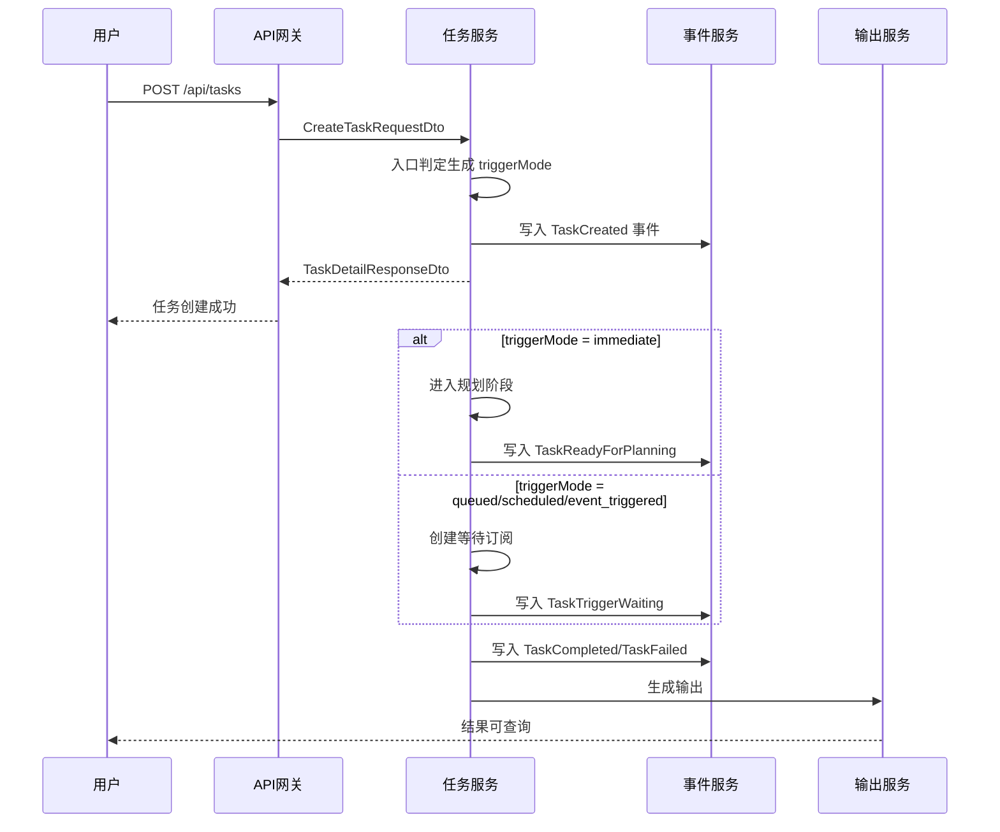
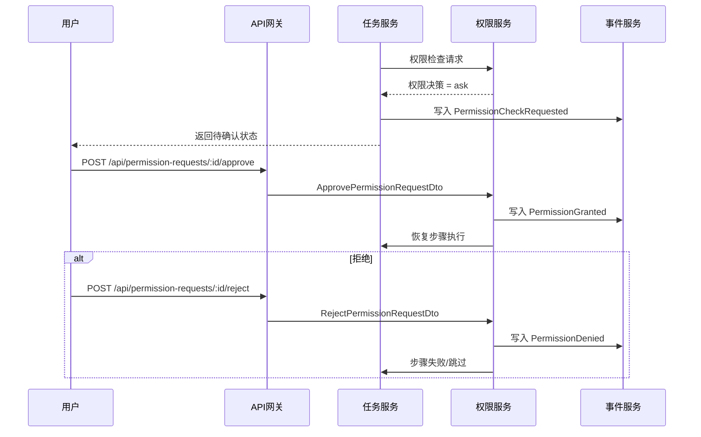
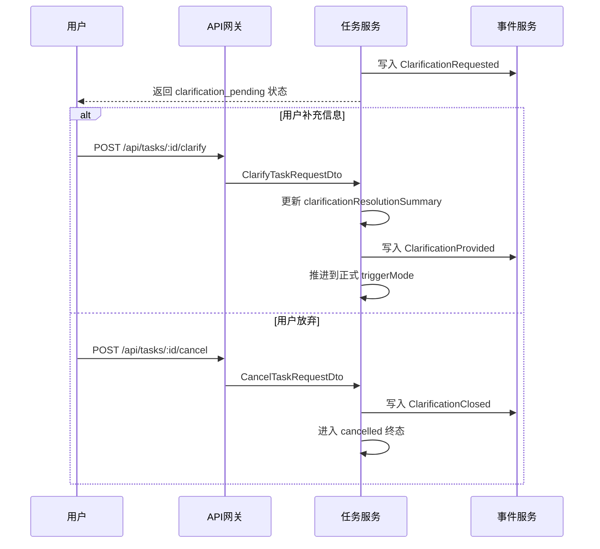
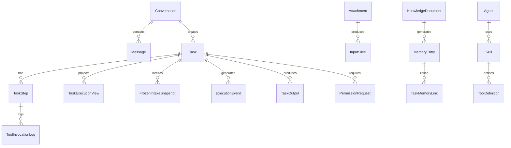

# BiosBot 功能函数文档

## 1. 文档目的

本文档仅定义系统对外接口契约，包括 API、DTO、错误码和事件语义。
本文档主要支撑 01-需求分析 中的主链路需求 N-01～N-05，以及接口契约层面的支撑需求 N-06～N-14，便于从需求到实现的精确追踪。
本文档重点回答“接口传什么、返回什么、事件如何命名”；这里的 DTO 和字段均为传输契约，不定义前端页面状态、页面组件拆分或 store 结构。

## 2. 接口函数清单

### 通用参数说明

#### 分页参数

所有列表接口支持以下分页参数：

| 参数 | 类型 | 必填 | 说明 |
|------|------|------|------|
| `page` | int | 否 | 页码，从1开始，默认1 |
| `pageSize` | int | 否 | 每页数量，默认20，最大100 |
| `cursor` | string | 否 | 游标分页标识，用于高效翻页 |

#### 排序参数

| 参数 | 类型 | 必填 | 说明 |
|------|------|------|------|
| `sortBy` | string | 否 | 排序字段，如 createdAt, updatedAt, status |
| `sortOrder` | string | 否 | 排序方向，asc/desc，默认 desc |

#### 通用响应结构

```json
{
  "data": [],
  "pagination": {
    "page": 1,
    "pageSize": 20,
    "total": 100,
    "hasMore": true,
    "nextCursor": "abc123"
  }
}
```

### 2.1 会话接口

- `GET /api/conversation`（来源：N-01.3，N-01.4，获取默认会话上下文）
- `GET /api/conversation/messages`（来源：N-01.1，N-01.4，N-05.1）
- `POST /api/conversation/messages`（来源：N-01.1，N-01.6，发送消息；支持普通任务请求、只读任务查询指令和常用任务操作指令）

多端请求约定：

- 所有需要区分接入端实例的接口应支持 `X-Client-Id` Header；服务端将其归一化写入 `originClientId`。
- 所有需要区分接入端类型的接口应支持 `X-Entry-Point` Header；服务端将其归一化写入 `entryPoint`。
- `originClientId` / `entryPoint` 不属于业务请求体字段；对于创建任务、发送消息等写请求，客户端只通过 Header 传递端来源，服务端再注入领域模型。

### 2.2 任务接口

- `POST /api/tasks`（来源：N-01.1，N-01.2，N-01.4，N-01.5，N-02.2）
- `GET /api/tasks`（来源：N-02.1，N-02.2，N-14）
- `GET /api/tasks/:id`（来源：N-02.1，N-02.4，N-02.5，N-03.1，N-03.2，N-03.3，N-04.1，N-04.2，N-04.3，N-04.4）
- `PATCH /api/tasks/:id`（来源：N-03.1，更新任务元数据/优先级）
- `DELETE /api/tasks/:id`（来源：N-03.1，删除任务）
- `POST /api/tasks/:id/retry`（来源：N-03.1，N-14）
- `POST /api/tasks/:id/cancel`（来源：N-03.1，N-14）
- `GET /api/tasks/:id/steps`（来源：N-02.2，N-03.1，N-03.2，N-14）
- `GET /api/tasks/:id/timeline`（来源：N-02.2，N-02.4，N-03.1，N-03.2，N-04.4，N-14）
- `GET /api/tasks/:id/events`（来源：N-02.2，N-14，事件流订阅）
- `GET /api/tasks/:id/report`（来源：N-03.3，N-04.1，N-04.4，N-14）
- `GET /api/tasks/:id/outputs`（来源：N-04.1，N-04.2，N-04.3，N-04.4，N-05.1）
- `POST /api/tasks/:id/confirm-trigger`（来源：N-01.2，确认入口模式）
- `POST /api/tasks/:id/clarify`（来源：N-01.5，补充入口澄清信息）

任务相关接口返回结构需补充以下统一字段：

- 路由摘要：`routeDecisionSummary`、`selectedAgents`、`selectedSkills`、`decisionReason`。
- 并行状态：`parallelGroupId`、`executionMode`、`waitingReason`。
- 重试与降级：`retryCount`、`retrySource`、`degradeReason`、`degradeAction`。
- 记忆控制：`memoryScope`、`memoryLoadSummary`、`memoryWriteSummary`。
- 写入控制：`aggregateVersion`、`pendingWriteCommandCount?`、`lastAcceptedWriteCommandId?`。
- 权限决策：`permissionMode`、`permissionStatus`、`permissionRequestId`、`permissionSummary`、`permissionDecisionTrace`。
- 事件同步：`lastEventSequence`、`nextEventCursor?`。
- 模型调用：`modelProvider?`、`modelFailureCode?`、`modelFailureSummary?`。
- 结果解释：`agentExecutionSummary`、`knowledgeHitSummary`、`availableActions`。

### 2.3 附件接口

- `POST /api/attachments`（来源：N-01.1，N-08）
- `GET /api/attachments/:id`（来源：N-03.1，N-08）
- `POST /api/attachments/:id/reparse`（来源：N-03.1，N-08，N-14）
- `POST /api/attachments/:id/add-to-knowledge-base`（来源：N-05.1，N-08，N-09.1）

### 2.4 知识库接口

- `GET /api/knowledge-bases/:agentId/documents`（来源：N-05.1，N-09.1）
- `POST /api/knowledge-bases/:agentId/documents`（来源：N-05.1，N-08，N-09.1）
- `DELETE /api/knowledge-bases/:agentId/documents/:docId`（来源：N-05.1，N-09.1）

### 2.5 权限确认接口

- `POST /api/permission-requests/:id/approve`（来源：N-13，N-14）
- `POST /api/permission-requests/:id/reject`（来源：N-13，N-14）

### 2.6 记忆整理与来源接口

- `POST /api/agents/:agentId/memory-consolidations/daily/rerun`（来源：N-09.3，N-10）
- `GET /api/agents/:agentId/memory-consolidations/daily`（来源：N-09.3，N-10）
- `GET /api/memory-entries/:id/source`（来源：N-09.3，N-10）

### 2.7 Agent 接口

- `GET /api/agents`（来源：N-06，N-07，获取Agent列表）
- `POST /api/agents`（来源：N-06，N-07，创建Agent）
- `GET /api/agents/:id`（来源：N-06，N-07，获取Agent详情）
- `PATCH /api/agents/:id`（来源：N-06，N-07，更新Agent配置）
- `DELETE /api/agents/:id`（来源：N-06，N-07，删除Agent）
- `POST /api/agents/:id/test`（来源：N-07，测试Agent连通性）

### 2.8 Skill 接口

- `GET /api/skills`（来源：N-11，获取Skill列表）
- `POST /api/skills`（来源：N-11，创建Skill）
- `GET /api/skills/:id`（来源：N-11，获取Skill详情）
- `PATCH /api/skills/:id`（来源：N-11，更新Skill）
- `DELETE /api/skills/:id`（来源：N-11，删除Skill）
- `POST /api/skills/:id/activate`（来源：N-11，激活Skill）

### 2.9 记忆接口

- `GET /api/memories`（来源：N-09，获取记忆列表）
- `POST /api/memories`（来源：N-09，创建记忆）
- `DELETE /api/memories/:id`（来源：N-09，删除记忆）
- `PATCH /api/memories/:id`（来源：N-09，更新记忆）

### 2.10 权限策略接口

- `GET /api/policies`（来源：N-13，获取权限策略列表）
- `POST /api/policies`（来源：N-13，创建权限策略）
- `GET /api/policies/:id`（来源：N-13，获取策略详情）
- `PATCH /api/policies/:id`（来源：N-13，更新策略）
- `DELETE /api/policies/:id`（来源：N-13，删除策略）

### 2.11 配置接口

- `GET /api/config`（来源：N-14，获取系统配置）
- `PATCH /api/config`（来源：N-14，更新系统配置）
- `GET /api/config/models`（来源：N-14，获取模型配置）
- `POST /api/config/models/test`（来源：N-14，测试模型连通性）

### 2.12 健康检查接口

- `GET /health`（来源：N-14，整体健康状态）
- `GET /health/ready`（来源：N-14，就绪检查）
- `GET /health/live`（来源：N-14，存活检查）

### 2.13 批量操作接口

- `POST /api/tasks/batch-delete`（来源：N-03.1，批量删除任务）
- `POST /api/attachments/batch-delete`（来源：N-08，批量删除附件）
- `POST /api/memories/batch-delete`（来源：N-09，批量删除记忆）
- `POST /api/knowledge-bases/:agentId/documents/batch-delete`（来源：N-09.1，批量删除知识文档）
- `POST /api/policies/batch-delete`（来源：N-13，批量删除策略）

## 3. DTO 函数契约

### 3.1 请求 DTO

- `ListConversationsRequestDto`
- `CreateTaskRequestDto`
- `RetryTaskRequestDto`
- `CancelTaskRequestDto`
- `UploadAttachmentRequestDto`
- `ReparseAttachmentRequestDto`
- `CreateKnowledgeDocumentRequestDto`
- `ApprovePermissionRequestDto`
- `RejectPermissionRequestDto`
- `RerunDailyMemoryConsolidationRequestDto`
- `ListDailyMemoryConsolidationsRequestDto`
- `SendMessageRequestDto`
- `UpdateConversationRequestDto`
- `UpdateTaskRequestDto`
- `ConfirmTriggerRequestDto`
- `ClarifyTaskRequestDto`
- `CreateAgentRequestDto`
- `UpdateAgentRequestDto`
- `TestAgentConnectivityRequestDto`
- `CreateSkillRequestDto`
- `UpdateSkillRequestDto`
- `ActivateSkillRequestDto`
- `CreateMemoryRequestDto`
- `UpdateMemoryRequestDto`
- `CreatePolicyRequestDto`
- `UpdatePolicyRequestDto`
- `UpdateConfigRequestDto`
- `TestModelConnectivityRequestDto`
- `BatchDeleteTasksRequestDto`
- `BatchDeleteConversationsRequestDto`
- `BatchDeleteAttachmentsRequestDto`
- `BatchDeleteMemoriesRequestDto`
- `BatchDeleteDocumentsRequestDto`
- `BatchDeletePoliciesRequestDto`
- `ListRequestDto`
- `PageRequestDto`
- `SortRequestDto`

### 3.0 通用 DTO 结构

#### 分页请求 DTO

```typescript
interface PageRequestDto {
  page?: number;       // 页码，从1开始，默认1
  pageSize?: number; // 每页数量，默认20，最大100
  cursor?: string;    // 游标，用于高效翻页
}
```

#### 排序请求 DTO

```typescript
interface SortRequestDto {
  sortBy?: string;    // 排序字段
  sortOrder?: 'asc' | 'desc';  // 排序方向，默认desc
}
```

#### 通用分页响应 DTO

```typescript
interface PaginatedResponseDto<T> {
  data: T[];
  pagination: {
    page: number;
    pageSize: number;
    total: number;
    hasMore: boolean;
    nextCursor?: string;
  };
}
```

#### 批量操作请求 DTO

```typescript
interface BatchDeleteRequestDto {
  ids: string[];      // 要删除的资源ID列表
  reason?: string;    // 删除原因（可选）
}
```

#### 批量操作响应 DTO

```typescript
interface BatchOperationResponseDto {
  successIds: string[];   // 成功删除的ID列表
  failedIds: string[];     // 删除失败的ID列表
  errors: {
    id: string;
    code: string;
    message: string;
  }[];
}
```

关键字段约定：

- `CreateTaskRequestDto`：包含 `conversationId?`、`inputText`、`attachmentIds`、`memoryScope`、`selectedMemoryIds?`，用于在任务创建时声明记忆加载范围；在单一会话窗口模型下，前端无需先调用独立“新建会话”接口，若实现仍需 `conversationId`，该值应由当前默认会话上下文自动注入，而不是通过用户显式新建会话获得。（来源：N-01.1，N-01.3，N-09.2）
- `CreateTaskRequestDto`：包含 `conversationId?`、`inputText`、`attachmentIds`、`memoryScope`、`selectedMemoryIds?`、`triggerMode`、`scheduledAt?`、`triggerRule?`，用于在任务创建时声明记忆加载范围以及任务入口模式；其中 `triggerMode` 至少支持 `immediate`、`queued`、`scheduled`、`event_triggered`。该字段不由用户在界面中手工选择，而是由会话输入解析链路根据时间表达、排队意图和事件条件自动填入。（来源：N-01.2，N-02.2，N-09.2，N-14）
- `CreateTaskRequestDto`：在标准化入参阶段还需支持 `triggerDecisionSummary?`、`nextTriggerCheckAt?` 与 `intakeInputSummary?`，用于承接会话意图解析输出和延迟任务的入口冻结摘要；当存在 `selectedMemoryIds` 时，服务端创建任务后需将其转化为冻结快照，而不是允许后续等待期间被隐式改写。（来源：N-01.2，N-01.5，N-09.4，N-14）
- `CreateTaskRequestDto`：在单窗口主交互模型下还需支持 `syncPolicy?`、`visibleClientIds?`，用于声明默认展示范围以及是否启用跨端同步；本次输入来自哪个接入端由 `X-Client-Id`、`X-Entry-Point` Header 提供，服务端归一化后写入任务的 `originClientId`、`entryPoint` 字段。若 `syncPolicy` 缺省，则默认按 `origin_only` 处理，只在发起端展示相关输入、进度、结果和权限授权信息。（来源：N-01.4，N-13，N-14）

`CreateTaskRequestDto` 请求示例：以下样例表示系统完成会话语义识别后的标准化请求载荷。

`queued` 载荷样例：

```json
{
	"conversationId": "conv_001",
	"inputText": "整理今天新增的需求变更并生成任务清单",
	"attachmentIds": ["att_101"],
	"memoryScope": "conversation_and_agent",
	"selectedMemoryIds": ["mem_201", "mem_202"],
	"triggerMode": "queued"
}
```

`scheduled` 载荷样例：

```json
{
	"conversationId": "conv_002",
	"inputText": "明早 09:00 汇总昨日日报并输出周报草稿",
	"attachmentIds": [],
	"memoryScope": "agent_only",
	"triggerMode": "scheduled",
	"scheduledAt": "2026-03-14T09:00:00+08:00"
}
```

`event_triggered` 载荷样例：

```json
{
	"conversationId": "conv_003",
	"inputText": "当需求文档发生变更时重新生成技术影响分析",
	"attachmentIds": ["att_305"],
	"memoryScope": "selected_only",
	"selectedMemoryIds": ["mem_501"],
	"triggerMode": "event_triggered",
	"triggerRule": {
		"eventType": "knowledge_document_updated",
		"agentId": "agent_product_architect",
		"filters": {
			"documentId": "doc_requirement_main"
		}
	}
}
```

- `RetryTaskRequestDto`：包含 `taskId`、`retryMode`、`failedStepId?`、`preserveMemoryScope?`、`expectedAggregateVersion?`，用于区分整任务重试、失败步骤重试、是否保留原记忆范围，以及避免基于过期任务聚合版本提交写操作；版本冲突时返回 `TASK_WRITE_CONFLICT`。（来源：N-03.1，N-14）
- `CreateKnowledgeDocumentRequestDto`：包含 `agentId`、`sourceTaskId?`、`sourceOutputId?`、`documentType`、`content`，用于显式沉淀任务结果。（来源：N-05.1，N-09.1，N-10）
- `ApprovePermissionRequestDto`：包含 `requestId`、`approvedBy`、`comment?`、`expectedSequence?`，用于完成权限确认并提交允许执行的权限决策；`expectedSequence` 用于避免基于过期时间线重复确认，冲突时返回 `PERMISSION_CONFIRMATION_CONFLICT`。（来源：N-13，N-14）
- `RejectPermissionRequestDto`：包含 `requestId`、`rejectedBy`、`reason?`、`expectedSequence?`，用于完成权限确认并提交拒绝执行的权限决策；`expectedSequence` 用于避免基于过期时间线重复确认，冲突时返回 `PERMISSION_CONFIRMATION_CONFLICT`。（来源：N-13，N-14）
- `RerunDailyMemoryConsolidationRequestDto`：包含 `summaryDate`、`triggeredBy`、`agentId?`、`forceRegenerate?`，用于手动补跑指定日期的会话日摘要整理；当 `forceRegenerate` 为 `false` 时，应优先复用既有去重结果，避免重复生成语义等价的持久记忆。（来源：N-09.3，N-10）
- `ListDailyMemoryConsolidationsRequestDto`：包含 `agentId`、`summaryDateFrom?`、`summaryDateTo?`、`status?`、`sourceConversationId?`，用于查询某 Agent 的日摘要整理作业和摘要来源范围。（来源：N-09.3，N-10）

### 3.2 响应 DTO

- `ConversationContextResponseDto`
- `TaskListResponseDto`
- `TaskDetailResponseDto`
- `TaskActionResponseDto`
- `TaskTimelineResponseDto`
- `TaskReportResponseDto`
- `TaskOutputsResponseDto`
- `AttachmentDetailResponseDto`
- `KnowledgeDocumentListResponseDto`
- `PermissionRequestResponseDto`
- `MemoryConsolidationJobResponseDto`
- `DailyMemoryConsolidationListResponseDto`
- `MemoryEntrySourceResponseDto`
- `MessageListResponseDto`
- `MessageDetailResponseDto`
- `AgentListResponseDto`
- `AgentDetailResponseDto`
- `SkillListResponseDto`
- `SkillDetailResponseDto`
- `MemoryListResponseDto`
- `MemoryDetailResponseDto`
- `PolicyListResponseDto`
- `PolicyDetailResponseDto`
- `ConfigResponseDto`
- `ModelConfigListResponseDto`
- `HealthCheckResponseDto`

关键字段约定：

- `ConversationContextResponseDto`：除基础会话信息外，还需返回 `lastActiveClientId?`、`latestTaskId?` 与可选的 `recentTaskIds?`，用于表达当前唯一默认会话上下文最近一次活跃输入来自哪个接入端以及最近任务引用；该 DTO 不承载会话列表、切换或删除所需的多会话管理语义。（来源：N-01.3，N-01.4，N-14）
- `TaskDetailResponseDto`：包含 `taskId`、`status`、`triggerMode`、`triggerStatus?`、`scheduledAt?`、`triggerRuleSummary?`、`triggerDecisionSummary?`、`complexityDecisionSummary?`、`nextTriggerCheckAt?`、`queuePosition?`、`routeDecisionSummary`、`selectedAgents`、`parallelGroups`、`retryCount`、`lastDegradeAction`、`memoryScope`、`aggregateVersion`、`pendingWriteCommandCount?`、`lastAcceptedWriteCommandId?`、`permissionStatus`、`permissionMode`、`permissionRequestId?`、`permissionSummary?`、`permissionDecisionTrace?`、`lastEventSequence`、`nextEventCursor?`、`modelProvider?`、`modelFailureCode?`、`modelFailureSummary?`、`resultPageMode?`、`terminalSummaryAvailable?`；当入口模式判定低置信度且尚未完成澄清时，`status` 必须可稳定表达正式 `clarification_pending` 或 05-详细设计 中定义的等价状态，不允许仅靠临时提示文案表示任务尚未确认。`resultPageMode` 用于稳定区分“最终输出结果页”和“无最终输出的终态摘要页”两类入口。（来源：N-01.2，N-01.5，N-02.1，N-03.1，N-04.1，N-04.3，N-09.2，N-14）
- `TaskDetailResponseDto`：上述字段除用于独立详情接口外，还需支持被会话消息回复复用，以便系统在处理“查看任务详情”类查询时，直接在消息流中回显结构化任务摘要而不丢失字段语义。（来源：N-01.6，N-02.1，N-02.2，N-14）
- `TaskActionResponseDto`：除用于独立任务动作接口外，还需支持被会话消息回复复用，以便系统在处理“重试任务”“取消任务”“继续等待”“重新安排”或等价控制指令时，在消息流中回显动作是否被接受、当前状态、影响范围和下一步建议。（来源：N-01.6，N-03.1，N-14）
- `TaskDetailResponseDto`：在单窗口主交互和多端显示场景下，还需返回 `entryPoint`、`originClientId`、`syncPolicy`、`visibleClientIds?`、`displayScope`，用于表达该任务相关输入、进度、结果和权限授权默认在哪些接入端可见；`displayScope` 至少支持 `origin_only`、`synced_clients`、`all_clients` 三类稳定显示语义。（来源：N-01.4，N-13，N-14）
- `TaskDetailResponseDto`：当任务处于等待态或延迟执行模式时，还需返回 `intakeInputSummary?`、`selectedMemoryIdsSnapshot?`、`invalidMemoryEntryIds?`、`snapshotResolution?`、`waitingAnomalyCode?`、`waitingAnomalySummary?`、`lastTriggerEvaluationSummary?`、`waitingThresholdMode?`、`waitingThresholdBasisSummary?`、`interventionRequiredReason?`、`suggestedActions?`、`clarificationRequiredFields?`、`clarificationResolutionSummary?`、`clarificationClosedReason?`，用于解释冻结快照、失效条目、等待异常、最近一次重评估结果、当前命中的阈值依据，以及低置信度入口在原 Task 上如何完成澄清、采用安全默认路径或被明确关闭。（来源：N-01.5，N-02.4，N-03.1，N-04.3，N-09.4，N-09.5，N-14）
- `TaskDetailResponseDto`：当任务是 Leader 父任务或 Domain 子任务时，还需返回 `parentTaskId?`、`childTaskIds?`、`assignedDomainAgentId?`、`arrangementStatus?`、`arrangementSummary?`、`estimatedCompletionAt?`、`estimatedDurationMinutes?`、`userNotificationStage?`、`finalOutputReady?`、`outputStage?`、`arrangementNoticeSummary?`、`blockingDecisionChangeSummary?`，用于表达父子关系、排队确认阶段、ETA、阶段性通知、blocking / non-blocking 标记调整摘要与最终交付状态，并稳定区分“仅完成安排确认”和“最终结果已可交付”两类阶段；其中 `arrangementStatus`、`userNotificationStage`、`outputStage` 的允许值以 05-详细设计 的状态枚举词表基线为准。（来源：N-02.2，N-02.4，N-03.2，N-04.2，N-07.2，N-07.3，N-14）
- `TaskDetailResponseDto`：当父任务进入部分完成或降级交付路径时，还需返回 `degradedDeliverySummary?`，至少包含 `completedBlockingTaskIds`、`failedOrSkippedNonBlockingTaskIds`、`impactSummary`、`deliveryReason`，用于把“主要目标已达成”的判定转化为结构化、可审计的接口事实。（来源：N-02.5，N-03.3，N-04.1，N-14）
- `TaskDetailResponseDto`：当任务已进入 Agent 执行链路时，还需返回 `currentReasoningSummary?`、`lastObservationSummary?`、`nextActionSummary?`、`reasoningUpdatedAt?`，用于表达当前回合的简短推理摘要、最近一次有效工具观察摘要和下一步动作意图，支撑 ReAct（“推理 + 行动”）模式的可解释展示；这些字段只能承载可审计摘要，不得承载完整原始思维链。（来源：N-03.1，N-07.5，N-12，N-13，N-14）
- `TaskTimelineResponseDto`：包含 `events[]` 与 `nextEventCursor?`，其中事件需支持 `TaskCreated`、`TaskTriggerResolved`、`TaskTriggerWaiting`、`TaskReadyForPlanning`、`TaskPlanned`、`TaskWriteQueued`、`TaskWriteConflictDetected`、`StepStarted`、`TaskCompleted`、`TaskPartialFailed`、`TaskFailed`、`TaskCancelled`、`TaskTimedOut`、`TaskManuallyClosed`、`TaskInterventionRequired`、`RouteResolved`、`PermissionCheckRequested`、`PermissionGranted`、`PermissionDenied`、`StepParallelQueued`、`StepWaiting`、`TaskTriggerReevaluated`、`TaskTriggerActivated`、`TaskTriggerInvalidated`、`TaskAutoRetried`、`TaskDegraded`、`MemoryScopeConfirmed`、`MemoryLoaded`、`MemoryRead`、`MemoryWritten`、`ModelCallStarted`、`ModelCallCompleted`、`ModelCallFailed` 等类型，并带 `eventId`、`sequence`、`cursor?`、`timestamp`、`stepId?`、`agentId?`、`summary`、`payload`；客户端必须以 `sequence` 作为稳定排序依据。（来源：N-02.1，N-02.4，N-03.1，N-09.2，N-09.4，N-14）
- `TaskTimelineResponseDto`：若事件涉及会话主交互展示或跨端同步，还需在事件级或 `payload` 中返回 `originClientId?`、`syncPolicy?`、`visibleClientIds?`、`entryPoint?`，用于保证不同接入端按同一显示范围和同一时间线顺序消费消息。（来源：N-01.4，N-14）
- `TaskTimelineResponseDto`：父任务时间线还需支持 `SubTasksCreated`、`DomainTaskQueued`、`DomainTaskScheduled`、`DomainTaskTriggered`、`TaskArrangementCompleted`、`TaskEtaEstimated` 等事件，用于表达子任务安排确认和 ETA 聚合过程。（来源：N-02.2，N-03.2，N-07.2，N-07.3，N-14）
- `TaskTimelineResponseDto`：当事件属于 Agent 执行回合、工具调用或工具结果观察时，事件级或 `payload` 还需返回 `reasoningSummary?`、`actionSummary?`、`observationSummary?`、`observationSourceType?`、`observationRef?`，用于表达该回合的简短推理摘要、实际动作和观察结果如何进入下一轮决策；上述字段仅用于展示可审计摘要，不允许作为完整原始思维链透传。（来源：N-03.1，N-07.5，N-12，N-13，N-14）
- `TaskReportResponseDto`：包含 `agentExecutionSummary`、`knowledgeHitSummary`、`memoryLoadSummary`、`memoryWriteSummary`、`toolCallSummary`、`failureAnalysis`、`suggestedActions`、`modelCallSummary`、`normalizedFailureCodes`、`degradedDeliverySummary?`、`supplementalUpdateSummary?`、`blockingDecisionChangeSummary?`，用于表达降级交付判定摘要、blocking / non-blocking 标记变更摘要以及父任务最终交付后晚到 non-blocking 成功结果的补充更新记录。（来源：N-02.5，N-03.3，N-04.4，N-09.1，N-09.2，N-14）
- `TaskReportResponseDto`：还需支持 `reasoningTraceSummary?`、`observationTraceSummary?`、`reactLoopSummary?`，用于聚合展示本次任务中关键 ReAct 回合的推理摘要、工具观察摘要和“观察如何改变后续动作”的执行结论，供复盘与排障使用；这些字段必须是压缩后的结构化摘要，不得直接返回完整原始思维链。（来源：N-03.1，N-07.5，N-12，N-13，N-14）
- `TaskOutputsResponseDto`：除输出物列表外，还需包含 `references`、`memoryChanges`、`availableActions`、`permissionSummary`、`outputStage?`、`arrangementNoticeSummary?`、`degradedDeliverySummary?`、`supplementalUpdates?`、`supplementalNotificationType?`、`terminalSummary?`，用于结果页展示结果解释、阶段性通知、结构化降级交付摘要、交付后的补充结果以及无最终输出的终态摘要；当 `outputStage=arranged_only` 时，不得把阶段性 ETA / 安排通知解释为最终输出；当存在 `supplementalUpdates` 时，界面必须把其解释为交付后的补充信息，而不是覆盖原最终输出；`supplementalNotificationType` 用于表达该补充更新是“仅页面被动展示”还是“已发送独立补充更新通知”；`terminalSummary` 用于承载无最终输出但已合法终止任务的终态摘要。`outputStage` 的允许值以 05-详细设计 的状态枚举词表基线为准。（来源：N-04.1，N-04.2，N-04.3，N-04.4，N-05.1，N-10，N-14）
- `TaskOutputsResponseDto`：当结果页需要解释 Agent 如何得出当前输出时，还需包含 `reasoningSummary?`、`observationSummary?` 或等价摘要字段，用于解释关键步骤摘要和关键工具观察，但不得以结果接口暴露完整原始思维链。（来源：N-04.1，N-05.2，N-07.5，N-12，N-14）
- `TaskActionResponseDto`：包含 `taskId`、`action`、`accepted`、`queueAccepted?`、`currentStatus`、`aggregateVersion?`、`retryCount?`、`degradeAction?`、`conflictCode?`，用于返回取消、重试等动作的即时结果，并显式表达是否进入任务写队列或命中写入冲突。（来源：N-03.1，N-14）
- `PermissionRequestResponseDto`：包含 `requestId`、`taskId`、`actionType`、`target`、`permissionMode`、`status`、`reason`、`requestedAt`、`decisionSource`、`decisionTraceSummary?`、`sequence`，用于向前端描述待权限确认或已完成权限决策的权限请求。（来源：N-13，N-14）
- `MemoryConsolidationJobResponseDto`：包含 `jobId`、`agentId`、`summaryDate`、`status`、`triggerMode`、`triggeredBy?`、`sourceConversationIds`、`generatedMemoryEntryIds?`、`dedupKey?`、`startedAt?`、`completedAt?`、`errorMessage?`，用于返回一次日摘要整理作业的执行结果。（来源：N-09.3，N-10）
- `DailyMemoryConsolidationListResponseDto`：包含 `items[]` 与 `total`，其中 `items[]` 为 `MemoryConsolidationJobResponseDto` 列表，用于查询某 Agent 在指定日期范围内的日摘要整理历史。（来源：N-09.3，N-10）
- `MemoryEntrySourceResponseDto`：包含 `memoryEntryId`、`sourceType`、`summaryDate?`、`sourceConversationIds?`、`sourceTaskId?`、`sourceAttachmentIds?`、`dedupKey?`、`jobId?`、`summaryVersion?`，用于查询一条持久记忆的来源，特别是日摘要由哪些会话和哪次整理作业生成。（来源：N-09.3，N-10）

## 4. 错误码与事件契约

- `TASK_NOT_FOUND`
- `TASK_STATUS_CONFLICT`
- `TASK_WRITE_CONFLICT`
- `ATTACHMENT_PARSE_FAILED`
- `TOOL_PERMISSION_DENIED`
- `TOOL_NOT_ACTIVATED`
- `PATCH_CONFLICT`
- `COMMAND_TIMEOUT`
- `MODEL_TIMEOUT`
- `MODEL_RATE_LIMITED`
- `MODEL_PROVIDER_UNAVAILABLE`
- `MODEL_RESPONSE_INVALID`
- `PROMPT_OVERFLOW`
- `PERMISSION_REQUIRED`
- `PERMISSION_CONFIRMATION_CONFLICT`
- `PERMISSION_DENIED`
- `MEMORY_CONSOLIDATION_JOB_NOT_FOUND`
- `MEMORY_CONSOLIDATION_ALREADY_RUNNING`
- `CONVERSATION_NOT_FOUND`
- `CONVERSATION_DELETE_FAILED`
- `AGENT_NOT_FOUND`
- `AGENT_ALREADY_EXISTS`
- `AGENT_DELETE_FAILED`
- `SKILL_NOT_FOUND`
- `SKILL_ALREADY_EXISTS`
- `SKILL_DELETE_FAILED`
- `SKILL_NOT_ACTIVE`
- `MEMORY_NOT_FOUND`
- `MEMORY_DELETE_FAILED`
- `POLICY_NOT_FOUND`
- `POLICY_ALREADY_EXISTS`
- `POLICY_DELETE_FAILED`
- `CONFIG_NOT_FOUND`
- `CONFIG_UPDATE_FAILED`
- `MODEL_CONFIG_NOT_FOUND`
- `MODEL_CONNECTIVITY_FAILED`
- `HEALTH_CHECK_FAILED`

任务时间线与报告需统一支持以下事件名：

- `TaskCreated`
- `TaskTriggerResolved`
- `TaskTriggerWaiting`
- `TaskReadyForPlanning`
- `TaskPlanned`
- `TaskWriteQueued`
- `TaskWriteConflictDetected`
- `StepStarted`
- `TaskCompleted`
- `TaskPartialFailed`
- `TaskFailed`
- `TaskCancelled`
- `TaskTimedOut`
- `TaskManuallyClosed`
- `TaskInterventionRequired`
- `SubTasksCreated`
- `DomainTaskQueued`
- `DomainTaskScheduled`
- `DomainTaskTriggered`
- `TaskArrangementCompleted`
- `TaskEtaEstimated`
- `BlockingDecisionChanged`
- `MemoryScopeConfirmed`
- `MemoryLoaded`
- `ModelCallStarted`
- `ModelCallCompleted`
- `ModelCallFailed`
- `RouteResolved`
- `PermissionCheckRequested`
- `PermissionGranted`
- `PermissionDenied`
- `StepParallelQueued`
- `StepWaiting`
- `TaskTriggerReevaluated`
- `TaskTriggerActivated`
- `TaskTriggerInvalidated`
- `MemoryRead`
- `MemoryWritten`
- `TaskAutoRetried`
- `TaskDegraded`

事件字段统一约定：

- 所有事件至少包含 `eventId`、`taskId`、`sequence`、`eventType`、`timestamp`、`summary`、`payload`，必要时补充 `stepId`、`agentId`、`cursor`。
- 入口判定相关事件的 `payload` 需包含 `triggerMode`、`triggerStatus?`、`triggerDecisionSummary?`、`complexityDecisionSummary?`、`nextTriggerCheckAt?`、`intakeInputSummary?`、`selectedMemoryIdsSnapshot?`，在低置信度澄清场景下还需包含 `clarificationRequiredFields?`、`clarificationResolutionSummary?`、`clarificationClosedReason?`，用于表达该任务已进入正式 `clarification_pending` 或等价状态、后续如何在原 Task 上完成确认或关闭；在事件触发等待场景下还需包含 `triggerRule?` 或其摘要；在释放、重评估与失效场景下还需包含 `subscriptionId?`、`releaseToken?`、`invalidationReason?`、`triggerFactId?`、`triggerSourceType?`、`triggerSourceRef?`、`triggerSourceSignature?`、`lastTriggerEvaluationSummary?`、`waitingAnomalyCode?`、`waitingAnomalySummary?`、`waitingThresholdMode?`、`waitingThresholdBasisSummary?`，用于表达一次性认领、触发事实身份、复杂任务判定摘要、命中的阈值依据和订阅失效或等待异常原因。
- 入口判定和会话主交互相关事件 `payload` 还需包含 `entryPoint?`、`originClientId?`、`syncPolicy?`、`visibleClientIds?`、`displayScope?`，用于表达本次输入来自哪个接入端、默认是否仅在发起端显示，以及跨端同步后的目标可见范围。
- 冻结快照校验相关事件或任务详情补充字段需支持 `invalidMemoryEntryIds?`、`snapshotResolution?`、`minimumContextSatisfied?`、`interventionRequiredReason?`、`suggestedActions?`，用于表达延迟任务释放前的快照失效处理结果与人工介入原因；若 `minimumContextSatisfied=false`，后续时间线必须进入明确终态而不是静默放行。
- 当 `triggerMode` 为 `queued`、`scheduled` 或 `event_triggered` 且任务成功被释放时，时间线必须至少连续出现 `TaskTriggerActivated`、`TaskReadyForPlanning`、`MemoryScopeConfirmed` 三个事件；若未成功释放，只能记录 `TaskTriggerReevaluated`，不得跳过 `TaskTriggerActivated` 直接进入 `TaskReadyForPlanning`。
- 队列等待相关响应或事件摘要需优先以所属 Domain Agent 显式队列顺位表达 `queuePosition` 或 `queuePositionInAgent`，释放判断再结合统一的全局任务执行槽位预算计算，不暴露未在概要层声明的 Agent 级或模型级子配额。
- 父任务与子任务相关事件 `payload` 还需支持 `parentTaskId?`、`childTaskId?`、`assignedDomainAgentId?`、`arrangementStatus?`、`arrangementSummary?`、`estimatedCompletionAt?`、`estimatedDurationMinutes?`、`queuePositionInAgent?`、`userNotificationStage?`、`finalOutputReady?`、`outputStage?`、`arrangementNoticeSummary?`、`degradedDeliverySummary?`、`blockingDecisionChangeSummary?`、`supplementalUpdate?`、`supplementalNotificationType?`、`terminalSummary?`，用于表达 Domain 子任务安排确认、父任务 ETA 聚合、双阶段用户通知、结构化降级交付判定、blocking / non-blocking 标记变更、交付后晚到 non-blocking 成功结果的补充更新事实以及无最终输出任务的终态摘要；若存在 `supplementalUpdate`，不得用其改写既有最终输出对应的首次交付事实。
- Agent 执行与工具观察相关事件 `payload` 还需支持 `reasoningSummary?`、`nextActionSummary?`、`observationSummary?`、`observationSourceType?`、`observationRef?`、`usedObservationIds?`，用于表达 ReAct 回合中的简短推理摘要、下一步动作意图、工具或检索观察结果以及被后续决策消费的观察引用；上述字段只表达对外展示与审计所需摘要，不得承载完整原始思维链。
- 权限相关事件的 `payload` 需包含 `permissionMode`、`decisionSource`，在待权限确认场景下还需包含 `permissionRequestId` 与 `decisionTraceSummary`。
- 写入冲突相关事件的 `payload` 需包含 `aggregateVersion`、`expectedAggregateVersion?`、`writeCommandId?` 与 `conflictCode?`。
- 模型调用相关事件的 `payload` 需包含 `modelProvider`、`normalizedErrorCode?`、`retryAttempt?`、`fallbackProvider?`。
- 事件接口与订阅通道需支持至少一次投递语义；客户端必须按 `eventId` 或 `sequence` 做幂等消费，不能因重复事件重复推进状态。

## 5. 接口契约设计规则

- API 路径、DTO、错误码和事件名必须统一，不允许前后端各自定义一套。
- 所有列表接口默认返回稳定排序结果，并明确分页或全量返回语义。
- 所有任务相关接口返回结构必须与任务时间线事件语义一致，避免同一字段在不同接口中含义不同。
- 任务时间线查询、事件订阅恢复和权限确认接口必须共享同一 `sequence/cursor` 语义，不允许一个接口按时间戳、另一个接口按序号恢复状态。
- 具体模块内部职责、Service 拆分、Repository 归属和工具执行流程以下一篇详细设计文档为准。

## 6. 接口 UML 类图

### 6.1 任务生命周期 API 流程



### 6.2 权限确认 API 流程



### 6.3 入口澄清 API 流程



### 6.4 领域对象关系图



### 6.5 状态与接口映射

| Task.status | 可用 API | 说明 |
|------------|---------|------|
| `clarification_pending` | GET /:id, POST /:id/clarify, POST /:id/cancel | 澄清中 |
| `planning` | GET /:id, GET /:id/timeline | 规划中 |
| `waiting` | GET /:id, GET /:id/timeline | 等待中 |
| `ready_for_planning` | GET /:id | 可规划 |
| `planned` | GET /:id, GET /:id/steps | 已规划 |
| `running` | GET /:id, GET /:id/timeline | 执行中 |
| `completed` | GET /:id, GET /:id/outputs, GET /:id/report | 已完成 |
| `failed` | GET /:id, POST /:id/retry | 失败 |
| `cancelled` | GET /:id | 已取消 |

### 6.6 WebSocket 实时事件

系统支持 WebSocket 实时推送以下事件：

#### 任务事件订阅

```typescript
// 订阅主题
ws://api/ws/tasks/:taskId/events

// 推送事件格式
{
  "eventType": "TaskStatusChanged",
  "taskId": "task_001",
  "sequence": 15,
  "timestamp": "2026-03-16T10:30:00Z",
  "payload": {
    "previousStatus": "planning",
    "currentStatus": "running"
  }
}
```

#### 可订阅事件类型

| 事件类型 | 说明 | 推送时机 |
|----------|------|---------|
| `TaskStatusChanged` | 任务状态变更 | 状态转换时 |
| `TaskStepChanged` | 步骤状态变更 | 步骤开始/完成/失败 |
| `PermissionRequested` | 权限请求 | 需要用户确认 |
| `OutputGenerated` | 输出生成 | 步骤产出结果 |
| `MemoryUpdated` | 记忆更新 | 记忆加载/写回 |
| `ErrorOccurred` | 错误发生 | 执行异常 |

#### 订阅/取消订阅

```json
// 订阅请求
{
  "action": "subscribe",
  "topics": ["tasks/task_001/events", "permissions"]
}

// 取消订阅请求
{
  "action": "unsubscribe",
  "topics": ["tasks/task_001/events"]
}
```

## 7. 功能函数文档结论

本接口契约的目标是保证前后端、事件流和结果页解释所依赖的字段语义保持统一，避免实现过程中出现多套不兼容的传输结构。