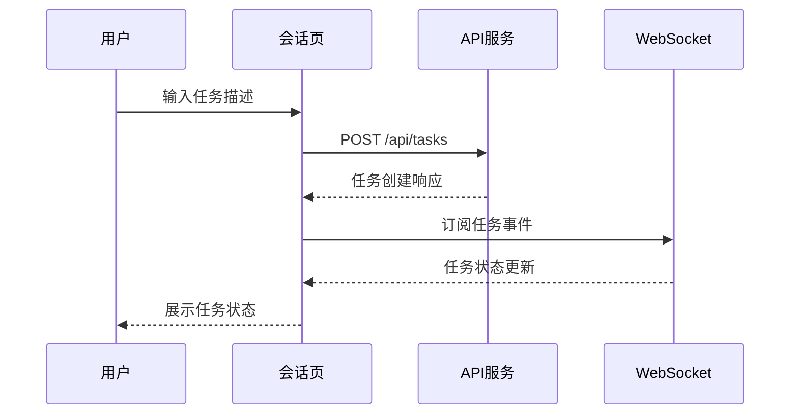
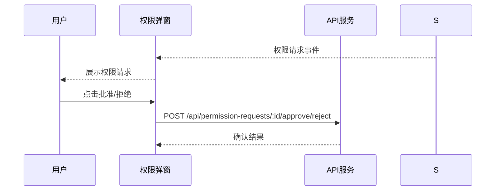
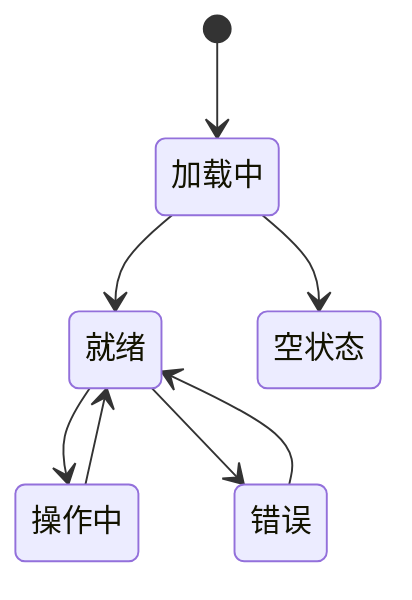

# BiosBot 界面文档

## 1. 文档目的

本文档定义 Web 端的信息架构、页面职责、组件拆分、页面状态和关键交互。
本文档主要支撑 01-需求分析 中的主链路需求 N-01～N-05，以及与会话、任务、结果与知识沉淀相关的支撑需求（N-08，N-09.1～N-09.5，N-14）。
本文档重点回答“页面如何组织、用户如何操作、界面如何反馈状态”；这里的页面状态为前端展示态，不等同于接口 DTO 字段或后端任务状态枚举。对外接口字段和返回结构以 06-功能函数文档 为准。

## 2. 信息架构

P0 Web 端围绕四个主页面展开：

- 会话页（主交互面）。
- 任务详情页。
- 结果页。
- 知识库页。

辅助页面：

- Agent 管理页。
- Skills 管理页。
- 记忆管理页。
- 设置页。
- 权限确认弹窗 / 面板。

## 3. 路由设计

```text
/
|-- /chat                      # 会话页（默认首页）
|-- /chat/:conversationId      # 指定会话页
|-- /tasks                    # 任务列表
|-- /tasks/:taskId           # 任务详情页
|-- /results/:taskId          # 结果页
|-- /knowledge/:agentId      # 知识库页
|-- /memory/:agentId          # 记忆管理页
|-- /agents                   # Agent 管理页
|-- /skills                   # Skills 管理页
|-- /policies                 # 权限策略管理页
|-- /settings                 # 设置页
|-- /monitor                  # 监控仪表盘
```

## 4. 页面布局概览

| 页面 | 布局类型 | 主要区域 |
|------|---------|---------|
| 会话页 | 左侧边栏 + 右侧主内容 | 消息流 + 输入框 + 状态栏 |
| 任务详情页 | 顶部概要 + 底部详情 | 任务信息 + 时间线 + 步骤 |
| 结果页 | 顶部横幅 + 主内容区 | 输出物 + 引用 + 操作 |
| 记忆管理页 | 左侧列表 + 右侧详情 | 记忆列表 + 来源追溯 |
| 知识库页 | 表格布局 | 文档列表 + 操作栏 |
| Agent管理页 | 表格布局 | Agent列表 + 操作栏 |
| 权限策略页 | 表格布局 | 策略列表 + 作用域 |

## 5. 页面职责

### 5.1 会话页

职责：

- 承载默认单一会话窗口，不向用户暴露单独的"新建会话"主操作。
- 展示消息流，并作为默认唯一的用户主交互窗口承载文本输入、多模态输入、进度显示、结果输出和权限授权。
- 上传附件。
- 发起任务。
- 对不同入口和接入端保持一致交互语义；Web 端为 P0 默认接入端，其他接入端扩展后仍复用同一会话交互模型。
- 根据用户会话内容自动识别任务触发模式，并在发送前后展示识别结果摘要。
- 当入口模式判定低置信度时，把已创建任务明确展示为正式待澄清 / 待确认状态，并提示用户这是原 Task 的澄清流程而不是重新建单。
- 当请求被识别为复杂任务时，展示复杂任务判定摘要，说明系统为何要拆分为父任务与多个 Domain 子任务。
- 展示当前父任务状态摘要、已安排完成提示和预计完成时间。
- 当复合任务已完成子任务安排但尚未最终交付时，在消息流中展示"任务已安排好"阶段性通知，并保留跳转父任务详情的入口。
- 当存在多端接入时，前端需基于 `entryPoint`、`originClientId`、`syncPolicy`、`visibleClientIds`、`displayScope` 或等价映射字段决定展示范围：默认仅在发起本次用户输入的接入端展示相关输入、多模态附件、进度、结果和权限授权；若启用同步策略，再把同一事实按原时间顺序同步到其他端。
关联需求：N-01，N-02，N-08。

核心组件：

- `ConversationSidebar`
- `ConversationMessagePanel`
- `ConversationComposer`
- `ConversationTaskStatusBar`

**页面草图：**
```
┌─────────────────────────────────────────────────────────────────┐
│  ☰ BiosBot                          [Agent▼] [Memory] [⚙️]   │
├────────────┬────────────────────────────────────────────────────┤
│            │  ┌──────────────────────────────────────────────┐  │
│  会话列表   │  │                    消息流                    │  │
│            │  │  ┌─────────────────────────────────────┐    │  │
│ ┌────────┐ │  │  │ 👤 用户: 整理今天的需求变更          │    │  │
│ │ 会话1  │ │  │  └─────────────────────────────────────┘    │  │
│ ├────────┤ │  │                                               │  │
│ │ 会话2  │ │  │  ┌─────────────────────────────────────┐    │  │
│ ├────────┤ │  │  │ 🤖 任务已创建: 待执行                  │    │  │
│ │ 会话3  │ │  │  └─────────────────────────────────────┘    │  │
│ └────────┘ │  │                                               │  │
│            │  └──────────────────────────────────────────────┘  │
│ [+新建]    │  ┌──────────────────────────────────────────────┐  │
│            │  │ 📎 [📷] │ 输入任务描述...        [发送 ➤]  │  │
└────────────┴──┴──────────────────────────────────────────────┘──┘
```

### 5.2 任务详情页

职责：

- 展示任务概览。
- 展示父任务或子任务身份、父子关系、目标 Domain Agent、任务入口模式、触发状态、计划执行时间、触发规则摘要和排队位次。
- 展示复杂任务判定摘要、等待异常原因、最近一次重评估摘要、命中的阈值依据和人工介入原因，帮助用户理解任务为什么被拆分、为什么卡住、为什么需要人工处理。
- 当任务处于正式待澄清 / 待确认状态时，展示缺失条件、可补充字段，安全默认路径说明和关闭原因，并明确后续状态推进发生在原 Task 上。
- 当任务为 Leader 父任务时，展示子任务列表、每个子任务所属 Domain Agent、安排状态、Agent 队列顺位或触发等待摘要，以及父任务聚合 ETA。
- 当 blocking / non-blocking 标记在安排通知或交付判定后发生调整时，展示明确的变更摘要、变更原因、影响范围和"需重评估"提示，禁止把新标记静默覆盖到既有历史结论上。
- 展示时间线、步骤列表、错误恢复。
- 查看附件解析详情。
- 重试或取消任务。
- 展示每个步骤所使用的 Agent、工具与关键知识/记忆命中摘要，便于用户理解路由与执行过程。
- 展示每个步骤的 `reasoningSummary`、`actionSummary`、`observationSummary` 或等价摘要，帮助用户理解 Agent 如何在"简短推理 -> 工具动作 -> 观察结果"之间交替推进，但不得把完整原始思维链直接渲染到界面。
- 展示 Leader Agent 的路由决策摘要、并行步骤状态，以及自动重试或降级执行记录。
- 展示父任务的两次正式用户通知记录，包括"已安排完成通知"和"最终完成通知"。
- 当出现高风险写入、编辑、执行或外部系统调用时，展示待权限确认的权限请求，并支持用户完成权限确认。
关联需求：N-02，N-03，N-14。

核心组件：

- `TaskOverviewSection`
- `TaskDecisionSummarySection`
- `TaskHierarchySection`
- `TaskEtaSection`
- `TaskWaitingAnomalySection`
- `TaskTimelineSection`
- `TaskStepsSection`
- `TaskNotificationSection`
- `TaskInterventionPanel`
- `TaskAttachmentSection`
- `TaskRecoverySection`

**页面草图：**
```
┌─────────────────────────────────────────────────────────────────┐
│  ← 返回   任务详情                              [重试] [取消]   │
├─────────────────────────────────────────────────────────────────┤
│  ┌─────────────────────────────────────────────────────────┐    │
│  │ 任务状态: 执行中                    触发模式: immediate   │    │
│  │ 入口判定: 整理今日需求变更 → 生成任务清单                 │    │
│  │ 创建时间: 2026-03-16 10:30        耗时: 2分30秒         │    │
│  └─────────────────────────────────────────────────────────┘    │
│                                                                 │
│  📋 步骤进度                                                    │
│  ┌─────────────────────────────────────────────────────────┐    │
│  │ ○──●──○──○ 步骤1 → 步骤2 → 步骤3 → 步骤4              │    │
│  │     ↗ 正在执行: 正在整理需求文档                          │    │
│  └─────────────────────────────────────────────────────────┘    │
│                                                                 │
│  📜 时间线                    👤 用户  🤼 Agent                │
│  ┌─────────────────────────────────────────────────────────┐    │
│  │ 10:30:00 任务创建                                        │    │
│  │ 10:30:01 入口判定完成 → immediate                       │    │
│  │ 10:30:02 开始规划                                        │    │
│  │ 10:30:05 步骤1完成: 解析需求文档                        │    │
│  │ 10:32:00 步骤2执行中: 整理需求                          │    │
│  └─────────────────────────────────────────────────────────┘    │
│                                                                 │
│  🔧 工具调用记录                                               │
│  ┌─────────────────────────────────────────────────────────┐    │
│  │ [📚 知识检索] "需求文档模板" → 命中3条                   │    │
│  │ [📝 文件写入] requirements.md → 成功                     │    │
│  └─────────────────────────────────────────────────────────┘    │
└─────────────────────────────────────────────────────────────────┘
```

### 5.3 结果页

职责：

- 展示主输出物。
- 展示结构化结论。
- 展示引用依据。
- 执行重试和加入知识库操作。
- 当结果仅处于阶段性安排确认阶段时，展示安排通知摘要并明确标记"尚未形成最终输出"。
- 当任务为 Leader 父任务时，展示子任务完成概览、各 Domain Agent 回传摘要和最终汇总结论。
- 当结果为部分完成或降级交付时，展示结构化降级交付判定摘要，至少包含已完成 blocking 子任务、失败或跳过的 non-blocking 子任务、影响范围和仍可交付理由。
- 当父任务最终交付后存在晚到 non-blocking 成功结果时，在结果页以"补充更新"区块单独展示，并附带到达时间和影响说明，不得覆盖原最终输出主体。
- 当任务不存在最终输出物但已合法终止时，结果页或终态摘要页入口需稳定可访问，并展示终止原因、最后有效状态、阶段性安排信息和后续动作，而不是伪装成正常最终结果页。
- 当补充更新需要触发用户通知时，页面需将其明确标记为"补充更新通知"而不是"最终完成通知"；若仅被动展示，也需明确说明本次未再次发送最终完成通知。
- 展示本次任务读取和写入的关键记忆条目与知识来源摘要，帮助用户理解结果依赖的上下文。
- 支持查看本次任务的记忆加载范围，并执行加入记忆或从记忆中移除等操作。
- 支持针对来源类型为"日摘要整理"的持久记忆打开来源链路抽屉，查看摘要日期、关联会话范围、整理作业 ID 和摘要版本。
- 展示本次任务的关键权限决策摘要，包括默认执行、待权限确认和拒绝执行的动作记录。
- 展示父任务的阶段性通知记录，区分"已安排完成"与"最终完成"两类通知，避免用户把 ETA 通知误解为最终结果。
- 展示支撑最终结论的关键步骤摘要与工具观察摘要，说明哪些观察结果影响了最终输出或补充更新结论，但只展示压缩后的可审计摘要，不展示完整原始思维链。
关联需求：N-04，N-05，N-09.1，N-09.2，N-09.3，N-09.4。

核心组件：

- `ResultArrangementSection`
- `ResultSummarySection`
- `ResultOutputSection`
- `ResultReferenceSection`
- `ResultNotificationSection`
- `ResultStageBanner`
- `ResultActionSection`

**页面草图：**
```
┌─────────────────────────────────────────────────────────────────┐
│  ← 返回   任务结果                              [加入知识库] [📤] │
├─────────────────────────────────────────────────────────────────┤
│  ✅ 任务已完成                                                   │
│  ┌─────────────────────────────────────────────────────────┐    │
│  │  📋 任务清单摘要                                         │    │
│  │  ───────────────────────────────────────────────        │    │
│  │  1. 需求收集完成 (需求文档已生成)                        │    │
│  │  2. 技术方案完成 (技术分析报告已生成)                      │    │
│  │  3. 任务拆分完成 (5个子任务已创建)                       │    │
│  └─────────────────────────────────────────────────────────┘    │
│                                                                 │
│  📖 输出物                                                      │
│  ┌─────────────────────────────────────────────────────────┐    │
│  │ [📄] requirements.md        [📊] 技术分析报告.pdf        │    │
│  │ [📋] 任务清单.xlsx            [📝] 会议纪要.docx        │    │
│  └─────────────────────────────────────────────────────────┘    │
│                                                                 │
│  📚 引用与参考                                                  │
│  ┌─────────────────────────────────────────────────────────┐    │
│  │ • 需求文档模板 v2.1                                     │    │
│  │ • 历史需求变更记录 (2026-03)                            │    │
│  └─────────────────────────────────────────────────────────┘    │
└─────────────────────────────────────────────────────────────────┘
```

### 5.4 记忆管理页

职责：

- 按 Agent 查看持久记忆条目和日摘要整理历史。
- 手动补跑指定日期的日摘要整理。
- 查看某条持久记忆的来源链路，包括来源会话、整理作业和摘要版本。
- 对日摘要整理结果进行审计、人工清理和重试决策。
关联需求：N-09.2，N-09.3，N-10。

核心组件：

- `MemoryAgentSwitcher`
- `MemoryEntryListSection`
- `DailyConsolidationSection`
- `MemoryConsolidationRerunDialog`
- `MemoryEntrySourceDrawer`

**页面草图：**
```
┌─────────────────────────────────────────────────────────────────┐
│  记忆管理                                    [手动整理] [刷新]   │
├────────────┬────────────────────────────────────────────────────┤
│            │  当前Agent: 技术方案 Agent ▼                      │
│  Agent    │  ┌──────────────────────────────────────────┐    │
│  选择器    │  │ 🔍 搜索记忆...                           │    │
│            │  └──────────────────────────────────────────┘    │
│ ┌────────┐ │                                                    │
│ │Agent A │ │  记忆列表                    全选  删除         │
│ ├────────┤ │  ┌──────────────────────────────────────────┐   │
│ │Agent B │ │  │ ☑ │ 记忆标题        │ 日期   │ 操作      │   │
│ ├────────┤ │  │───│─────────────────│────────│──────────│   │
│ │Agent C │ │  │ ☑ │ 今日需求变更    │ 03-16  │ [来源][删]│   │
│ └────────┘ │  │ ☑ │ 技术评审结论     │ 03-15  │ [来源][删]│   │
│            │  │ ☐ │ 上周任务汇总     │ 03-14  │ [来源][删]│   │
│            │  └──────────────────────────────────────────┘    │
│            │                                                    │
│            │  📅 日摘要整理历史                                 │
│            │  ┌──────────────────────────────────────────┐    │
│            │  │ 03-16: ✓ 完成 (生成3条)                 │    │
│            │  │ 03-15: ✓ 完成 (生成2条)                 │    │
│            │  │ 03-14: ⚠️ 去重跳过                        │    │
│            │  └──────────────────────────────────────────┘    │
└────────────┴───────────────────────────────────────────────────┘
```

### 5.5 知识库页

职责：

- 按 Agent 查看知识资料。
- 导入资料。
- 删除资料。
关联需求：N-05，N-08，N-09.1。

核心组件：

- `KnowledgeAgentSwitcher`
- `KnowledgeDocumentSection`
- `KnowledgeImportSection`

### 5.6 Agent 管理页

职责：

- 查看 Agent 列表。
- 创建、编辑、删除 Agent。
- 配置 Agent 能力、模型和权限策略。
- 测试 Agent 连通性。
关联需求：N-06，N-07。

核心组件：

- `AgentListSection`
- `AgentCreateDialog`
- `AgentEditDialog`
- `AgentDetailPanel`
- `AgentTestDialog`

### 5.7 Skills 管理页

职责：

- 查看 Skill 列表。
- 创建、编辑、删除 Skill。
- 激活/停用 Skill。
- 查看 Skill 所需权限。
关联需求：N-11。

核心组件：

- `SkillListSection`
- `SkillCreateDialog`
- `SkillEditDialog`
- `SkillDetailPanel`
- `SkillActivationToggle`

### 5.8 权限策略管理页

职责：

- 查看权限策略列表。
- 创建、编辑、删除权限策略。
- 配置全局、Agent、Skill、工具级权限规则。
- 查看权限策略关联的资源和动作。
关联需求：N-13。

核心组件：

- `PolicyListSection`
- `PolicyCreateDialog`
- `PolicyEditDialog`
- `PolicyDetailPanel`
- `PolicyScopeSelector`

### 5.9 设置页

职责：

- 系统配置管理。
- 模型配置管理。
- 查看系统健康状态。
关联需求：N-14。

核心组件：

- `SystemConfigSection`
- `ModelConfigSection`
- `HealthCheckPanel`
- `ConfigEditor`

### 5.10 权限确认弹窗/面板

职责：

- 展示待确认的权限请求。
- 展示目标对象、动作类型、发起 Agent。
- 展示权限策略来源和判定轨迹。
- 支持批准或拒绝操作。
关联需求：N-13。

核心组件：

- `PermissionConfirmDialog`
- `PermissionRequestDetail`
- `PermissionDecisionTrace`
- `PermissionApproveButton`
- `PermissionRejectButton`

**页面草图：**
```
┌─────────────────────────────────────────────────────────────────┐
│                                                                  │
│              ⚠️ 权限确认请求                                     │
│     ━━━━━━━━━━━━━━━━━━━━━━━━━━━━━━━━━━━━━━━━━━━━━━━━━━          │
│                                                                  │
│  操作类型:  文件写入                                             │
│  目标文件:  /data/requirements.md                                │
│  发起 Agent: 技术方案 Agent                                      │
│                                                                  │
│  权限策略来源:                                                   │
│  ┌─────────────────────────────────────────────────────────┐    │
│  │ • 全局默认: ask                                        │    │
│  │ • Agent配置: allow → 被 Skill 配置覆盖为 ask          │    │
│  │ • Skill配置: ask (最终决策)                            │    │
│  └─────────────────────────────────────────────────────────┘    │
│                                                                  │
│  风险评估: 中风险                                                │
│                                                                  │
│     ┌─────────────┐        ┌─────────────┐                    │
│     │   拒绝 ✗    │        │   批准 ✓    │                    │
│     └─────────────┘        └─────────────┘                    │
│                                                                  │
└─────────────────────────────────────────────────────────────────┘
```

### 5.11 监控仪表盘

职责：

- 展示系统健康状态。
- 展示关键指标：任务创建数、执行中数、成功率、平均执行时间。
- 展示模型指标：调用次数、平均响应时间、错误率、供应商切换次数。
- 展示资源指标：CPU使用率、内存使用率、并发槽位利用率。
- 展示告警列表：任务失败率、模型错误率、并发利用率、等待订阅堆积。
关联需求：N-14。

核心组件：

- `HealthStatusPanel`
- `TaskMetricsChart`
- `ModelMetricsChart`
- `ResourceMetricsChart`
- `AlertList`
- `AlertDetail`

## 6. 组件分层规则

- 页面容器组件：负责数据装载与路由参数处理。
- 区块容器组件：负责页面某一功能区的状态切片和动作触发。
- 展示组件：纯展示，无副作用。
- 动作组件：只触发页面或 store action，不直接操作其他组件。

## 7. 状态归属

- `conversationStore`：会话列表、当前会话、消息流、`entryPoint`、`originClientId`、`syncPolicy`、`visibleClientIds`、`displayScope` 及其等价前端映射状态。
- `taskStore`：任务详情、复杂任务判定摘要、父子任务关系、子任务列表、ETA 摘要、等待异常摘要、等待阈值依据、人工介入原因、澄清所需字段、澄清关闭原因、阶段性通知记录、结构化降级交付摘要、blocking 标记变更摘要、补充更新记录、补充更新通知类型、终态摘要、时间线、步骤、输出物、重试状态、任务触发状态摘要，以及步骤级 `reasoningSummary` / `observationSummary` / `actionSummary` 等可解释执行摘要。
- `memoryStore`：持久记忆列表、日摘要整理历史、来源链路抽屉状态、补跑提交状态。
- `knowledgeBaseStore`：知识资料列表、导入状态。
- `permissionStore`：待权限确认请求、已完成权限决策请求、权限弹窗状态。
- `ui.store`：抽屉、确认框、全局错误提示、会话发送提交态与触发模式识别提示。

## 8. 页面展示态说明

### 8.1 会话页

- `empty`：无会话。
- `input_ready`：可输入，可上传附件。
- `trigger_inferring`：用户已提交会话输入，界面正在根据输入语义识别 `immediate`、`queued`、`scheduled`、`event_triggered` 四种触发模式之一。
- `trigger_inferred`：系统已完成触发模式识别，并在消息区或状态条展示识别出的模式、计划时间或触发条件摘要。
- `task_clarification_pending`：系统已创建原 Task，但入口模式仍待澄清 / 待确认；界面展示正式待澄清状态、缺失条件、安全默认选项和关闭入口，不展示“重新创建任务”的误导性动作。
- `task_running`：任务执行中。
- `task_running_local_only`：任务正在推进，但默认只在发起端显示进度、结果和权限授权相关消息。
- `task_waiting_trigger`：任务已创建但尚未进入执行态，界面展示排队中、等待计划时间或等待事件命中等摘要。
- `task_arranged`：复合任务的全部必需子任务已完成排队确认或触发登记，界面展示“任务已安排好”、聚合 ETA 和父任务详情入口。
- `task_intervention_required`：任务因等待异常、触发失效或快照失效不能继续自动推进，界面展示人工介入原因和后续动作入口。
- `task_failed`：当前任务失败，可继续输入或跳转详情。

### 8.2 任务详情页

- `loading`：页面正在加载任务详情、时间线或步骤数据。
- `pending_trigger`：任务已创建但仍处于 `queued`、`scheduled` 或 `event_triggered` 的等待态，页面需优先展示触发模式说明、等待原因、命中的等待阈值依据和下一次可观测动作。
- `clarification_pending`：任务已进入正式待澄清 / 待确认状态，页面需优先展示缺失条件、澄清输入入口、安全默认路径说明和明确关闭动作，并将该状态与普通等待态区分开。
- `arranged`：父任务已完成全部必需子任务安排，页面展示子任务列表、安排摘要、聚合 ETA 和首次通知记录，但最终结果区仍保持等待态。
- `intervention_required`：页面展示等待异常摘要、命中的阈值依据、人工介入原因、建议动作和受阻子任务，禁止继续以“正常等待”语义渲染。
- `running`：界面显示任务仍在推进，且步骤区会持续响应事件流更新；若存在新的步骤推理摘要或工具观察摘要，应以增量方式刷新当前步骤说明。
- `completed`：页面展示完整结果摘要，且不再显示进行中提示。
- `partial_failed`：页面需同时展示已完成结果和失败步骤提示。
- `failed`：页面进入排错态，重点展示错误原因、失败步骤和可重试动作。
- `awaiting_permission`：页面存在待权限确认的高风险动作，需展示权限确认区并暂停对应步骤推进提示。
- `reassessment_required`：页面展示 blocking / non-blocking 标记调整后的影响摘要，并提示原安排通知、ETA 或交付判定已进入需重评估状态。

### 8.3 结果页

- `loading`：页面正在加载输出物、执行报告和引用依据。
- `arranged_only`：父任务仅完成安排确认，结果页允许查看 ETA、子任务安排概览和首次通知记录，但尚无最终输出物。
- `intervention_only`：父任务尚未形成最终输出且已进入人工介入状态，结果页只展示安排摘要、受阻原因和阶段性通知，不展示伪造输出物。
- `success`：页面完整展示主输出物、结构化结论、结果解释区以及支撑结论的关键步骤摘要 / 工具观察摘要。
- `partial_failed`：页面展示可交付结果，同时提示部分步骤失败或降级信息。
- `supplemented`：页面在既有最终输出基础上额外展示交付后的补充更新区块，用于承载晚到 non-blocking 成功结果；原最终输出主体与首次完成通知保持不变。
- `empty_output`：页面没有可交付主输出物，需展示原因和建议动作。
- `terminal_summary_only`：页面不存在最终输出物，但存在合法终止的终态摘要；需展示终止原因、最后有效状态、阶段性安排信息和后续动作，并与成功结果页明确区分。

### 8.4 记忆管理页

- `empty`：当前 Agent 下暂无持久记忆或暂无日摘要整理记录。
- `loading`：页面正在加载持久记忆列表、整理历史或来源链路。
- `ready`：页面可查看记忆条目、整理记录并执行补跑操作。
- `rerun_submitting`：页面正在提交手动补跑请求，并展示作业创建结果或冲突提示。
- `source_loading`：页面正在加载某条记忆的来源链路详情。

### 8.5 知识库页

- `empty`：当前 Agent 下暂无知识资料。
- `loading`：页面正在加载知识资料列表。
- `ready`：资料列表可查看、可切换、可执行导入或删除操作。
- `importing`：页面正在处理导入动作，并展示进度或结果反馈。

## 9. 页面交互原则

- 页面先加载主数据源，再渲染区块。
- WebSocket 事件先进入 store，再更新页面。
- 触发模式由系统根据会话内容自动识别，界面不提供手工切换入口；若识别结果包含计划时间或事件条件，应以摘要形式回显给用户。
- 会话页是默认唯一主交互面：文本输入、多模态输入、进度反馈、结果输出和权限授权默认都在同一会话窗口闭环完成；任务详情页和结果页只负责补充查看、跳转和复盘，不得要求用户在不同窗口之间来回切换才能完成主链路操作。
- 接入端可以扩展，但主交互语义必须一致：不同端共享同一任务事实模型，不允许某一接入端单独定义另一套输入、进度、结果或权限交互语义。
- 多端显示默认关闭：若未显式启用同步策略，输入发起端之外的其他接入端不主动显示该次输入相关的进度、结果和权限授权；启用同步后，也必须保持与原事件时间线一致的展示顺序。
- 识别结果必须可解释：当系统判定为 `scheduled` 或 `event_triggered` 时，应展示触发依据摘要，避免用户无法理解任务为何未立即执行。
- 低置信度入口必须展示为正式待澄清 / 待确认状态，并说明后续澄清、默认确定或关闭都发生在原 Task 上，禁止通过界面文案让用户误以为系统会重新生成第二个任务。
- 复杂任务拆解必须可解释：若系统生成了 Leader 父任务与 Domain 子任务，界面需展示复杂任务判定摘要，而不能只展示“已拆解”这一结论。
- 等待异常不得继续伪装成普通等待态；一旦存在等待异常摘要或人工介入原因，页面必须切换到异常展示语义，并暴露后续动作。
- 等待阈值依据必须可读：当任务因超阈值进入异常或人工介入状态时，界面需展示当前命中的等待模式、阈值来源和本次命中判断结果，而不能只展示抽象错误码。
- 复合任务必须在界面上稳定区分 Leader 父任务和 Domain 子任务，不得把父任务时间线、子任务执行状态和最终输出混成单一任务卡片。
- `queuePosition` 在界面中默认解释为所属 Domain Agent 队列顺位；若页面需要展示执行释放判断，应同时说明其仍受全局任务执行槽位预算限制。
- “任务已安排好”通知只能表达安排完成与 ETA，不能替代最终交付结果；最终结果仍需在父任务完成汇总后单独展示。
- 阶段性通知与最终输出必须视觉区分：阶段性通知使用状态横幅或通知区呈现，最终输出使用结果主体区呈现，禁止复用同一主内容容器造成语义混淆。
- 降级交付与补充更新必须视觉区分：结构化降级交付判定摘要属于最终交付解释的一部分，而晚到 non-blocking 成功结果只能显示在补充更新区，禁止把补充结果渲染进首版最终输出主体造成事实覆盖。
- blocking / non-blocking 标记变更必须显式展示：一旦该变更影响既有安排通知、ETA 或交付判定，界面必须展示“需重评估”提示和变更原因，禁止无痕改写历史页面内容。
- 无最终输出物的合法终态必须有稳定入口：结果页或等价终态摘要页必须可直接访问，禁止以空页面、404 或成功结果页误代替。
- 补充更新通知类型必须可见：若系统选择发送通知，界面必须明确其为“补充更新通知”；若系统选择仅被动展示，也需保证不会在文案上与最终完成通知混淆。
- 结果页不承担完整排错职责。
- 任务详情页不承担最终结果交付职责。
- 记忆管理页负责后台日摘要整理的人工干预与来源审计，不承接任务执行中的排错链路。
- 权限确认动作必须展示目标对象、动作类型、发起 Agent 和权限策略来源，避免用户在信息不足情况下完成高风险动作的权限确认。

## 10. 页面时序摘要

### 10.1 会话页

- 打开页面。
- 加载会话列表。
- 加载消息流。
- 上传附件。
- 用户提交会话输入后，系统结合输入语义、时间表达和事件条件自动识别触发模式。
- 若入口模式判定低置信度，则界面在创建原 Task 后切换到正式待澄清展示态，并展示缺失条件与安全默认选项。
- 若系统同时判定该请求为复杂任务，则在发送反馈或状态条中展示复杂任务判定摘要和父任务创建提示。
- 若识别为 `scheduled`，界面展示计划执行时间摘要；若识别为 `event_triggered`，界面展示触发条件摘要；若识别为 `queued`，界面展示任务已进入队列的提示。
- 创建任务请求提交后，根据返回结果在状态条展示立即执行、排队等待、定时等待或事件等待摘要。
- 若任务被拆分为 Leader 父任务与多个 Domain 子任务，则会话页先展示父任务已创建、子任务安排中的摘要；当全部必需子任务完成安排后，再展示“任务已安排好”和聚合 ETA。
- 若任务后续进入等待异常或人工介入状态，则会话页状态条更新为异常提示，并提供跳转任务详情查看原因。
- 接收任务事件并更新状态条。

### 10.2 任务详情页

- 加载任务详情。
- 先渲染任务身份、复杂任务判定摘要、父子关系、目标 Domain Agent、任务入口模式、触发状态、计划时间、触发规则摘要和排队位次。
- 若任务处于 `clarification_pending` 或等价正式状态，则优先渲染澄清区，展示缺失条件、澄清动作、安全默认说明和关闭原因，并暂停按普通等待态渲染。
- 若为 Leader 父任务，则优先渲染子任务列表、安排状态、Agent 队列顺位或触发等待摘要，并显示聚合 ETA。
- 加载时间线。
- 加载步骤。
- 若父任务已达到 `TaskArrangementCompleted` 与 `TaskEtaEstimated`，则展示首次用户通知记录，并把页面切换到 `arranged` 展示态。
- 若收到 blocking / non-blocking 标记变更事件，则页面展示变更摘要与影响范围，并把安排摘要或 ETA 区切换到需重评估提示态。
- 若任务尚未被触发执行，则展示等待态说明，并在收到触发进入执行态事件后切换到运行态展示。
- 若任务存在 `waitingAnomalySummary` 或 `interventionRequiredReason`，则优先展示等待异常区、阈值依据字段与人工介入面板，并将页面切换到 `intervention_required` 展示态。
- 若出现待权限确认动作，则展示权限确认弹窗或面板。
- 用户完成权限确认后，更新步骤状态与事件流。
- 查看附件详情。
- 重试或取消。

### 10.3 结果页

- 加载执行报告。
- 加载输出物。
- 若父任务仅完成安排确认但尚未有最终输出，则先展示子任务安排概览、ETA 和首次通知记录。
- 若返回 `outputStage=arranged_only` 或任务已进入人工介入状态，则在结果页顶部展示阶段横幅，明确“当前仅有阶段性通知，尚无最终输出”。
- 切换输出 Tab。
- 当全部必需子任务完成后，展示最终汇总结果，并补充最终完成通知记录。
- 若返回 `degradedDeliverySummary`，则在结果主体附近展示结构化降级交付判定摘要。
- 若返回 `supplementalUpdates`，则在结果页底部或侧栏展示“补充更新”区，明确其为交付后的附加信息，不改写原最终输出内容。
- 若返回 `supplementalNotificationType`，则在补充更新区同步展示本次是“仅页面展示”还是“已发送补充更新通知”。
- 若返回 `terminalSummary` 且不存在最终输出物，则结果页切换到终态摘要展示模式，明确这不是最终输出结果页。
- 加入知识库或重试任务。
- 打开记忆来源链路抽屉，查看日摘要来源会话和整理作业。

### 9.4 记忆管理页

- 进入指定 Agent 的记忆管理页。
- 加载持久记忆列表与日摘要整理历史。
- 用户选择某个日期发起手动补跑，打开补跑确认弹窗。
- 提交补跑请求后展示作业状态、去重结果或并发冲突提示。
- 用户点击某条记忆的“查看来源链路”，打开来源抽屉并加载 `summaryDate`、`sourceConversationIds`、`jobId`、`summaryVersion`。
- 用户根据来源链路决定保留、清理或后续再次补跑。

## 11. 页面交互流程图

### 11.1 任务创建流程



### 11.2 权限确认流程



### 11.3 页面状态转换



## 12. 响应式设计规则

### 12.1 断点定义

| 断点 | 宽度 | 布局调整 |
|------|------|---------|
| xs | < 576px | 单列布局 |
| sm | 576px - 768px | 紧凑双列 |
| md | 768px - 992px | 标准双列 |
| lg | 992px - 1200px | 宽双列 |
| xl | > 1200px | 三列布局 |

### 12.2 组件适配规则

| 组件 | 桌面端 | 移动端 |
|------|-------|-------|
| 侧边栏 | 固定宽度，可折叠 | 隐藏，需点击展开 |
| 消息流 | 气泡+时间 | 简化气泡 |
| 任务卡片 | 详细信息 | 摘要信息 |
| 操作按钮 | 完整文本 | 图标+文字 |

## 13. 通用 UI 组件库

### 13.1 基础组件

| 组件 | 说明 | 使用场景 |
|------|------|---------|
| `Button` | 按钮 | 操作触发 |
| `Input` | 输入框 | 文本输入 |
| `Select` | 下拉选择 | 选项选择 |
| `Switch` | 开关 | 布尔开关 |
| `Modal` | 弹窗 | 复杂交互 |
| `Drawer` | 抽屉 | 侧边详情 |
| `Table` | 表格 | 列表展示 |
| `Form` | 表单 | 数据提交 |
| `Tree` | 树形 | 层级展示 |
| `Tabs` | 标签页 | 内容切换 |

### 13.2 业务组件

| 组件 | 说明 | 使用场景 |
|------|------|---------|
| `MessageBubble` | 消息气泡 | 会话消息 |
| `TaskCard` | 任务卡片 | 任务列表 |
| `StatusTag` | 状态标签 | 状态展示 |
| `Timeline` | 时间线 | 任务进度 |
| `StepIndicator` | 步骤指示 | 执行步骤 |
| `PermissionBadge` | 权限徽章 | 权限状态 |
| `MemoryEntry` | 记忆条目 | 记忆列表 |
| `KnowledgeCard` | 知识卡片 | 知识展示 |
| `AlertCard` | 告警卡片 | 监控告警 |
| `MetricChart` | 指标图表 | 监控数据 |

### 13.3 交互模式

| 模式 | 说明 | 示例 |
|------|------|------|
| 乐观更新 | 先更新UI，后同步服务器 | 任务状态变更 |
| 批量操作 | 选中多项后批量处理 | 批量删除 |
| 拖拽排序 | 拖拽调整顺序 | 任务优先级 |
| 无限滚动 | 滚动加载更多 | 消息历史 |
| 实时推送 | WebSocket推送 | 任务进度 |

### 13.4 加载反馈规范

| 场景 | 反馈方式 | 时长阈值 |
|------|---------|---------|
| 页面加载 | 骨架屏Skeleton | > 200ms |
| 按钮点击 | 按钮 loading 态 | > 300ms |
| 文件上传 | 进度条 | 实时 |
| 数据提交 | Toast 提示 | 即时 |
| 接口超时 | 错误提示 | > 30s |

### 13.5 空状态设计

| 场景 | 设计建议 |
|------|---------|
| 无会话 | "开始你的第一个对话" + 引导按钮 |
| 无任务 | "暂无任务" + 创建任务入口 |
| 无记忆 | "暂无记忆" + 手动添加提示 |
| 无知识 | "暂无知识" + 导入引导 |
| 无搜索结果 | "未找到结果" + 建议关键词 |

### 13.6 动效规范

| 动效类型 | 时长 | 缓动函数 |
|----------|------|---------|
| 页面切换 | 200-300ms | ease-out |
| 弹窗出现 | 150-200ms | ease-in-out |
| 列表项展开 | 200ms | ease-out |
| 状态变化 | 150ms | linear |
| 骨架屏闪烁 | 1.5s | ease-in-out (循环) |

### 13.7 色彩系统

| 色彩类型 | 使用场景 | 推荐色值 |
|----------|---------|---------|
| 主色 | 主要按钮、链接 | #1890ff |
| 成功色 | 成功状态、完成 | #52c41a |
| 警告色 | 警告状态、待确认 | #faad14 |
| 错误色 | 错误状态、失败 | #ff4d4f |
| 信息色 | 信息提示 | #1890ff |
| 文字主色 | 正文 | #262626 |
| 文字次色 | 辅助文字 | #8c8c8c |
| 边框色 | 分割线、输入框 | #d9d9d9 |
| 背景色 | 页面背景 | #fafafa |

## 14. 无障碍设计

### 14.1 键盘导航

- 所有交互元素支持键盘访问
- Tab 顺序符合逻辑流程
- 支持快捷键操作
- 焦点状态清晰可见

### 14.2 屏幕阅读器

- 所有图片提供 alt 文本
- 表单标签正确关联
- ARIA 标签正确使用
- 动态内容提供实时通知

### 14.3 视觉设计

- 颜色对比度符合 WCAG AA 标准
- 不依赖颜色传递信息
- 支持文字放大
- 支持高对比度模式

## 15. 视觉设计规范

### 15.1 字体系统

| 用途 | 字体 | 字号 | 字重 |
|------|------|------|------|
| 页面标题 | Inter / 系统字体 | 24px | 600 |
| 区块标题 | Inter / 系统字体 | 18px | 600 |
| 卡片标题 | Inter / 系统字体 | 16px | 500 |
| 正文 | Inter / 系统字体 | 14px | 400 |
| 辅助文字 | Inter / 系统字体 | 12px | 400 |
| 按钮文字 | Inter / 系统字体 | 14px | 500 |
| 代码 | JetBrains Mono / 等宽字体 | 13px | 400 |

### 15.2 图标系统

| 图标风格 | 使用场景 | 推荐库 |
|----------|---------|---------|
| 线性图标 | 导航、按钮 | Lucide, Feather |
| 实心图标 | 状态、标签 | Ant Design Icons |
| 双色图标 | 品牌、Logo | 自定义 |

常用图标映射：
- 任务: `task`, `list-check`
- 会话: `message-circle`, `chat`
- 记忆: `brain`, `memory-chip`
- 知识: `book-open`, `library`
- 设置: `settings`, `cog`
- 用户: `user`, `user-circle`

### 16.3 间距系统

| 命名 | 数值 | 使用场景 |
|------|------|---------|
| xs | 4px | 紧凑元素间距 |
| sm | 8px | 组件内部间距 |
| md | 16px | 区块间距 |
| lg | 24px | 区块与区块间距 |
| xl | 32px | 页面边距 |
| xxl | 48px | 大区块间距 |

### 16.4 圆角系统

| 命名 | 数值 | 使用场景 |
|------|------|---------|
| sm | 4px | 输入框、按钮 |
| md | 8px | 卡片、弹窗 |
| lg | 12px | 大型卡片 |
| full | 9999px | 头像、标签 |

### 16.5 阴影系统

| 命名 | 数值 | 使用场景 |
|------|------|---------|
| sm | 0 1px 2px rgba(0,0,0,0.05) | 按钮hover |
| md | 0 2px 8px rgba(0,0,0,0.1) | 卡片 |
| lg | 0 4px 16px rgba(0,0,0,0.15) | 弹窗 |
| xl | 0 8px 24px rgba(0,0,0,0.2) | 模态框 |

## 16. 国际化设计

### 17.1 文本处理

- 所有用户文本使用 i18n key
- 文本长度考虑扩展语言
- 日期/时间格式本地化
- 数字格式本地化

### 17.2 RTL 支持

- 布局支持从右到左
- 图表方向自适应
- 图标方向语义化

## 17. 界面文档结论

界面设计必须服从任务主链路：

- 会话页负责发起。
- 任务详情页负责展示父子任务安排、等待态和排错。
- 结果页负责阶段性通知记录与最终交付。
- 知识库页负责沉淀。